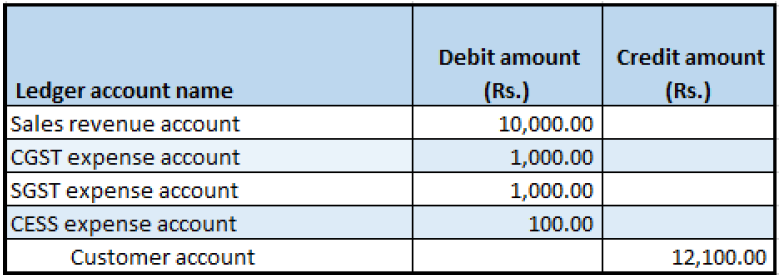

---
# required metadata

title: Return order form
description:  This topic provides information about creating a return order.
author: EricWang
manager: RichardLuan
ms.date: 06/04/2019
ms.topic: article
ms.prod: 
ms.service: dynamics-365-applications
ms.technology: 

# optional metadata

# ms.search.form: 
audience: Application User
# ms.devlang: 
ms.reviewer: kfend 
ms.search.scope: Core, Operations
# ms.tgt_pltfrm: 
# ms.custom: 
ms.search.region: India
# ms.search.industry: 
ms.author: EricWang
ms.search.validFrom: 2019-06-01
ms.dyn365.ops.version: 10.0.4

---

# Return order form

1. Click **Sales and marketing** \> **Return orders** \> **All return orders**.
2. Create a return order for a taxable item, and on the **Line details** FastTab, in the **Disposition code** field, select **Credit only**.
3. On the Action Pane, on the **Return order** tab, in the **Send** group, click **Return order**.
4. Click **OK** and then close the page.

## Sales order form

1. Click **Accounts receivable** \> **Sales orders** \> **All sales orders**.
2. Select the record where the **Order type** field is set to **Returned order**.
3. On the Action Pane, on the **Sales order** tab, in the **Maintain** group, click **Edit**.
4. Click **Tax information**.
5. Click the **GST** tab.
6. Click the **Customer tax information** tab.

> [!NOTE]
> The Tax information value is automatically set, based on the original sales order that the return order is created against.

7. Click **OK**.
8. On the Action Pane, on the **Sell** tab, in the **Tax** group, click **Tax document**. YOu might see something similary to the following example:

  - Taxable amount: 10,000
  - CGST: 10 percent
  - SGST: 10 percent
  - CESS: 1 percent

9 Click **Close**.

## Post the invoice

1. On the Action Pane, on the **Invoice** tab, in the **Generate** group, click **Invoice**.
2. In the **Quantity** field, select **All**.
3. Click OK, and then click **Yes** to acknowledge the warning message.

## Validate the voucher

1. On the Action Pane, on the **Invoice** tab, in the **Journals** group, click **Invoice**.
2. Click **Voucher**.

- Financial entry for the Credit only/Replace and scrap/Scrap disposition code

- Financial entry for the Credit/Replace and credit disposition code

