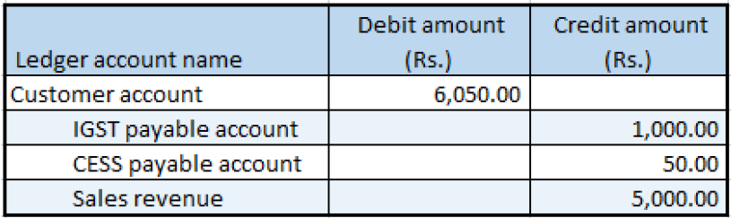

---
# required metadata

title: Sales invoice that is split based on delivery addresses
description:  This topic provides information about sales invoices that are split based on delivery address.
author: EricWang
manager: RichardLuan
ms.date: 06/04/2019
ms.topic: article
ms.prod: 
ms.service: dynamics-365-applications
ms.technology: 

# optional metadata

# ms.search.form: 
audience: Application User
# ms.devlang: 
ms.reviewer: kfend
ms.search.scope: Core, Operations
# ms.tgt_pltfrm: 
# ms.custom: 
ms.search.region: India
# ms.search.industry: 
ms.author: EricWang
ms.search.validFrom: 2019-06-01
ms.dyn365.ops.version: 10.0.4

---

# Sales invoice that is split based on delivery addresses

1. Click **Accounts receivable** \> **Sales orders** \> **All sales orders**.
2. Create a sales order for taxable items, and on the **Lines details** FastTab, click the **Address** tab.
3. Save the record and then select order line 1.
4. Click **Tax information** and then click the **GST** tab.
5. Click the **Customer tax information** tab
6. Click **OK**.
7. Select order line 2.
8. Click **Tax information**.
9. Click the **GST** tab.
10. Click the **Customer tax information** tab and then click **OK**.
11. On the Action Pane, on the **Sell** tab, in the **Tax** group, click **Tax document** to review the calculated taxes. For example, you might see something similar to the following:

    Order line 1

    - Taxable amount: 10,000.00
    - CGST: 10 percent
    - SGST: 10 percent
    - CESS: 1 percent

    Order line 2

    - Taxable amount: 5,000.00
    - IGST: 20 percent
    - CESS: 1 percent

12. Click Close.

## Post the packing slip

1. On the Action Pane, on the **Pick and pack** tab , in the **Generate** group, click **Packing slip**.
2. Click **OK**.

## Post the invoice

1. On the Action Pane, on the **Invoice** tab, in the **Generate** group, click **Invoice**.
2. In the **Quantity** field, select **All**.

> [!NOTE]
> The invoice is split based on the delivery addresses.

3. Click **OK** and then click **Yes** to acknowledge the warning message.

## Validate the voucher

1. On the Action Pane, on the **Invoice** tab, in the **Journals** group, click **Invoice**.
2. Select a record with an invoice amount of 12100.00.
3. Click **Voucher**.

4. Click **Close**.
5. Select a record with an invoice amount of 6050.00.
6. Click **Voucher**.

