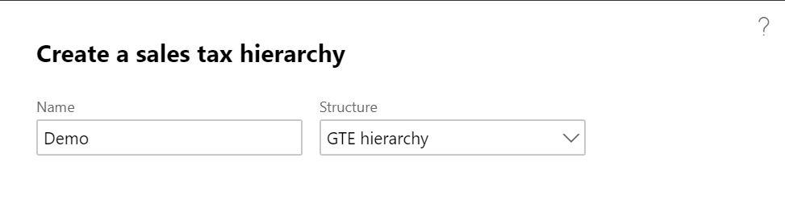
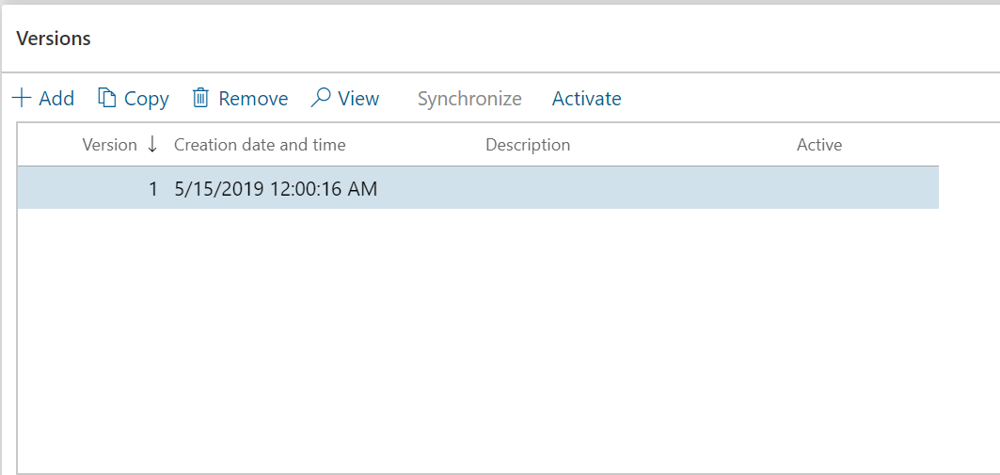
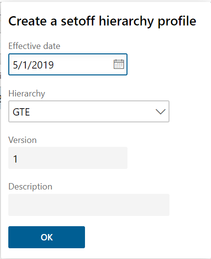
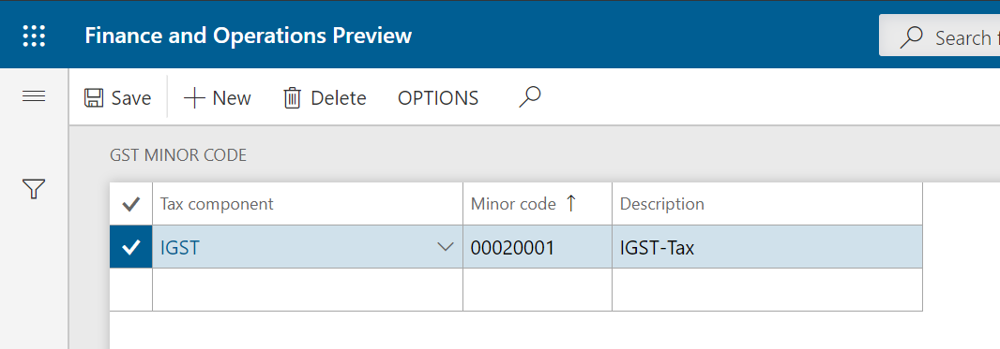

---
# required metadata

title: Set up a sales tax hierarchy and the setoff rules
description:  This topic provides information about how to set up a sale tax hierarchy and the setoff rules.
author: EricWang
manager: RichardLuan
ms.date: 06/05/2019
ms.topic: article
ms.prod: 
ms.service: dynamics-365-applications
ms.technology: 

# optional metadata

# ms.search.form: 
audience: Application User
# ms.devlang: 
ms.reviewer: kfend
ms.search.scope: Core, Operations
# ms.tgt_pltfrm: 
# ms.custom: 
ms.search.region: India
# ms.search.industry: 
ms.author: EricWang
ms.search.validFrom: 2019-06-01
ms.dyn365.ops.version: 10.0.4

---

# Set up a sales tax hierarchy and the setoff rules

1. Click **Tax** \> **Setup** \> **Sales tax** \> **Sales tax hierarchies**.
2. Click **New**, and in the **Name** field, enter a value.
3. In the **Structure** field, select **GTE hierarchy**.

4. Click **OK**, and on the **Versions** FastTab, click **Synchronize**.
5. Close the message.
6. Click **View**.

  The **Sales tax hierarchy designer** page shows the tax type and tax components per the configuration.

7. Click **Setoff rules for sales tax hierarchy**, and then click **New**.
8. In the **Name** field, enter a value and then save the record.
9. On the **Recoverable** and **Payable** FastTabs, select the tax components, and adjust the priority values.
10. Define the setoff rules per the legal requirement.

11. Click **Save** and then click **Close**.
12. Close the **Sales tax hierarchy designer** page.
13. Click **Activate**, and then click **Close**.

## Maintain setoff hierarchy profiles

1. Click **Tax** \> **Setup** \> **Sales Tax** \> **Maintain setoff hierarchy profiles**.
2. Click **New**, and in the **Effective date** field, enter a value.
3. In the **Hierarchy** field, select a value.

4. Click **OK**, and then click **Activate**.
5. Click **Yes**.
6. Close the message, and then close the page.

## GST minor codes

1. Click **Tax** \> **Setup** \> **Sales tax** \> **GST minor codes**.
2. Click **New** to create a record.
3. In the **Tax component** field, select a value.
4. In the **Minor code** field, enter a value.
5. In the **Description** field, enter a value.
6. Click **Save** and then click **Close**.

