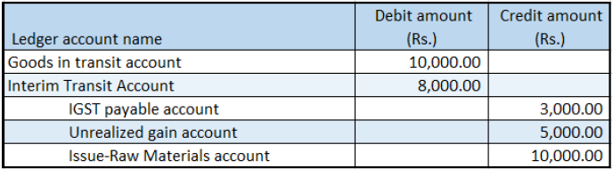

---
# required metadata

title: Stock transfer orders with tax on the transfer price
description:  This topic provides information about creating a stock transfer order that has tax on the transfer price.
author: EricWang
manager: RichardLuan
ms.date: 06/05/2019
ms.topic: article
ms.prod: 
ms.service: dynamics-365-applications
ms.technology: 

# optional metadata

# ms.search.form: 
audience: Application User
# ms.devlang: 
ms.reviewer: kfend
ms.search.scope: Core, Operations
# ms.tgt_pltfrm: 
# ms.custom: 
ms.search.region: India
# ms.search.industry: 
ms.author: EricWang
ms.search.validFrom: 2019-06-01
ms.dyn365.ops.version: 10.0.4

---

# Stock transfer orders with tax on the transfer price

Complete the procedures in this topic to create a stock transfer order that includes tax on the transfer price. 

## Create a stock transfer order

1. Click **Inventory management** \> **Transfer order**.
2. Create a transfer order where the **Transfer type** field is set to **Stock transfer**.

  > [!NOTE]
  > For the selected item, the item cost is 10,000.00, and the transfer price is 15,000.00

3. At the line level, click **Tax information from warehouse**.
4. Click the **GST** tab.
5. Click **OK**.
6. At the line level, click **Tax information to warehouse**.
7. Click the **GST** tab.
8. Click **OK**.
9. Click **Inquiries** \> **Tax document** to verify that the tax is calculated.

For example, the information might look like:

- Taxable value: 15,000.00
- IGST: 20 percent

10. Click **Close**.

## Post the shipment

1. Click **Posting** \> **Ship transfer order**.
2. Select the **Edit lines** check box.
3. In the **Update** field, select **All**.
4. Click **Setup** \> **Tax document**
5. Click **Close**.
6. Click **OK**.

## Validate the voucher

1. Click **Inquiries** \> **Transfer order history**.
2. Select the record where the **Update type** field is set to **Shipment**.
3. Click **Ledger** \> **Voucher**.

  

  > [!NOTE]
  > The tax accounts for the **From** warehouse, GSTIN are posted.

## Post the receipt

1. Click **Posting** \> **Receive**.
2. Select the **Edit lines** check box.
3. In the **Update** field, select **All**.
4. Click **Setup** \> **Tax document**
5. Click **Close**.
6. Click **OK**.

## Validate the voucher

1. Click **Inquiries** \> **Transfer order history**.
2. Select the record where the **Update type** field is set to **Receive**.
3. Click **Ledger** \> **Voucher**

  

  > [!NOTE]
  > The tax accounts for the **To** warehouse, GSTIN are posted.
