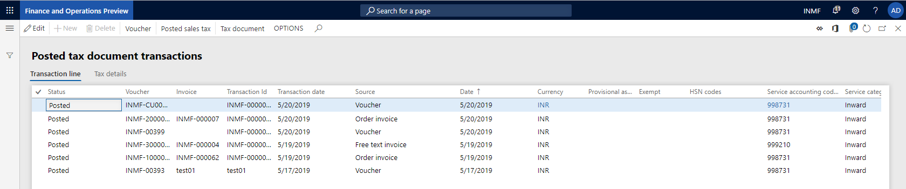
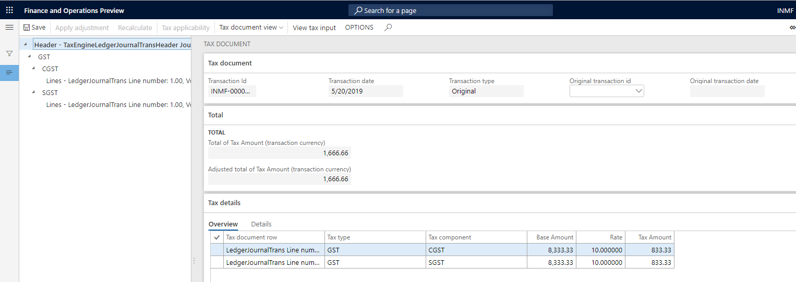

---
# required metadata

title: Tax inquiry
description:  This topic provides information about how to view various types of tax information.
author: EricWang
manager: RichardLuan
ms.date: 06/05/2019
ms.topic: article
ms.prod: 
ms.service: dynamics-365-applications
ms.technology: 

# optional metadata

# ms.search.form: 
audience: Application User
# ms.devlang: 
ms.reviewer: 
ms.search.scope: Core, Operations
# ms.tgt_pltfrm: 
# ms.custom: 
ms.search.region: India
# ms.search.industry: 
ms.author: EricWang
ms.search.validFrom: 2019-06-01
ms.dyn365.ops.version: 10.0.4

---

# Tax inquiry

1. Click **Tax** \> **Inquiries and reports** \> **Tax document transactions** \> **Posted tax document transactions**.
2. Select the registration number and then click **OK**.

3. Click **Voucher** to view the financial entry that is posted for the transaction.

4. Click **Close**.
5. Click **Tax document** to view the tax that is calculated on the transaction.

6. Click **Close**.
7. Click **Posted sales tax**.

8. Click **Close**.
