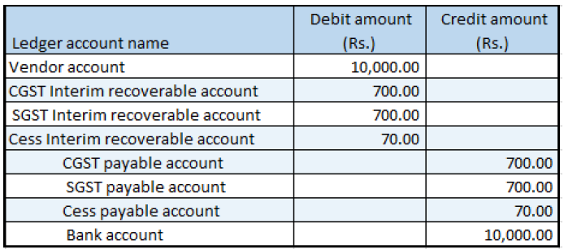

---
# required metadata

title: Vendor advance payment where there are reverse charges
description:  This topic provides information about creating vendor advance payments that contain reverse charges.
author: EricWang
manager: RichardLuan
ms.date: 06/042019
ms.topic: article
ms.prod: 
ms.service: dynamics-365-applications
ms.technology: 

# optional metadata

# ms.search.form: 
audience: Application User
# ms.devlang: 
ms.reviewer: kfend
ms.search.scope: Core, Operations
# ms.tgt_pltfrm: 
# ms.custom: 
ms.search.region: India
# ms.search.industry: 
ms.author: EricWang
ms.search.validFrom: 2019-06-01
ms.dyn365.ops.version: 10.0.4

---

# Vendor advance payment where there are reverse charges

1. Click **Accounts payable** \> **Payments** \> **Vendor Payment journal** and create a new record.
2. In the **Name** field, select a value and then click **Lines**.
3. Create a vendor advance payment journal and then save the record.
4. Click **Tax information**.
5. On the **GST** tab, in the **HSN code** field, select a value.
6. Click the **Vendor tax information** tab.
7. Click OK.

## Validate the tax details

1. On the Action Pane, on the **Purchase** tab, in the **Tax** group, click **Tax document**. You should see something similar to the following:

  - CGST: 10 percent
  - SGST: 10 percent
  - CESS: 1 percent
  - Reverse charge percentage: 70 percent for all the three components

2. Click **Close**.
3. Click **Post** \> **Post**.
4. Close the message.

## Update the transaction ID

1. Click **Functions** \> **GST transaction ID**.
2. In the **Date** field, enter a value.
3. In the **Text** field, enter a value.
4. Click **Close**.

## Validate the financial entries

To validate the financial entries, click **Inquiries** \> **Voucher**.

