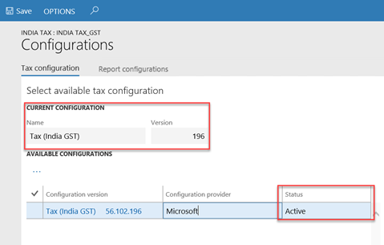
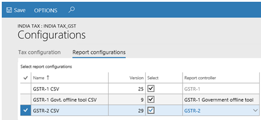
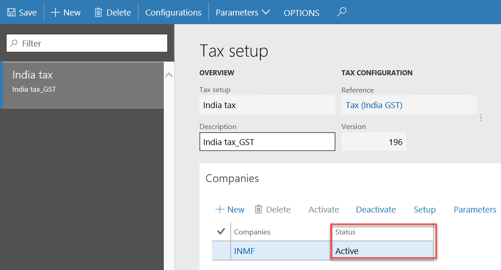
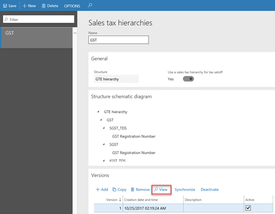

---
# required metadata

title: India Goods and Services Tax (GST) overview
description: This article provides detailed information about India Goods and Services Tax (GST) for Microsoft Dynamics 365 Finance. 
author: ShylaThompson
manager: AnnBe
ms.date: 07/25/2019
ms.topic: article
ms.prod: 
ms.service: dynamics-ax-applications
ms.technology: 

# optional metadata

# keywords: 
audience: IT Pro, Application User
# ms.devlang: 
ms.reviewer: kfend
# ms.suite: 
# ms.tgt_pltfrm: 
ms.custom: 1587884
ms.search.region: India
ms.search.scope: Core, Operations
# ms.search.industry: 
ms.author: ralin
ms.dyn365.ops.version: 7.3
ms.search.validFrom: 2017-12-31

---

# India Goods and Services Tax (GST) overview

[!include [banner](../includes/banner.md)]

This topic provides detailed information about India Goods and Services Tax (GST). For an overview of the tax engine using India GST examples, watch the following video.

- [Tax engine overview (YouTube video)](https://www.youtube.com/watch?v=jAFpEBOtNWI&feature=youtu.be)

## Prerequisites

<table>
<thead>
<tr>
<th>Prerequisite</th>
<th>Details</th>
</tr>
</thead>
<tbody>
<tr>
<td>Set up business verticals.</td>
<td>On the <strong>Business verticals</strong> page (<strong>General ledger</strong> &gt; <strong>Setup</strong> &gt; <strong>Sales tax</strong> &gt; <strong>India</strong> &gt; <strong>Business verticals</strong>), create business verticals.</td>
</tr>
<tr>
<td>Set up state codes and the union territory designation for Indian states.</td>
<td>On the <strong>Address setup</strong> page (<strong>Organization administration</strong> &gt; <strong>Global address book</strong> &gt; <strong>Addresses</strong> &gt; <strong>Address setup</strong>), be sure to enter state codes for each Indian state. Additionally, if the state is a union territory, set the <strong>Union territory</strong> option to <strong>Yes</strong>.</td>
</tr>
<tr>
<td>Set up enterprise tax registration numbers.</td>
<td>

On the <strong>Enterprise tax registration numbers</strong> page (<strong>Tax</strong> &gt; <strong>Setup</strong> &gt; <strong>Sales tax</strong> &gt; <strong>Enterprise tax registration numbers</strong>), create enterprise tax registration numbers for companies, vendors, and customers.

<ul>
<li><strong>Companies:</strong> Create an entry for the Goods and Services Taxpayer Identification Number (GSTIN) for every company, and specify casual registration periods.</li>
<li><strong>Vendors:</strong> Define state GST type registration numbers for vendors.</li>
<li><strong>Customers:</strong> Define state GST type registration numbers for customers.</li>
</ul>
</td>
</tr>
<tr>
<td>Set up GST reference number groups.</td>
<td>GST transactions are differentiated through a unique number sequence. If different number sequence is required for every warehouse or for the addresses of legal entities, you can create a reference number sequence group and assign it to the addresses. For more information, see <a href="apac-ind-gst-reference-groups.md">Set up GST reference number groups</a>.</td>
</tr>
<tr>
<td>Enter GST information for legal entities, warehouses, vendors, or customers.</td>
<td>

For each legal entity, warehouse, vendor, and customer, you can enter a GSTIN. For each legal entity and warehouse, you can select the GST reference number sequence group.

<ul>
<li><strong>Legal entities:</strong> Go to <strong>Organization administration</strong> &gt; <strong>Organizations</strong> &gt; <strong>Legal entities</strong>. On the <strong>Addresses</strong> FastTab, select <strong>More options</strong> &gt; <strong>Advanced</strong>, and then expand the <strong>Tax information</strong> FastTab.</li>
<li><strong>Warehouses:</strong> Go to <strong>Inventory management</strong> &gt; <strong>Setup</strong> &gt; <strong>Inventory</strong> &gt; <strong>Inventory breakdown</strong> &gt; <strong>Warehouses</strong>. On the <strong>Addresses</strong> FastTab, select <strong>Advanced</strong>, and then expand the <strong>Tax information</strong> FastTab.</li>
<li><strong>Vendors:</strong> Go to <strong>Accounts payable</strong> &gt; <strong>Vendors</strong> &gt; <strong>All vendors</strong>, and select a vendor. On the <strong>Addresses</strong> FastTab, select <strong>More options</strong> &gt; Advanced</strong>, and then expand the <strong>Tax information</strong> FastTab.</li>
<li><strong>Customers:</strong> Go to <strong>Accounts receivable</strong> &gt; <strong>Customers</strong> &gt; <strong>All customers</strong>, and select a customer. On the <strong>Addresses</strong> FastTab, select <strong>More options</strong> &gt; <strong>Advanced</strong>, and then expand the <strong>Tax information</strong> FastTab.</li>
</ul>
</td>
</tr>
<tr>
<td>Create Harmonized System of Nomenclature (HSN) and Services Accounting Code (SAC) codes.</td>
<td>
Create HSN and SAC codes for all goods and services. The GST rates that are applied depend on the HSN or SAC codes that are assigned to the goods or services.

<ul>
<li><strong>HSN:</strong> Go to <strong>Tax</strong> &gt; <strong>Setup</strong> &gt; <strong>Sales tax</strong> &gt; <strong>HSN code</strong>.</li>
<li><strong>SAC:</strong> Go to <strong>Tax</strong> &gt; <strong>Setup</strong> &gt; <strong>Sales tax</strong> &gt; <strong>Service accounting codes</strong>.</li>
</ul>

You can assign HSN and SAC codes to products in the <strong>GST</strong> field group of the <strong>Released products</strong> page. Products of the <strong>Item</strong> item type should have an HSN code, and products of the <strong>Service</strong> item type should have an SAC code.

<blockquote>

[!IMPORTANT]
The item sales tax group should be removed on products that are assigned an HSN or SAC code.

<blockquote>
</td>
</tr>
<tr>
<td>Assign an SAC code to miscellaneous charges.</td>
<td>
<ol>
<li>Go to <strong>Accounts payable</strong> &gt; <strong>Setup</strong> &gt; <strong>Charges</strong> &gt; <strong>Charges code</strong>, and select a charges code.</li>
<li>On the <strong>Tax information</strong> FastTab, in the <strong>SAC</strong> or <strong>HSN code</strong> field, enter a value.</li>
<li>In the <strong>Service category</strong> or <strong>ITC category</strong> field, enter a value.</li>
<li>Select the <strong>Exempt</strong> check box to exempt these charges from the calculation of GST.</li>
<li>Select <strong>Save</strong>.</li>
</ol>

When this charges code is selected for a transaction, the defined tax information is automatically entered, and GST is calculated accordingly.

<ol>
<li>Go to <strong>Accounts receivable</strong> &gt; <strong>Setup</strong> &gt; <strong>Charges</strong> &gt; <strong>Charges code</strong>, and select a charges code.</li>
<li>On the <strong>Tax information</strong> FastTab, in the <strong>SAC</strong> or <strong>HSN code</strong> field, enter a value.</li>
<li>Select the <strong>Exempt</strong> check box to exempt these charges from the calculation of GST.</li>
<li>Select <strong>Save</strong>.</li>
</ol>

When this charges code is selected for a transaction, the defined tax information is automatically entered, and GST is calculated accordingly.

</td>
</tr>
<tr>
<td>Create main accounts for the GST posting type.</td>
<td>
Go to <strong>General ledger</strong> &gt; <strong>Common</strong> &gt; <strong>Main accounts</strong>, and create a main account for each state-wide ledger account that is required. On the <strong>Setup</strong> FastTab, be sure to select <strong>GST</strong> as the posting type.

For more information, see <a href="../general-ledger/tasks/create-main-account.md">Create a main account</a>.

</td>
</tr>
<tr>
<td>Create a GST authority.</td>
<td>
<ol>
<li>Go to <strong>Accounts payable</strong> &gt; <strong>Vendors</strong> &gt; <strong>All vendors</strong>, and create a vendor record for the GST authority.</li>
<li>Go to <strong>Tax</strong> &gt; <strong>Indirect taxes</strong> &gt; <strong>Sales tax</strong> &gt; <strong>Sales tax authorities</strong>, and create a sales tax authority by using the GST authority vendor account.</li>
</ol>
</td>
</tr>
<tr>
<td>Create a tax period for GST.</td>
<td>Go to <strong>Tax</strong> &gt; <strong>Indirect taxes</strong> &gt; <strong>Sales tax</strong> &gt; <strong>Sales tax settlement periods</strong>, and create a sales tax period for GST.</td>
</tr>
<tr>
<td>Create a GST tax registration group.</td>
<td>Go to <strong>Tax</strong> &gt; <strong>Setup</strong> &gt; <strong>Sales tax</strong> &gt; <strong>Tax registration group</strong></strong>, create a tax registration group, and add GSTIN information.</td>
</tr>
</tbody>
</table>

## Import the configuration and deploy it to a specific company

Before you complete this task, be sure to save all the configuration files in a location that you can access from Dynamics 365 Finance.

Follow these steps to load the configurations and map them to a legal entity.

### Tax configurations

1. Go to **Organization administration** &gt; **Workspaces** &gt; **Electronic reporting**, and select the **Tax configurations** tile.
2. Select **Exchange** &gt; **Load from XML files**.
3. Browse to the location of the configuration file that should be loaded, and select the configuration file.
4. Select **OK**.
5. Repeat steps 2 through 4 to load **Taxable document**, **Taxable document (India)**, and **Tax (India GST)** in that order.
6. Select **Close**.

### Report configurations

1. Go to **Organization administration** &gt; **Workspaces** &gt; **Electronic reporting**, and select the **Report configurations**        tile.
2. Select **Exchange** &gt; **Load from XML files**.
3. Browse to the location of the configuration file that should be loaded, and select the configuration file.
4. Select **OK**.
5. Repeat steps 2 through 4 to load **GST Returns govt.model**, **GST Returns govt. model mapping**, **GSTR-1 Govt. offline tool CSV**    and **GSTR1_Government offline** in that order.
6. Select **Close**.

### Map configurations to the Legal entity

1. Go to **Tax** &gt; **Setup** &gt; **Tax configuration** &gt; **Tax setup**.
2. Select **New**.
3. In the **Tax setup** field, enter a value.
4. In the **Description** field, enter a value.
5. Select **Configurations**.
6. On the **Tax configuration** FastTab, under **Available configurations**, select the ellipsis button (**...**), and then select **New**.
7. In the **Configuration version** field, select a value. The new tax configuration is listed in the **Available configurations** grid.
8. Select the ellipsis button (**...**), and then select **Synchronize**.
9. Select **Activate**. The activated configuration is updated as the current configuration.

    

10. On the **Report configuration** FastTab, under **Select report configurations**, select the **Select** checkbox.
11. In the **Report controller** field, select a value. 
12. Repeat step 10 and 11, to map the report configurations.

    
    
13. Close the page.
14. On the **Companies** FastTab, create a record.
15. In the **Companies** field, select a value, and then select **Save**.
16. On the **Companies** FastTab, select **Activate**. The tax setup is now active for the selected company.

    

## Update the configuration version

1. Go to **Tax** &gt; **Setup** &gt; **Tax configuration** &gt; **Tax setup**.
2. Select a tax setup.
3. On the **Companies** FastTab, select **Deactivate**.
4. Repeat steps 2 through 13 in the previous section, [Import the configuration and deploy it to a specific company](#import-the-configuration-and-deploy-it-to-a-specific-company), to load the configuration, deploy it to the company, and synchronize the new version.

    

5. Select the new version, and then select **Activate**.
6. Complete the tasks in the **Tax setup** section to update data for the new version.

    > [!IMPORTANT]
    > If the tasks in the [Tax setup](#tax-setup), section were previously completed for the old configuration version, the data is retained after you synchronize to the new configuration version. You just have to review the setup and update it according to the new changes.
    
    
        

## Tax setup

This section walks you through defining the GST and Customs tax setup.

### Map configuration tax types to ERP tax types (Customs)

1. Go to **Tax** &gt; **Setup** &gt; **Tax configuration** &gt; **Tax setup**.
2. Select a tax setup, and then select a company.
3. Select **Setup**.
4. Select the **Customs** node.
5. On the **Tax type mapping** tab, in the **Tax type** field, select **Customs**.
6. Define a tax period:

    1. Select the node for the tax component.
    2. On the **Tax period mapping** tab, in the **Period** field, select a value.

7. Define main accounts:

   1. On the **Accounting** tab, on the **Conditions** FastTab, select **Add**.
   2. In the **Import Order** field, select a value.
   3. In the **Export order** field, select a value.
   4. Save the record.
   5. On the **Values** FastTab, in the **Main account** field, select a value.

       > [!NOTE]
       > The list of accounts is generated dynamically, based on the posting profile from the configuration. The posting type of the selected main account should be **Customs**.

   6. Select the **IGST CUS** node.
   7. On the **Values** FastTab, in the **Main account** field, select a value.

      > [!NOTE]
      > The main account that you selected for **Customs duty accrual** should be the same account that you selected as the Customs duty accrual account for the **GST** &gt; **IGST** node.

### Map configuration tax types to ERP tax types (GST)

1. Go to **Tax** &gt; **Setup** &gt; **Tax configuration** &gt; **Tax setup**.
2. Select a company.
3. Select **Setup**.
4. Select the **GST** node.
5. On the **Tax type mapping** tab, in the **Tax type** field, select **GST**.
6. Define a tax period:

    1. Select the node for the tax component.
    2. On the **Tax period mapping** tab, in the **Period** field, select a value.

7. Define main accounts:

   1. On the **Accounting** tab, on the **Conditions** FastTab, select **Add**.
   2. In the **GST Registration Number** field, select a value.
   3. Save the record.
   4. On the **Values** FastTab, in the **Main account** field, select a value.

      > [!NOTE]
      > - The list of accounts is generated dynamically, based on the posting profile from the configuration.
      > - Tax main accounts can be defined at the level of either the tax type or the tax component. The value at the tax component level overrides the value at the tax type level. If the field is left blank for a posting type at the tax component level, the corresponding value from the tax type level is used for posting. We recommend that you set up the tax accounts at the tax component level for each  registration.

8. Set up rate and percentage tables:

    1. Expand the node for the tax component.
    2. Select the **Rate** node, and then, in the **Value** field, define the tax rates.
    3. Select the **Reverse Charge Percentage** node, and then, in the **Value** field, define the reverse charge percentage.
    4. Select the **Load on Inventory Percentage** node, and then, in the **Value** field, define the load on inventory percentage.
    5. Select **Close**.
    6. Select **Parameters**.
    7. In the **Tax journal name** field, select a value. (This step is required in order to post the tax adjustments.)
    8. In the **Tax journal voucher series** field, select a value.
    9. Select **OK**.

9. Set up a sales tax hierarchy, and maintain setoff rule profiles:

    1. Go to **Tax** &gt; **Setup** &gt; **Sales tax** &gt; **Sales tax hierarchies**.
    2. Select **New**.
    3. In the **Name** field, enter a value.
    4. In the **Structure** field, select **GTE hierarchy**.
    5. Select **OK**.
    6. On the **Versions** FastTab, select **Synchronize**.
    7. Close the message.
    8. Select **View**. The **Sales tax hierarchy designer** page shows the tax type and tax components, based on the configuration.

        

    9. Select **Setoff rules for sales tax hierarchy**.
    10. Select **New**.
    11. In the **Name** field, enter a value.
    12. Save the record.
    13. On the **Recoverable** FastTab, select the tax components, and then adjust the **Priority** values.
    14. On the **Payable** FastTab, select the tax components, and then adjust the **Priority** values.
    15. Define the setoff rules according to the legal requirement.

        

    16. Select **Close**.
    17. Close the **Sales tax hierarchy designer** page.
    18. Select **Activate**.
    19. Select **Close**.

### Maintain setoff hierarchy profiles

1. Go to **Tax** &gt; **Setup** &gt; **Sales tax** &gt; **Maintain setoff hierarchy profiles**.
2. Select **New**.
3. In the **Effective date** field, enter a value.
4. In the **Hierarchy** field, select a value.
5. Select **OK**.
6. Select **Activate**.
7. Select **Yes** in the message.
8. Close the message.
9. Close the page.

### Create GST minor codes

1. Go to **Tax** &gt; **Setup** &gt; **Sales tax** &gt; **India** &gt; **GST minor codes**.
2. Select **New**.
3. In the **Tax component** field, select a value.
4. In the **Minor code** field, enter a value.
5. In the **Description** field, enter a value.

## Print management

Complete the following procedures to select the India GST report formats for customer and vendor invoices.

### Accounts payable

1. Go to **Accounts payable** &gt; **Setup** &gt; **Forms** &gt; **Form setup**.
2. On the **General** tab, select **Print management**.
3. Expand the **Vendor invoice** node, and select **Original**.
4. Select **VendInvoiceDocument_IN.Report** as the report format.

### Accounts receivable

1. Go to **Accounts receivable** &gt; **Setup** &gt; **Forms** &gt; **Form setup**.
2. On the **General** tab, select **Print management**.
3. Expand the **Customer invoice** node, and select **Original**.
4. Select **SalesInvoice_IN.Report** as the report format.
5. Expand the **Free text invoice** node, and select **Original**.
6. Select **FreeTextInvoice.ReportIN** as the report format.

## Resources for other Microsoft Dynamics products

If you're using one of the following versions of Microsoft Dynamics AX, you can use the India GST release to help you be compliant with India GST regulations:

- Microsoft Dynamics AX 2009 SP1
- Microsoft Dynamics AX 2012 R2
- Microsoft Dynamics AX 2012 R3

The India GST release takes advantage of Microsoft Dynamics 365 for Operations (1611) together with an applied hotfix to generate GST configurations that you can use in your release of Microsoft Dynamics AX.

For detailed information that includes documentation and downloads for release packages, see the following pages:

- [CustomerSource page for the India GST release](https://mbs.microsoft.com/customersource/global/AX/downloads/tax-regulatory-updates/GST-India)
- [PartnerSource page for the India GST release](https://mbs.microsoft.com/partnersource/northamerica/deployment/downloads/tax-regulatory-updates/GST-India) (Sign-in is required.)
