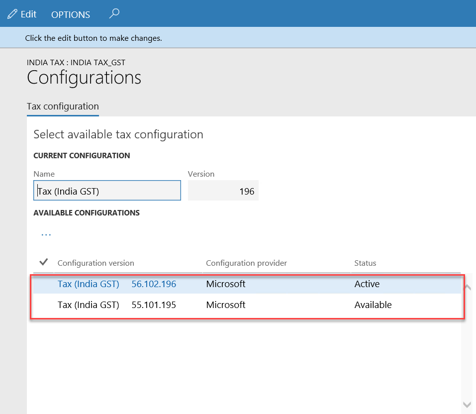

---
# required metadata

title: India GST | Microsoft Docs
description: This article provides information about India Goods and Services Tax (GST) for Microsoft Dynamics 365 for Finance and Operations, Enterprise edition. 
author: ShylaThompson
manager: AnnBe
ms.date: 12/08/2017
ms.topic: article
ms.prod: 
ms.service: dynamics-ax-applications
ms.technology: 

# optional metadata

# keywords: 
audience: IT Pro, Application User
# ms.devlang: 
ms.reviewer: shylaw
# ms.suite: 
# ms.tgt_pltfrm: 
ms.custom: 1587884
ms.search.region: India
ms.search.scope: Core, Operations
# ms.search.industry: 
ms.author: ralin
ms.dyn365.ops.version: 2012
# ms.search.validFrom:
---

# India Goods and Services Tax (GST)

[!include[banner](../includes/banner.md)]

This content provides detailed information about India Goods and Services Tax (GST). 

## Prerequisites

<table>
<thead>
<tr>
<th>Prerequisite</th>
<th>Details</th>
</tr>
</thead>
<tbody>
  <tr>
    <td>Set up business verticals
    </td>
    <td>Create business verticals on the <strong>Business verticals</strong> page (<strong>General ledger</strong> > <strong>Setup</strong> > <strong>Sales tax</strong> > <strong>India</strong> > <strong>Business verticals</strong>).
    </td>
  </tr>
    
  <tr>
    <td>Set up state codes and union territory designation for India states
    </td>
    <td>On the <strong>Address setup page</strong> (<strong>Organization administration</strong> > <strong>Global address book</strong> > <strong>Addresses</strong> > <strong>Address setup</strong>), be sure to enter state codes for each Indian state. Indicate if the state is a union territory by setting the <strong>Union territory</strong> option to <strong>Yes</strong>.
    </td>
  </tr>
  <tr>
    <td>Set up enterprise tax registration numbers
</td>
    <td>
    
On the <strong>Enterprise tax registration numbers</strong> page (<strong>Tax</strong> &gt; <strong>Setup</strong> &gt; <strong>Sales tax</strong> &gt; <strong>Enterprise tax registration numbers</strong>), create enterprise tax registration numbers for Companies, Vendors and Customers.

<ul>
<li><strong>Company</strong> - Create a GSTIN entry for each company and specify casual registration periods 
<li><strong>Vendors</strong> - Define state-wide GST type registration numbers for vendors.</li>
<li><strong>Customers</strong> - Define state-wide GST type registration numbers for customers.</li>
</ul>
    </td>
  </tr>
  <tr>
  <td> Set up GST reference number groups
  </td>
  <td>GST transactions are differentiated with a unique number sequence. If different number sequences are required for each warehouse or legal entity addresses, you can create a reference number sequence group and assign the reference number sequence group to the addresses. For more information, see [Set up GST reference number groups](apac-ind-gst-reference-groups.md).
  </td>
  </tr>
 <tr>
    <td> Enter GST information for legal entities, warehouses, vendors, or customers 
   </td>
   <td> For each legal entity, warehouse, vendor and customer, you can enter a GSTIN number. For each legal entity and warehouse, you can select the GST reference number sequence group. 
     <ul>
       <li>
     <strong>Legal entity</strong> - Go to <strong>Organization administration</strong> > <strong>Organizations</strong> > <strong>Legal
    entities</strong> > <strong>Addresses (More options > Advanced)</strong> > <strong>Tax
         information</strong>. </li>
    <li> <strong>Warehouses</strong> - Go to <strong>Inventory management</strong> > <strong>Setup</strong> > <strong>Inventory</strong> > <strong>Inventory
    breakdown</strong> > <strong>Warehouse</strong> > <strong>Addresses</strong> > <strong>Advanced</strong> > <strong>Tax
    information</strong>.</li>
    <li> <strong>Vendors</strong> - Go to <strong>Accounts payable</strong> > <strong>Vendors</strong> > <strong>All vendors</strong> > <strong>Addresses
    (More options > Advanced)</strong> > <strong>Tax information</strong>.</li>
    <li> <strong>Customers</strong> - Go to <strong>Accounts receivable</strong> > <strong>Customers</strong> > <strong>All customers</strong> >
    <strong>Addresses (More options > Advanced)</strong>> <strong>Tax information</strong>.</li>
     </ul>
   </td>
  </tr>
<tr>
  <td>Harmonized System of Nomenclature (HSN) codes and Service accounting codes (SAC)</td>
  <td>Create HSN and SAC codes for all goods and services. The GST rates are applicable based on the HSN or SAC codes assigned to the goods or services. 
<ul>
  <li> <strong>HSN</strong> - Go to <strong>Tax</strong> > <strong>Setup</strong> > <strong>Sales tax</strong> > <strong>HSN code</strong>.
  </li>
  <li> <strong>SAC</strong> - Go to <strong>Tax</strong> > <strong>Setup</strong> > <strong>Sales tax</strong> > <strong>Service accounting codes</strong>.
  </li>
    </ul>
    
 You can assign HSN codes and Service accounting codes to products in the <strong>GST</strong> area of the the <strong>Released products</strong> page. Products of the <strong>Item</strong> item type should get an HSN code and products of the <strong>Service</strong> item type should get a SAC. 

      <strong>IMPORTANT</strong>: Item sales tax group should be removed on products that are assigned an HSN or SAC code. 
    </td>
</tr>
<tr>
<td>Assign a Service accounting code to miscellaneous charges</td>
<td>
<ol>
  <li>Click <strong>Accounts payable</strong> > <strong>Setup</strong> > <strong>Charges</strong> > <strong>Charges code</strong>.</li>
  <li>Select a charges code.</li>
  <li>On the Tax information FastTab, enter a value in the SAC or HSN code field.</li>
  <li>Enter a value in the Service category or ITC Category field.</li>
  <li>Select the Exempt check box to exempt these charges from the calculation of GST.</li>
  <li>Click <strong>Save</strong>.</li>
  </ol>
  
When this charges code is selected for a transaction, the defined tax information automatically entered, and GST is calculated accordingly.

<ol>
  <li>Click <strong>Accounts receivable</strong> > <strong>Setup</strong> > <strong>Charges</strong> > <strong>Charges code</strong>.</li>
  <li>Select a charges code.</li>
  <li>On the Tax information FastTab, enter a value in the SAC or HSN code field.</li>
  <li>Select the Exempt check box to exempt this charges from the calculation of GST.</li>
  <li>Click <strong>Save</strong>.</li>
  </ol>

When this charges code is selected for a transaction, the defined tax information is automatically entered, and GST is calculated accordingly.
  
  </td>
</tr>
<tr>
<td>
<td>
  
</tr>
<tr>
  <td>Main accounts for the GST posting type 
  </td>
  <td> 
<strong>General ledger</strong> > <strong>Common</strong> > <strong>Main accounts</strong>

    
 Create a Main account for all required state-wide ledger accounts and be sure to select <strong>GST</strong> as the posting type on the <strong>Setup</strong> FastTab. For more information, see <a href="https://docs.microsoft.com/en-us/dynamics365/unified-operations/financials/localization/tasks/create-main-account">Create a main account</a>.
    

  </td>
  </tr>
  <tr>
  <td> Create a GST authority
  </td>
  <td> <ol><li>Create a vendor record for the GST authority. Go to <strong>Accounts payable</strong> > <strong>Vendors</strong> > <strong>All vendors</strong>.</li>
    <li>Create a Sales tax authority with the GST authority vendor account. Go to <strong>Tax</strong> > <strong>Indirect taxes</strong> > <strong>Sales tax</strong> > <strong>Sales tax authorities</strong>.
    </li>
    </ol>
  </td>
  </tr>
    <tr>
  <td> Create a tax period for GST
  </td>
  <td>Create a sales tax period for GST. Go to <strong>Tax</strong> > <strong>Indirect taxes</strong> > <strong>Sales tax</strong> > <strong>Sales tax settlement periods</strong>.
  </td>
  </tr>
     <tr>
  <td> Create a GST tax registration group
  </td>
  <td>Create a tax registration group and add GSTIN information. Go to <strong>Tax</strong> > <strong>Setup</strong> > <strong>Sales tax</strong> > <strong>Tax registration group</strong>.</strong>.
  </td>
  </tr>
</tbody>
</table>

## Import the configuration and deploy it to a specific company
Before you complete this task, be sure to save all the configuration files in a location that you can access from Finance and Operations.

Complete the following steps to load a tax configuration and map it to a legal entity.

1.  Go to **Organization administration** > **Workspaces** > **Electronic reporting** > **Tax configurations**.
2.  Click **Exchange** > **Load from XML files**.
3.  Browse to the location of the configuration file and select the configuration file to load.
4.  Click **OK**.
5.  Repeat step 2 - 4 to load **Taxable document**, **Taxable document (India)** and **Tax (India GST)** in sequence.
6.  Click **Close**.
7.  Go to **Tax** > **Setup** > **Tax configuration** > **Tax setup**.
8.  Click **New**.
9.  In the **Tax setup** field, enter a value.
10. In the **Description** field, enter a value.
11.  Click **Configurations**.
12.  On the **Tax configuration** tab, under **Available configurations**, click **New**.
    
13.  In the **Configuration version** field, select a value. The new tax configuration is listed in the **Available configurations** grid.
14.  Click **Synchronize**.
    
15.  Click **Activate**. The activated configuration is updated as the current configuration.
    
16. Close the page.
17.  On the **Companies** FastTab, create a record.
18.  In the **Companies** field, select a value and then click **Save**.
19.  On the **Companies** FastTab, click **Activate.** The tax setup will now be **Active** for the selected company.
    

## Update the configuration version

1. Go to **Tax** > **Setup** > **Tax configuration** > **Tax setup**.
2. Select a tax setup.
3. On the **Companies** FastTab, click **Deactivate**.
   

4.  Repeat steps 2 through 13 of [Import the configuration and deploy it to a specific company](#import-the-configuration-and-deploy-it-to-a-specific-company) to load the configuration , deploy to the company and synchronize the new version.

  

5.  Select the new version and click **Activate**.
6.  Follow the **Tax setup** task to update data for the new version.
    > [!IMPORTANT]
    > If the task in the Tax setup section have been completed for the old configuration version, the data will be retained after you synchronize to the new configuration version. You just have to review and update the setup per the new changes.

## Example: Tax setup
This section walks you through defining the GST and Customs tax setup in Finance and Operations.

### Map configuration tax types to ERP tax types (Customs) 

1.  Go to **Tax** > **Setup** > **Tax configuration** > **Tax setup**.
2.  Select a tax setup and then select a company.
3.  Click **Setup**.
4.  Select the **Customs** node.
5.  On the **Tax type mapping** tab, in the **Tax type** field, select **Customs**.
6. Define a tax period. 
    1.  Select the node for the tax component.
    2. On the **Tax period mapping** tab, in the **Period** field, select a value.
7. Define main accounts 
    1.  On the **Accounting** tab, on the **Conditions** FastTab, click **Add**.
    2.  In the **Import Order** field, select a value.
    3.  In the **Export order** field, select a value
    4.  Save the record.
    5.  On the **Values** FastTab, in the **Main account** field, select a value.

    >   [!NOTE]
    >    The list of accounts is generated dynamically, based on the posting profile from the configuration. The selected Main account should be of posting type **Customs**.

    6.  Select **IGST CUS** node
    7.  On the **Values** FastTab, in the **Main account** field, select a value.

    >   [!NOTE]
    >   The main account that you selected for **Customs duty accrual** should be the same account selected for the **Customs duty accrual account** of the **GST \> IGST** node.

### Map configuration tax types to ERP tax types (GST) 
1.  Go to **Tax** > **Setup** > **Tax configuration** > **Tax setup**.
2.  Select a company.
3.  Click **Setup**.
4.  Select the **GST** node.
5.  On the **Tax type mapping** tab, in the **Tax type** field, select **GST**.
6. Define a tax period. 
    1.  Select the node for the tax component.
    2.  On the **Tax period mapping** tab, in the **Period** field, select a value.

7. Define main accounts 
    1.  On the **Accounting** tab, on the **Conditions** FastTab, click Add.
    2.  In the **GST Registration Number** field, select a value.
    3.  Save the record.
    4.  On the **Values** FastTab, in the **Main account** field, select a value.

    >   [!NOTE]
    >   - The list of accounts is generated dynamically, based on the posting profile
    from the configuration.
    >   - Tax main accounts can be defined at level of the tax type or the tax component. The value at the tax component level will override the value at the tax type level. If the field is left blank for a posting type at the tax component level, the corresponding value from the tax type level will be used for posting. It is recommend to set up the tax accounts at the tax component level per registration.

8. Set up rate and percentage tables. 
    1.  Expand the node for the tax Component.
    2.  Select the **Rate** node, and then, in the **Value** field, define the tax rates.
    3.  Select the **Reverse Charge Percentage** node, and then, in the **Value** field, define the reverse charge percentage.
    4.  Select the **Load on Inventory Percentage** node, and then, in the **Value** field, define the load on inventory percentage.
    5.  Click **Close**.
    6.  Click **Parameters**.
    7.  In the **Tax journal name** field, select a value. (Required for posting the Tax adjusments)
    8.  In the **Tax journal voucher series** field, select a value.
    9.  Click **OK**.
9. Set up a sales tax hierarchy and Maintain setoff rules profiles.
    1.  Go to **Tax** > **Setup** > **Sales tax** > **Sales tax hierarchies.**
    2.  Click **New**.
    3.  In the **Name** field, enter a value.
    4.  In the **Structure** field, select **GTE hierarchy**.
    
    5.  Click **OK**.
    6.  On the **Versions** FastTab, click **Synchronize**.
    7.  Close the message.
    8.  Click **View**. The **Sales tax hierarchy designer** page shows the tax type and tax components per the configuration.
    
    

    9.  Click **Setoff rules for sales tax hierarchy**.
    10.  Click **New**.
    11.  In the **Name** field, enter a value.
    12.  Save the record.
    13.  On the **Recoverable** FastTab, select the tax components, and adjust the **Priority** values.
    14.  On the **Payable** FastTab, select the tax components, and adjust the **Priority** values.
    15.  Define the setoff rules per the legal requirement.
      
    16.  Click **Close**.
    17.  Close the **Sales tax hierarchy designer** form.
    18. Click **Activate**.
    19. Click **Close**.

### Maintain setoff hierarchy profiles

1.  Go to **Tax** > **Setup** > **Sales tax** > **Maintain setoff hierarchy profiles**.
2.  Click **New**.
3.  In the **Effective date** field, enter a value.
4.  In the **Hierarchy** field, select a value.
    
5. Click **OK**.
6. Click **Activate**.
7. Click **Yes** on the message.
8. Close the message.
9. Close the form.

### Create GST minor codes

1. Go to **Tax** > **Setup** > **Sales tax** > **India** > **GST minor codes**.
2. Click **New**.
3. In the **Tax component** field, select a value. 
4. In the **Minor code** field, enter a value.
5. In the **Description** field, enter a value. 

## Print management
Complete the following tasks to select the India GST report formats for customer and vendor invoices.

### Accounts payable

1. Go to **Accounts payable** > **Setup** > **Forms** > **Form setup**.
2. Click on the **General** tab.
3. Click **Print management**.
4. Expand **Vendor invoice**.
5. Select **Original**.
6. Select **Report format** ‘VendInvoiceDocument_IN.Report’.

  

### Accounts receivable
1. Go to **Accounts receivable** > **Setup** > **Forms** > **Form setup**.
2. Expand the **General** FastTab.
3. Click **Print management**.
4. Expand **Customer invoice**.
5. Select **Original**.  
6. Select the report format **SalesInvoice_IN.Report**.

>  

7. Expand **Free text invoice**.
8. Select **Original**.
9. Select the report format **FreeTextInvoice.ReportIN**.

## Resources for other Microsoft Dynamics products

If you are using one of the following Microsoft Dynamics AX versions, you can use the India GST release to help you be compliant with India GST regulations.

- Microsoft Dynamics AX 2009 SP1
- Microsoft Dynamics AX 2012 R2
- Microsoft Dynamics AX 2012 R3

The India GST release leverages Microsoft Dynamics 365 for Operations (1611) with an applied hotfix to generate GST configurations that you can use in the releases listed. 

For detailed information, including documentation and release package downloads, refer to the following pages:

- [CustomerSource page for the India GST release](https://mbs.microsoft.com/customersource/global/AX/downloads/tax-regulatory-updates/GST-India)
- [PartnerSource page for the India GST release](https://mbs.microsoft.com/partnersource/northamerica/deployment/downloads/tax-regulatory-updates/GST-India) (login required)

