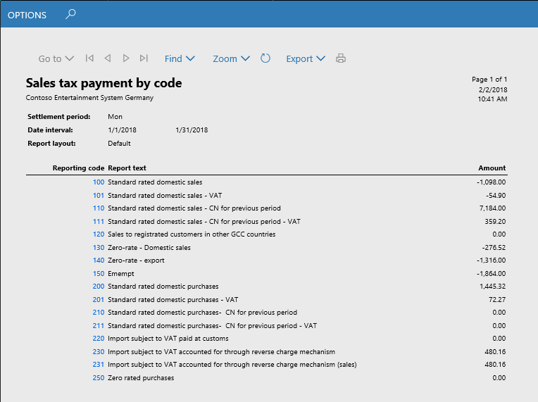

---
# required metadata

title: Sales tax for Saudi Arabia
description: This topic provides information about sales taxes for Saudi Arabia.           
author: ShylaThompson
manager: AnnBe
ms.date: 02/15/2018
ms.topic: article
ms.prod: 
ms.service: dynamics-ax-applications
ms.technology: 

# optional metadata

# ms.search.form: 
audience: Application User
# ms.devlang: 
ms.reviewer: shylaw
ms.search.scope: Core, Operations
# ms.tgt_pltfrm: 
# ms.custom: 
ms.search.region: Saudi Arabia
# ms.search.industry: 
ms.author: shylaw
ms.search.validFrom: 
ms.dyn365.ops.version: 

---

# Sales tax for Saudi Arabia

[!include[banner](../includes/banner.md)]

This topic walks you through setting up sales taxes for Saudi Arabia. Before you read this topic, it might be helpful to read [Sales tax overview](../general-ledger/indirect-taxes-overview.md). For information about regulatory requirements for Saudi Arabia, see [VAT for Saudi Arabia (Government website)](https://www.vat.gov.sa/). 

## Setting up sales tax for Saudi Arabia
The following table lists the typical sales tax setup tasks with notes for sales tax in Saudi Arabia.

| Setup activity                                                  | Considerations for Saudi Arabia  | More information |
|-----------------------------------------------------------------|----------------------------------------|------------------|
| Create main accounts.                                           |                                        |[Create a main account](../general-ledger/tasks/create-main-account.md)                   |
| Set up ledger posting groups for sales tax.                     |                                        |[Set up ledger posting groups for sales tax](../general-ledger/tasks/set-up-ledger-posting-groups-sales-tax.md). |
| Set up sales tax authorities.                                   | When you set up sales tax authorities, pay attention to the **Report layout** field. Sales tax codes use the same report layout as the sales tax authority that is associated with the sales tax settlement period that you selected for the sales tax code. | [Set up sales tax authorities](../general-ledger/tasks/set-up-sales-tax-authorities.md)| |
| Set up sales tax settlement periods.                            | When you set up sales tax settlement periods, consider that in Saudi Arabia Taxable, if you make an annual taxable supply above a certain amount, you might be required to file monthly VAT returns instead of quarterly VAT returns. Consult a tax professional for guidance. |[Set up sales tax settlement periods](../general-ledger/tasks/set-up-sales-tax-settlement-periods.md)|
| Set up sales tax reporting codes.                               |See [Sales tax reporting codes example for Saudi Arabia](#sales-tax-reporting-codes-example-for-saudi-arabia) |[Set up sales tax reporting codes](../general-ledger/tasks/set-up-sales-tax-reporting-codes.md)||
| Set up sales tax codes.                                         |See [Sales tax codes, sales tax groups, and item sales tax groups](#sales-tax-codes-sales-tax-groups-and-item-sales-tax-groups) and [Create sales tax codes for reverse charge operations](#create-sales-tax-codes-for-reverse-charge-operations)                                | [Sales tax codes](../general-ledger/tasks/set-up-sales-tax-codes.md)|
| Set up sales tax groups and item sales tax groups                                        |See [Sales tax codes, sales tax groups, and item sales tax groups](#sales-tax-codes-sales-tax-groups-and-item-sales-tax-groups) and [Create a sales tax group for reverse charge](#create-sales-tax-group-for-reverse-charge)                 |[Sales tax groups and item sales tax groups](../general-ledger/tasks/set-up-sales-tax-groups-item-sales-tax-groups.md)|
| Set up sales tax parameters on the application parameter pages. | Enable reverse charge functionality on the **General ledger parameters** page.    |[Reverse charges](emea-reverse-charge.md)|

### Sales tax reporting codes example for Saudi Arabia
You can create report codes which might be necessary for analysis (E.g. details of legislation return and/or data disclosure). The following screenshot shows examples of reporting codes.

### Sales tax codes, sales tax groups, and item sales tax groups

Sales tax group may be set up in Customer/ Vendor by default and Item sales tax group may be set up in Items by default when a user creates sales/purchase order the system transfers Sales tax group from customer to the header and lines and transfers Item sales tax group from item to the lines. But a user may change groups both in the header and in lines.

If a sales tax code is included in two groups (sales tax group and item sales tax group) in the line, then when posting the invoice, the system will create sales tax transaction with this sales tax code and calculate sales tax. If there is no intersection of sales tax codes in groups of line, then sales tax transaction will not be created.

The following diagram demonstrates one way that sales tax groups can be set up and how sales tax transactions and sales tax calculation are defined given that setup.  

For each sales tax code enter the following: 
- Type of tax (Standard VAT or VAT 0%)
- Settlement period
 > [!NOTE]
 > When you select a settlement period the system automatically fills in the **Report layout** field.
- Ledger posting codes
- Calculation (firstly the settings by default may be used)
- Report setup/ Report setup – Credit note

Your company's accounting practices will affect how you set up Sales tax groups and Item sales tax groups to include sales tax codes. 
For example, an export operation might select the **Exempt** check box and Select **Exempt code**. In this case, the system will create sales tax transaction with VAT equal to zero. But with the rate equal to 5% (Value field in sales tax transaction). It may be useful for analysis of export operations by VAT rates.   

For import operations from third countries (VAT is paid at customs) you might use the Use tax check box in sales tax group. 

When you post an invoice with such setting, the system creates sales tax transaction with Use tax direction, but sales tax is not included in vendor liability. Sales transactions with Use tax direction are not taken into account when settling and posting sales taxes (see Settle and post sales tax), and depending on ledger posting setting (see Ledger posting groups) the system creates ledger transactions for this sales tax (see the screenshot below).
This setting allows you to analyze purchases from third countries by VAT rates.
Example of sales tax transactions with different values of sales tax direction.

## Printing invoices

When you print an invoice, if your language is different than the language specified for the current legal entity, two invoices will be generated, one in Arabic and the other in the language that you selected on the **User options** page.

## Sales tax payment by code report

The following diagram shows how data may be collected in the **Sales tax payment by code** report. If an invoice does not include tax transactions then the invoice will not be included in the **Sales tax payment by code** report.  One report code may be selected in several sales tax codes and several report codes may be selected in one sales tax code in different fields. 

### Report setup
Consider the following before you generate the **Sales tax payment by code** report.

- You may create report codes in details which are necessary for analysis (for example, details of legislation return and/or data disclosure). 

- To include sales tax transactions in **Sales tax payments by report code** report, it is necessary to select report codes in the corresponding fields. in the **Report setup** and **Report setup – Credit note** areas in **Sales tax code** page.

 > [!NOTE]
 > You can enter Reporting codes in the sales tax code either before posting tax transactions or after posting tax transactions.

### Generate the **Sales tax payment by code** report

To generate the report, complete the following steps.
1. Go to **Tax** > **Inquiries and reports** > **Sales tax reports** > **Sales tax payment by code**.
2. Select the report parameters including the report layout.

Report example:

## Additional resources
- [Create a sales tax payment](../general-ledger/tasks/create-sales-tax-payment.md)
- [FAQ: VAT returns (Government website)](https://www.vat.gov.sa/en/e-services/vat-returns)
