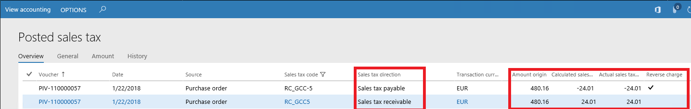

---
# required metadata

title: Sales tax for Saudi Arabia
description: This topic provides information about sales taxes for Saudi Arabia.           
author: ShylaThompson
manager: AnnBe
ms.date: 10/05/2017
ms.topic: article
ms.prod: 
ms.service: dynamics-ax-applications
ms.technology: 

# optional metadata

# ms.search.form: 
audience: Application User
# ms.devlang: 
ms.reviewer: shylaw
ms.search.scope: Core, Operations
# ms.tgt_pltfrm: 
# ms.custom: 
ms.search.region: Saudi Arabia
# ms.search.industry: 
ms.author: shylaw
ms.search.validFrom: 
ms.dyn365.ops.version: 

---

# Sales tax for Saudi Arabia

[!include[banner](../includes/banner.md)]

This topic walks you through setting up sales taxes for Saudi Arabia.  

## Sales tax codes for Saudi Arabia
Tax type with values added for VAT type: Standard VAT, Reduced VAT, VAT 0%
New value in Country/ Region field: GCC
Translation of sales tax description (button Tax directive)

## Reverse charges

### Enable reverse charge
You can enable the reverse charge functionality by setting the **Reverse charge** option to **Yes** on the **General ledger parameters** page.

### Create sales tax codes for reverse charge operations
Create sales tax codes for reverse charge operations (for purchase operations). (**Tax** > **Indirect taxes** > **Sales tax** > **Sales tax codes**) 

It is necessary to set up two sales tax codes for reverse charge operations (for purchase operations): one with positive rate and another with negative rate.  You may fill in negative rate (SALES TAX CODE/ Value button) if Negative sales tax percentage check box has been selected in the Sales tax codes form (see the screenshot below). 
Tax > Indirect taxes > Sales tax > Sales tax codes

### Create a sales tax group for reverse charge
Create a sales tax group that has the **Reverse charge** check box selected for a sales tax code with a negative rate. The two sales tax codes that you created in [Create sales tax codes for reverse charge operations](#create-sales-tax-codes-for-reverse-charge-operations) should be added to a sales tax group and to an item sales tax group.  See how sales tax functionality works in Sales tax codes, Sales tax group and Item sales tax groups
Tax > Indirect taxes > Sales tax > Sales tax groups 

### Sales tax transactions with reverse charges
If the **Reverse charge** check box is selected in the sales tax group, sales tax transactions are created when you posting an invoice. One transaction includes sales tax receivable and another transaction includes a sales tax payable direction. 

Tax > Inquiries and reports > Sales tax inquiries > Posted sales tax

## Invoice language

If the user language is different than the legal entity
The system output invoice in two languages if the customer language is different from the language which set up in Legal entity form otherwise the invoice will output only in the language, which set up in Legal entity form. If the system determines that an invoice should be output in two languages (for example, English and Arabic) it’ll output two printing invoices:  one output report in English and another in Arabic. 

## Example: Sales tax payment by report code

The diagram below shows how data may be collected in Sales tax payment by report code report. 
It is important to note that data is collected on the base of sales tax transactions. Therefore, if an invoice created has not tax transactions then this invoice will not be included in the report.  One report code may be selected in several sales tax codes and several report codes may be selected in one sales tax code in different fields. 

