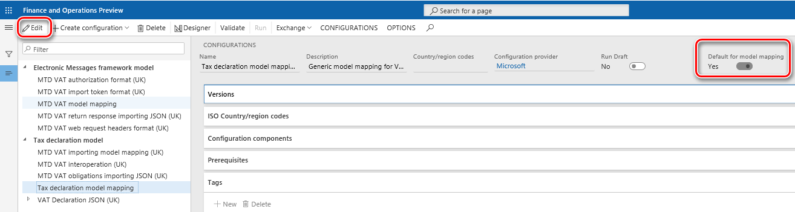
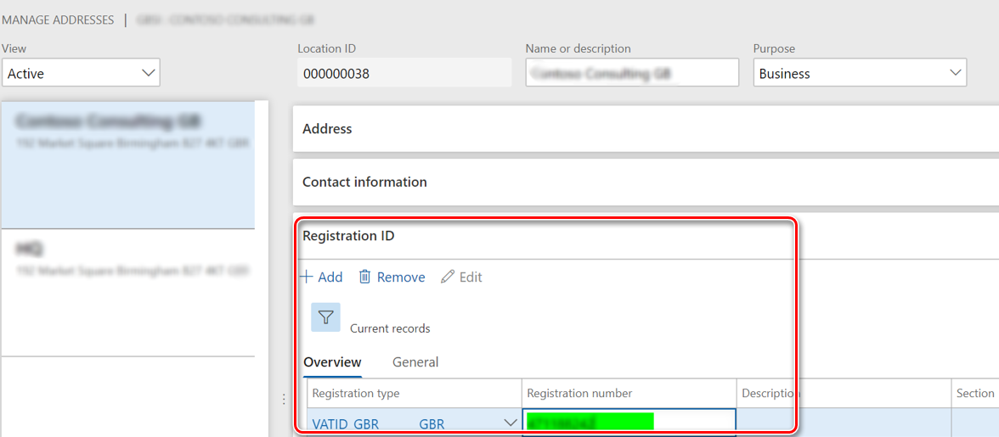
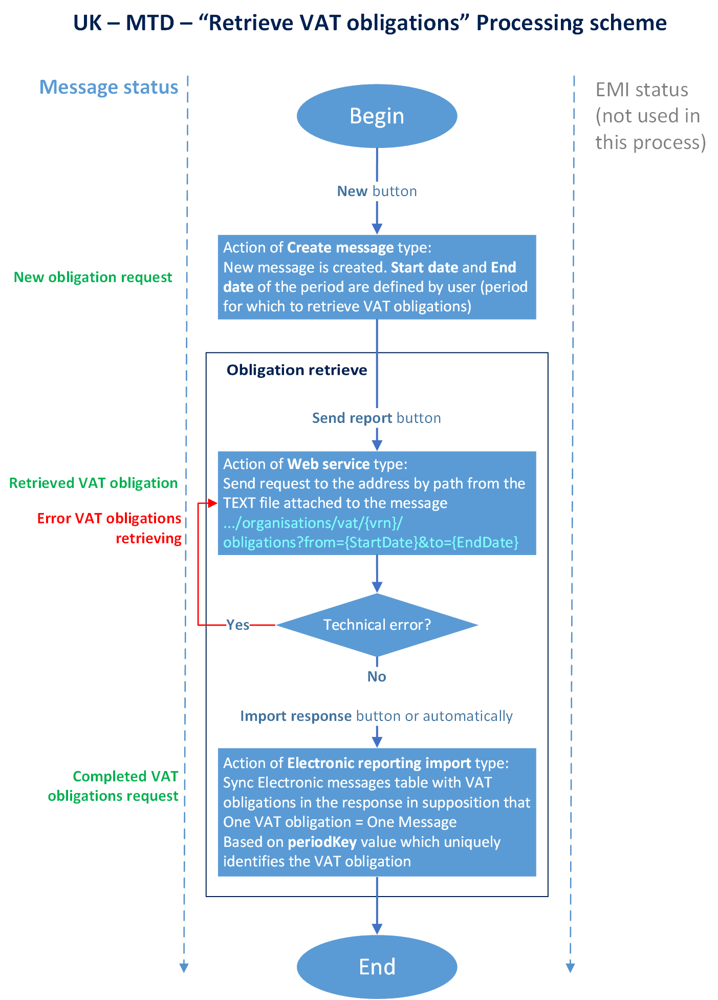
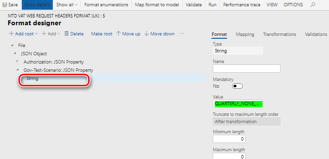
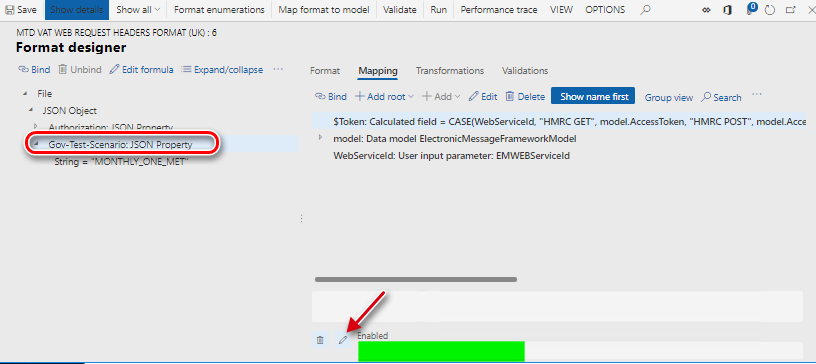
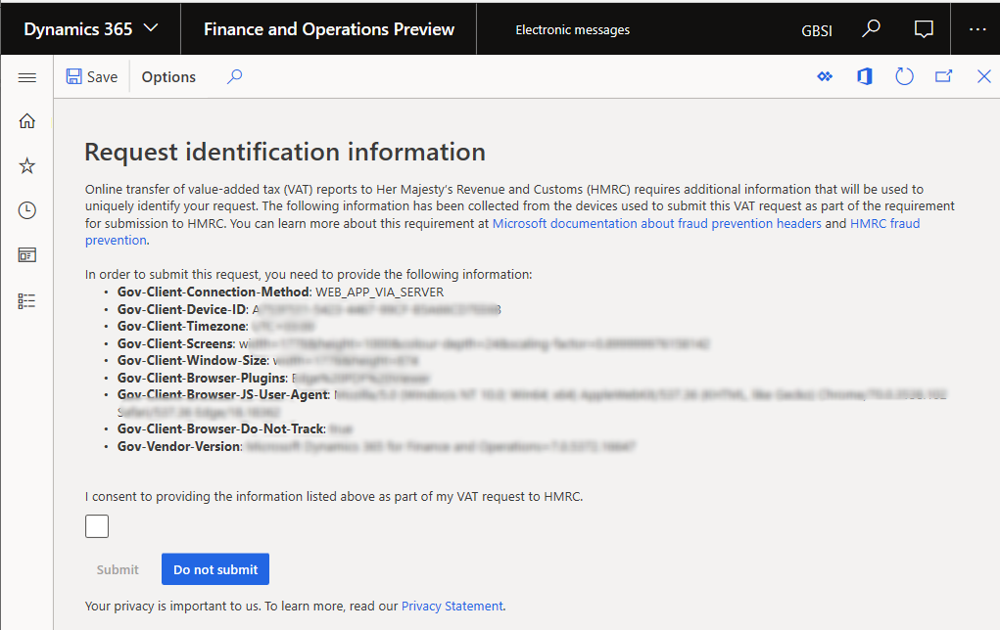

---
# required metadata

title: Prepare Finance and Operations for integration with MTD for VAT (United Kingdom)
description: This topic walks you through the process of setting up Dynamics 365 Finance and Operations for Making Tax Digital (MTD) for value-added tax (VAT) in the United Kingdom.
author: ShylaThompson
manager: AnnBe
ms.date: 06/10/2019
ms.topic: article
ms.prod: 
ms.service: dynamics-ax-applications
ms.technology: 

# optional metadata

# ms.search.form: 
# ROBOTS: 
audience: Application User
# ms.devlang: 
ms.reviewer: kfend
ms.search.scope: Core, Operations
# ms.tgt_pltfrm: 
# ms.custom: 
ms.search.region: United Kingdom
# ms.search.industry: 
ms.author: mrolecki
ms.search.validFrom: 2016-02-28
ms.dyn365.ops.version: AX 7.0.0

---

# Prepare Finance and Operations for integration with MTD for VAT (United Kingdom)

[!include [banner](../includes/banner.md)]
[!include [preview-banner](../includes/preview-banner.md)]

This topic walks you through the process of setting up Microsoft Dynamics 365 Finance and Operations for Making Tax Digital (MTD) for value-added tax (VAT) in the United Kingdom (UK).

## Making Tax Digital – VAT statement submission

On July 13, 2017, the Financial Secretary to the Treasury and Paymaster General in the UK announced that MTD for VAT will take effect on April 1, 2019.

MTD introduces an obligation for VAT-registered businesses to keep their records digitally (for VAT purposes only) and to provide VAT return information to Her Majesty's Revenue and Customs (HMRC) through software that is functionally compatible with MTD. Starting April 1, 2019, MTD for VAT will be mandatory for businesses that have turnover that exceeds the VAT registration threshold (currently £85,000). For VAT-registered businesses that have turnover that is below the VAT registration threshold, MTD for VAT will remain voluntary until 2020 at the earliest.

VAT returns will have to be submitted to HMRC by using software that is compatible with MTD. They can no longer be submitted by using the HMRC portal.

In the UK, VAT returns are filed either quarterly or monthly. The deadline for submitting the return online and paying HMRC is one calendar month and seven days after the end of the VAT period.

As HMRC states on the official website, the current amendment process will stay in place for VAT:

- If the net value of the errors on the VAT return is less than £10,000, the company will amend those errors on the next VAT return.
- If the net value of the errors exceeds £10,000, the company must complete the VAT 652 form, which is available on the GOV.UK website.

For more information about MTD for VAT, see [Making Tax Digital for VAT: legislation overview](https://www.gov.uk/government/consultations/making-tax-digital-reforms-affecting-businesses/making-tax-digital-for-vat-legislation-overview).

Software that is compatible with MTD must support the following requirements:

- Keep the required records in a digital form.
- Preserve those records in digital form for up to six years.
- Create a VAT return from the digital records that are held in functionally compatible software, and digitally provide this information to HMRC.
- Provide VAT data to HMRC on a voluntary basis.
- Receive, via the MTD for VAT application programming interface (API) platform, information from HMRC about a relevant entity's compliance with obligations under the regulations.

As HMRC mentions in Making Tax Digital for Business VAT Guide for Vendors, users must sign up for the MTD service for VAT, even if they have already signed up to use the MTD service for income tax. For more information about how to get ready for MTD, see [Making Tax Digital: how VAT businesses and other VAT entities can get ready](https://www.gov.uk/government/publications/making-tax-digital-how-vat-businesses-and-other-vat-entities-can-get-ready).

The solution that supports the MTD for VAT requirements in Finance and Operations is based on the Electronic messages functionality. This functionality provides a flexible approach for setting up and supporting reporting processes. The setup package for MTD for VAT for the UK covers the following scope of interoperation to help companies in the UK meet their VAT obligations:

- **Retrieve VAT obligations (Mandatory)** – Users can initiate a request to HMRC to obtain their company's VAT obligations for a specific period. For each user's request, HMRC will post information about the company's VAT obligations, as that information is defined in the company's profile on the HMRC side. VAT obligations contain information about the VAT period, the due date for submission, and the status of the obligation. This information will be reflected in Finance and Operations.
- **Submit VAT return for period (Mandatory)** – The system collects information about VAT returns. The information that is collected is based on the sales tax payment transactions that have been posted in the system via the sales tax settlement process, with respect to the VAT obligations that are registered in the system. After this information is collected, a VAT return report in JavaScript Object Notation (JSON) format is generated. The user will submit this report to HMRC. The HMRC response to the submission will be reflected in Finance and Operations.
- **Retrieve VAT liabilities (Optional)** – Users can initiate a request to HMRC to obtain their company's VAT liabilities for a specific period. In response to each user's request, HMRC will post information about the company's VAT liabilities, as that information is defined in the company's profile on the HMRC side. This information will be stored in Finance and Operations as an attachment to the related electronic message. This attachment will be in JSON format.
- **Retrieve VAT payments (Optional)** – Users can initiate a request to HMRC to obtain their company's VAT payments for a specific period. In response to each user's request, HMRC will post information about the company's VAT payments, as that information is defined in the company's profile on the HMRC side. This information will be stored in Finance and Operations as an attachment to the related electronic message. This attachment will be in JSON format.

The setup package for MTD for VAT for the UK doesn't cover the View VAT Return endpoint that might be required. However, the Electronic messages functionality lets you set up and support this endpoint.

When a company is signed up for the MTD service for VAT in HMRC, they should complete the following tasks in Finance and Operations. These tasks will prepare Finance and Operations to interoperate with the HMRC web service to retrieve VAT obligations and submit VAT returns.

- Import and set up Electronic reporting (ER) configurations.
- Set up application-specific parameters.
- Import a package of data entities that include a predefined electronic message setup.
- Set up General ledger parameters.
- Define a sales tax settlement period.
- Set up security roles for electronic message processing.
- Set up security roles to access the token of the web application.
- Initialize the web application for interoperation with HMRC.
- Obtain an authorization code for the sandbox environment (for testing purposes only).
- Obtain an authorization code for the production environment.
- Obtain an access token.

## Import and set up ER configurations

To prepare Finance and Operations to operate with MTD for VAT, the ER configurations in the following table must be imported.

| Number | ER configuration name                       | Type                                 | Description |
|--------|---------------------------------------------|--------------------------------------|-------------|
| 1      | **Tax declaration model**                   | **Model**                            | A generic model for different tax declarations. |
| 2      | Tax declaration model mapping               | Model mapping                        | A generic model mapping for VAT declarations. |
| 3      | VAT Declaration JSON (UK)                   | Format (exporting)                   | A VAT return in JSON format for submission to HMRC. |
| 4      | VAT Declaration Excel (UK)                  | Format (exporting)                   | The **VAT 100** report (a declaration in Microsoft Excel format). |
| 5      | MTD VAT interoperation (UK)                 | Format (exporting)                   | A format that is used to create a URL path for HMRC endpoints and to request a test user. |
| 6      | MTD VAT importing model mapping (UK)        | Model mapping (importing)            | The importing model mapping for VAT obligations. |
| 7      | MTD VAT obligations importing JSON (UK)     | Format (importing)                   | The format for importing VAT obligations that are retrieved from HMRC. |
| 8      | **Electronic Messages framework model**     | **Model**                            | The model for the Electronic messages framework. |
| 9      | MTD VAT model mapping (UK)                  | Model mapping (exporting, importing) | A model mapping that supports interoperation for MTD for VAT for the UK. |
| 10     | MTD VAT return response importing JSON (UK) | Format (importing)                   | The importing ER format used for response that is received from HMRC for the VAT declaration submission and import it into an electronic message. |
| 11     | MTD VAT web request headers format (UK)     | Format (exporting)                   | A format that is used to create request header parameters for the HTTPS request. |
| 12     | MTD VAT authorization format (UK)           | Format (exporting)                   | The request header parameters for the authorization code and access token. |
| 13     | MTD VAT import token format (UK)            | Format (importing)                   | The ER format used for importing of access token that is received from HMRC into the database. |

Import the latest versions of the configurations. The version description usually contains the number of the KB article that explains the change introduced by the configuration version.

> [!NOTE]
> After all the ER configurations from the preceding table are imported, set the **Default for model mapping** option to **Yes** for the following configurations:
>
> - Tax declaration model mapping
> - MTD VAT model mapping (UK)
>
> 

For more information about how to download ER configurations from Microsoft Dynamics Lifecycle Services (LCS), see [Download Electronic reporting configurations from Lifecycle Services](../../dev-itpro/analytics/download-electronic-reporting-configuration-lcs.md).

## Set up application-specific parameters

Nine boxes on the VAT declaration for the UK must contain values that are calculated based on tax transactions selected depending on a set of criteria such as the transaction direction, tax code, country or region code of the tax code, and tax type (item or service). Application-specific parameters let users influence the collection of tax transactions that must be considered for calculation of reporting value in each box. For the VAT declaration, there is a **ReportFieldLookup** application-specific parameter. The following result values are available for this parameter:

- VATDue
- VATDueEC
- ECSupplies
- VATReclaimed
- Other

The following table provides details about the result values.

| Result value        | Used in calculation of| Default setup of the Classifier value |
|------------------|--------------------------------------------------------------------------------------------------------------------------------------------------------------------------------------------------------------------------------------------------------------------------------------------------------------------------------------|---------------------------------------------|
| **VATDue**       | <ul><li>[Tax amount] of **vatDueSales** box.</li><li>[Tax base amount] **totalValueSalesExVAT** box.</li><li>[Tax base amount] of **totalValueGoodsSuppliedExVAT** box. In addition to calculating this box, the reporting type of the item sales tax group is not **Service**. The **Country/region** type of the Sales tax code is set as **EU**.</li></ul>| <ul><li>Sales</li><li>SalesCreditNote</li><li>SalesReverseCharge</li><li>SalesReverseChargeCreditNote</li></ul>|
| **VATDueEC**     |<ul><li>[Tax amount] of **vatDueAcquisitions** and [Tax base amount] of **totalAcquisitionsExVAT** boxes. In addition to calculating these boxes, the reporting type of the item sales tax group is not **Service**. The **Country/region** type of the sales tax code is **EU**.</li><li>[Tax amount] of **vatReclaimedCurrPeriod** box.</li><li>[Tax base amount] of **totalValuePurchasesExVAT** box.</li></ul> | <ul><li>UseTax</li><li>UseTaxCreditNote</li></ul>|
| **ECSupplies**   | <ul><li>[Tax base amount] of **totalValueSalesExVAT** box.</li><li>[Tax base amount] of **totalValueGoodsSuppliedExVAT** box. In addition to calculating the **totalValueGoodsSuppliedExVAT** box amount, the reporting type of the item sales tax group is not **Service**. The **Country/region type** of the sales tax code is "EU".</li></ul>| <ul><li>SaleExempt</li><li>SalesExemptCreditNote</li></ul>|
| **VATReclaimed** | <ul><li>[Deductible sales tax amount] of **vatReclaimedCurrPeriod** box.</li><li>[Tax base amount] of **totalValuePurchasesExVAT** box.</li><li>[Tax amount] of **vatDueAcquisitions** box. In addition to calculating the **vatDueAcquisitions** box amount, the reporting type of the item sales tax group is not **Service**. The **Country/region** type of the sales tax code is **EU**.</li></ul> | <ul><li>Purchase</li><li>PurchaseCreditNote</li><li>PurchaseReverseCharge</li><li>PurchaseReverseChargeCreditNote</li><li>PurchaseExempt</li><li>PurchaseExemptCreditNote</li></ul> |
| **Other**        | Use the **Not blank** value for this result and set it up at the end of your list of result values.| **Not blank**|

For each value, users can define a set of sales tax codes together with a classifier that is associated with the direction of the tax transaction and the credit note identifier. The following table provides a definition of this classifier.

| Classifier value           | Condition |
|---------------------------------|-----------|
| PurchaseCreditNote              | <ul><li>Credit note</li><li>Tax direction = Sales tax receivable</li></ul> |
| Purchase                        | <ul><li>Not credit note</li><li>Tax direction = Sales tax receivable</li></ul> |
| SalesCreditNote                 | <ul><li>Credit note</li><li>Tax direction = Sales tax payable</li></ul> |
| Sales                           | <ul><li>Not credit note</li><li>Tax direction = Sales tax payable</li></ul> |
| PurchaseExemptCreditNote        | <ul><li>Credit note</li><li>Tax direction = Tax-free purchase</li></ul> |
| PurchaseExempt                  | <ul><li>Not credit note</li><li>Tax direction = Tax-free purchase</li></ul> |
| SalesExemptCreditNote           | <ul><li>Credit note</li><li>Tax direction = Tax-free sales</li></ul> |
| SaleExempt                      | <ul><li>Not credit note</li><li>Tax direction = Tax-free sales</li></ul> |
| UseTaxCreditNote                | <ul><li>Credit note</li><li>Tax direction = Use tax</li></ul> |
| UseTax                          | <ul><li>Not credit note</li><li>Tax direction = Use tax</li></ul> |
| PurchaseReverseChargeCreditNote | <ul><li>Credit note</li><li>Tax direction = Sales tax receivable</li><li>ReverseCharge\_W = Yes</li></ul> |
| PurchaseReverseCharge           | <ul><li>Not credit note</li><li>Tax direction = Sales tax receivable</li><li>ReverseCharge\_W = Yes</li></ul> |
| SalesReverseChargeCreditNote    | <ul><li>Credit note</li><li>Tax direction = Sales tax payable</li><li>ReverseCharge\_W = Yes</li></ul> |
| SalesReverseCharge              | <ul><li>Not credit note</li><li>Tax direction = Sales tax payable</li><li>ReverseCharge\_W = Yes</li></ul> |

Before you start to use the **VAT Declaration JSON (UK)** and **VAT Declaration Excel (UK)** formats, you must set up the **ReportFieldLookup** application-specific parameter. You can download an example of this setup from the Shared asset library in LCS. In the Shared asset library, select the **Data package** asset type, find the **UK MTD VAT ReportFieldLookup v1.xml** file in the list of data package files, and download it.

To set up the **ReportFieldLookup** application-specific parameter in the system, open the **Electronic reporting** workspace, and select the **VAT Declaration JSON (UK)** format in the configuration tree. Then, on the Action Pane, on the **Configurations** tab, in the **Application specific parameters** group, select **Setup**, and select the version of the format that you want to use. If you want to use the example of this setup, select **Import** on the Action Pane, and select the file that you previously downloaded. If you want to manually define conditions, select **ReportFieldLookup** on **Lookups** FastTab, and define criteria on the **Conditions** FastTab. The example file can also be used as a starting point for setting up conditions. When the setup of conditions is completed, change the value of the **State** field to **Completed**, save your changes, and close the page.

> [!IMPORTANT]
> We recommend that you set up the **Other** value as the last condition in the list. This value isn't used in **VAT Declaration JSON (UK)** format but must be set up **"Not blank"** for both columns of criteria.

You can easily export the setup of application-specific parameters from one version of a report and import it into another version. You can also export the setup from one report and import it into another, provided that both reports have the same structure of lookup fields. When your setup is ready, export it, and then import it into the **VAT Declaration Excel (UK)** format.

## Import a package of data entities that includes a predefined electronic message setup

The process of setting up the Electronic messages functionality for MTD for VAT has many steps. Because the names of some predefined entities are used in the ER configurations, it's important that you use a set of predefined values that is delivered in a package of data entities for the related tables.

In [LCS](https://lcs.dynamics.com/v2), go to the Shared asset library, and select the **Data package** asset type. Find **UK MTD-VAT setup.zip** in the list of data package files, and download it to your computer.

After the UK MTD-VAT setup.zip file is downloaded, open Finance and Operations, select the company that you will interoperate with HMRC from, and then go to **Workspaces** \> **Data management**.

Before you import setup data from the package of data entities, make sure that the data entities in your application are refreshed and synchronized. To do this, complete the following steps.

1.	In the **Data management** workspace, go to **Framework parameters** \> **Entity settings**, and then select **Refresh entity list**. Wait for the confirmation that the refresh has completed. For more information about refreshing the entity list, see ["Entity list refresh"](../../dev-itpro/data-entities/data-entities.md#entity-list-refresh) for details.
2.	Validate that the source data and target data are mapped correctly. For more information, see the validation section in the topic, [Data import and export jobs](../../dev-itpro/data-entities/data-import-export-job.md#validate-that-the-source-data-and-target-data-are-mapped-correctly).
3.	Before the data entities are used for the first time to import the data from the package, sync the mapping of source data and target data. In the list for the package, select each data entity, and then, on the Action Pane, select **Modify target mapping**. Then, above the grid for the package, select **Generate mapping** to create a mapping from scratch. Finally, save the mapping. Repeat this step for each data entity in the package before you start the import.
For more information about data management, see [Data management](../../dev-itpro/data-entities/data-entities-data-packages.md). 

You must now import data from the UK MTD-VAT setup.zip file into the selected company. In the **Data management** workspace, select **Import**, and set the **Source data format** field to **Package**. Select **Upload and add**, select the **UK MTD-VAT setup.zip** file on your computer, and upload it.

For more information, see [Data management](../../dev-itpro/data-entities/data-entities-data-packages.md?toc=/fin-and-ops/toc.json).

> [!NOTE]
> Some records in the data entities in the package include a link to ER configurations. It's important that ER configurations be imported into Finance and Operations before you start to import the data entities package.

The **UK MTD-VAT setup** package provides a setup for two sets of processing that can be used independently:

- **UK MTD VAT returns** – For interoperation with the **production** HMRC web service.
- **UK MTD VAT TEST** – For interoperation with the **sandbox** HMRC web service.

The **UK MTD-VAT setup** package also provides a setup for two web applications that are used to interoperate with HMRC web services:

- **Dynamics 365 for Finance and Operations** – For interoperation with the **production** HMRC web service.
- **Sandbox HMRC** – For interoperation with the **sandbox** HMRC web service.

For more information about the predefined setup that is included in the data entities in the package for MTD for VAT, see [Appendix 1: Electronic messages setup for MTD for VAT](#appendix-1-electronic-messages-setup-for-mtd-for-vat) later in this topic. 

## Set up General ledger parameters

On the **General ledger parameters** page, you must set up the following parameters:

- Number sequences
- VAT statement format mapping

### Number sequences

To work with the Electronic messages functionality, you must define related number sequences. Go to **Tax** \> **Setup** \> **General ledger parameters**, and then, on the **Number sequences** tab, set up two number sequences:

- Message
- Message item

### VAT statement format mapping

Finance and Operations lets you generate a paper format of **VAT 100 report** by using the **Report sales tax for settlement period** dialog box (**Tax** \> **Declarations** \> **Sales tax** \> **Report sales tax for settlement period**). Alternatively, you can generate the statement for a selected sales tax payment transaction directly from the **Sales tax payments** page (**Tax** \> **Inquiries and reports** \> **Sales tax inquiries** \> **Sales tax payments**). In both cases, the **VAT 100** report is generated in Microsoft SQL Server Reporting Services (SSRS) format.

To generate the **VAT 100** report in Excel format instead of SSRS format, you must define an ER format on the **General ledger parameters** page. Go to **Tax** \> **Setup** \> **General ledger parameters**, and then, on the **Sales tax** tab, in the **Tax options** section, in the **VAT statement format mapping** field, select **VAT Declaration Excel (UK)**.

If you leave the **VAT statement format mapping** field blank, the **VAT 100** report is generated in SSRS format.

## Define a sales tax settlement period

Electronic message processing that is defined for MTD for VAT in the UK MTD-VAT setup.zip file is company-agnostic. Therefore, it can be implemented in any legal entity in Finance and Operations.

Both the **UK MTD VAT returns** processing (for production) and the **UK MTD VAT TEST** processing (for sandbox) let you collect sales tax payment transactions in the legal entity. You can then generate a VAT return in JSON or Excel format, for either production purposes or testing purposes. The collection of sales tax payment transactions is implemented via the **Populate VAT return records** action of the **Populate record** type. To correctly collect sales tax payment transactions, you must define a sales tax settlement period for the **Populate VAT return records** action. Go to **Tax** \> **Setup** \> **Electronic messages** \> **Populate records actions**, and select the **Populate VAT return records** action. On the **Datasource setup** FastTab, select the **VAT payment** record, and then select **Edit query**. For the **Settlement period** field of the **Sales tax payments** table, define the sales tax settlement period when tax transactions from the selected legal entity must be reported to HMRC.

If you don't set the **Settlement period** field, all tax transactions from the selected legal entity will be considered for reporting to MTD for VAT.

## Set up security roles for electronic message processing

Different groups of users might require access to different electronic message processing (**UK MTD VAT TEST** or **UK MTD VAT return**). You can limit access to each type of processing, based on security groups that are defined in the system.

To limit access to the **UK MTD VAT TEST** processing, go to **Tax** \> **Setup** \> **Electronic messages** \> **Electronic message processing**. Select the **UK MTD VAT TEST** processing, and add the security groups that must work with this processing for testing purposes. If no security group is defined for the processing, only a system admin can see the processing on the **Electronic messages** page.

To limit access to the **UK MTD VAT returns** processing (production processing), go to **Tax** \> **Setup** \> **Electronic messages** \> **Electronic message processing**. Select the **UK MTD VAT returns** processing, and add the security groups that must work with this processing for real-life interoperation with the production HMRC environment. If no security group is defined for the processing, only a system admin can see the processing on the **Electronic messages** page.

## Set up security roles for the access token of the web application

When an access token to each HMRC web application (production and sandbox) is retrieved from HMRC, it's stored in the system database in encrypted format. The access token must be used whenever a request of any type will be addressed to HMRC. For security reasons, access to the access token must be limited to security groups that must address requests to HMRC. If users who aren't in one of those security groups try to address a request to HMRC, a message notifies them that they aren't allowed to interoperate via the selected web application.

To set up security groups that must have access to HMRC's access token for MTD for VAT, go to **Tax** \> **Setup** \> **Electronic messages** \> **Web applications**. Select the web application to define security groups for, and then add those security group on the **Security roles** FastTab.

If security roles aren't defined for a web application, only a system admin can interoperate via the selected web application.

## Initialize the web application for interoperation with HMRC

Each web application on the HMRC side has three parameters that uniquely identify it:

- **Client ID** – The unique identifier of the web application.
- **Client secret** – The secret passphrase that is used to authorize the web application.
- **Server token** – The secret token that is used to authorize the web application when requests are made to any application-restricted endpoint.

These parameters are used when requests are addressed to HMRC. They must be filled in before you start the authorization process for a web application.

For the sandbox application, you can manually obtain these parameters from the **Manage credentials** section of your sandbox application on the HMRC portal. Copy the parameters, and then, on the **Web applications** page in Finance and Operations (**Tax** \> **Setup** \> **Electronic messages** \> **Web applications**), select the **Sandbox HMRC** web application, and paste the parameters into the appropriate fields in the **Authorization parameters** section on the **General** FastTab.

For the production application (**Dynamics 365 for Finance and Operations**), these parameters are delivered via the package of data entities and stored in the system in encrypted format. When you import predefined setup of Electronic messages functionality for MTD for VAT these parameters will be imported as well, no additional manual actions are needed, once imported, the production application is ready for authorization (obtain an authorization code and access token).

## Obtain an authorization code for sandbox 

HMRC lets you register as a developer on [HMRC Developer Hub](https://developer.service.hmrc.gov.uk/developer/registration) and access the sandbox environment for testing purposes. When you're registered as a developer, you can use the **UK MTD VAT TEST** processing to try to interoperate with the HMRC sandbox environment. However, you must first get test user credentials:

- **User ID** – The name that is used to access HMRC while an authorization code is being requested.
- **Password** – The password that is used to access HMRC while an authorization code is being requested.
- **VRN** – The testing VAT registration number (VRN) that is used during testing interoperation with the HMRC sandbox.

These three parameters must be used together.

To get test user credentials, go to **Tax** \> **Inquires and reports** \> **Electronic messages** \> **Electronic messages**, select **UK MTD VAT TEST**, and then select **New** on the **Messages** FastTab. Select the **Create test user request** action, and then select **OK**. A new electronic message is created. You don't have to fill in any fields of this electronic message to create a test user request. Select **Generate report** on the **Messages** FastTab, and then select **OK** to confirm that you want to send a test user request to HMRC. (A **Generate test user request** action is initialized together with the **Send test user request** action.)

The response from HMRC will be attached to the electronic message as an attachment in JSON format. To open it, select the electronic message, and then select the **Attachments** button (paper clip symbol) in the upper-right corner of the page. On the **Attachments** page for the selected electronic message, select the last **TestUserInfo.txt** file, and then select **Open** on the Action Pane. In the opened file, you will find **userID**, **password** and **VRN** fields, and their respective values.

Update the **Tax exempt number** value of the legal entity that you're working in with the **VRN** value that you obtained from HMRC. Don't change this value while you're working with the sandbox web application unless you get new test user credentials.

After the **Tax exempt number** value of the legal entity that you're working in is updated, you can proceed with authorization in HMRC. Two steps must be done before your system is authorized to interoperate with HMRC:

- Get an authorization code.
- Get an access token.

To get an authorization code, go to **Tax** \> **Setup** \> **Electronic messages** \> **Web applications**, select the web application that you want to authorize for (**Sandbox HMRC**), and select **Get authorization code**. Select **OK** to confirm that you want to initialize the authorization process. On the **Electronic reporting parameters** page, set the **Scope** field. The following values are allowed by HMRC:

- read:vat
- write:vat
- read:vat write:vat

We recommend that you enter **read:vat write:vat** in this field, because the same application must be used for both GET and POST HTTPS requests to the web service. Select **OK** to address the authorization request to HMRC. You're redirected to the HMRC portal for authorization. On the **Sign in** page, enter values that are related to the **userID** and **password** value from the response that you received when you got test user credentials. The next page will show the authorization code that was granted by HMRC. Copy it to the clipboard, and move on to getting an access token. The authorization code is valid for only 10 minutes. You must retrieve the access token during this time. If you don't retrieve the access token within 10 minutes, and the authorization code expires, you can get a new authorization code by using the same test user credentials. Alternatively, you can get a new test user.

## Obtain an authorization code for production

When a company is ready to interoperate in real life with MTD for VAT, it must create an HMRC online account and link it to the Finance and Operations application by selecting **Microsoft Dynamics 365 for Finance and Operations** as the software. The company will then receive credentials that are linked to its VAT registration number:

- **User ID** – The name that is used to access HMRC while an authorization code is being requested.
- **Password** – The password that is used to access HMRC while an authorization code is being requested

To work with MTD for VAT, the VAT registration number of your legal entity must be defined in the registration ID. For more information, see [Registration IDs](emea-registration-ids.md). 

1. Create a registration type that you will use for VAT registration numbers. For more information, see [Registration type](emea-registration-ids.md#registration-type-creation). 
2. Associate the registration type with a **VAT ID**. For more information, see [Registration category](emea-registration-ids.md#supported-registration-categories).
3. Go to **Organization administration** \> **Global Address Book** \> **Legal entities**, and on the Action Pane, select **Registration ID**.
4. Define the VAT registration number as a **Registration ID** which is associated with the **VAT ID**" registration category.

After the company has user credentials, an authorization process can be initialized. Two steps must be done before your system is ready to interoperate with HMRC:

- Get an authorization code.
- Get an access token.

To get an authorization code from HMRC, go to **Tax** \> **Setup** \> **Electronic messages** \> **Web applications**, select the web application that you want to authorize for (**Dynamics 365 for Finance and Operations**), and select **Get authorization code**. Select **OK** to confirm that you want to initialize the authorization process. On the **Electronic report parameters** page, set the **Scope** field. The following values are allowed by HMRC:

- read:vat
- write:vat
- read:vat write:vat

We recommend that you enter **read:vat write:vat** in this field, because the same application must be used for both GET and POST HTTPS requests to the web service. Select **OK** to address the authorization request to HMRC. You're redirected to the HMRC portal for authorization. On the **Sign in** page, enter the **User ID** and **Password** values that HMRC granted when the HMRC online account was created. The next page will show the authorization code. Copy it to the clipboard, and move on to getting an access token. The authorization code is valid for only 10 minutes. You must retrieve the access token during this time. If you don't retrieve the access token within 10 minutes and the authorization code expires, you may get a new authorization code.

## Obtain an access token

Initialize retrieval of an access token within 10 minutes from the moment when an authorization code is generated by HMRC.

Go to **Tax** \> **Setup** \> **Electronic messages** \> **Web applications**, select the web application that you want to authorize for (**Sandbox HMRC** for testing purposes or **Dynamics 365 for Finance and Operations** for production). On the **Web applications** page, select **Obtain access token** on the Action Pane to request an access token from HMRC. Paste the authorization code that you copied to the clipboard from the HMRC portal earlier, and then select **OK**. The access token request is sent to HMRC, and the access token will be automatically saved in Finance and Operations from HMRC's response. You can't review the token from the user interface. However, the **Access token will expire in** field shows the validity period of the access toke.

Each access token is valid for four hours from the moment when it's created by HMRC. To receive a new access token, you don't have to renew an authorization code. You just have to refresh the access token. To manually initiate a refresh of an access token, on the **Web applications** page, select **Refresh access token** on the Action Pane. A refresh access token request is sent to HMRC, and a new access token will be automatically saved in the system from HMRC's response.

You don't have to manually refresh an access token every four hours or before you start to interoperate with HMRC. During interoperation with HMRC, the process of refreshing the access token is automatically initialized and is hidden from user.

## Retrieve VAT obligations from HMRC

After the web application is initialized and authorized, the system is ready to interoperate with HMRC.

Go to **Tax** \> **Inquires and reports** \> **Electronic messages** \> **Electronic messages**, and select either the **UK MTD VAT TEST** processing (for testing purposes) or the **UK MTD VAT returns** processing (for real-life interoperation with the production HMRC web application). The page shows information about VAT obligations and returns, and is used for interoperation with the HMRC web service. Select **New** on **Messages** FastTab, select the **Create VAT obligation request** action, and then select **OK**. A new electronic message is created and has a status of **New obligation request**. Fill in the following fields.

| Field       | Description |
|-------------|-------------|
| From date   | This field is mandatory for an electronic message that retrieves VAT obligations. It defines the start date of the period for which to get information about VAT obligations from HMRC. |
| To date     | This field is mandatory for an electronic message that retrieves VAT obligations. It defines the end date of the period for which to get information about VAT obligations from HMRC. |
| Description | This field is optional for an electronic message that retrieves VAT obligations. Enter a description of the electronic message. |

The **Action log** FastTab saves information about the user, and the date and time when the electronic message was created.

No additional fields are applicable to this type of electronic message.

Select **Send report** to initialize the retrieval of VAT obligation information from HMRC. In the **Run processing** dialog box, the **Retrieve VAT obligations** action is automatically defined, and information is filled in by the system. Select **OK**. A request in JSON format is created and addressed to the HMRC web application. A response from HMRC will be received and attached to the electronic message. Based on the response, either new electronic messages for the VAT return will be created, or existing electronic messages will be updated.

HMRC uniquely identifies each VAT return period via a **periodKey** parameter. This parameter is stored in Finance and Operation. However, according to HMRC requirements, its value must be hidden in the user interface. Users must not be able to see the **periodKey** value from the user interface.

The **periodKey** additional field is used to store the **periodKey** value in both the **UK MTD VAT TEST** processing and the **UK MTD VAT returns** processing. This field is set up as a hidden field, so that users can't see its value. To accommodate HMRC requirements, we don't recommend that you change this setup for the **periodKey** additional field.

The following illustration show the lifecycle of electronic message processing for the retrieval of VAT obligations.

The last step of the processing is an **Import VAT obligations** action of the **Electronic reporting import** type. On this step, the system defines the following behavior:

- If a VAT obligation from the response doesn't exist in the database, and the status of this VAT obligation in HMRC is **Open**, a new electronic message is created that has a status of **New VAT return**.
- If a VAT obligation from the response doesn't exist in the database, and the status of this VAT obligation in HMRC is **Fulfilled**, a new electronic message is created that has a status of **Completed VAT return**.
- If a VAT obligation from the response does exist in the database, the system verifies and syncs the values of the **HMRC status**, **Due date**, and **Received date** additional fields with the information from the response.

All the actions that are done for electronic messages are logged and can be viewed on the **Log** FastTab.

## Test "Gov-Test-Scenario" for the "Retrieve VAT obligations" endpoint in the HMRC sandbox

HMRC lets you simulate different scenarios of VAT obligation retrieval on the sandbox web application. For example, "QUARTERLY\_NONE\_MET" simulates the scenario where the client has quarterly obligations, and none are fulfilled. You can find related information in the "Endpoints" paragraph of the "VAT" subscription API documentation.

To try different scenarios in sandbox application, go to **Workspaces** \> **Electronic reporting** \> **Reporting configurations**, and select **MTD VAT web request headers format (UK)** under **Electronic Messages framework model**. Derive a new child format configuration under **MTD VAT web request headers format (UK)**, and open it in the designer. Find the **File** \> **JSON Object** \> **Gov-Test-Scenario** property, expand it, and select **String** under it. Define the scenario that you want to test as the **String** value.

Here is an example.

Make sure that the **Gov-Test-Scenario** property is enabled in the format. On the **Mapping** tab, verify that the **Enabled** property value of the **Gov-Test-Scenario** node is either blank or set to **true**. To change the value of the **Enabled** property, select the **Edit** button (pencil symbol) near it.

Save and complete the format. To enable the system to use the new format (where the **Gov-Test-Scenario** property is enabled) instead of the parent format for generation of the request to HMRC, go to **Tax** \> **Setup** \> **Electronic messages** \> **Web service settings**, select the **HMRC sandbox GET** web service, and select your new format instead of **MTD VAT web request headers format (UK)** in the **Request headers format mapping** field.

Change the **Gov-Test-Scenario** property in the new format for all the scenarios that you want to test. Clean up the **Gov-Test-Scenario** property in the format, and complete it when you've finished testing.

### Collect data for VAT return

The process of preparing and submitting a VAT return for a period is based on sales tax payment transactions that were posted during the [Settle and post sales tax](https://docs.microsoft.com/dynamics365/unified-operations/financials/general-ledger/tasks/create-sales-tax-payment) job in Finance and Operations. For more information about sales tax settlement and reporting, see [Sales tax overview](https://docs.microsoft.com/dynamics365/unified-operations/financials/general-ledger/indirect-taxes-overview).

Before you start to prepare and submit a VAT return to HMRC, complete the regular **Settle and post sales tax** job for the period that you will report to HMRC. When this job is run, new sales tax payment transactions are created. Go to **Tax** \> **Inquires and reports** \> **Sales tax inquires** \> **Sales tax payments** to view the sales tax payments. You can review the resulting values for each sales tax payment transaction on the **VAT 100** report in SSRS or Excel format. For information about how to define the format that is used, see the [Set up General ledger parameters](#vat-statement-format-mapping) section of this topic. To generate a **VAT 100** report for selected sales tax payment transactions, select **Print report** on the Action Pane.

In Finance and Operations, you can run the **Settle and post sales tax** job several times for the same period before you submit a VAT return to HMRC. All the sales tax payment transactions can be included on the same VAT return report for a period. The transactions that the system fills in for reporting depend on the sales tax settlement period that is defined in the **Populate VAT return records** action for the processing. For more information, see the [Define a sales tax settlement period](#define-a-sales-tax-settlement-period) section of this topic.

> [!IMPORTANT]
> MTD for VAT lets you submit a VAT return only one time for each reporting period. As HMRC states on the official website, the current amendment process will stay in place for VAT:
>
> - If the net value of the errors in a VAT return is less than £10,000, the company will do the amendment in the next VAT return.
> - If the net value of the errors in a VAT return is more than £10,000, the company must complete the VAT 652 form that is available on the GOV.UK website.

When the **Settle and post sales tax** job is completed, you can start to prepare a report for electronic submission. The first step of data preparation is to collect sales tax payment transactions that are related to the period. Go to **Tax** \> **Inquires and reports** \> **Electronic messages** \> **Electronic messages**, and select either the **UK MTD VAT TEST** processing (for testing purposes) or the **UK MTD VAT returns** processing (for real-life interoperation with the production HMRC web application). On the **Message** FastTab, select the electronic message that is related to the period you want to submit a VAT return for. Don't update the **Start date** and **End date** fields of the record. These values are received from HMRC and will be used as criteria for collecting sales tax payment transactions. You can add a description of the electronic message. Collection of VAT data is available only for electronic messages that have a status of **New VAT return**.

To start to collect sales tax payment transactions, select **Collect data** on the **Message** FastTab. The **Populate VAT return records** action is predefined in the **Run processing** dialog box. Select **OK**. The system collects the sales tax payment transactions that were posted in the period that is defined by the **From date** and **To date** fields, and it enters those transactions as electronic message items of the message. You can review the transactions on the **Message items** FastTab.

If, for some reason, a sales tax payment transaction that the system entered must be excluded from the report, you can delete it. Alternatively, you can update its status to **Excluded** by selecting **Update status** on the **Message items** FastTab. Transactions that have a status of **Excluded** aren't considered for reporting. You can also change the status of a transaction from **Excluded** back to **Populated** by selecting **Update status** on the **Message items** FastTab.

You can repeatedly select **Collect data** on the **Message** FastTab until the electronic message is moved to the next status. When data is collected, select **Update status** on the **Messages** FastTab. The **Ready to generate VAT return** status is predefined in the **Update status** dialog box. Select **OK** to mark the electronic message as ready for report generation. The status of the electronic message items that are linked to the electronic message is updated to **To be reported**. If, for some reason, you must go back to the previous step and continue to collect data or change electronic message items status, select **Update status** on the **Messages** FastTab, select **New VAT return** in the **New status** field, and then select **OK**.

All the actions for the electronic message are reflected on the **Action log** FastTab.

After an electronic message has a status of **Ready to generate VAT return**, you can initialize report generation. Two generation options are available:

- **Preview VAT return** – The file will be generated in Excel format and attached to the electronic message. No statuses will be changed.
- **Generate file for submission** – The file will be generated in JSON format and attached to the electronic message. The status of the electronic message will be updated to **Generated VAT return**, and the status of the linked electronic message items will be updated to **Reported**.

### Generate a VAT return in Excel format for preview

To generate a VAT return in **VAT 100 report** format in Excel, go to **Tax** \> **Inquires and reports** \> **Electronic messages** \> **Electronic messages**, and select either the **UK MTD VAT TEST** processing (for testing purposes) or the **UK MTD VAT returns** processing (for real-life interoperation with the production HMRC web application). On the **Messages** FastTab, select the electronic message record that is related to the period that you want to generate a file for, and then select **Generate report**. The **Generate report** button is available only for electronic messages that have the following statuses:

- **Ready to generate VAT return** – The user changes the electronic message status to this value by using the **Update status** button.
- **Error VAT return generation** – If an error occurs during report generation, the electronic message status is changed to this value.
- **Error VAT return submission** – If an error occurs during report submission, the electronic message status is changed to this value. The response that includes a description of the error is attached to the action log.

In the **Run processing** dialog box, select the **Preview VAT return** action, and then select **OK**. The file will be generated in Excel format and attached to the electronic message. No statuses will be changed. To view the file, select the electronic message, and then select the **Attachments** button (paper clip symbol) in the upper-right corner of the page. On the **Attachments** page for the selected message, select the last attachment (**VAT statement.xlsx**), and then select **Open** on the Action Pane. The file is opened in Excel.

You can regenerate the **VAT 100** report several times before you generate the report in JSON format. At that point, the electronic message status will be changed to **Generated VAT return**.

### Generate a VAT return in JSON format

MTD for VAT accepts VAT returns in JSON format only. To generate a VAT return in JSON format, go to **Tax** \> **Inquires and reports** \> **Electronic messages** \> **Electronic messages**, and select either the **UK MTD VAT TEST** processing (for testing purposes) or the **UK MTD VAT returns** processing (for real-life interoperation with the production HMRC web application). On the **Messages** FastTab, select the electronic message record that is related to the period that you want to generate a file for, and then select **Generate report**. The **Generate report** button is available only for electronic messages that have the following statuses:

- **Ready to generate VAT return** – The user changes the electronic message status to this value by using the **Update status** button.
- **Error VAT return generation** – If an error occurs during report generation, the electronic message status is changed to this value.
- **Error VAT return submission** – If an error occurs during report submission, the electronic message status is changed to this value. The response that includes a description of the error is attached to the action log.

In the **Run processing** dialog box, select the **Generate file for submission** action, and then select **OK**. The file will be generated in JSON format and attached to the electronic message. The electronic message status will be updated to **Generated VAT return**, and the status of the electronic message items that are linked to the electronic message will be updated to **Reported**. To view the file, select the electronic message, and then select the **Attachments** button (paper clip symbol) in the upper-right corner of the page. On the **Attachments** page for the selected message, select the last attachment (**VAT\_return.json**), and then select **Open** on the Action Pane.

If, for some reason, you must regenerate a VAT return in JSON format before it's submitted to HMRC, use the **Update status** button on the **Messages** FastTab to update the status of the related electronic message to either **New VAT return** or **Ready to generate VAT return**, depending on whether you must go back to the data collection step or the file generation step.

### Submit VAT returns to HMRC

When a VAT return in JSON format is generated and ready to be submitted to HMRC, you can initialize its submission to the MTD for VAT web application. The last JSON file that was attached to the electronic message will be used for the submission. To avoid any discrepancy, we recommended that you delete any unnecessary JSON files that are attached to the electronic message that you will submit to HMRC. To find and clean up unnecessary attachments, select the electronic message, and then select the **Attachments** button (paper clip symbol) in the upper-right corner of the page. The **Attachments** page for the selected message is opened.

To start submission, go to **Tax** \> **Inquires and reports** \> **Electronic messages** \> **Electronic messages**, and select either the **UK MTD VAT TEST** processing (for testing purposes) or the **UK MTD VAT returns** processing (for real-life interoperation with the production HMRC web application). On the **Messages** FastTab, select the electronic message record that is related to the period that you want to submit the VAT return for, and then select **Send report**. The **Send report** button is available only for electronic messages that have the following statuses:

- **Generated VAT return** – The electronic message status is automatically updated to this value when a VAT return in JSON format is successfully generated and attached to the electronic message.
- **Error VAT return submission** – If an error occurs during report submission, the electronic message status is changed to this value. The response that includes a description of the error is attached to the action log.

In the **Run processing** dialog box, the **Submit VAT return** action is predefined. Select **OK**. A dialog box appears that contains mandatory declaration text that is required by HMRC. We recommended that you not modify or delete this declaration text in the setup of the **Submit VAT return** action, to remain compliant with HMRC requirements. By selecting **OK** in this dialog box, you submit VAT information, and confirm that the information is true and complete. A false declaration can result in prosecution.

A VAT return can be submitted to HMRC just one time for each period. Therefore, make sure that you want to submit the VAT return before you accept the declaration. If you aren't sure that the VAT return is ready to be submitted, select **Cancel**. When you select **OK**, the VAT return in JSON format that is related to the selected electronic message is submitted to HMRC. If the VAT return is successfully submitted to HMRC, the status of the electronic message is updated to **Sent VAT return**, and the response from HMRC is attached to the electronic message.

Next, the system automatically runs the **Import response for VAT return** action. This action reflects information from the response in the **Processing date** additional field of the electronic message, updates the status of the electronic message to **Completed VAT return**, and updates the status of the electronic message items to **Submitted**. If, for some reason, the **Import response for VAT return** action isn't automatically run, you can manually initialize it by selecting **Import response** on the **Messages** FastTab. The **Import response** button is available only for electronic messages that have the following status:

- **Sent VAT return** – The electronic message status is automatically updated to this value when a VAT return in JSON format is successfully submitted to the electronic message.

All the actions for the electronic message are reflected on the **Action log** FastTab.

### Retrieve VAT liabilities and payments from HMRC

HMRC lets you retrieve information about VAT liabilities and VAT payments. Therefore, the MTD for VAT web applications support specific endpoints.

The **UK MTD VAT returns** processing includes actions that let you retrieve information about VAT liabilities and VAT payments from HMRC.

To retrieve information about VAT payments, go to **Tax** \> **Inquires and reports** \> **Electronic messages** \> **Electronic messages**, and select the **UK MTD VAT returns** processing. On the **Messages** FastTab, select **New**. In the **Run processing** dialog box, select the **Create VAT payments request** action, and then select **OK**. An electronic message that has a status of **New payments request** is created. Specify the "from" date and "to" date for the electronic message to define the period that you want to retrieve VAT payment information from HMRC for. On the **Messages** FastTab, select **Send report**. In the **Run processing** dialog box, the **Request VAT payments** action is predefined. Select **OK**. A request is sent to HMRC, and a response that contains information about VAT payments is attached to the electronic message as a file in JSON format. To view the file, select the electronic message, and then select the **Attachments** button (paper clip symbol) in the upper-right corner of the page. On the **Attachments** page for the selected message, select the last attachment, and then select **Open** on the Action Pane.

To retrieve information about VAT liabilities, go to **Tax** \> **Inquires and reports** \> **Electronic messages** \> **Electronic messages**, and select the **UK MTD VAT returns** processing. On the **Messages** FastTab, select **New**. In the **Run processing** dialog box, select the **Create VAT liabilities request** action, and then select **OK**. An electronic message that has a status of **New liabilities request** is created. Specify the "from" date and "to" date for the electronic message to define the period that you want to retrieve VAT liability information from HMRC for. On the **Messages** FastTab, select **Send report**. In the **Run processing** dialog box, the **Request VAT liabilities** action is predefined. Select **OK**. A request is sent to HMRC, and a response that contains information about VAT liabilities is attached to the electronic message as a file in JSON format. To view the file, select the electronic message, and then select the **Attachments** button (paper clip symbol) in the upper-right corner of the page. On the **Attachments** page for the selected message, select the last attachment, and then select **Open** on the Action Pane.

## Security privileges

The following security privileges are available for electronic messages.

| Security privilege           | Access level description | Association |
|------------------------------|--------------------------|-----------------|
| Maintain electronic messages | This privilege gives full access to the Electronic messages functionality. It lets the user set up electronic messaging and run all the processing. | This privilege is included in the **Maintain sales tax transactions** security duty. That duty, in turn, is included in the **Accountant** security role. |
| View electronic messages     | This privilege gives read-only access to the Electronic messages functionality. It lets the user view both the electronic messaging settings and messages/items. However, it doesn't let the user set up or run anything. | This privilege is included in the **Inquire into sales tax transaction status** security duty. That duty, in turn, is included in the following security roles:<ul><li>Collections manager</li><li>Accounts receivable clerk</li><li>Accounts receivable manager</li><li>Tax accountant</li><li>Accountant</li><li>Accounting manager</li><li>Accounting supervisor</li><li>Sales manager</li><li>Accounts payable clerk</li></ul> |
| Operate electronic messages  | This privilege gives access only to the **Electronic messages** and **Electronic message items** pages. It lets the user run all the processing that is called from those pages. | This privilege is included in the **Operate electronic messages** security duty. That duty, in turn, is included in the **Electronic messages operator** security role. |

## Fraud prevention headers 

To prevent fraud, the HMRC APIs provide HTTP headers that must be used to pass audit data.

Depending on the architecture of the environment that is used by a company which interoperates with the MTD for VAT, a different set of HTTP headers for fraud prevention must be transmitted. The header, **Gov-Client-Connection-Method** must represent the connection method used for the request made by the company. It is supposed that most companies using Finance and Operations in cloud architecture use the **WEB\_APP\_VIA\_SERVER** connection method interoperating with HMRC through Electronic messages functionality. It is also possible that a user may initiate a batch job for interoperation with HMRC. In this case, the connection method will be transmitted as **BATCH\_PROCESS\_DIRECT**. 

The **WEB\_APP\_VIA\_SERVER** connection method assumes transmission of the following headers.

| HTTP header                      | Description                                                                                                                         | Coverage                        |
|--------------------------------------|-----------------------------------------------------------------------------------------------------------------------------------------|-------------------------------------|
| **Gov-Client-Public-IP**             | The public IP address (IPv4 or IPv6) from which the originating device makes the request.                                               | Not included |
| **Gov-Client-Public-Port**           | The public TCP port that the originating device uses when initiating the request.                                                       | Not included |
| **Gov-Client-Device-ID**             | An identifier that is unique to an originating device.                                                                                          | **Included** (in part 2) |
| **Gov-Client-User-IDs**              | A key-value data structure containing the user identifiers.                                                                             | Not included |
| **Gov-Client-Timezone**              | The local time zone of the originating device.                                                                                          | **Included** (in part 2) |
| **Gov-Client-Local-IPs**             | A list of all local IP addresses (IPv4 and IPv6) available to the originating device.                                                   | Not included |
| **Gov-Client-Screens**               | Information that is related to the originating device's screens. The following fields are included:<ul><li><strong>width</strong> – The reported width of the screen, in pixels</li><li><strong>height</strong> – The reported height of the screen, in pixels</li><li><strong>scaling-factor</strong> – The reported scaling factor of the screen</li><li><strong>color-depth</strong> – The color depth of the screen, in bits.</li></ul> | **Included** (in part 2) |
| **Gov-Client-Window-Size**           | The number of pixels of the window on the originating device where the user initiated (directly or indirectly) the API call to HMRC. | **Included** (in part 2) |
| **Gov-Client-Browser-Plugins**       | A list of browser plug-ins on the originating device.                                                                                    | **Included** (in part 2) |
| **Gov-Client-Browser-JS-User-Agent** | The JavaScript-reported user agent string from the originating device.                                                                      | **Included** (in part 2) |
| **Gov-Client-Browser-Do-Not-Track**  | A value that indicates whether the **Do Not Track** option is turned on in the browser.                                                                              | **Included** (in part 2) |
| **Gov-Client-Multi-Factor**          | A list of key-value data structures containing details of the multi-factor authentication (MFA) statuses related to the API call.       | Not included |
| **Gov-Vendor-Version**               | A key-value data structure of the software versions that are involved in handling a request.                                                         | **Included** (in part 1) |
| **Gov-Vendor-License-IDs**           | A key-value data structure of hashed license keys relating to the vendor software initiating the API request on the originating device. | Not included |
| **Gov-Vendor-Public-IP**             | The public IP address of the servers to which the originating device sent their requests.                                               | Not included |
| **Gov-Vendor-Forwarded**             | A list that details hops over the internet between services that terminate TLS.                                                         | Not included |

The **BATCH\_PROCESS\_DIRECT** connection method assumes transmission of the following headers.

| HTTP header              | Description                                                                                                                         | Coverage                        |
|------------------------------|-----------------------------------------------------------------------------------------------------------------------------------------|-------------------------------------|
| **Gov-Client-Device-ID**     | An identifier unique to an originating device.                                                                                          | Not included |
| **Gov-Client-User-IDs**      | A key-value data structure containing the user identifiers.                                                                             | Not included |
| **Gov-Client-Timezone**      | The local time zone of the originating device.                                                                                          | **Included** (in part 1)  |
| **Gov-Client-Local-IPs**     | A list of all local IP addresses (IPv4 and IPv6) available to the originating device.                                                   | Not included. |
| **Gov-Client-User-Agent**    | An attempt to identify the operating system family, version, device manufacturer, and model of the originating device.                   | **Included**  (in part 1) |
| **Gov-Vendor-Version**       | A key-value data structure of the software versions that are involved in handling a request.                                                         | **Included** (in part 1) |
| **Gov-Vendor-License-IDs**   | A key-value data structure of hashed license keys relating to the vendor software initiating the API request on the originating device. | Not included |
| **Gov-Client-MAC-Addresses** | The list of media access control (MAC) addresses that are available on the originating device.                                                                          | **Included** (in part 1)  |

### Headers that are marked "Included (in part 1)"

HTTP headers that are marked "Included (in part 1)" in the "Coverage" column are supported in the following and later versions of ER configurations.

| \#  | GER configuration name              | Type                              | Version |
|--------|-----------------------------------------|--------------------------------------|-------------|
| 1      | **Electronic Messages framework model** | **Model**                            | 22          |
| 2      | MTD VAT model mapping (UK)              | Model mapping (exporting, importing) | 22.24       |
| 3      | MTD VAT web request headers format (UK) | Format (exporting)                   | 22.13       |

With respect to these versions of ER configurations, the application must be the following versions or later.

| Finance and Operations version     | Build number |
|-----------------------------------------------------|------------------|
| 10.0.1                                              | 10.0.51.30002    |
| 10.0.2                                              | 10.0.80.10022    |
| 10.0.3                                              | 10.0.107.0       |

For Dynamics 365 for Finance and Operations, Enterprise edition 7.3, KB \#4504462 must be installed.

### Headers that are marked "Included (in part 2)"

HTTP headers that are marked "Included (in part 2)" in the "Coverage" column are supported in the following and later versions of ER configurations.

| \#  | GER configuration name              | Type                              | Version |
|--------|-----------------------------------------|--------------------------------------|-------------|
| 1      | **Electronic Messages framework model** | **Model**                            | 24          |
| 2      | MTD VAT model mapping (UK)              | Model mapping (exporting, importing) | 24.31       |
| 3      | MTD VAT web request headers format (UK) | Format (exporting)                   | 24.24       |

With respect to these versions of ER configurations, the application must be the following versions or later.

| Finance and Operations version     | Build number |
|-----------------------------------------------------|------------------|
| 10.0.5                                              | 10.0.197.14       |

For Finance and Operations, Enterprise edition 7.3, KB \#4513878 must be installed.

### Implementation details

In Finance and Operations, request headers are composed in the **MTD VAT web request headers format (UK)** format in the ER module. This format configuration was extended so that it includes the necessary nodes.

To determine the corresponding values of the headers, the **MTD VAT model mapping** configuration can call the X++ methods. The **Electronic Messages framework model** was also extended to support the included nodes that are used to map the values of fraud prevention headers.

### Setup

To activate the transmission of fraud prevention headers during interoperation with the HMRC API, import the previously mentioned versions of ER configurations from LCS.

> [!IMPORTANT]
> When new versions of ER configurations are imported, check that following configurations are marked as **Default for model mapping**:
>
> - Tax declaration model mapping
> - MTD VAT model mapping (UK)

When the ER configurations are imported, fraud prevention parameters will be transmitted as part of the HTTP request to HMRC.

When you initiate a request to the HMRC without activating a batch job, the **Request identification information** page informs you about the information that will be sent to HMRC.

The user must consent to the transmission of the information that is listed on the page by selecting the check box. The **Submit** button then becomes available, and user can select it to proceed with request to HMRC. 

If the user cancels the transmission at this point by selecting **Do not submit**, the status of the electronic message is changed to **Error**, and a description of the error is attached to the Action log. Select **Send report** to continue the transmission of the same electronic message.

When a request to the HMRC in a batch job is initiated, the fraud prevention headers will be transmitted to the HMRC and information about what headers were sent will be attached to the batch job. To view this information, go to **System administration** \> **Inquires** \> **Batch jobs**, and select your batch job. You can review the log details by selecting **Batch job** \> **Log** on the Action Pane.

If for some reason a company decides to address requests to the HMRC without transmitting fraud prevention headers, the version of the format including the fraud prevention headers can be deleted or not imported at all. Alternatively, these headers can be disabled in the **MTD VAT web request headers format (UK)** format in the Electronic Reporting module. For this purpose, the following steps must be completed:

1. Select the **MTD VAT web request headers format (UK)** format in the ER **Configurations** tree, and create a child format by **Deriving** it. For more information, see [Building a format selecting another format as a base](../../dev-itpro/analytics/general-electronic-reporting.md#building-a-format-selecting-another-format-as-a-base-customization).
2. On the Action Pane, select **Designer** to open the child format in the designer.
3. Select the node, **Gov-Client-Connection-Method** and set the **Enabled** parameter to **false**.

    

4. Repeat steps 1-3 for other fraud prevention headers including Gov-Client-Timezone, Gov-Client-User-Agent, Gov-Vendor-Version, and Gov-Client-MAC-Addresses.
5.Save and complete your configuration.
6. Go to **Tax** \> **Setup** \> **Electronic reporting** \> **Web service settings** and select your child format in the "**Request headers format mapping**" field of all the web services used for interoperation with the HMRC, instead of the parent format used by default.

> [!IMPORTANT]
> API requests without fraud prevention headers may be rejected by HMRC. We recommend that you address API requests to HMRC with fraud prevention headers.

When at least one fraud prevention header about the originating device is enabled, the list of all parameters that were defined during the request to the HMRC API is shown. However, only the enabled parameters are transmitted as part of the request. 

### Using the MTD feature outside the UK

A company that is registered for VAT in the territory of the UK might have a primary address that is outside the UK. To simplify adoption of the MTD for VAT feature in legal entities that have a primary address outside the UK, the following ER formats are delivered without any **ISO country/region code** parameter:

- MTD VAT return response importing JSON (UK).version.19.10 
- MTD VAT import token format (UK).version.19.8 
- MTD VAT web request headers format (UK).version.22.22 
- MTD VAT authorization format (UK).version.19.7 
- MTD VAT interoperation (UK).version.31.8 
- MTD VAT obligations importing JSON (UK).version.31.9 

When these ER formats, and later versions of them, are used, the MTD for VAT feature can be set up and used in legal entities that have a primary address in any country or region.

The following ER formats are used to generate a VAT declaration (VAT 100 report in Excel format and VAT return in JSON format):

- VAT Declaration JSON (UK) 
- VAT Declaration Excel (UK) 

These formats are delivered still with **GB** set as the value of the **ISO country/region code** parameter.

When a company that has a primary address outside the UK uses MTD for VAT, it's important that the VAT setup in the related legal entity be completed according to UK rules. VAT management must be done in an appropriate manner to correctly generate a VAT declaration in accordance with the requirements of HMRC. 

When a company that has a primary address outside the UK considers VAT management in the legal entity, the following steps must be completed to set up the MTD for VAT feature.

1. Derive the VAT Declaration JSON (UK) ER format, and then, for the child configuration, define the ISO country/region code that is related to the ISO code in the primary address of this legal entity. You can complete this step on the **ISO country/region code** FastTab for the selected format.
2. Derive the VAT Declaration Excel (UK) ER format, and then, for the child configuration, define the ISO country/region code that is related to the ISO code in the primary address of this legal entity. You can complete this step on the **ISO country/region code** FastTab for the selected format.
3. Import or set up application-specific parameters for the child configuration of the VAT Declaration JSON (UK) and VAT Declaration Excel (UK) formats.
4. Go to **Tax** \> **Setup** \> **Electronic messages** \> **Message processing**, and then select **Generate file for submission**.
5. In the **Format mapping** field, select the child configuration of the VAT Declaration JSON (UK) format.
6. On the **Electronic messages** page, select **Message processing**, and then select **Preview VAT return**. 
7. In the **Format mapping** field, select the child configuration of the VAT Declaration Excel (UK) format.

For more information about how to derive ER configurations, see [Version control](../../dev-itpro/analytics/electronic-reporting-configuration.md) and 
[Building a format selecting another format as a base](../../dev-itpro/analytics/general-electronic-reporting.md).

For more information about how to set up application-specific parameters for MTD for VAT, see [Set up application-specific parameters](emea-gbr-mtd-vat-integration.md#set-up-application-specific-parameters).

## Appendix 1: Electronic messages setup for MTD for VAT

This appendix provides information about the setup of Electronic messages functionality so that it supports both the **UK MTD VAT TEST** processing (for testing purposes) and the **UK MTD VAT returns** processing (for real-life interoperation with the production HMRC web application). Use this information to determine whether the Electronic messages functionality is set up correctly.

Although this appendix includes the most important information about the setup, it doesn't include all the data. We recommend that you use a package of data entities that provides a predefined setup of the functionality, and that includes all the data that is required in order to set up of the processing to interoperate with MTD for VAT.

### Electronic message processing

The following types of processing are defined to support interoperation with MTD for VAT.

| Name               | Description |
|--------------------|-------------|
| UK MTD VAT TEST    | The testing process for the preparation and submission of VAT returns to the HMRC sandbox. |
| UK MTD VAT returns | The process of preparing and submitting VAT returns to HMRC. |

Security roles should be defined for both types of processing to limit access to them (at the record level).

### Web applications

The following web applications are used by the **UK MTD VAT TEST** and **UK MTD VAT returns** processing.

| Name                                    | Description                                              |
|-----------------------------------------|----------------------------------------------------------|
| Dynamics 365 for Finance and Operations | HMRC Web application for Finance and Operations          |
| Sandbox HMRC                            | HMRC sandbox for Dynamics 365 for Finance and Operations |

The following table shows the parameters of the web applications.

| Parameter                                            | Value                                  |
|------------------------------------------------------|----------------------------------------|
| Base URL for "**Dynamics 365 for Finance and Operations**" | `https://api.service.hmrc.gov.uk`      |
| Base URL for "**Sandbox HMRC**"                            | `https://test-api.service.hmrc.gov.uk` |
| Authorization URL path                               | /oauth/authorize                       |
| Token URL path                                       | /oauth/token                           |
| Redirect URL                                         | urn:ietf:wg:oauth:2.0:oob              |
| Authorization format mapping                         | MTD VAT authorization format (UK)      |
| Import token model mapping                           | MTD VAT import token format (UK) shown as **MTD VAT token response format to model mapping** in the list       |
| Accept | application/vnd.hmrc.1.0+json |
| Content type | application/json |

Additionally, security roles should be defined for both web applications to limit access to the access token.

### Web service settings

The following web services are used by the **UK MTD VAT TEST** and **UK MTD VAT returns** processing.

| Name                | Description                                                              | Web application                         |
|---------------------|--------------------------------------------------------------------------|-----------------------------------------|
| HMRC GET            | The HMRC web service for GET requests.                                   | Dynamics 365 for Finance and Operations |
| HMRC POST           | The HMRC web service for POST requests.                                  | Dynamics 365 for Finance and Operations |
| HMRC sandbox GET    | The sandbox that is used to test the HMRC web service for GET requests.  | Sandbox HMRC                            |
| HMRC sandbox POST   | The sandbox that is used to test the HMRC web service for POST requests. | Sandbox HMRC                            |
| HMRC TEST USER POST | The HMRC web service that is used to POST test user requests.            | Sandbox HMRC                            |

The following table shows the shared parameters for all these web services.

| Parameter                     | Value                                   |
|-------------------------------|-----------------------------------------|
| Request type – XML            | NO                                      |
| Accept                        | application/vnd.hmrc.1.0+json           |
| Content type                  | application/json                        |
| Request header format mapping | MTD VAT web request headers format (UK) |

The following table shows other request parameters which must be defined for these web services:

| Web service         | Request method                      | Successful response code                |
|---------------------|-------------------------------------|-----------------------------------------|
| HMRC GET            | GET                                 | 200 |
| HMRC POST           | POST                                | 201 |
| HMRC sandbox GET    | GET                                 | 200 |
| HMRC sandbox POST   | POST                                | 201 |
| HMRC TEST USER POST | POST                                | 201 |

### Additional fields

The following additional fields are used by the **UK MTD VAT TEST** and **UK MTD VAT returns** processing.

| Field           | Description |
|-----------------|-------------|
| Due date        | The due date for the obligation period. This field can't be changed by the user. |
| HMRC status     | The obligation status in HMRC:<ul><li><strong>O</strong> – Open</li><li><strong>F</strong> – Fulfilled</li></ul>This field can't be changed by the user. |
| periodKey       | The ID code for the period that the obligation belongs to. This field can't be changed by the user. It's also hidden and can't be seen by the user. |
| Processing date | The time when the message was processed by HMRC. This field can't be changed by the user. |
| Received date   | The date when the obligation was received by HMRC. This field can't be changed by the user. |

### Electronic message item types

The setup of electronic messages for both the **UK MTD VAT TEST** processing (for testing purposes) and the **UK MTD VAT returns** processing (for real-life interoperation with the production HMRC web application) uses one type of electronic message item: **VAT return**.

### Electronic message item statuses

The following electronic message item statuses are used by the **UK MTD VAT TEST** and **UK MTD VAT returns** processing.

| Status         | Description |
|----------------|-------------|
| Populated      | The record has been filled in from sales tax payments. Records that have this status can be deleted. |
| Excluded       | The record is excluded from report generation. Records that have this status can be deleted. |
| To be reported | The line will be included in the VAT return for submission. Records that have this status can't be deleted. |
| Reported       | The record has been included in a VAT declaration file. Records that have this status can't be deleted. |
| Sent           | The record has been sent to HMRC in a VAT declaration. Records that have this status can't be deleted. |
| Submitted      | The record has been submitted to HMRC. Records that have this status can't be deleted. |

### Electronic message statuses

The following electronic message statuses are used by the **UK MTD VAT TEST** and **UK MTD VAT returns** processing.

| Status                             | Description |
|------------------------------------|-------------|
| New obligation request             | New electronic message to retrieve VAT obligations. Record in this status can be deleted. |
| Retrieved VAT obligation           | VAT obligations request is sent. Record in this status can be deleted. |
| Error VAT obligations retrieving   | A technical error occurred on VAT obligations retrieving. Record in this status can be deleted. |
| Completed VAT obligations request  | VAT obligations are successfully retrieved. Record in this status can be deleted. |
| Error VAT obligations importing    | A technical error occurred on VAT obligations import. |
| New VAT return                     | This Sales tax payment is included for further submission. Record in this status can be deleted. |
| Ready to generate VAT return       | The message is ready to generate VAT return. Record in this status can be deleted. |
| Generated VAT return               | VAT return JSON file is generated and attached to the message. Record in this status cannot be deleted. |
| Error VAT return generation        | A technical error occurred on generation of GER report. Record in this status can be deleted.|
| Sent VAT return                    | VAT return is sent to HMRC in JSON format. Record in this status cannot be deleted. |
| Error VAT return submission        | Error occurred while VAT return submission. Record in this status can be deleted. |
| Completed VAT return               | Completed VAT return. Record in this status cannot be deleted. |
| Error VAT return import response   | A technical error occurred on VAT return importing response. |
| New liabilities request            | New electronic message to request liabilities. Record in this status can be deleted. |
| Error VAT liabilities request      | A technical error occurred on VAT liabilities request. Record in this status can be deleted.|
| Completed VAT liabilities request  | VAT liabilities are successfully retrieved. Record in this status can be deleted. |
| New payments request               | New electronic message to request VAT payments information. Record in this status can be deleted. |
| Error VAT payments request         | A technical error occurred on VAT payments request. Record in this status can be deleted. |
| Completed VAT payments request     | Completed VAT payments request. Record in this status can be deleted. |
| New test user request              | New electronic message to request test user. Record in this status can be deleted. |
| Generated test user request        | Test user JSON file is generated and attached to the message. Record in this status can be deleted. |
| Error test user request generation | A technical error occurred on generation of test user JSON. Record in this status can be deleted. |
| Completed test user request        | Test user request is sent to HMRC in JSON format. Record in this status can be deleted. |
| Error test user request            | Error occurred while test user request submission. Record in this status can be deleted. |

### Action populate records

The **Populate VAT return records** action is used by the **UK MTD VAT TEST** and **UK MTD VAT returns** processing. The following table shows the setup of the data source for the action.

| Property               | Value |
|------------------------|-------|
| Name                   | VAT payment |
| Message item type      | VAT return |
| Account type           | All |
| Master table name      | TaxReportVoucher |
| Document number field  | Voucher |
| Document date field    | TransDate |
| Document account field | TaxPeriod |
| User query             | Yes. Define the settlement period by using **Edit query** button. |

### Electronic message actions

The following electronic message actions are used by the **UK MTD VAT TEST** and **UK MTD VAT returns** processing.

| Name                                  | Description | Action type |
|---------------------------------------|-------------|-------------|
| Create VAT obligation request         | Create a message to retrieve VAT obligations.<ul><li><strong>From statuses:</strong> No</li><li><strong>To statuses:</strong> New obligation request</li></ul> | Create message |
| Retrieve VAT obligations              | Prepare the request to retrieve VAT obligations.<ul><li><strong>From statuses:</strong> Error VAT obligations retrieving, New obligation request</li><li><strong>To statuses:</strong> Error VAT obligations retrieving, Retrieved VAT obligation</li><li><strong>Format mapping for URL path:</strong> "MTD VAT interoperation (UK)"</li><li><strong>Web service:</strong> "HMRC GET"</li><li><strong>File name:</strong> "response.json.txt"</li></ul> | Web service |
| Test retrieve VAT obligations         | Retrieve VAT obligations from the HMRC sandbox.<ul><li><strong>From statuses:</strong> Error VAT obligations retrieving, New obligation request</li><li><strong>To statuses:</strong> Error VAT obligations retrieving, Retrieved VAT obligation</li><li><strong>Format mapping for URL path:</strong> "MTD VAT interoperation (UK)"</li><li><strong>Web service:</strong> "HMRC sandbox GET"</li><li><strong>File name:</strong> "response.json.txt"</li></ul> | Web service |
| Import VAT obligations                | Import the response from HMRC that includes VAT obligations.<ul><li><strong>From statuses:</strong> Retrieved VAT obligation, Error VAT obligations importing</li><li><strong>To statuses:</strong> Completed VAT obligations request, Error VAT obligations importing</li><li><strong>Model mapping:</strong> "MTD VAT obligations importing JSON (UK)"</li></ul> | Electronic reporting import |
| Populate VAT return records           | Enter information in sales tax payment records.<ul><li><strong>From statuses:</strong> New VAT return</li><li><strong>To statuses:</strong> No</li><li><strong>Populates records action:</strong> "Populate VAT return records"</li></ul> | Populate records |
| Exclude from reporting                | Mark the sales tax payment record as excluded from reporting. This action doesn't change the electronic message status. | User processing |
| Update to initial status              | Update the status of the sales tax payment to its initial status. This action doesn't change the electronic message status. | User processing |
| Ready to generate VAT return          | Update the status of the message to **Ready to generate**.<ul><li><strong>From statuses:</strong> New VAT return</li><li><strong>To statuses:</strong> Ready to generate VAT return</li></ul> | Message level user processing |
| Update to initial status VAT return | Update the status of the message to its initial status.<ul><li><strong>From statuses:</strong> Generated VAT return, Ready to generate VAT return, Error VAT return generation, Error VAT return import response. </li><li><strong>To statuses:</strong> New VAT return, Ready to generate VAT return</li></ul> | Message level user processing |
| Preview VAT return                    | Generate a preview file in Excel format.<ul><li><strong>From statuses:</strong> Error VAT return generation, Error VAT return submission, Ready to generate VAT return</li><li><strong>To statuses:</strong> Error VAT return generation, Ready to generate VAT return</li><li><strong>Format mapping:</strong> "VAT Declaration Excel (UK)"</li><li><strong>File name:</strong> "VAT statement.xlsx"</li></ul> | Electronic reporting export message |
| Generate file for submission          | Generate a VAT return file in JSON format for submission to HMRC.<ul><li><strong>From statuses:</strong> Error VAT return generation, Error VAT return submission, Ready to generate VAT return</li><li><strong>To statuses:</strong> Error VAT return generation, Generated VAT return</li><li><strong>Format mapping:</strong> "VAT Declaration JSON (UK)"</li><li><strong>File name:</strong> "VAT\_return.json"</li></ul> | Electronic reporting export message |
| Submit VAT return                     | Submit the VAT return that is generated in JSON format to HMRC.<ul><li><strong>From statuses:</strong> Error VAT return submission, Generated VAT return</li><li><strong>To statuses:</strong> Error VAT return submission, Sent VAT return</li><li><strong>Message item type:</strong> "VAT return"</li><li><strong>Format mapping for URL path:</strong> "MTD VAT interoperation (UK)"</li><li><strong>Web service:</strong> "HMRC POST"</li><li><strong>File name:</strong> "response.json"</li></ul> | Web service |
| Test submit VAT return                | Test submission of the VAT return to the HMRC sandbox.<ul><li><strong>From statuses:</strong> Error VAT return submission, Generated VAT return</li><li><strong>To statuses:</strong> Error VAT return submission, Sent VAT return</li><li><strong>Message item type:</strong> "VAT return"</li><li><strong>Format mapping for URL path:</strong> "MTD VAT interoperation (UK)"</li><li><strong>Web service:</strong> "HMRC sandbox POST"</li><li><strong>File name:</strong> "response.json"</li></ul> | Web service |
| Import response for VAT return        | Import a response from HMRC about the VAT return that was submitted.<ul><li><strong>From statuses:</strong> Sent VAT return, Error VAT return import response</li><li><strong>To statuses:</strong> Completed VAT return, Error VAT return import response</li><li><strong>Model mapping:</strong> "MTD VAT return response importing JSON (UK)"</li></ul> | Electronic reporting import |
| Create VAT liabilities request        | Create a message to request VAT liabilities.<ul><li><strong>From statuses:</strong> No</li><li><strong>To statuses:</strong> New liabilities request</li></ul> | Create message |
| Request VAT liabilities               | Request VAT liabilities.<ul><li><strong>From statuses:</strong> Error VAT liabilities request, New liabilities request</li><li><strong>To statuses:</strong> Completed VAT liabilities request, Error VAT liabilities request</li><li><strong>Format mapping:</strong> "MTD VAT interoperation (UK)"</li><li><strong>Web service:</strong> "HMRC GET"</li><li><strong>File name:</strong> "response.json.txt"</li></ul> | Web service |
| Create VAT payments request           | Create a message to request VAT payments.<ul><li><strong>From statuses:</strong> No</li><li><strong>To statuses:</strong> New payments request</li></ul> | Create message |
| Request VAT payments                  | Request VAT payments.<ul><li><strong>From statuses:</strong> Error VAT payments request, New payments request</li><li><strong>To statuses:</strong> Completed VAT payments request, Error VAT payments request</li><li><strong>Format mapping:</strong> "MTD VAT interoperation (UK)"</li><li><strong>Web service:</strong> "HMRC GET"</li><li><strong>File name:</strong> "response.json.txt"</li></ul> | Web service |
| Create test user request              | Create a message to request a test user.<ul><li><strong>From statuses:</strong> No</li><li><strong>To statuses:</strong> New test user request</li></ul> | Create message |
| Generate test user request            | Generate a JSON file to request a test user.<ul><li><strong>From statuses:</strong> Error test user request, New test user request</li><li><strong>To statuses:</strong> Error test user request, Generated test user request</li><li><strong>Format mapping:</strong> "MTD VAT interoperation (UK)"</li><li><strong>File name:</strong> "TestUserRequest.json"</li></ul> | Electronic reporting export message |
| Send test user request                | Send a JSON request for a test user.<ul><li><strong>From statuses:</strong> Error test user request, Generated test user request</li><li><strong>To statuses:</strong> Completed test user request, Error test user request</li><li><strong>Format mapping:</strong> "MTD VAT interoperation (UK)"</li><li><strong>Web service:</strong> "HMRC TEST USER POST"</li><li><strong>File name:</strong> "TestUserInfo.txt"</li></ul> | Web service |

### Electronic processing actions

The following electronic processing actions are used by the **UK MTD VAT TEST** processing.

| Name                                | Run separately | Inseparable sequence |
|-------------------------------------|----------------|----------------------|
| Create test user request            | Yes            |                      |
| Generate test user request          | Yes            | TestUser             |
| Send test user request              | No             | TestUser             |
| Create VAT obligation request       | Yes            |                      |
| Test retrieve VAT obligations       | Yes            | Obligation           |
| Import VAT obligations              | No             | Obligation           |
| Populate VAT return records         | Yes            |                      |
| Exclude from reporting              | Yes            |                      |
| Update to initial status            | Yes            |                      |
| Ready to generate VAT return        | Yes            |                      |
| Update to initial status VAT return | Yes            |                      |
| Preview VAT return                  | Yes            |                      |
| Generate file for submission        | Yes            |                      |
| Test submit VAT return              | Yes            | Submission           |
| Import response for VAT return      | No             | Submission           |

The following electronic processing actions are used by the **UK MTD VAT returns** processing.

| Name                                | Run separately | Inseparable sequence |
|-------------------------------------|----------------|----------------------|
| Create VAT obligation request       | Yes            |                      |
| Retrieve VAT obligations            | Yes            | Obligation           |
| Import VAT obligations              | No             | Obligation           |
| Populate VAT return records         | Yes            |                      |
| Exclude from reporting              | Yes            |                      |
| Update to initial status            | Yes            |                      |
| Ready to generate VAT return        | Yes            |                      |
| Update to initial status VAT return | Yes            |                      |
| Preview VAT return                  | Yes            |                      |
| Generate file for submission        | Yes            |                      |
| Submit VAT return                   | Yes            | Submission           |
| Import response for VAT return      | No             | Submission           |
| Create VAT liabilities request      | Yes            |                      |
| Request VAT liabilities             | Yes            |                      |
| Create VAT payments request         | Yes            |                      |
| Request VAT payments                | Yes            |                      |

## Appendix 2: History of the changes of VAT MTD feature

This section is dedicated to the history of the changes for the MTD for VAT feature. In this section, you will find information about related versions of the ER configurations, versions of the application, and the KB numbers.

### Initial feature release

ER configuration versions:

| ER configuration name                       | Type                                 | Version |
|---------------------------------------------|--------------------------------------|---------|
| Tax declaration model                       | Model                                | 31      |
| Tax declaration model mapping               | Model mapping                        | 31.30   |
| VAT Declaration JSON (UK)                   | Format (exporting)                   | 31.24   |
| VAT Declaration Excel (UK)                  | Format (exporting)                   | 31.24.3 |
| MTD VAT interoperation (UK)                 | Format (exporting)                   | 31.7    |
| MTD VAT importing model mapping (UK)        | Model mapping (importing)            | 31.35   |
| MTD VAT obligations importing JSON (UK)     | Format (importing)                   | 31.8    |
| Electronic Messages framework model         | Model                                | 19      |
| MTD VAT model mapping (UK)                  | Model mapping (exporting, importing) | 19.18   |
| MTD VAT return response importing JSON (UK) | Format (importing)                   | 19.9    |
| MTD VAT web request headers format (UK)     | Format (exporting)                   | 19.9    |
| MTD VAT authorization format (UK)           | Format (exporting)                   | 19.6    |
| MTD VAT import token format (UK)            | Format (importing)                   | 19.7    |

Sufficient versions of the applications:

| Version           | Build     |
|-------------------|-----------|
| 10.0.1 and higher | 10.0.51.0 |

For Finance and Operations, Enterprise edition 7.3, the following KBs must be installed: 4489431, 4492999, and 4493076.

### Hotfix "VAT report Box 5 should not be negative" (KB 4499784)

This hotfix provides an additional check that the amount that is reported in Box 5 of the VAT 100 report in SSRS format is always positive.

Sufficient versions of the applications:

| Version           | Check-in build |
|-------------------|----------------|
| 10.0.3 and higher | 10.0.100.0     |

Any previously published versions of the ER configurations can be used.

### Hotfix "UK MTD VAT declaration tax transaction filter by period interval is missing when called from EM" (KB 4502252)

This hotfix introduces filtering by additional fields to help prevent unexpected tax transactions from appearing on the report.

The hotfix is delivered in version 31.32 of the "Tax declaration model mapping" configuration.

This version of the configuration can be imported into any version of the application that is sufficient for the previous version of this configuration (31.30).

### Hotfix "UK Making tax digital: JSON and Excel format wrongly report Box3 amount for non-zero use tax transactions for services" (KB 4505110)

This hotfix fixes an issue where the JSON and Excel formats wrongly report the Box 3 amount for non-zero use tax transactions for services.

The hotfix is delivered in the following versions of ER configurations:

- VAT Declaration JSON (UK).version.31.**25**
- VAT Declaration Excel (UK).version.31.**25.4**

These versions of the configurations can be imported into any version of the application that is sufficient for the initial versions of these configurations.

### "UK VAT Declaration does not report Tax-Free purchase" (4514862)

This change is related to a case where the VAT declaration (Excel and JSON formats) doesn't report tax-free purchases.

The UK MTD VAT ReportFieldLookup v2.zip file that contains the example of application-specific parameters is updated for this type of scenario and is published on LCS.

For more details, see the KB at <https://support.microsoft.com/help/4514862>.

A new version of the application-specific parameters configuration example can be used for any versions of the ER configurations and application, starting from the initial version.

### Support of fraud prevention headers – part 1 (KB 4504462)

This update supports requirements that HMRC introduced to supply compulsory header information for the VAT API, to help prevent fraud. For more information, see [Fraud prevention](https://docs.microsoft.com/dynamics365/unified-operations/financials/localizations/emea-gbr-mtd-vat-integration#fraud-prevention-headers).

In the scope of this update, the following ER configurations are released:

- Electronic Messages framework model.version.22
- MTD VAT model mapping.version.22.25
- MTD VAT web request headers format (UK).version.22.13

These versions of the ER configurations must be imported and used in the following versions of the application or later versions.

| Version | Check-in build |
|---------|----------------|
| 10.0.1  | 10.0.51.30002  |
| 10.0.2  | 10.0.80.10022  |
| 10.0.3  | 10.0.107.0     |

For Finance and Operations, Enterprise edition 7.3, KB \#4504462 must be installed.

### "United Kingdom: Making Tax Digital (MTD) - Electronic reporting format configurations - remove country/region code" (KB 4513582)

In the scope of this update, the following ER formats are delivered without any **ISO country/region code** parameter:

- MTD VAT return response importing JSON (UK).version.19.10
- MTD VAT import token format (UK).version.19.8
- MTD VAT web request headers format (UK).version.22.22
- MTD VAT authorization format (UK).version.19.7
- MTD VAT interoperation (UK).version.31.8
- MTD VAT obligations importing JSON (UK).version.31.9

When these versions of the formats or later versions are used, the MTD for VAT feature can be set up and used in legal entities that have a primary address in any country or region.

These versions of the ER configurations can be imported into any version of the application that is sufficient for the previous versions of these ER configurations.

| Version | Check-in build |
|---------|----------------|
| 10.0.1  | 10.0.51.30002  |
| 10.0.2  | 10.0.80.10022  |
| 10.0.3  | 10.0.107.0     |

For Finance and Operations, Enterprise edition 7.3, KB \#4504462 must be installed.

The following ER formats that are used to generate a VAT declaration (VAT 100 report in Excel format and VAT return in JSON format) still have **GB** as the value of the **ISO country/region code** parameter:

- VAT Declaration JSON (UK)
- VAT Declaration Excel (UK)

For more information, see [Making Tax Digital for VAT](emea-gbr-mtd-vat-integration.md).

### Support of fraud prevention headers – part 2 (about originating device) (KB 4513878)

This update supplements the previously delivered scope of the fraud prevention parameters. It enables the identification and transmission of fraud prevention parameters about the originating device when the **WEB\_APP\_VIA\_SERVER** connection method is used for interoperation with HMRC.

In the scope of this update, the following ER configurations are released:

- Electronic Messages framework model.version.24
- MTD VAT model mapping.version.24.31
- MTD VAT web request headers format (UK).version.24.24

These versions of the ER configurations must be imported and used on the following versions of the application or later versions.

| Version | Check-in build |
|---------|----------------|
| 10.0.5  | 10.0.197.14    |

For Finance and Operations, Enterprise edition 7.3, KB \#4513878 must be installed.
