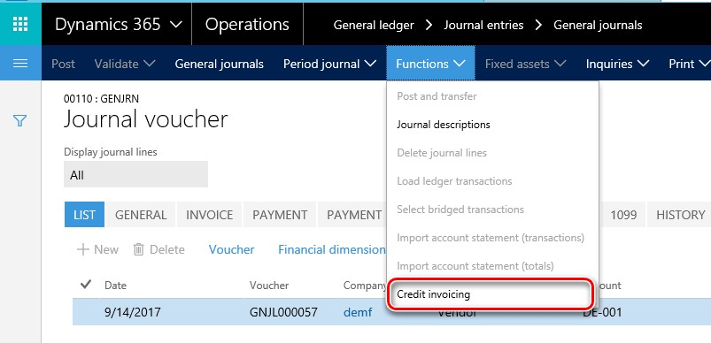

## Credit invoicing (Italy)

To activate this functionality in **Accounts payable** module, mark the **Credit invoicing** check box on **Accounts payable** > **Setup** > **Parameters** > **Updates** tab and in **Accounts receivable **on **Accounts receivable** > **Setup** > **Parameters** > **Updates** tab.
See the screenshots below to find this functionality:

1. From **General ledger** > **Journal entries** > **General journal** > **Lines**:

2. From **Accounts receivable** > **Invoices** > **All free text invoice**:

3. From **Accounts receivable** > **Orders** > **All sales orders**:

4. From **Accounts payable** > **Invoices** > **Invoice journal** > **Lines**:

5. From **Accounts payable** > **Purchase orders** > **All purchase order**:

