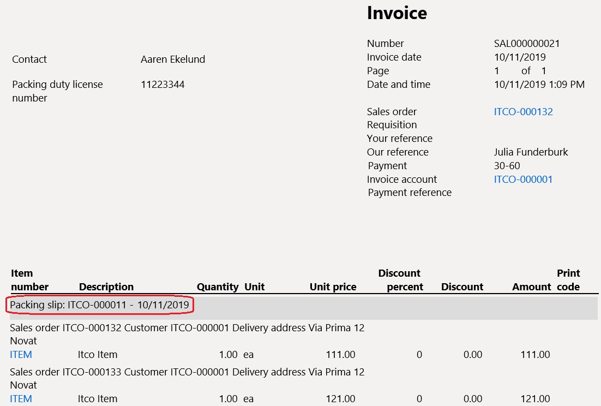

---
# required metadata

title: Sales invoice lines sorting by packing slips
description: Sales invoice lines sorting by packing slips.
author: ilkond
manager: AnnBe
ms.date: 27/08/2019
ms.topic: article
ms.prod: 
ms.service: dynamics-ax-applications
ms.technology: 

# optional metadata

ms.search.form: 
audience: Application User
# ms.devlang: 
ms.reviewer: kfend
ms.search.scope: Core, Operations
# ms.tgt_pltfrm: 
# ms.custom: 
ms.search.region: Italy
# ms.search.industry: 
ms.author: ilyako
ms.search.validFrom: 2019-11-29
ms.dyn365.ops.version: 10.0.7

---

# Sales invoice lines sorting by packing slips

[!include [banner](../includes/banner.md)]

In Italy, companies often need to issue so-called accompanying invoices which combine an ordinary invoice with DDT (transposrt document or packing slip).
This topic explains how to set up and print accompanying invoices which also contain all the required packing slips details properly grouped and sorted.
 
## Prerequisites

- The primary address of the legal entity must be in Italy.
- In **Feature management**, enable the feature, **Sales invoice lines sorting by packing slips**. For more information, see [Feature management overview](../../fin-and-ops/get-started/feature-management/feature-management-overview.md)
- In **Print management** set the reference to *SalesInvoice.Report_IT* layout for Customer invoice (Original).

***Accounts receivable > Setup > Forms > Form setup > General*** (FastTab) ***> Print management***:

## Accompanying invoices printing
Once enabled and set up, the invoice report printout will contain packing slips details.

> [!NOTE]
> The new layout is applicable only to invoices that are based on sales orders. It isn't applicable to free-text invoices, because free-text invoices do not assume packing slips.

