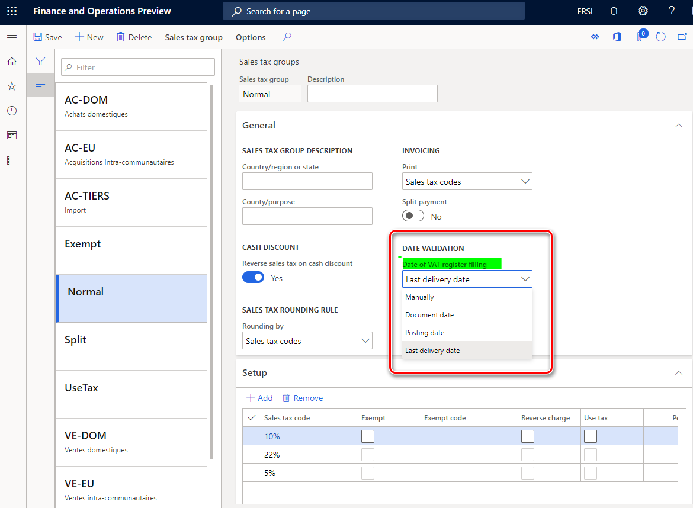

# Tax point date (Date of VAT register)

## “Date of VAT register” feature activating

The **Date of VAT register** field is shared globally and can be enabled in legal entities with primary address in any country. To switch on this functionality **Date of VAT register** feature must be enabled in the **Feature management** workspace:

When **Date of VAT register** feature is enabled in the **Feature management** workspace, user can define additionally for tax transactions date of tax point by using **Date of VAT register** field in all legal entities through the system.
**Date of VAT register** field appears on more than 20 pages. These pages include journals, sales orders, purchase orders, free-text invoices, vendor invoice journals, and project invoices. When you update or post the documents, all taxes are posted by using the corresponding date of the VAT register, and the date is included on pages such as the customer and vendor invoice journals pages.

**Date of VAT register** field appears also in the following reports:
•	**Tax** > **Inquiries and reports** > **Sales tax reports** > **Specification**
•	**Tax** > **Inquiries and reports** > **Sales tax reports** > **Sales tax transactions**
•	**Tax** > **Inquiries and reports** > **Sales tax reports** > **Sales tax transactions – details**
•	**Tax** > **Inquiries and reports** > **Sales tax reports** > **Sales tax specification by ledger transaction**

## Auto-filling of “Date of VAT register” value

**Date of VAT register** feature enables possibility to select a method of auto-filling of **Date of VAT register** field via the **Date of VAT register filling** parameter on the **Sales tax groups page**:

This option fills in automatically **Date of VAT register** field during invoice creation. The following methods are available to select:
•	**Manually** – no value will be defined for **Date of VAT register** field. User can manually define the value before invoice posting.
•	**Document date** – value of **Date of VAT register** field will be defined automatically on document date change.
•	**Posting date** - value of **Date of VAT register** field will be defined automatically on posting date change.
•	**Last delivery date** - the date of last packing slip (for sales order) or product receipt (for purchase order) will be populated as **Date of VAT register** of the invoice.

## “Date of VAT register” filling after invoice posting

If for some reason an invoice is posted with empty **Date of VAT register** field, it is still possible to fill it in. To do so, open **Tax** > **Periodic tasks** > **VAT register transactions** page. This page represents sales tax transactions with empty **Date of VAT register** field. You may select one record for update or a set of records by using a **Filter** function. To define the value for **Date of VAT register** field of the selected record, click **Date of VAT register** button on the **Action pane** of the page and specify the value in the **Date of VAT register** field of the dialog. Updated record will be automatically filtered out from the list of records on the **VAT register transactions** page.

