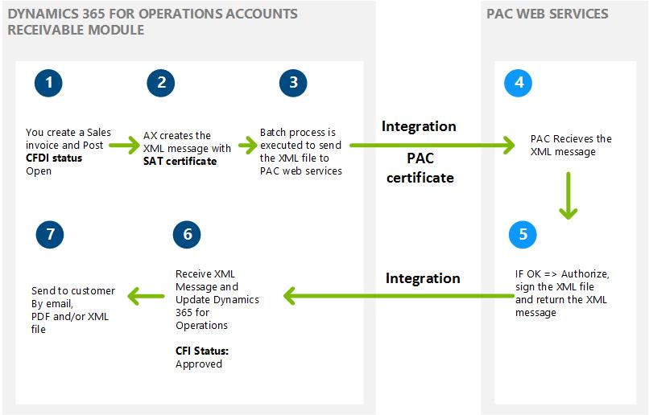

---
# required metadata

title: Electronic invoices (CFDI)
description: This article provides information about the electronic invoices that your organization can submit to the Mexican tax authority (SAT). It describes the currently approved method for submitting electronic invoices (CFDI), the requirements for using them, and the information that they include.
author: sndray
manager: AnnBe
ms.date: 06/20/2017
ms.topic: article
ms.prod: 
ms.service: dynamics-ax-applications
ms.technology: 

# optional metadata

ms.search.form: EInvoiceCFDIJour_MX, EInvoiceCFDIPACTable_MX, EInvoiceParameters_MX, SalesTable, SalesTablePostings
# ROBOTS: 
audience: Application User
# ms.devlang: 
ms.reviewer: shylaw
ms.search.scope: Core, AX 7.0.0, Operations, UnifiedOperations
# ms.tgt_pltfrm: 
ms.custom: 29791
ms.assetid: b6861a2c-c132-48a2-97b5-9cb1020e0512
ms.search.region: Mexico
# ms.search.industry: 
ms.author: sndray
ms.search.validFrom: 2016-02-28
ms.dyn365.ops.version: AX 7.0.0

---

# Electronic invoices (CFDI)

[!include[banner](../includes/banner.md)]

Electronic billing in Mexico requires the Comprobantes fiscales digitales por internet (CFDI) format. 

This article provides information about the electronic invoices that your organization can submit to the Mexican tax authority (SAT). It describes the currently approved method for submitting electronic invoices (CFDI), the requirements for using them, and the information that they include.

An electronic invoice is a legally accepted digital tax receipt that your organization submits to the Mexican tax authority (Servicio de Administración Tributaria \[SAT\]). Microsoft Dynamics 365 for Finance and Operations, Enterprise edition helps guarantee that the electronic invoices that your organization generates are secure, confidential, authentic, and legally acceptable. You can also make sure that international standards are applied to your electronic invoices. You can generate an electronic invoice for the following documents when a transaction is posted:

-   Sales order
-   Free text invoice
-   Credit note
-   Return order
-   Project invoice
-   Project sales order

## Methods for generating electronic invoices
There are two methods for generating electronic invoices:

-   **Comprobantes fiscales digitales (CFD)** – Electronic invoices are generated by using Finance and Operations. The invoices are then verified and certified by using a government website. Finally, your organization submits the invoices to SAT. Although this method is now obsolete because of changes in the legislation, you can inquire about CFD transactions that were previously generated in Finance and Operations.
-   **Comprobantes fiscales digitales por internet (CFDI)** – This is the current method for generating electronic invoices in the format that SAT requires. In this method, the invoices are verified and certified by a digital signature service provider (PAC). Before you can use the CFDI method to generate electronic invoices, your organization must set up a web service connection to an authorized PAC. For the CFDI method, you send an XML message from Finance and Operations to the PAC. The PAC validates each invoice, assigns a folio number, and then incorporates the digital stamp that the service tax authorities provide. After the PAC completes the approval process, your organization receives the approved XML message, and can then submit the invoice to the customer in XML or PDF format.

> [!NOTE]
>  Integration with the PAC web service is not part of the Mexican localization. For information about how to customize a web service connection with a PAC, see “Customizing the integration with PAC web services” later in this article. 

The following illustration shows the process for generating an electronic invoice by using the CFDI method.     

### Requirements for using electronic invoices

To use electronic invoices, your organization must complete the following tasks:

-   Obtain authorization from SAT to use the CFDI method, and acquire the related SAT certificate to issue electronic invoices.
-   Obtain a Registro Federal de Contribuyentes (RFC) number, a Clave Única de Registro de Población (CURP) number, and a state inscription number from SAT.
-   Contract a PAC web service. You can find the authorized PAC services on the SAT website. Some PACs require that you install an additional certificate to enable the connection between your instance of Finance and Operations and the PAC web service.
-   Make sure that PDF and XML files meet SAT requirements. These files are sent to customers as email attachments. The XML file that is generated must be based on the XML schema definition (XSD) that SAT provides. You must archive the XML file of each electronic invoice.
-   An RFC or CURP tax registration ID is required for your organization and your customers. Be sure to complete this information in the related configuration.
-   Install the SAT certificate and PAC service certificate on the server, and make sure that the NETWORK SERVICE user has the appropriate permissions for private keys.
-   Identify the PAC web service that is used. (Click **Accounts receivable** &gt; **Invoices** &gt; **E-invoice** &gt; **PAC accounts**.) You can use test and production environments if your PAC services allow for these types of environments.
-   Enable the configuration to send email, and define the email template that is used to transmit XML and PDF files. (Click **Organization administration** &gt; **Setup** &gt; **E-mail parameters**.)
-   Enable the configuration to issue CFDI electronic invoices. (Click **Accounts receivable** &gt; **Invoices** &gt; **E-invoice** &gt; **Electronic invoice parameters**.)
-   Prepare the integration with your PAC web service.

### Information that is included in electronic invoices

An electronic invoice includes the following details:

-   The name, address, and tax registration numbers of your organization and the customer.
-   The invoice number, the date, and the name of the city where the invoice was generated.
-   The serial number of the digital certificate, the authorization number, and the year when the certificate was authorized.
-   The description and quantity of each item that is included in the invoice.
-   The unit price of each item.
-   The amount that was withheld for income tax (Impuesto sobre la renta \[ISR\]) and value-added tax (VAT). To obtain this information, you must set up the tax type (VAT or ISR) on the **Sales tax code configuration** page (click **Tax** &gt; **Indirect taxes, Sales tax** &gt; **Sales tax code** &gt; **General** &gt; **Tax type**).
-   The total amount of the invoice transaction.
-   The name, number, and date of the customs document that is generated for imported items. This information is available in each invoice transaction form that is mentioned earlier.
-   The registration number of the property if the invoice transaction includes leasing services. This information is available in each invoice transaction form that is mentioned earlier.
-   The digital stamp of the organization.
-   For a printed CFDI version, the bidimensional bar code.

## Customizing the integration PAC web services
As is explained in detail in the Mexican localization scope document, integration with PAC web services requires customization. This customization varies, depending on the PAC web services that are contracted.

## CFDI layout versions

### CFDI layout version 3.3
The following changes are introduced as part of changes in layout version 3.3:
- CFDI version. Version 3.3 is now available.
- CFDI digest algorithm. SHA-256.
- CFDI payment XML schema file. Path and schema file to validate the CFDI payment complement.
- Total amount limits. Identify the incoming and outgoing total amount limits that requires confirmation number.
- Default government classification codes: 
  - SAT product code. Use this classification for scenarios where the item code is not identified.
  - SAT unit code. Use this classification for scenarios where the unit of measure is not identified.
  
##  SAT catalogs

<table>
		<tr><td>SAT Catalogs
			</td>
			<td>
			Microsoft Dynamics AX mapping
			</td>
		</tr>
		<tr>
			<td>cUsoCFDI</td>
			<td>
			
<strong>Organization administration &gt; Setup &gt; Einvoice &gt; SAT classifications &gt; CFDI purpose</strong>, to introduce the list of CFDI purpose classification defined by the government. The user will be able to introduce the following information: SAT code classification, description, version effective and expiration date.

			
This information must be identified into the&nbsp;Sales invoice transaction header under the <strong>CFDI purpose </strong>field. The user can also define the default&nbsp;<strong>CFDI purpose </strong>per customer in <strong>Customers &gt; Invoice and delivery </strong>option.

			</td>
		</tr><tr>
			<td>c_Aduana</td>
			<td>Not applicable for this feature.</td>
		</tr>
		<tr>
			<td>c_ClaveProdServ</td>
			<td>
			
<strong>Organization administration &gt; Setup &gt; Einvoice &gt; SAT classifications &gt; Product and services</strong>, to introduce the list of item code classification defined by the government. The user will be able to introduce the following information: SAT code classification, description, version effective and expiration date.

			
Once the list is created or updated, the user will be able to map the related classification in the following master data:

			<ul>
				<li><strong>Electronic invoice parameters </strong>in default classifications.</li>
				<li><strong>Product information &gt; Released products&gt; General &gt; Electronic invoices</strong></li>
				<li><strong>Account receivables &gt; Setup &gt; Charges &gt; Charges code</strong></li>
			</ul>
			</td>
		</tr>
		<tr>
			<td>c_ClaveUnidad</td>
			<td>
			
<strong>Organization administration &gt; Setup &gt; Einvoice &gt; SAT classifications &gt; Unit of measures</strong>, to introduce the list of unit of measure classification defined by the government. The user will be able to introduce the following information: SAT code classification, description, version effective and expiration date.

			
Once the list is created or updated, the user will be able to map the related classification in the following master data:

			<ul>
				<li><strong>Organization administration &gt; Setup</strong> &gt; <strong>Units</strong> &gt; <strong>Units &gt; Electronic invoices </strong></li>
			</ul>
			</td>
		</tr>
		<tr>
			<td>c_CodigoPostal</td>
			<td>Identified by the ZIP code in the address code of customer, company or other related address.</td>
		</tr>
		<tr>
			<td>c_FormaPago</td>
			<td>Existing information in <strong>Account&nbsp;receivables &gt; Setup &gt; Payment &gt; Method of Payment &gt; SAT payment</strong>.</td>
		</tr>
		<tr>
			<td>c_Impuesto</td>
			<td>
			
Determined by the <strong>Tax type </strong>in Sales tax code setup.

			</td>
		</tr>
		<tr>
			<td>c_MetodoPago</td>
			<td>
			
<strong>Organization administration &gt; Setup &gt; Einvoice &gt; SAT classifications &gt; Method of payment, </strong>to introduce the list of method of payments defined by the government.

			
This information must be identified into the&nbsp;Sales invoice transaction header under the <strong>Payment type</strong> field. The user can also define the default payment type per customer in <strong>Customers &gt; Invoice and delivery </strong>option.

			</td>
		</tr>
		<tr>
			<td>cMoneda</td>
			<td>
			
Identified by the <strong>Currency code </strong>configured in Microsoft Dynamics AX.

			
The allowed exchange rate variation defined by the government must configured in <strong>General ledger &gt; Setup &gt; Currencies &gt; Electronic invoices</strong>. You will be able to introduce the <strong>Exchange rate variation</strong> <strong> limit</strong> per currency.

			</td>
		</tr>
		<tr>
			<td>c_NumPedimentoAduana</td>
			<td>Existing information in the Sales invoice transaction line in the&nbsp;<strong>Custom Number</strong> field.</td>
		</tr>
		<tr>
			<td>cPais</td>
			<td>Identified by the <strong>Country code </strong>configured in Microsoft Dynamics AX.</td>
		</tr>
		<tr>
			<td>c_PatenteAduanal</td>
			<td>&nbsp;</td>
		</tr>
		<tr>
			<td>cRegimenFiscal</td>
			<td>
			
<strong>Organization administration &gt; Setup &gt; Einvoice &gt; SAT classifications &gt; Tax regime</strong>, to introduce the list of tax regime classification defined by the government. The user will be able to introduce the following information: SAT code classification, description, version effective and expiration date.

			
Once the list is created or updated, the user will be able to map the related classification in the following master data:

			<ul>
				<li><strong>Organization administration &gt; Setup</strong> <strong>&gt;Organization &gt; Legal entities &gt; Tax registration</strong>. You will bale to select the tax regime.</li>
			</ul>
			</td>
		</tr>
		<tr>
			<td>cTasaCuota</td>
			<td>Determined by the <strong>Tax type </strong>in Sales tax code setup.</td>
		</tr>
		<tr>
			<td>cTipodeComprobante</td>
			<td>
			
Determined by the type of Sales invoice transaction. The support types for this feature are:

			<ul>
				<li>Incoming</li>
				<li>Outgoing</li>
				<li>Payment</li>
			</ul>
			</td>
		</tr>
		<tr>
			<td>cTipoFactor</td>
			<td>
			
Determined by the <strong>Tax type </strong>in Sales tax code setup.

			
<strong>Exempt&nbsp;</strong>type is identified by&nbsp;the sales tax code configuration as <strong>tax rate = 0.00 </strong>and <strong>tax type = VAT</strong>.

			
<strong>TASA </strong>type identified by sales tax code configuration with <strong>tax rate &lt;&gt; 0.00</strong>.

			</td>
		</tr>
		<tr>
			<td>cTipoRelacion</td>
			<td>New functionality has been implemented<strong> CFDI reference </strong>to allow users to identify the different types of relations between CFDI documents. Some of them are assigned automatically, and others scenarios will allow manually selection by the user.</td>
		</tr>
</table>

## CFDI Reference
As per legal requirement, user must be able to reference one or more CFDI invoices related under specific scenarios. For example, a customer might return items if the incorrect item was received, or if an item is defective. You must create a return order and also identify the original sales invoice that was submitted before and identify the type of relation (cTipoRelacion) defined by the government, in this case 03: Goods return.

Before you post a Sales invoice, you can reference the related CFDI invoice under the following path: **Post** > **Setup** > **CFDI reference**.

You can select the available list of CFDI invoices that are approved or you can manually enter the following information:
- **UUID**
- **Type of relation**

This functionality is also available in **Payment journals** > **CFDI reference** when the CFDI payment complement is generated as well. 

This process describes the processing of CFDI payment complement generation when a payment is collected from customer and applied to an existing CFDI invoice document.

CFDI payment complement are generated from the payment journal and settlement process under the following criterias:
- Journal payment settled with one or more invoices;
- Journal settlement, settled with one or more invoices;
- Journal name must be defined with journal type = Customer payment.

Once the journal payment or journal settlement is posted, and then Export/Import batch process is executed to get the related approval from PAC (third party software).
Some addition information will be required for journal payment depending on the method of payment selected:

- Offset main account;
- Third party customer bank account;
- RFC customer bank account. We introduced a new field into the Customer bank account form to fulfill the legal requirements established by the tax authorities.

Use the CFDI electronic invoice inquire to view, email, export, or print an already-generated CFDI payment complement based on a customer’s request. The printed CFDI electronic invoice includes two-dimensional bar code in accordance with the format of QR Code (Quick Response Code) that is described in the standard ISO/IEC18004. Go to **Accounts receivable** > **Inquiries and reports** > **CFDI (electronic invoices)** >**Payment tab**.

## Customer advance payments

This process describes the processing and setup of advanced customer payment to generate and issue a CFDI electronic invoice.
As per government definition, there is an specific process to follow when advance payments are collected from customers.
1. **CFDI advance payment**. Issuance of an electronic invoice to the customer for the amount of the advance received
2. **CFDI Invoice**. Once the operation is realized and advance payment is applied, the company must issue the CFDI invoice of operation, and details the CFDI advance payment UUID issued in the step one.
3. **CFDI Invoice reverse**. Issuance of an electronic invoice to reverse the Advance payment applied.

### Advance payment prerequisites
Use prepayment journal vouchers functionality to issue CFDI advance payment. Before to submit, the CFDI additional configuration is required to fulfill the step 1 detailed in previous section.
- Accounts receivable > Setup > Customer posting profiles, create and Advance payment profile.
- Accounts receivable > Setup > Accounts receivable parameters > Ledger and sales tax > Payment
- Select the posting profile created before.
- If sales tax is calculated and posted when you post a prepayment journal voucher, select the Sales tax on prepayment journal voucher check box.

### Issuing CFDI for Advance payment - Step 1
1. Click Accounts receivable > Journals > Payments > Payment journal to create the advance payment.
2. Introduce the lines and the related information. Include the Method of payment and Sales tax codes is applicable.
On the Payment tab, select the Prepayment journal voucher check box.
Post the Advance payment.
Click Accounts receivable >Periodic > CFDI electronic invoices > Export/Import electronic invoice process, to request the digital stamp of CFDI advance payment.
Click Accounts receivable > Inquire > Journals > CFDI electronic invoice > Payment tab, to inquire the status of CFDI advance payment. This transaction is classified in Document type information as Prepayment.
Note
CFDI Advance payment transactions are identified in the system by the following criterias, Journal name type = Customer payment and Prepayment journal voucher marked. Otherwise, the payment transaction is considered as regular payment
 
### Issuing CFDI invoice with Advance application - Step 2
Create a sales invoice transaction.
Before to post the invoice, you can settle the advance payment created in the step 1, by using the Open Transaction settle option.
In the Post form, you can check the referenced CFDI invoice. It has been created automatically with cTipoRelacion = 07.
Post the Sales invoice and proceed with the regular process.
Note
At the time we released this KB, the government has not updated the schema to allow cTipoRelacion = 07. In case of getting error schema validation, you can select manually the option 01: Credit note to solve the issue.
 
### Issuing CFDI Advance reverse - Step 3
After the company issue a CFDI for the total amount of operation, the company needs to submit another CFDI Advance reverse ( Egreso) for the advance payment settled.
This CFDI advance reverse is generated automatically when we get the approval of CFDI generated in step 2. No additional actions are required from the user point of view.
Use the CFDI electronic invoice inquire to view, email, export, or print an already-generated CFDI advance payment based on a customer's request. The printed CFDI electronic invoice includes two-dimensional bar code in accordance with the format of QR Code (Quick Response Code) that is described in the standard ISO/IEC18004. Go to Accounts receivable > Inquiries and reports > CFDI (electronic invoices) > Payment tab.
CFDI Advance payment are identified with the document type = Prepayment.
Confirmation number
The confirmation number in a CFDI invoice is required when the total amount of invoice or exchange rate vairaiton is out of range of limits established by the government. Under this scenario, it is required a specific confirmation code that could be included in two ways.
If the company knows that exceed the limits, you can include the confirmation code in the header of sales invoice transaction.
If you receive a Rejection from PAC because the limits, you can set the confirmation code in CFDI electronic invoice inquire > Functions > Set authorization code and Resend again for the approval process.

## Additional resources

- [Create and post a customer invoice as an electronic invoice by using the CFDI method](./tasks/mx-00010-e-invoicing-cfdi.md)
- [View, email, export, or print an already-generated CFDI electronic invoice based on a customer’s request](./tasks/mx-00010-inquire-print-electronic-invoice.md)
- [Cancel a CFDI electronic invoice](./tasks/mx-00010-cancel-electronic-invoice.md)

