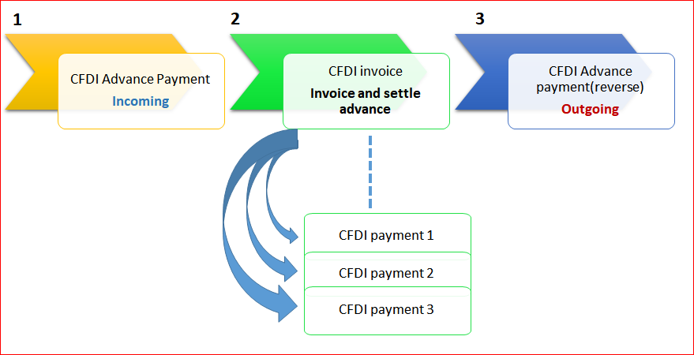

---
# required metadata

title: CFDI layout version 3.3
description: This topic provides information about Comprobante Fiscal Digital por Internet (CFDI) layout version 3.3 for Mexico.
author: sndray
manager: AnnBe
ms.date: 01/03/2018
ms.topic: article
ms.prod: 
ms.service: dynamics-ax-applications
ms.technology: 

# optional metadata

ms.search.form: CustPosting, VendParameters
audience: Application User
# ms.devlang: 
ms.reviewer: shylaw
ms.search.scope: Core, Operations
# ms.tgt_pltfrm: 
# ms.custom: 
ms.search.region: Mexico
# ms.search.industry: 
ms.author: sndray
ms.search.validFrom: 2017-12-01
# ms.dyn365.ops.version: 

---

# CFDI layout version 3.3

[!include[banner](../includes/banner.md)]

## Electronic invoice parameters

If your organization uses electronic invoices that are validated and certified by a third-party digital signature service provider (PAC), you enable electronic invoicing by using the fields in the **CFDI** area of the **Electronic invoice parameters** page.

The following changes are introduced in version 3.3 of the Comprobante Fiscal Digital por Internet (CFDI) layout:

- **CFDI version:** Version 3.3 is now available.
- **CFDI digest algorithm:** SHA-256.
- **CFDI payment XML schema file:** The path and name of the schema file that is used to validate the CFDI payment complement.
- **Total amount limits:** Specify the incoming and outgoing total amount limits that require a confirmation number.
- **Default government classification codes:**

    - **SAT product code** – Use this classification for scenarios where the item code isn't identified.
    - **SAT unit code** – Use this classification for scenarios where the unit of measure isn't identified.

## SAT catalogs

<table>
<thead>
<tr>
<th>SAT catalog</th>
<th>Microsoft Dynamics 365 for Finance and Operations, Enterprise edition mapping</th>
</tr>
</thead>
<tbody>
<tr>
<td>cUsoCFDI</td>
<td>Select <strong>Organization administration</strong> &gt; <strong>Setup</strong> &gt; <strong>Einvoice</strong> &gt; <strong>SAT classifications</strong> &gt; <strong>CFDI purpose</strong> to enter the list of CFDI purpose classifications that are defined by the government. You can enter the following information: Mexican tax authorities (SAT) code classification, description, effective version, and expiration date.

This information must be entered in the <strong>CFDI purpose</strong> field on the sales invoice transaction header. You can also define a default CFDI purpose per customer by selecting <strong>Customers</strong> and using the <strong>Invoice and delivery</strong> option.</td>
</tr>
<tr>
<td>c_Aduana</td>
<td>Not applicable</td>
</tr>
<tr>
<td>c_ClaveProdServ</td>
<td>Select <strong>Organization administration</strong> &gt; <strong>Setup</strong> &gt; <strong>Einvoice</strong> &gt; <strong>SAT classifications</strong> &gt; <strong>Product and services</strong> to enter the list of item code classifications that are defined by the government. You can enter the following information: SAT code classification, description, effective version, and expiration date.

After the list is created or updated, you can map the related classification in the following master data:
<ul>
<li><strong>Electronic invoice parameters</strong> in default classifications</li>
<li><strong>Product information</strong> &gt; <strong>Released products</strong> &gt; <strong>General</strong> &gt; <strong>Electronic invoices</strong></li>
<li><strong>Accounts receivable</strong> &gt; <strong>Setup</strong> &gt; <strong>Charges</strong> &gt; <strong>Charges code</strong></li>
</ul>
</td>
</tr>
<tr>
<td>c_ClaveUnidad</td>
<td>Select <strong>Organization administration</strong> &gt; <strong>Setup</strong> &gt; <strong>Einvoice</strong> &gt; <strong>SAT classifications</strong> &gt; <strong>Unit of measures</strong> to enter the list of unit of measure classifications that are defined by the government. You can enter the following information: SAT code classification, description, effective version, and expiration date.

After the list is created or updated, you can map the related classification in the following master data:
<ul>
<li><strong>Organization administration</strong> &gt; <strong>Setup</strong> &gt; <strong>Units</strong> &gt; <strong>Units</strong> &gt; <strong>Electronic invoices</strong></li>
</ul>
</td>
</tr>
<tr>
<td>c_CodigoPostal</td>
<td>This information is identified by the ZIP Code/postal code in the address code of the customer, company, or other related address.</td>
</tr>
<tr>
<td>c_FormaPago</td>
<td>Existing information at <strong>Accounts receivable</strong> &gt; <strong>Setup</strong> &gt; <strong>Payment</strong> &gt; <strong>Method of Payment</strong> &gt; <strong>SAT payment</strong> is used.</td>
</tr>
<tr>
<td>c_Impuesto</td>
<td>This information is determined by the <strong>Tax type</strong> value in the sales tax code setup.</td>
</tr>
<tr>
<td>c_MetodoPago</td>
<td>Select <strong>Organization administration</strong> &gt; <strong>Setup</strong> &gt; <strong>Einvoice</strong> &gt; <strong>SAT classifications</strong> &gt; <strong>Method of payment</strong> to enter the list of methods of payment that are defined by the government.

This information must be entered in the <strong>Payment type</strong> field on the sales invoice transaction header. You can also define the default payment type per customer by selecting <strong>Customers</strong> and using the <strong>Invoice and delivery</strong> option.</td>
</tr>
<tr>
<td>cMoneda</td>
<td>This information is identified by the <strong>Currency code</strong> value that is configured in Finance and Operations.

The government defines the exchange rate variation that is allowed. This value must be configured at <strong>General ledger</strong> &gt; <strong>Setup</strong> &gt; <strong>Currencies</strong> &gt; <strong>Electronic invoices</strong>. You can enter the <strong>Exchange rate variation limit</strong> value per currency.</td>
</tr>
<tr>
<td>c_NumPedimentoAduana</td>
<td>Existing information in the <strong>Custom Number</strong> field on the sales invoice transaction line is used.</td>
</tr>
<tr>
<td>cPais</td>
<td>This information is identified by the <strong>Country code</strong> value that is configured in Finance and Operations.</td>
</tr>
<tr>
<td>c_PatenteAduanal</td>
<td>Not applicable</td>
</tr>
<tr>
<td>cRegimenFiscal</td>
<td>Select <strong>Organization administration</strong> &gt; <strong>Setup</strong> &gt; <strong>Einvoice</strong> &gt; <strong>SAT classifications</strong> &gt; <strong>Tax regime</strong> to enter the list of tax regime classifications that are defined by the government. You can enter the following information: SAT code classification, description, effective version, and expiration date.

After the list is created or updated, you can map the related classification in the following master data:
<ul>
<li>Select <strong>Organization administration</strong> &gt; <strong>Setup</strong> &gt; <strong>Organization</strong> &gt; <strong>Legal entities</strong> &gt; <strong>Tax registration</strong>. You can then select the tax regime.</li>
</ul>
</td>
</tr>
<tr>
<td>cTasaCuota</td>
<td>This information is determined by the <strong>Tax type</strong> value in the sales tax code setup.</td>
</tr>
<tr>
<td>cTipodeComprobante</td>
<td>This information is determined by the type of sales invoice transaction. The following types are supported for this feature:
<ul>
<li>Incoming</li>
<li>Outgoing</li>
<li>Payment</li>
</ul>
</td>
</tr>
<tr>
<td>cTipoFactor</td>
<td>This information is determined by the <strong>Tax type</strong> value in the sales tax code setup.

The sales tax code configuration identifies the <strong>Exempt</strong> type as <strong>tax rate = 0.00</strong> and <strong>tax type = VAT</strong>. It identifies the <strong>TASA</strong> type as <strong>tax rate &lt;&gt; 0.00</strong>.</td>
</tr>
<tr>
<td>cTipoRelacion</td>
<td>New CFDI reference functionality has been implemented that lets users identify the various types of relations between CFDI documents. Some of these relation types are assigned automatically. Users can manually select other relationship types in specific scenarios.</td>
</tr>
</tbody>
</table>

## CFDI reference

Per the legal requirement, users must be able to reference one or more related CFDI invoices in specific scenarios. For example, a customer might return items if the incorrect item was received, or if an item is defective. You must then create a return order, identify the original sales invoice that was submitted, and identify the type of relation (**cTipoRelacion**) that is defined by the government. In this case, the relation is **03: Goods return**.

Before you post a sales invoice, you can reference the related CFDI invoice at **Post** &gt; **Setup** &gt; **CFDI reference**.

You can select the available list of CFDI invoices that have been approved, or you can enter the following information:

- Universally unique identifier (UUID)
- Type of relation

When a CFDI payment complement is generated, this functionality is also available at **Payment journals** &gt; **CFDI reference**. 

The following information describes how a CFDI payment complement is generated when payment is collected from a customer and applied to an existing CFDI invoice document.

CFDI payment complements are generated from the payment journal and settlement process under the following conditions:

- The journal payment is settled with one or more invoices.
- The journal settlement is settled with one or more invoices.
- In the journal name definition, the journal type is set to **Customer payment**.

After the journal payment or journal settlement is posted, the Export/Import batch process is run to get the related approval from PAC (third-party software).

The following additional information is required for the journal payment, depending on the method of payment that is selected:

- Offset main account.
- Third-party customer bank account.
- Registro Federal de Contribuyentes (RFC) customer bank account. A new field has been added to the **Customer bank account** page to meet the legal requirements that were established by the tax authorities.

Based on a customer's request, you can use the CFDI electronic invoice inquiry to view, email, export, or print a CFDI payment complement that was previously generated. Select **Accounts receivable** &gt; **Inquiries and reports** &gt; **CFDI (electronic invoices)**, and then select the **Payment** tab. The printed CFDI electronic invoice includes a two-dimensional barcode in accordance with the format for Quick Response Codes (QR codes) that is described in the International Organization for Standardization (ISO)/International Electrotechnical Commission (IEC) 18004 standard.

## Customer advance payments

This section describes the processing and setup of an advance customer payment so that a CFDI electronic invoice can be generated and issued. Per the government definition, a specific procedure must be followed when advance payments are collected from customers.

1. **CFDI advance payment** – An electronic invoice is issued to the customer for the amount of the advance that was received.
2. **CFDI invoice** – After the operation is realized, and the advance payment is applied, the company must issue the CFDI invoice of operation and details of the CFDI advance payment UUID that was issued in the step 1.
3. **CFDI advance payment reverse** – An electronic invoice is issued to reverse the advance payment that was applied.

## Prerequisites

You use the functionality for prepayment journal vouchers to issue a CFDI advance payment. Before you can submit the advance payment, you must complete the following prerequisites.

1. Select **Accounts receivable** &gt; **Setup** &gt; **Customer posting profiles**, and create a posting profile for advance payments.
2. Select **Accounts receivable** &gt; **Setup** &gt; **Accounts receivable parameters** &gt; **Ledger and sales tax** &gt; **Payment**, and follow these steps:

    1. Select the posting profile that you created earlier.
    2. If sales tax is calculated and posted when you post a prepayment journal voucher, select the **Sales tax on prepayment journal voucher** check box.

## Step 1: Issue a CFDI advance payment

1. Select **Accounts receivable** &gt; **Journals** &gt; **Payments** &gt; **Payment journal** to create the advance payment.
2. Enter the lines and the related information. Include the method of payment and sales tax codes as appropriate.
3. On the **Payment** tab, select the **Prepayment journal voucher** check box.
4. Post the advance payment.
5. Select **Accounts receivable** &gt; **Periodic** &gt; **CFDI electronic invoices** &gt; **Export/Import electronic invoice process** to request the digital stamp of CFDI advance payment.
6. Select **Accounts receivable** &gt; **Inquire** &gt; **Journals** &gt; **CFDI electronic invoice**, and then select the **Payment** tab to inquire about the status of the CFDI advance payment. This transaction is classified in the **Document type information** field as **Prepayment**.

    > [!NOTE]
    > The following criteria are used to identify CFDI advance payment transactions in the system:
    >
    > - The journal name type is set to **Customer payment**.
    > - The **Prepayment journal voucher** check box is selected.
    > 
    > Any payment transaction that doesn't meet these criteria is considered a regular payment.

## Step 2: Issue a CFDI invoice together with details of the advance payment that was applied

1. Create a sales invoice transaction.
2. Before you post the invoice, you can settle the advance payment that you created in [Step 1: Issue a CFDI advance payment](##step-1-issuing-cfdi-for-advance-payment). To settle the advance payment, use the **Open transaction settle** option.
3. On the **Post** page, you can verify the referenced CFDI invoice. The invoice is created automatically, and the type of relation (**cTipoRelacion**) is set to **07**.
4. Post the sales invoice.

    > [!NOTE]
    > As of publication, the government hasn't updated the schema to enable **cTipoRelacion** to be set to **07**. If you receive an error message during schema validation, you can manually select **01: Credit note** to solve the issue.

## Step 3: Issue a CFDI advance payment reverse

After the company issues a CFDI invoice for the total amount of the operation, it must submit a CFDI advance payment reverse (Egreso) for the advance payment that was settled. This CFDI advance payment reverse is automatically generated when you receive approval for the CFDI invoice that you generated in [Step 2: Issue a CFDI invoice together with details of the advance payment that was applied](##step-2-issuing-cfdi-invoice-with-advance-application).

Based on a customer's request, you can use the CFDI electronic invoice inquiry to view, email, export, or print a CFDI payment complement that was previously generated. Select **Accounts receivable** &gt; **Inquiries and reports** &gt; **CFDI (electronic invoices)**, and then select the **Payment** tab. The printed CFDI electronic invoice includes a two-dimensional barcode in accordance with the format for QR codes that is described in the ISO/IEC 18004 standard.

CFDI advance payments are identified by a document type of **Prepayment**.

## Confirmation number

The confirmation number is required on a CFDI invoice when the total amount of the invoice or the exchange rate variation is outside the limits that the government has established. In this scenario, you can specify the required confirmation in two ways:

- If the company knows that the limits have been exceeded, you can include the confirmation code on the sales invoice transaction header.
- If you receive a rejection from PAC because the limits have been exceeded, you can set the confirmation code for the approval process at **CFDI electronic invoice inquire** &gt; **Functions** &gt; **Set authorization code and Resend again**.
