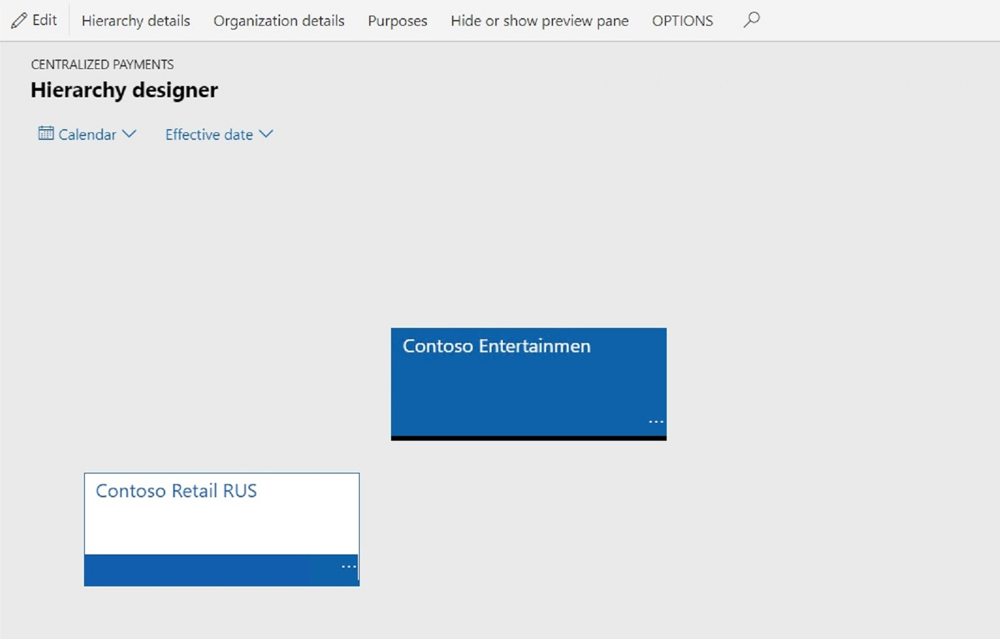
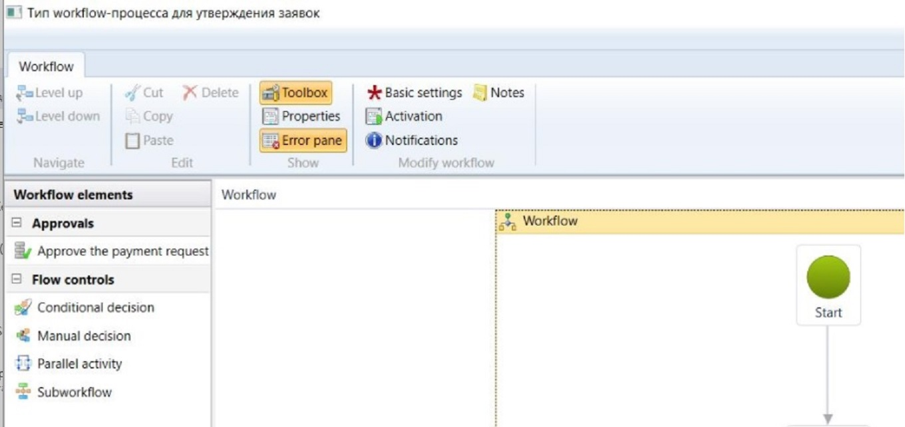
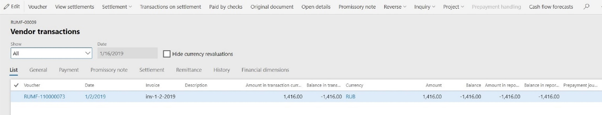
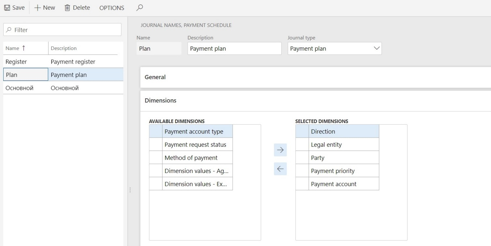
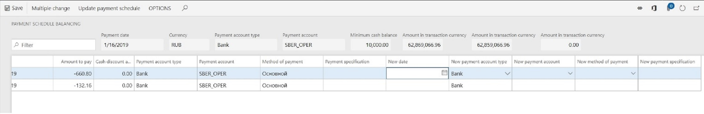
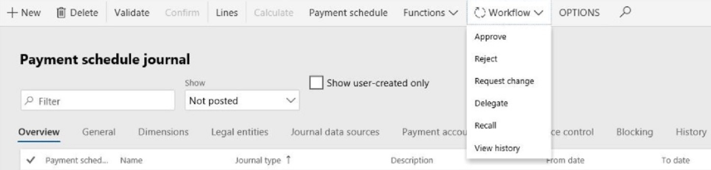

---
# required metadata

title: Cash flow management (Russia)
description: This topic walks you through an example of setting up and using cash flow management in Microsoft Dynamics 365 for Finance and Operations.
author: ShylaThompson
manager: AnnBe
ms.date: 02/11/2019
ms.topic: article
ms.prod: 
ms.service: dynamics-ax-applications
ms.technology: 

# optional metadata

# ms.search.form:  
audience: Application User
# ms.devlang: 
ms.reviewer: shylaw
ms.search.scope: Core, Operations
# ms.tgt_pltfrm: 
# ms.custom: 
ms.search.region: Russia
# ms.search.industry: 
ms.author: shylaw
ms.search.validFrom: 
ms.dyn365.ops.version: 

---

# Cash flow management (Russia)
[!include [banner](../includes/banner.md)]

**Note:** The data set that is used in this document is for demo purposes only. The codes that you use for ledger accounts, value-added tax (VAT), rates, and so on, should comply with the rules that are accepted in your company.

In a centralized payments organization, there are many legal entities for operations, and each operating legal entity manages its own invoices payable information. Payments for all the operating legal entities are generated from a single legal entity, which might be called the Treasury legal entity (company).

The Treasury company is responsible for monitoring the flow of cash/liquidity movement across companies and cash positions, and for preventing corporate cash shortage in good time.

The key goals of the Treasury company are as follows:

- Obtain an accurate liquidity/cash flow forecast and perform an analysis for the
medium-term/short-term horizon.

- Manage payments daily by using payment schedule journals.

- Control the company’s cash position (shortage and surplus).

- Maintain the company’s cash flows through centralized control.

This document provides a step-by-step example that illustrates the settings and user activities for cash flow management in Microsoft Dynamics 365 for Finance and Operations.

In this example, Contoso Retail RUS (RURT) is a subsidiary of an industrial holding company and does business as an operating legal entity. Contoso Entertainment Systems Russia (RUMF) is an internal bank of an industrial holding company and handles all payments.

The following table shows the stages of payment that a treasurer deals with during payment processing.

<table> 
<tr>
<td>Business scenario</td>
<td>Payment cause</td>
<td>:Payment stage</td>
</tr>
<tr>
<td>The company requests and confirms delivery of goods (that is, a purchase order that has a delivery schedule is confirmed). A treasurer includes information about the expected payments (inflow or outflow) in the cash flow forecast – payment schedule journal (payment plan).
The new entity is an expansion of cash flow forecast transactions and purchase order/sales order payment schedule lines.
</td>
<td>
<ul>
  <li>Purchase order</li>
  <li>Sales order</li>
  <li>Free text invoice</li>
  </ul></td>
<td>Planned payment</td>
</tr>
<tr>
<td>Note: This new entity and the associated functionality are available only if the Payment request license configuration key is enabled.
The company receives the payment request from a seller (prepayment request, invoice, and so on). The manager creates a payment request, which should be approved by the manager lead and a treasurer. The treasurer includes information about the expected and approved payments (inflow or outflow) in the cash flow forecast.
The new entity is an expansion of vendor transactions and customer transactions.
</td>
<td><ul>
  <li>Vendor invoice</li>
  <li>Prepayment invoicer</li>
  <li>Planned payment for confirmed purchase order</li>
  <li>Customer return invoice</li>
  </ul></td>
<td>Payment request</td>
</tr>
<tr>
<td>A treasurer generates and confirms the payment schedule journal (payment register). In this way, the company defines the list of payments that should be performed by the bank/cash account.</td>
<td>Payment schedule journal (of the Payment register type)</td>
<td>Payment order</td>
</tr>
<tr>
<td>The company receives the statement from a bank. This statement includes the authorized transactions (completed payments).</td>
<td>Bank statement</td>
<td>Completed payment</td>
</tr>
</table>

After you complete the example that is provided in this document, you will be able to complete the following tasks:

Configure cash flow management parameters to support the new functionality.

Perform a planned payment processing. Forecast transactions of incoming and outgoing payments are automatically created and updated based on purchase orders, sales orders and free text invoices.

(Only if the **Payment request** license configuration key is enabled) Perform payment request processing (including creation, update, and approval), based on indebtedness to vendors, customers, and workers, and prepayment requirements from vendors.

Perform payment schedule journal processing for mid-term liquidity planning (payment plan) and daily payment management (payment register). Analyze cash deficit and surplus through payment schedule sheet balancing (the simulation function).

Generate payments, based on an approved payment register (a type of payment schedule journal).

## Setup

### License configuration

1. Go to  **System administration > Setup > License configuration**.
2. Under **Country/Regional specific features \>Russia**, select the **Cash flow management** check box.
3. If the organization is planning to use payment requests, select the **Payment requests** check box.

### Organization hierarchy for centralized payments (optional)

1. Go to **Organization administration > Organizations > Organization hierarchies**.
2. Make sure that the selection in the Hierarchy table is changed to **Centralized Payments**.

3. Click **View**.
4. On the **Hierarchy designer** page, create a new hierarchy, where **RUMF** is the legal entity of the payment and **RURT** is the operating legal entity.

5. Publish the new hierarchy.

###  Cash flow management workflow

1. Go to **Cash and bank management > Setup > Cash and bank management workflows**.
2. Click **New** to create a new record.
3. Select the required workflow type: **Workflow type for payment requests approval** or **Payment schedule journal approval workflow**.
4. Set the new workflow by using the new workflow elements: **Approve the payment request** or **Approve payment schedule journal**.

5. Activate the new workflow.

### Payment priority

1. Go to **Cash and bank management > Setup > Cash flow management > Payment priority**.
2. Click **New** to create a new record.
3. On the **Manage priority** FastTab, use the **Up** and **Down** buttons to arrange the priority list.
4. Click **Accounts payable > Vendors > All vendors**.
5. On the **Vendors** page, select the vendor.
6. Click **Edit**. Then, in the **Payment priority** field, specify a priority code for the associated party. This operation can also be completed in the **Party** and **Customer** forms.

### Payment request type

1.  Go to **Cash and bank management > Setup > Cash flow management > Payment request type**.
    > [!NOTE]
    > The **Payment request type** page is available only if the **Payment request** license configuration key is enabled.
2.  Click **New** to create a new record.
3.  Specify the **Payment priority**: . If a payment priority is not specified for a payment request type, the lowest payment priority will be used for payment requests of that type. The payment priority for a payment request will be a maximum between the payment priority of the party and the payment priority of the payment request type.

4.  Specify the cash flow direction: **Cash inflow** or **Cash outflow**.
5.  Specify the workflow that is associated with payment request approval, if the approval procedure should be applied to payment requests of this type.

### Specify cash flow management parameters

This setup should be completed for a Treasury company.

1. Go to **Cash and bank management > Setup > Cash and bank management parameters**. 

2. In the **Cash flow management** area, on the **Financial dimensions** FastTab, specify the dimension set. This step enables an organization to determine which dimensions in the account structures that are associated with the chart of accounts (of legal entities in a centralized payment hierarchy) are available for cash flow management processing. This means that, for example, combinations of departments that have cost centers can be used for liquidity/cash flow forecast analysis.

3. On the **Default exchange rate type for forecast** FastTab, specify the default exchange rate type for forecasts. This value is used in payment plans when the currency of a payment source differs from the payment currency.

> [!NOTE] 
> The following parameters are available only if the **Payment request** license configuration key is enabled.

4. On the **Payment requests** FastTab, specify payment request types for **Indebtedness to vendor**, **Vendor prepayment**, **Indebtedness to customer**, **Indebtedness to worker**. These payment request types will be used during automatic payment request creation.

5. On the **Payments** FastTab, specify the vendor payment journal and customer payment journal that are used to post payments that are generated by the payment register.

6. On the **Payment request re-approval** FastTab, in the **Amount to pay change** field, specify the system behavior if the amount to pay for a payment request is changed. You can specify that the system should always initialize a payment request re-approval through workflow, that the system should initialize a payment request re-approval only if the amount to pay has increased, or that re-approval is never required.

7. On the **Number sequences** FastTab, specify the number sequence codes for the following:
    - payment requests
    - payment schedule journals.

### Set up terms of payment

This setup is available only if the **Payment request** license configuration key is enabled.

1. Go to **Accounts payable > Payment Setup > Terms of payment**.
2. Click **Edit**. Specify the payment request types for payments and prepayments if specific payment request types should be used in these scenarios.

### Set up payment schedules

1. Go to **Accounts payable > Payment setup > Payment schedules**.
2. Create a new payment schedule and set the allocation method to **Specified**.
3. On the **Payment lines** FastTab, create new payment lines. Select the **Prepayment** check box if a payment request on prepayment should be created for a line.

### Set up the remittance en route account

This setup should be completed for a Treasury company.

1. Go to **Cash and bank management > Cash flow forecasting \> Cash flow forecast setup.**
2. In the **General** area, on the **Liquidity accounts** FastTab, click **Add**.
3. Select the Ledger account in the field **Main account**
4. Select the **Remittance en route** check box.

### Set up minimum cash balance for bank accounts

This setup should be completed for a Treasury company.

1. Go to **Cash and bank management > Bank accounts > Bank accounts**.
2. Select a bank account and click **Edit**.
3. Specify the **Minimum cash balance**. If the estimated balance amount of the bank account is less than the minimum cash balance that you specify, the payment schedule sheet will overwrite the estimated balance for that date.

### Set up minimum cash balance for cash accounts

This setup should be completed for a Treasury company.

1. Go to **Cash and bank management > Bank accounts > Cash accounts**.
2. Select the record and click **Edit**.
3. Specify the **Minimum cash balance**. If the estimated balance amount of the cash account is less than the minimum cash balance that you specify, the payment schedule sheet will overwrite the estimated balance for that date.

### Set up default Payment order requisites for purchase agreement.
The same setup is valid for payment order requisites on sales agreements.

1. Click **Accounts payable > Purchase orders > Purchase agreements**.
2. Select a purchase agreement that has a method of payment that is associated with a payment order in Russian rubles (RUB).
3. On the **Action Pane**, on the **Purchase agreement** tab, in the **Setup** group, click **Payment order**.
4. Click **Edit** and specify default payment order requisites. Payment order requisites of a payment request or a payment journal line that is associated with this purchase agreement will be initialized from the purchase agreement.

## Planned payment processing

### Planned payments on purchase orders

A planned payment contains details about future payments: the amount, method of payment, payment account, payment priority, and cash discount amount.

The due date is calculated based on the confirmed delivery date or delivery date if the first date is not specified.

If a user posts an invoice, planned payments will be recalculated. If a purchase order is fully invoiced, the purchase order will not have any planned payments.

If the **Payment request** license configuration key is enabled, a planned payment is created based on the financial dimensions from the purchase order lines; otherwise, the planned payment is based on the financial dimensions from the purchase order header.

Planned payments will be generated for a purchase order if a payment schedule is calculated, or if a user clicks the **Planned payments** button.

This procedure should be completed in a subsidiary company.

1. Go to **Accounts payable > Purchase orders > All purchase orders**.
2. Create a new purchase order, and specify the terms of payments, payment schedule, method of payment, cash discount, and financial dimensions on the purchase order header.
3. Create purchase order lines, and specify the sales tax group, item sales tax group, and financial dimensions. Distribute the amount of a line if you need to.
4. On the **Action Pane**, on the **Invoice** tab, in the **Bill** group, click **Planned payments**.
5. Review the planned payments that have been created, based on the due dates, financial dimension values, sales tax group, and item sales tax group.

### Planned payments on sales orders
A planned payment contains details about future payments: the value, method of payment, payment account, payment priority, and cash discount amount.

If the **Payment request** license configuration key is enabled, a planned payment is created based on the financial dimensions from the sales order lines; otherwise, the planned payment is based on the financial dimensions from the sales order header.

Planned payments will be generated for a sales order if a payment schedule is calculated, or if a user clicks the **Planned payments** button.

This step should be completed in a subsidiary company.

1. Go to **Accounts receivable > Orders > All sales orders**.
2. Create a new sales order, and specify the terms of payments, payment schedule, method of payment, cash discount, and financial dimensions on the sales order header.
3. Create sales order lines, and specify the sales tax group, item sales tax group, and financial dimensions.
4. On the **Action Pane**, on the **Invoice** tab, in the **Bill** group, click **Planned payments**.
5. Review the planned payments that have been created, based on the due dates, dimension values, sales tax group, and item sales tax group.

### Planned payments on free text invoices

A planned payment contains details about future payments: the value, method of payment, payment account, payment priority, and cash discount amount.

If the **Payment request** license configuration key is enabled, a planned payment is created based on the financial dimensions from the free text invoice lines; otherwise, the planned payment is based on the financial dimensions from the free text invoice header.

Planned payments will be generated for a free text invoice if a payment schedule is calculated, or if a user clicks the **Planned payments** button.

This step should be completed in a subsidiary company.

1. Go to **Accounts receivable > Invoices > All free text invoices**.
2. Create a new free text invoice, and specify the terms of payments, payment schedule, method of payment, cash discount, and financial dimensions on the free text invoice header.
3. Create free text invoice lines, and specify the sales tax group, item sales tax group, and financial dimensions. Distribute the amount of a line you need to.
4. On the **Action Pane**, on the **Invoice** tab, in the **Details** group, click **Planned payments**.
5. Review the planned payments that have been created, based on the due dates, dimension values, sales tax group, and item sales tax group.

### Periodic creation of planned payments

This step should be completed for a Treasury company.

1. Go to **Cash and bank management > Periodic tasks > Cash flow management > Calculate planned payments**.
2. Specify the following parameters:

  |Field | Description|
  |--------|--------------|
  |**From date** |Specify the start of the date range for the planned payment sources. |
  |**To date** | Specify the end of the date range for the planned payment sources.|
  | **Planned payment source** | Select a planned payment source.|
  |**Legal entities** |Select legal entities. A Treasury company can include all legal entities that belong to the current centralized payment hierarchy.|
  |**Recalculate all** | Select this option if all planned payments should be recalculated. If you do not select this option, only new planned payment will be created.|
  
## Payment request processing

### Create a manual payment request

1. Go to **Cash and bank management > Cash flow management* > All payment requests**.

2. Create new payment request. In the **Create payment request** form, specify the **Payment request type**, **Currency of the payment request**, **Account type** (vendor, customer, or worker), **Account** and **Invoice account**, **Agreement registration number**, **Payment currency**, **Due date**, and **Method of payment**.

>   The **Payment request type** defines the cash flow direction and an application
>   of a particular workflow.

>   The **Method of payment** defines the payment account type and payment account.

>   The **Payment request priority** is defined by properties of the payment account
>   type and party.

>   The Centralized payment hierarchy defines the **Treasury company**. A payment
>   request company is a company where a payment request is created.

3. Click **OK** to create payment request.

4. In the **Header** view, on the **General** FastTab, specify the required payment request parameters. You can change the **Payment date**, **Payment currency**, **Payment priority**, and other parameters if you need to.

5. the **Payment** FastTab, specify the required payment request parameters. You can change the **Posting profile**, **Payment account type**, **Payment account**, and other parameters if you need to.

6. On the **Payment order** FastTab, specify the required payment order requisites. By default, these requisites are initialized from a purchase agreement or sales agreement. This FastTab is available if the method of payment is associated with a *Payment order in RUB*.

7. On the **History** FastTab, review details about the payment request processing. You can change the payment request initiator if you need to.

8. On the **Financial dimensions** FastTab, specify the financial dimensions of the payment request.

9. Switch to the **Lines** view

10. Click **Add line** to create a new record.

11. Specify the dimension values, **Sales tax group**, **Item sales tax group**, and **Original amount**. By default, the **Amount to pay** field is set to **Original amount**.

12. Create more new lines if you need to.

13. Save the record.

14. On the **Action Pane**, on the **General** tab, in the **Bill** group, click **Cash discount**.

15. Create a new record and specify the **Cash discount date** and **Cash discount amount**.

16. Create more lines if you need to and close the window

17. If all data are filled in and workflow approval can start, on the **Action Pane**, on the **Payment request** tab, in the **Generate** group, click **Confirmation**

18. Click **Workflow > Submit** button

The status of a payment request is updated automatically. The following table describes all payment request statuses.

| Payment request status | System event       |
|-----------|----------------------------|
| Opened    | A user creates a manual payment request.   |
| Confirmed | A user confirms a manual payment request, or the system creates a payment request that is based on a source (vendor invoice, customer invoice, or prepayment planned payment). |
| Scheduled | A payment schedule journal of the **Payment plan** type (including a payment request) is posted. |
| Accepted  | A payment schedule journal of the **Payment register** type (including a payment request) is posted.   |
| Completed | A payment journal (including a payment request) is posted.     |
| Canceled  | A user cancels a payment request.     |

### Cancel a payment request

You can cancel a payment request only if the status of a payment request is **Opened**, **Confirmed**, or **Scheduled**.

1. Go to **Cash and bank management > Cash flow management > All payment requests**.
2. Select a payment request.
3. On the **Action Pane**, on the **Payment request** tab, in the **Maintain** group, click **Cancel**.
4. Click **OK**.

### Put a payment request on hold

You can put a payment request on hold only if the status of a payment request is **Opened**, **Confirmed**, or **Scheduled**.

A payment request that is on hold will not be included in payment schedule journals.

1. Go to **Cash and bank management > Cash flow management > All payment requests**.
2. Select a payment request.
3. On the **Action Pane**, on the **Payment request** tab, in the **Maintain** group, click **On hold**.
4. Set the **On hold** option to be **Yes**, and specify a reason code.
5. Click **OK**.

To remove the hold from a payment request, on the **Action Pane**, on the **Payment request** tab, in the **Maintain** group, click **On hold**, and clear the **On hold** check box.

### Split a payment request
You can split a payment request only if the following conditions are met:

- The status of the payment request is **Confirmed** or **Scheduled**.
- The payment request is not included in an unposted payment schedule journal.
- The workflow status is not **Submitted**.

The system will create a new payment request by copying all the main requisites from the original payment request. The amount and amount to pay of the original payment request will be reduced. The status of the new payment request will be **Confirmed** if the status of the original payment is **Scheduled** but the new payment request is out of range for the associated payment schedule journal.

1. Go to **Cash and bank management > Cash flow management > All payment requests**.
2. Select a payment request.
3. On the **Action Pane**, on the **Payment request** tab, in the **Generate** group, click **Split request**.
4. Specify the amount to pay and the payment date for the new payment request.
5. Click **OK**.

### Copy a payment request

1. Go to **Cash and bank management > Cash flow management > All payment requests**.
2. Select a payment request.
3. On the **Action Pane**, on the **Payment request** tab, in the **New** group, click **Copy**.
4. Specify the **Due date** for the new payment request.
5. Click **OK**.
6. Select a previously created payment request.
7. On the **Action Pane**, on the **Payment request** tab, in the **New** group, click **Edit**.
8. Change the payment request parameters if you need to.
9. Click **OK**.

### Create a payment request for a vendor invoice

1. Go to **Accounts payable > Purchase orders > All purchase orders**.
2. Create a new purchase order, and specify the terms of payments, payment schedules, method of payment, cash discount, and financial dimensions on the purchase order header.
3. Create purchase order lines, and specify the sales tax group, item sales tax group, and financial dimensions. Distribute the amount of a line.
4. Generate and post an invoice.
5. On the **Action Pane**, on the **Purchase** tab, in the **Generate** group, click **Payment requests**.
6. On the **Action Pane**, on the **Purchase** tab, in the **Journals** group, click **Payment requests**.
7. Review the payment requests that have been created.
8. On the **Vendors** page, click **Transactions**.
9. Select the vendor transaction.
10. Click **Inquiry > Payment requests**.
11. Review the associated payment requests.
12. On the **General** tab, in the **Related information** group, click **Request
origin**.
13. Verify the vendor transaction that is a source for the payment request.

Payment requisites (**Method of payment**, **Due date**, **Vendor bank account**, and so on) on an open vendor transaction cannot be changed if a payment request exists for it. Instead, you should modify payment requisites in the payment request. The payment requisites will then be synchronized in the open vendor transaction automatically.

### Create a payment request for a prepayment to a vendor

1. Go to **Accounts payable > Purchase orders > All purchase orders**.
2. Create a new purchase order, and specify the terms of payments, payment schedules, method of payment, cash discount, and financial dimensions on the purchase order header.

    > [!NOTE]
    >   One or more payment schedules lines should be marked as prepayments.

3. Create purchase order lines, and specify the sales tax group, item sales tax group, and financial dimensions. Distribute the amount of a line.
4. Confirm the purchase order.
5. Calculate planned payments by using the periodic operation; or, on the purchase order, on the **Action Pane**, on the **Invoice** tab, in the **Bill** group, click **Planned payments**. Close the page.
6. On the **Action Pane**, on the **Purchase** tab, in the **Generate** group, click **Payment requests**.
7. On the **Action Pane**, on the **Purchase** tab, in the **Journals** group, click **Payment requests**.
8. Review the payment requests that have been created.
9. On the **Payment request** page, on the **Action Pane**, on the **General** tab, in the **Related information** group, click **Request origin**.
10. Verify that the purchase order is a source for the payment request.

### Create a payment request for a customer invoice return

1. Go to **Accounts receivable > Orders > All sales orders**.
2. Create a new return sales order, and specify the terms of payments, method of payment, and financial dimensions on the sales order header.
3. Create sales order lines, and specify the sales tax group, item sales tax group, and financial dimensions.
4. Generate and post an invoice.
5. On the **Action Pane**, on the **Sell** tab, in the **Generate** group, click **Payment requests**.
6. Click **Close**.
7. On the **Action Pane**, on the **Sell** tab, in the **Journals** group, click **Payment requests**.
8. Review the payment requests that have been created.
9. In the **Customers** form, click the **General** FastTab.
10. On the **Action Pane**, on the **Customer** tab, in the **Transactions** group, click **Transactions**.
11. Select the last customer transaction.
12. Click **Inquiry** \> **Payment requests**.
13. Review the associated payment requests.
14. On the **Payment request** page, on the **Action Pane**, on the **General** tab, in the **Related information** group, click **Request origin**.
15. Verify that the customer transaction is a source for the payment request.
    > [!NOTE]
    >   Payment requisites (method of payment, due date, customer bank account, and so on) on an open customer transaction cannot be changed if a payment request exists for it. Instead, you should modify payment requisites in the payment request. The payment requisites will then be synchronized in the open customer transaction automatically.

16. Go to **Accounts receivable > Common > Free text invoices* > All free text invoices**.
17. Create a new return free text invoice, and specify the terms of payments, method of payment, and financial dimensions on free text invoice header.
18. Create free text invoice lines, and specify the sales tax group, item sales tax group, and financial dimensions.
19. Generate and post an invoice.
20. On the **Action Pane**, on the **Invoice** tab, in the **Details** group, click **Payment requests**.
21. Click **Close**.
22. On the **Action Pane**, on the **Invoice** tab, in the **Related information** group, click **Payment requests**.
23. Review the payment requests that have been created.
24. On the **Customers** page, click the **General** FastTab.
25. On the **Action Pane**, on the **Customer** tab, in the **Transactions** group, click **Transactions**.
26. Select the last customer transaction.
27. Click **Inquiry > Payment requests**.
28. Review the associated payment requests.
29. In the **Payment request** form, on the **Action Pane**, on the **General** tab, in the **Related information** group, click **Request origin**.
30. Verify that the customer transaction is a source for the payment request.

### Periodic creation of payment requests

This procedure should be completed for a Treasury company.

1. Go to **Cash and bank management > Periodic > Cash flow management > Create payment requests**.
2. On the **General** tab, specify the following parameters:
  |Field | Description|
  |--------|--------------|
  |**From date** |Specify the start of the date range for the payment request sources. |
  |**To date** | Specify the end of the date range for the payment request sources.|
  | **Request sources** | Select the sources of the payment request.|
  |**Legal entities** |Select legal entities. A Treasury company can include all legal entities that belong to the current centralized payment hierarchy.|
  |**Number of batch threads** | Enter the number of parallel tasks for payment request creation.|

### Update a payment request

When you update a payment request, the **Amount to pay** value is changed on payment request lines and in the cash discount details.

Re-approval of payment requests can be required and is controlled by the **Amount to pay change** parameter on the **Cash and bank management parameters** page.

You can update a payment request only if the following conditions are met:

- The status of the payment request is **Confirmed** or **Scheduled**.
- The payment request is not included in an unposted payment schedule journal.
- The workflow status is not **Submitted**.

1. Go to **Cash and bank management > Cash flow management* > All payment requests**.
2. Select a payment request for which the **Outdated** check box is selected.

>   The system selects this check box automatically if the original source of a payment request has been changed through settlement or unsettlement. A selected check box indicates that the amount to pay of the payment request is not equal to the amount of the vendor/customer open transaction.

3. On the Action Pane, Click **Request update**.

### Periodic update of payment requests

This step should be completed for a Treasury company.

1. Click **Cash and bank management > Periodic tasks > Cash flow management > Update payment requests**.
2. On the **General** tab, specify the following parameters:

  |Field | Description|
  |--------|--------------|
  |**From date** |Specify the start of the date range for the payment requests. |
  |**To date** | Specify the end of the date range for the payment requests.|
  | **Request sources** | SSpecify the sources of the payment request.|
  |**Legal entities** |Specify legal entities. A Treasury company can include all legal entities that belong to the current centralized payment hierarchy.|
  |**Number of batch threads** | Enter the number of parallel tasks for payment request creation.|

## Payment schedule journal processing

### Set up a payment schedule journal

1. Go to **Cash and bank management > Setup > Cash flow management > Payment schedule journal names**.
2. Click **New** to create a new record. Specify a name and description for the journal.
3. Select the journal type:

   - **Payment plan** – This journal type is intended for payment forecasts in a medium-term/short-term horizon.
   - **Payment register** – This journal type is intended for payment statement generation.

3. On the **General** FastTab, specify the following parameters:

  - Select the **Payment on cash discount date** option if a date of payment in the payment schedule should be used as a cash discount date.
  - Select the **Overdue payments** option (only for a payment plan) if the payment schedule should include outstanding payments.
  - Select the **Active** option if this journal should use the workflow procedure.
  - Specify the **Workflow ID** that should be applied.

4. Click the **Dimensions** FastTab. This section defines how the lines of the payment schedule journal will be aggregated. The analytic report of the payment schedule journal will also use these dimensions. Use the arrow buttons to move a dimension out of or into the **Selected dimensions** list.

5. Click the **Legal entities** FastTab. This section defines the legal entities that are used for payment schedule journal generation. Use the button to select a legal entity.
6. On the **Journal data sources** FastTab, click **Add line** to create a new record.
7. Specify the data source and source direction for the payment schedule journal.
The following table lists the possible sources.

| Source type (direction)                | Description                                               |
|----------------------------------------|-----------------------------------------------------------|
| Bank account balance                   | The current balance of bank accounts.                     |
| Cash account balance                   | The current balance of cash accounts.                     |
| Remittance en route balance            | The current balance of general ledger (GL) accounts that are marked as **Remittance en route**. |
| Open payment journals (inflow/outflow) | Payments that are included in open payment journals.      |
| Open slip journals (inflow/outflow)    | Payments that are included in open cash slip journals.    |
| Planned payment (inflow/outflow)       | Planned payments.                                         |
| Payment request (inflow/outflow)       | Payment requests.                                         |
| Accounts payable (inflow/outflow)      | Open vendor transactions without a link to a payment request.         |
| Accounts receivable (inflow/outflow)   | Open customer transactions without a link to a payment request.       |

9. Create lines that have the required journal data sources.
10. On the **Payment accounts** FastTab, set the **Include transactions with no specified bank account** option to be **Yes** if the payment schedule journal should include planned payments and payment requests that do not have a payment account specified.
11. Click **Add line** to create a new record.
12. Specify the **Payment account type** and **Account number**. The payment schedule journal will include only sources that are associated with the specified payment accounts.
13. On the **Cash balance control** FastTab, click **Add line** and then specify the **Currency** and **Minimum cash balance**. If the estimated balance amount of the cash account is less than the minimum cash balance that you specify, the payment schedule sheet will overwrite the estimated balance for that date.

### Payment plan processing

1. Go to **Cash and bank management > Cash flow management > Payment schedule journal**.
2. In the **Name** field, select a payment schedule journal of the **Payment plan** type.

    

3. Use the **From date** and **To date** fields to specify an effective date range.
4. Change the payment schedule journal attributes on the **General**, **Dimensions**, **Legal entities**, **Journal data sources**, **Payment accounts**, and **Cash balance control** tabs, if you need to.

5. Click **Calculate**.
6. Click **Lines** to validate the payment schedule journal lines.
7. Click **Edit beginning balance** to change the beginning balance of this journal.
8. For lines that have **Payment request** as the data source, click **Payment request lines** button to review the payment request lines that are included on the current journal line.
9. **Close** the page.
10. In the **Payment schedule journal**, click **Payment schedule** to review the payment schedule sheet. If a cash shortage or surplus is detected and should be prevented, you can make changes.

  

11. Select the **Show totals per payment accounts** check box if the payment schedule sheet should be calculated based on payment accounts.
12. Select the **Show totals per method of payments** check box if the payment schedule sheet should be calculated based on methods of payments.
13. Click the **\<** button to select an aggregation parameter for the payment schedule sheet.
14. Click **Show results**.

  >   If the minimum cash balance for a currency or a payment account is exceeded,  the payment schedule sheet highlights the **Estimated balance** amounts in yellow.

15. Click on the amount for a journal data source of **Payment request** (if the **Payment request** license configuration key is enabled) or **Accounts payable**/**Accounts receivable** (if the **Payment request** license configuration key is *not* enabled) and press **Show origin** to open the sources of that amount.

16. Click on the amount for a journal data source of **Payment request** and press **Change payment sources**

17. Select payment sources that should be moved to another date, or that should be paid by using another method of payment, or payment account.

**[Anastasia] Please add screenshot here**

18. Click **Multiple change**, specify the new payment details in the **Modify payment attributes** form, and then click **OK**.

  >   Alternatively, you can specify a new payment date, new method of payment, or payment account requisites for a specific line.

19. Click **Update payment schedule**. The system updates the payment schedule sheet and creates uncommitted payment schedule journal lines of payment sources correction.

20. Make additional changes in the payment schedule sheet if you need to.

21. In the **Payment schedule journal** form, click **Functions** \> **Apply changes** to apply your changes or **Revert changes** to reject them.

22. Click **Functions** \> **Delete journal lines** if changes in the journal setup are required, and calculate the journal.

**[Anastasia] Please add screenshot here**

23. Click **Validate** to verify the journal. The system will inform you if canceled, on-hold, or incomplete workflow payment requests are included in this journal.

24. If all data is correct and workflow approval of the payment plan can start, on the **Action Pane**, click **Workflow \> Submit**.

25. Approvers may see the following actions during approval flow: **Approve**, **Reject**, **Requestchange**, **Delegate**, **Recall**, **View history**

26. If the payment plan is approved, click **Confirm**. The status of the payment requests that are included changes to **Scheduled**.

27. In the **Payment request** form, on the **Action Pane**, on the **General** tab, in the **Related information** group, click **Payment schedule journal**.

28. Review the payment schedule journal that is associated with the payment request.

### Payment register processing

1. Go to **Cash and bank management > Cash flow management > Payment schedule journal**.
2. In the **Name** field, select a payment schedule journal of the **Payment register** type.
3. Use the **From date** and **To date** fields to specify an effective date range.
4. Change the payment schedule journal attributes on the **General**, **Dimensions**, **Legal entities**, **Journal data sources**, **Payment accounts**, and **Cash balance control** tabs, if you need to.
5. Click **Calculate**.
6. Click **Lines** to validate the payment schedule journal lines.
7. Click **Edit beginning balance** to change the beginning balance of this journal.
8. For lines that have **Payment request** as the journal data source, click **Payment request lines** to review the payment request lines that are included on the current journal line.
9. Close the form.
10. Click **Payment schedule** to review the payment register. If a cash shortage or surplus is detected, you can make changes.
11. Click **Validate** to verify the journal. The system informs you if canceled or on-hold payment requests are included in this journal.
12. If all data is correct and workflow approval of the payment plan can start, on the **Action Pane**, Workflow \> **Submit**.
13. If the payment plan is approved, click **Confirm**. The status of the payment requests that are included changes to **Accepted**.
14. In the **Payment request** form, on the **Action Pane**, on the **General** tab, in the **Related information** group, click **Payment schedule journal**.

15. Review the payment schedule journal that is associated with the payment request.

> [!NOTE] 
> The following steps can be completed only if the **Payment request** license configuration key is enabled.

16. In the Payment schedule journal page, click **Functions** \> **Generate payments**.
17. Specify parameters for payment journal generation.

18. Click **OK**.
19. Click **Accounts payable > Journals > Payments > Payment journal** to validate and process the vendor payment journal that is created.
20. Click **Accounts receivable > Journals > Payments > Payment journal** to validate and process the customer payment journal that is created.

Standard payment proposal functionality will process open transactions that have a link to a payment request that has **Accepted** status.

The payment proposal algorithm includes additional changes that are applied when payment requests are used. The system will take into account the posting profile, the **Prepayment** parameter, and the payment order requisites that are filled on payment requests.
