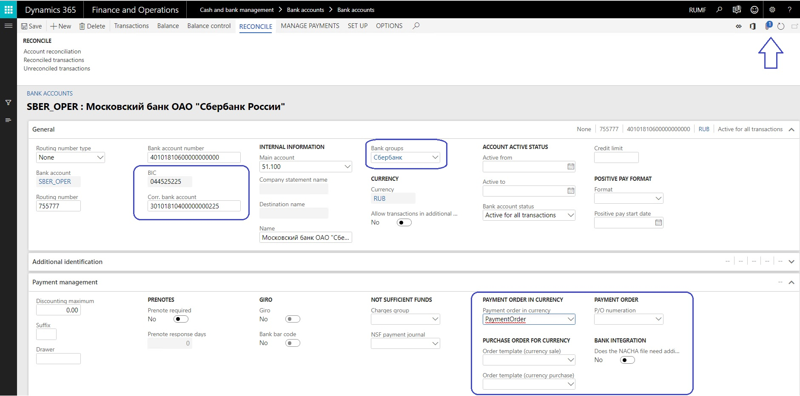

---
# required metadata
title: Set up bank accounts (Russia)
description: This topic provides information about local settings and prerequisites for bank modules for Russia. 
author: anasyash
manager: AnnBe
ms.date: 10/28/2018
ms.topic: article
ms.prod: 
ms.service: dynamics-ax-applications
ms.technology: 

# optional metadata
ms.search.form: BankGroup, BankAccountTable 
audience: Application User
# ms.devlang: 
ms.reviewer: shylaw
ms.search.scope: Core, Operations
# ms.tgt_pltfrm: 
# ms.custom: 
ms.search.region: Russia
# ms.search.industry: 
ms.author: anasyash
ms.search.validFrom: 2018-10-28
ms.dyn365.ops.version: 8.1

---

# Set up bank accounts (Russia)

Before working in the **Bank management** workspace, you should complete the following procedures to ensure that you have the prerequisites needed for setting up bank accounts for Russia.

## Enter bank group information

1. Go to **Cash and bank management > Setup > Bank groups** and click **Update bank accounts**.
2. Select a bank group. 
2. Enter Russia-specific information for the bank group.  
   - **BIC** – Bank identifification code 
   - **Corr. Bank account** – Corresponding bank account
   - **Bank type** – Select either **Main**, **Foreign**, or **Branch**. If you select, **Foreign**, select a **Vendor account** on the **General** FastTab. If you select **Branch**, select a value in the **Main bank** field.
3. (Optional) Select the .docx template to use in the **Payment order in currency** field on the **Setup** FastTab. If defined, this will be the default template for the payment order in currency for all foreign bank accounts related to this bank.

> [!NOTE]
> Before defining a document template, create the templates as files and attach them to the record. You can determine if a document is attached by using the number indicator on the **Document attachment** icon.

  
    

## Create a Bank account

1. Create a new bank account at **Cash and bank management > Bank accounts > Bank accounts**.
2. Complete all required fields. The following list includes some fields that might be required. 
    - **Bank account** (code)
    - **Bank account number**
    - **Main account** - This is the general ledger account that is used for posting.
    - **Currency**
    - **SWIFT code** 

  For more information see [Bank management workspace](../cash-bank-management/bank-management-workspace.md).

3. Enter Russia-specific information: 
    - Select **Bank** in the **Bank groups** field. Confirm that the **BIC** and **Corr. Bank account** fields are correct. Also confirm **Address** and **Contact information** on respective FastTabs and update accordingly.
    - Define the number series for payment order generation in the **P/O numeration** field.
    - For bank accounts in foreign currency, you can also define .docx templates for generation of payment orders in paper format in the following fields: **Payment order in currency**, **Order template (currency sale)**, and **Order template (currency purchase)**. 

> [!NOTE]
> Before defining a document template, create the templates as files and attach them to the record. You can determine if a document is attached by using the number indicator on the **Document attachment** icon.

