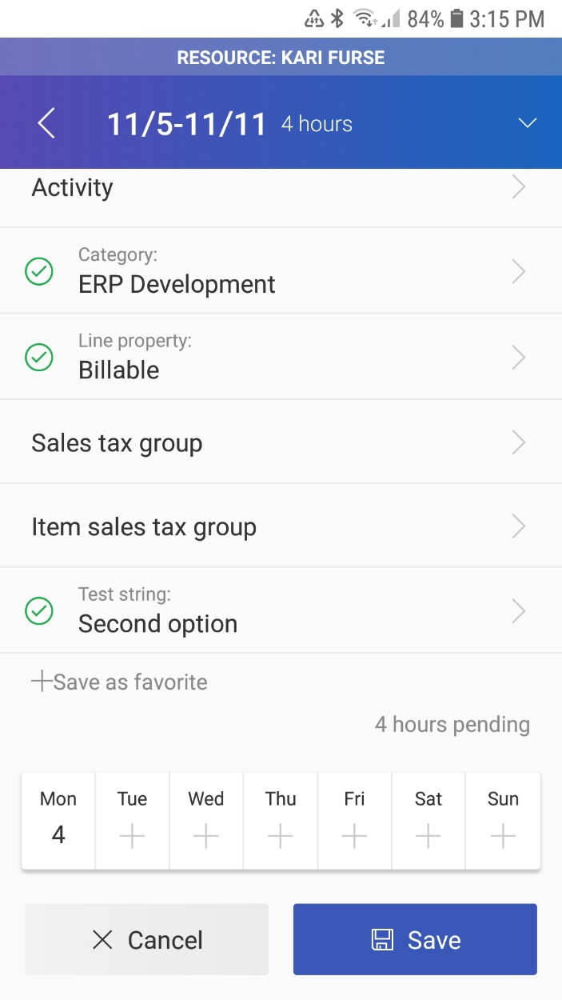
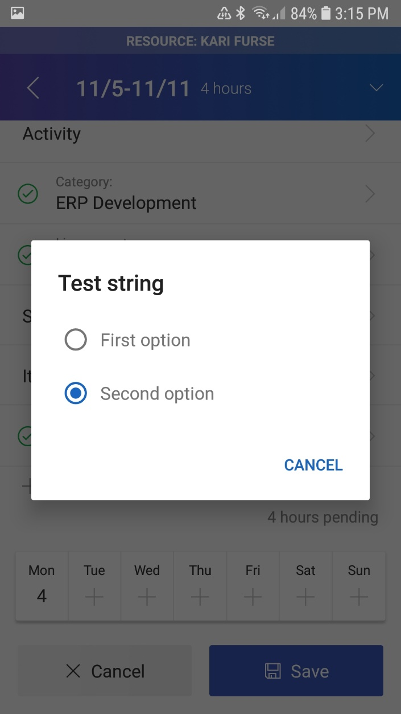
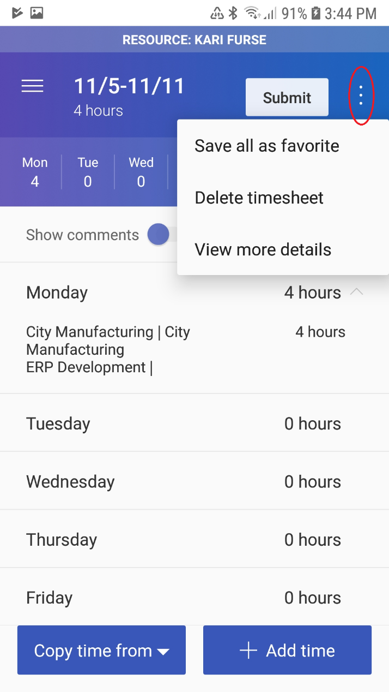
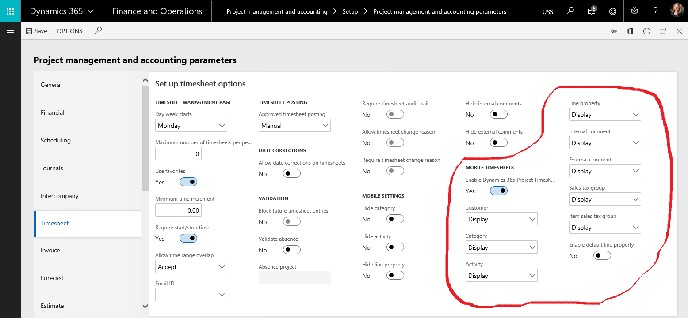

---
# required metadata

title: Implement custom fields for the Microsoft Dynamics 365 Project timesheet mobile app on iOS and Android
description: This document provides common patterns for implementing custom fields utilizing extensions.
author: KimANelson
manager: AnnBe
ms.date: 05/28/2019
ms.topic: article
ms.prod: 
ms.service: dynamics-ax-applications
ms.technology: 

# optional metadata

# ms.search.form: 
# ROBOTS: 
audience: Application User
# ms.devlang: 
ms.reviewer: josaw
ms.search.scope: Core, Operations
# ms.tgt_pltfrm: 
ms.custom: 
ms.assetid: 
ms.search.region: Global
ms.search.industry: Service industries
ms.author: knelson
ms.dyn365.ops.version: 10.0.3
ms.search.validFrom: 2019-05-28

---

# Implement custom fields for the Microsoft Dynamics 365 Project timesheet mobile app on iOS and Android

[!include [banner](../includes/banner.md)]

This topic provides common patterns for implementing custom fields utilizing extensions. The following topics are covered.

-   The various datatypes supported by the custom field framework.

-   How to display read-only or editable fields on timesheet entries and save the user provided values back to the database.

-   How to display read-only fields on the timesheet header.

-   Integrating other custom business logic for defaulting of fields and additional validation.

## Audience
This topic is intended for developers integrating their custom fields into the Microsoft Dynamics 365 Project Timesheet mobile application available for iOS and Android. It is assumed that the reader is familiar with X++ development and project timesheet functionality.

## Data contract – TSTimesheetCustomField X++ class

The TSTimesheetCustomField is the X++ data contract class that represents
information about a custom field for timesheet functionality. Lists of these
custom field objects are passed on both the TSTimesheetDetails and
TSTimesheetEntry data contracts to display custom fields in the mobile apps.

**TSTimesheetDetails** -\> The timesheet header contract.

**TSTimesheetEntry** -\> The timesheet transaction contract. Groups of these
objects with the same project information and timesheetLineRecId constitute a
line.

### fieldBaseType (Types)

The type of the field to be displayed in the app is determined by the
FieldBaseType property on the TsTimesheetCustom object. The following Types
values are supported:

| Type value | Type              | Notes                                                                                                                                                                                                           |
|------------|-------------------|-----------------------------------------------------------------------------------------------------------------------------------------------------------------------------------------------------------------|
| 0          | String (and Enum) | Displays as a text field.                                                                                                                                                                                       |
| 1          | Integer           | Displays as a number without decimals.                                                                                                                                                                          |
| 2          | Real              | Displays as a number with decimals.                                                                                                                                                                             |
|            |                   |                                                                                                                                                                                                                 |
|            |                   | Utilize the fieldExtenededType property to show the real value as a currency in the app. The numberOfDecimals property can be used to set the number of decimals to display.                                    |
| 3          | Date              | Date formats are determined by the user’s ‘Date, times, and number format’ specified under Language and country/region preference in User options.                                                              |
| 4          | Boolean           |                                                                                                                                                                                                                 |
| 15         | GUID              |                                                                                                                                                                                                                 |
| 16         | Int64             |                                                                                                                                                                                                                 |

1.  If the stringOptions property is not provided on the TSTimesheetCustomField
    object, a free text field is provided to the user.  
      
    The stringLength property can be used to set the maximum string length that
    can be entered by the user.

2.  If the stringOptions property is provided on the TSTimesheetCustomField
    object, then those list elements are the only values available for selection
    by the user via radio buttons.  
      
    With this, the string field can act as an enum value for purposes of user
    entry. To save the value as an enum to the database, manually map the string
    value back to the enum value before saving to the database using chain of
    command (see below).

### fieldExtendedType (TSCustomFieldExtendedType)

Format Real values as currency if desired. Applicable only when fieldBaseType is
Real.

-   TSCustomFieldExtendedType:None - No formatting applied

-   TSCustomFieldExtendedType::Currency - Format as currency  
      
    When currency format is active, the stringValue field can be used pass the
    desired currency code to display in the app. It is a read-only value.  
      
    The realValue field contains the money amount to be saved to the database.

### fieldSection (TSCustomFieldSection)

Determines where in the app the custom field should be displayed.

-   TSCustomFieldSection::Header – The field will be shown under the “View more
    details” section in the app. These fields are always read-only.

-   TSCustomFieldSection::Line – The field will be shown on timesheet entries
    after all of the out of box line fields. These fields can be either editable
    or read-only.

fieldName (FieldNameShort)  
Identifies the field when saving values provided by the app back to the
database.

### tableName (TableNameShort)

Identifies the field when saving values provided by the app back to the
database.

### isEditable (NoYes)

Set to **Yes** to specify the field in the entry section should be editable by the
user or **No** to make it read-only.

### isMandatory (NoYes)

Set to **Yes** to specify the field in the entry section should be mandatory by
the user.

### label (str)

The label to display next the field in the app.

### stringOptions (List of Strings)

Applicable only when fieldBaseType is String. If stringOptions is populated, the
string values available for selection via radio buttons are specified by the
strings in the list. If not provided, free text entry into the string field is
allowed (see example below).

### stringLength (int)

The maximum length for a string field. Applicable only when fieldBaseType is
String.

### numberOfDecimals (int)

The number of decimals to display for a real field. Applicable only when
fieldBaseType is Real.

### orderSequence (int)

Controls the order the custom fields are displayed in within the app when more
than one custom field is specified. Fields with lower numbers are displayed
first.

### booleanValue (boolean)

Passes the boolean value of the field between the server and the app for boolean
type fields.

### guidValue (guid)

Passes the guid value of the field between the server and the app for guid type
fields.

### int64Value (int64)

Passes the int64 value of the field between the server and the app for int64
type fields.

### intValue (int)

Passes the int value of the field between the server and the app for int type
fields.

### realValue (real)

Passes the real value of the field between the server and the app for real type
fields.

### stringValue (str)

Passes the string value of the field between the server and the app for string
type fields. Also used for real type fields formatted as currency to pass
currency code to the app.

### dateValue (date)

Passes the date value of the field between the server and the app for date type
fields.

## Display and save a custom field in the timesheet entry section

### Extend the TSTimesheetLine table to have a custom field

In typical scenarios, the data for an entry custom field will likely be saved to
the TSTimesheetLine table, but other tables can be used as well as long as the
data can be retrieved based on a provided TSTimesheetTrans record or do not have
specific record context (e.g. a read-only field from ProjPramaters).

Also note that custom fields could be dynamically generated based on X++ logic
without any backing database records. This can be useful in read-only scenarios
(see the timesheet header section for an example of this).

### Use chain of command on the TSTimesheetSettings class, buildCustomFieldList method to display field in entry section

This code controls the display settings for the field within the app (e.g. what
type of field, label, whether mandatory, and section to display the field in).

The following example shows displaying a string field with the options ‘First
option’ and ‘Second option’ available via radio buttons on time entries. The
field in the app is associated with the TestLineString field added to the
TSTimesheetLine table.

Note the usage of the TSTimesheetCustomField::newFromMetatdata() method to
simplify the initialization of the custom field properties: fieldBaseType,
tableName, fieldname, label, isEditable, isMandatory, stringLength, and
numberOfDecimals. If preferred, these parameters can be set manually.

...
     [ExtensionOf(classStr(TsTimesheetSettings))]

     final class TSTimesheetSettings_Extension
     {

        protected List buildCustomFieldList()

        {

            List customFieldList = next buildCustomFieldList();

            TSTimesheetCustomField tsTimesheetCustomField;

            tsTimesheetCustomField =
            TSTimesheetCustomField::newFromMetadata(tableNum(TsTimesheetLine),
            fieldNum(TSTimesheetLine, TestLineString));

            tsTimesheetCustomField.parmFieldSection(TSCustomFieldSection::Line);

            tsTimesheetCustomField.parmOrderSequence(1);

            List stringOptions = new List(Types::String);

            stringOptions.addEnd('First option');

            stringOptions.addEnd('Second option');

            tsTimesheetCustomField.parmStringOptions(stringOptions);

            customFieldList.addEnd(tsTimesheetCustomField);

            return customFieldList;

        }
    }
...

### Use chain of command on the TSTimesheetEntry class, buildCustomFieldListForEntry method to populate timesheet entry

This method is used to populate the saved timesheet lines within the mobile
apps. The method takes a TSTimesheetTrans record as a parameter. Fields from
that record can be used to populate the custom field value in the app.

[ExtensionOf(classStr(TsTimesheetEntry))]

final class TsTimesheetEntry_Extension

{

protected List buildCustomFieldListForEntry(TSTimesheetTrans \_tsTimesheetTrans)

{

List customFieldList = next buildCustomFieldListForEntry(_tsTimesheetTrans);

TSTimesheetLine tsTimesheetLine = \_tsTimesheetTrans.timesheetLine();

TSTimesheetCustomField tsTimesheetCustomField;

tsTimesheetCustomField =
TSTimesheetCustomField::newFromMetadata(tableNum(TsTimesheetLine),
fieldNum(TSTimesheetLine, TestLineString));

tsTimesheetCustomField.parmFieldSection(TSCustomFieldSection::Line);

tsTimesheetCustomField.parmOrderSequence(1);

tsTimesheetCustomField.parmStringValue(tsTimesheetLine.TestLineString);

List stringOptions = new List(Types::String);

stringOptions.addEnd('First option');

stringOptions.addEnd('second option;);

tsTimesheetCustomField.parmStringOptions(stringOptions);

customFieldList.addEnd(tsTimesheetCustomField);

return customFieldList;

}

}

### Use chain of command on the TSTimesheetEntryService class to save entry from application back to the database

Multiple methods will need to be extended to save custom field back to database
in typical usage.

The **timesheetLineNeedsUpdating** method is used to determine if the line
record has been changed by the user in the app and needs to be saved to the
database. If performance is not a concern, this can be simplified to return
“true” all the time.

The **populateTimesheetLineFromEntryDuringCreate** and
**populateTimesheetLineFromEntryDuringUpdate** methods can be extended to
populate the TSTimesheetLine database record from the provided TSTimesheetEntry
data contract record. Note how the mapping between the database field and the
entry field is done manually via X++ code in the sample code below.

The **populateTimesheetWeekFromEntry** method can also be extended if the custom
field mapped to the TSTimesheetEntry object needs to write back to the
TSTimesheetLineweek database table.

Note: our example below saves the ‘firstOption’ or ‘secondOption’ selected by
the user to the database as a raw string value. If the database field is an enum
type, those values could be manually mapped to an enum value and then saved to
an enum field on the database table.

[ExtensionOf(classStr(TSTimesheetEntryService))]

final class TSTimesheetEntryService_Extension

{

protected boolean timesheetLineNeedsUpdating(TSTimesheetLine \_tsTimesheetLine,
TsTimesheetEntry \_tsTimesheetEntry)

{

boolean ret = next timesheetLineNeedsUpdating(_tsTimesheetLine,
\_tsTimesheetEntry);

if (!ret)

{

*// Loop through custom fields to see if value needs updating*

ListEnumerator enumerator =
\_tsTimesheetEntry.parmCustomFields().getEnumerator();

while (enumerator.moveNext())

{

TSTimesheetCustomField customField = enumerator.current();

if (customField.parmFieldName() == fieldId2Name(tableNum(TsTimesheetLine),
fieldNum(TSTimesheetLine, TestLineString)))

{

*// If Custom field value for TestLineString field has changed, We need to
update the timesheet line.*

if (_tsTimesheetLine.TestLineString != customField.parmStringValue())

{

ret = true;

}

}

}

}

return ret;

}

protected void populateTimesheetLineFromEntryDuringCreate(TSTimesheetLine
\_tsTimesheetLine, TSTimesheetEntry \_tsTimesheetEntry)

{

next populateTimesheetLineFromEntryDuringCreate(_tsTimesheetLine,
\_tsTimesheetEntry);

this.populateTimesheetLineFromCustomFields(_tsTimesheetLine,
\_tsTimesheetEntry);

}

protected void populateTimesheetLineFromEntryDuringUpdate(TSTimesheetLine
\_tsTimesheetLine, TSTimesheetEntry \_tsTimesheetEntry)

{

next populateTimesheetLineFromEntryDuringUpdate(_tsTimesheetLine,
\_tsTimesheetEntry);

this.populateTimesheetLineFromCustomFields(_tsTimesheetLine,
\_tsTimesheetEntry);

}

private void populateTimesheetLineFromCustomFields(TSTimesheetLine
\_tsTimesheetLine, TSTimesheetEntry \_tsTimesheetEntry)

{

ListEnumerator enumerator =
\_tsTimesheetEntry.parmCustomFields().getEnumerator();

while (enumerator.moveNext())

{

TSTimesheetCustomField customField = enumerator.current();

if (customField.parmFieldName() == fieldId2Name(tableNum(TsTimesheetLine),
fieldNum(TSTimesheetLine, TestLineString)))

{

\_tsTimesheetLine.TestLineString = customField.parmStringValue();

}

}

}

}

## Display a custom field in the timesheet header section

### Extend the TSTimesheetTable table to have a custom field

In typical scenarios, the data for a header custom field will likely be pulled
from the TSTimesheetHeader table, but other tables can be used as well as long
as the data can be retrieved based on a provided TSTimesheetTable record or do
not have specific record context (e.g. a read-only field from ProjPramaters).

Also note that custom fields can be dynamically generated based on X++ logic
without any backing database records. Our example below outlines this scenario.

Fields in the header section are always read-only in the app.

### Use chain of command on the TSTimesheetSettings class, buildCustomFieldList method to display field in the header section

This code controls the display settings for the field within the app (e.g. what
type of field, label, whether mandatory, and section to display the field in).

The following example shows a computed value in the header section in the app.

[ExtensionOf(classStr(TsTimesheetSettings))]

final class TSTimesheetSettings_Extension

{

protected List buildCustomFieldList()

{

List customFieldList = next buildCustomFieldList();

TSTimesheetCustomField tsTimesheetCustomField;

*// Computed utilization rate*

tsTimesheetCustomField = new TSTimesheetCustomField();

tsTimesheetCustomField.parmFieldBaseType(Types::Real);

tsTimesheetCustomField.parmLabel("Utilization rate of this timesheet (computed
custom field)");

tsTimesheetCustomField.parmFieldSection(TSCustomFieldSection::Header);

tsTimesheetCustomField.parmOrderSequence(2);

tsTimesheetCustomField.parmNumberOfDecimals(3);

customFieldList.addEnd(tsTimesheetCustomField);

return customFieldList;

}

}

### Use chain of command on the TSTimesheetDetails class, buildCustomFieldListForHeader method to populate timesheet details

This method is used to populate the timesheet header details within the mobile
apps. This method takes a TSTimesheetTable record as a parameter. Fields from
that record can be used to populate the custom field value in the app. Our
example below does not read any values from the database. Instead, it generates
a computed value to display with X++ logic.

[ExtensionOf(classStr(TSTimesheetDetails))]

final class TSTimesheetDetails_Extension

{

protected List buildCustomFieldListForHeader(TSTimesheetTable
\_tsTimesheetTable)

{

List customFieldList = next buildCustomFieldListForHeader(_tsTimesheetTable);

TSTimesheetCustomField tsTimesheetCustomField;

*// Computed utilization rate*

tsTimesheetCustomField = new TSTimesheetCustomField();

tsTimesheetCustomField.parmFieldBaseType(Types::Real);

tsTimesheetCustomField.parmLabel("Utilization rate of this timesheet (computed
custom field)");

tsTimesheetCustomField.parmFieldSection(TSCustomFieldSection::Header);

tsTimesheetCustomField.parmOrderSequence(2);

tsTimesheetCustomField.parmNumberOfDecimals(3);

real utilizationRate = 0;

if (_tsTimesheetTable.totalHours() != 0)

{

utilizationRate = \_tsTimesheetTable.totalHoursBillable() /
\_tsTimesheetTable.totalHours();

}

tsTimesheetCustomField.parmRealValue(utilizationRate);

customFieldList.addEnd(tsTimesheetCustomField);

return customFieldList;

}

}

## Other configurability/extensibility opportunities

### Adding additional validation for app

Existing logic that at the database level for timesheet functionality will still
work as expected. Interrupt the completion of the save/submit with a more
specific error message, ‘throw error(“message to user”)’ which can be added to
the code. Three examples of useful extensible methods:

1.  If validateWrite on the TSTimesheetLine table returns false during a
    timesheet line save, then an error message will be displayed in the mobile
    app.

2.  If validateSubmit on the TSTimesheetTable table returns false during
    timesheet submission in the app, then an error message is shown to the user.

3.  Logic that will populate fields (e.g. Line Property) during the insert
    method on the TSTimesheetLine table will still execute.

### Hiding and marking out-of-box fields as read-only via configuration

Out-of-box fields can be made read-only or hidden in the mobile app from the
project parameters. 
  

### Changing the activities available for selection via extensions

Activities available for selection for a project are populated via the
getActivitiesForProject() and getActivityQuery() methods on the
TsTimesheetProjectService class. Utilize chain of command to modify this
behavior to match your business scenario for activities available for selection
for a given project.

### Defaulting of project category on timesheet entries

Defaulting of project category on timesheet entries occurs at three different
levels. Use chain of command to extend the behavior in any or all of these
places to accommodate your desired behavior. The following hierarchy is used:

1.  First, the app will try to pull the default category from the project
    resource. This is set in the getCurrentUserResource and
    getDelegatedResourcesForCurrentUser methods in the
    TSTimesheetSettingsService class.

2.  If not provided at the resource level, the category will attempt to default
    from the project activity. This is set in the getActivitiesForProject method
    in the TSTimesheetProjectService class.

3.  If not provided at the activity level, the category will default from the
    project parameters. This is set in the getProjectDetailsbyRule method in the
    TSTimesheetProjectService class.
