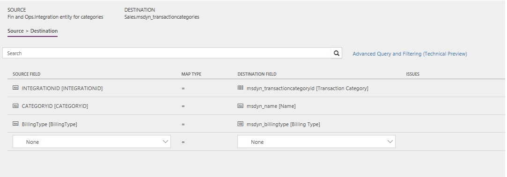

---
# required metadata

title: Synchronize project expense categories from Project Service Automation 
description: This topic describes the templates and underlying tasks that are used to synchronize project expense categories between Microsoft Dynamics 365 for Finance and Operations and Microsoft Dynamics 365 for Project Service Automation.
author: KimANelson
manager: AnnBe
ms.date: 04/02/2018
ms.topic: article
ms.prod: 
ms.service: dynamics-ax-applications
ms.technology: 

# optional metadata

# ms.search.form: 
# ROBOTS: 
audience: Application User
# ms.devlang: 
ms.reviewer: twheeloc
ms.search.scope: Core, Operations
# ms.tgt_pltfrm: 
ms.custom: 87983
ms.assetid: b454ad57-2fd6-46c9-a77e-646de4153067
ms.search.region: Global
# ms.search.industry: 
ms.author: knelson
ms.search.validFrom: 2016-11-28
ms.dyn365.ops.version: AX 8.0.0

---

# Synchronize project expense categories between Finance and Operations and Project Service Automation

This topic describes the templates and underlying tasks that are used to synchronize project expense categories between Microsoft Dynamics 365 for Finance and Operations and Microsoft Dynamics 365 for Project Service Automation.

> [!NOTE]
> Project tasks integration, expense transaction categories, hour estimates, expense estimates, and functionality locking is available 
in Dynamics 365 for Finance and Operations version 8.0, which will be available in the Spring '18 release.

> [!NOTE]
> Typically, the project expense categories will be mastered in Finance and Operations. If that is not your situation, or you already have expense categories created in Project Service Automation, you must first sync using the Project expense transaction categories (PSA to Fin and Ops) and then sync using Project expense transaction categories (Fin and Ops to PSA). You should then run the sync from PSA to Fin and Ops one more time.

> [!NOTE]
> If synchronizing first from Project Service Automation, the project categories must already be set up in Finance and Operations and any project categories that need to be synched with the Project Service Automation transaction categories must be set up to be **Active in journals**.

## Data flow for Project Service Automation and Finance and Operations

The Project Service Automation and Finance and Operations integration solution uses the Data integration feature to synchronize data across instances of Project Service Automation and Finance and Operations. The integration templates that are available with the Data integration feature enables the flow of data about project expense transaction categories between Finance and Operations and Project Service Automation.

If the project expense categories are mastered in Finance and Operations, the integration flow is first from Finance and Operations to Project Service Automation, and then updating the project expense categories integration IDs by synchronizing from Project Service Automation to Finance and Operations.

If the project expense categories are mastered in Project Service Automation, the integration flow is first from Project Service Automation to Finance and Operations. The project categories must already be configured in Finance and Operations prior to the synchronization from Project Service Automation. Then synchronize from Finance and Operations back to Project Service Automation and then from Project Service Automtation to Finance and Operations again. This ensures the categories are linked and duplicates are not created.

The following illustration shows how the data is synchronized between Project Service Automation and Finance and Operations.

## Templates and tasks

To access available templates, in the Microsoft PoswerApps Admin Center, select **Projects**, and then, in the upper-right corner, select **New project** to select public templates.

The following template and underlying task is used to synchronize project expense categories from Finance and Operations to Project Service Automation:

-**Name of the template in Data integration:** Project expense transaction categories (Fin and Ops to PSA)
-**Name of the task in the project:** Sync categories to PSA

## Entity set

| Finance and Operations               | Project Service Automation    |
|--------------------------------------|-------------------------------|
| Integration entity for categories    | Transaction categories        |

## Entity flow

Project expense categories are managed in Finance and Operations, and they are synchronized to Project Service Automation as transaction categories.

## Power Query

You must use Microsoft Power Query to set the billing type on the transaction category when synchronizing to Project Service Automation. The Project expense transaction categories (Fin and Ops to PSA) template has a default column and mapping already provided. If you create your own template, you must add a conditional column in POwer Query.
- Open the Advance Query and Filtering form from within the mapping of project expense categories task.
- Select **Add Conditional Column**.
- Give the new column a name, such as BillingType.
- Enter the following condition: f **CATEGORYID not equal to null then 19235001, Otherwise null**.
- Click OK on the column.
- Be sure to map this new column in the mapping page.

The following illustration shows an example of the template task mapping in Data integration.

> [!NOTE]
> The mapping shows the field information that will be synchronized from Finance and Operations to Project Service Automation.

ProjectExpenseCategoriesToFinOpsMapping.jpg

The following template and underlying task is used to synchronize project expense categories from Project Service Automation to Finance and Operations:

-**Name of the template in Data integration:** Project expense transaction categories (PSA to Fin and Ops)
-**Name of the task in the project:** Sync categories to Fin Ops

## Entity set

| Project Service Automation      | Finance and Operations             |
|---------------------------------|------------------------------------|
| Transaction categories          | Integration entity for categories  | 

## Entity flow

Project expense categories are managed in Finance and Operations, and they are synchronized to Project Service Automation as transaction categories. The synchronization back to Finance and Operations updates the integration ID from Project Service Automation on the Finance and Operations project category.

The following illustration shows an example of the template task mapping in Data integration.

> [!NOTE]
> The mapping shows the field information that will be synchronized from Project Service Automation to Finance and Operations.

