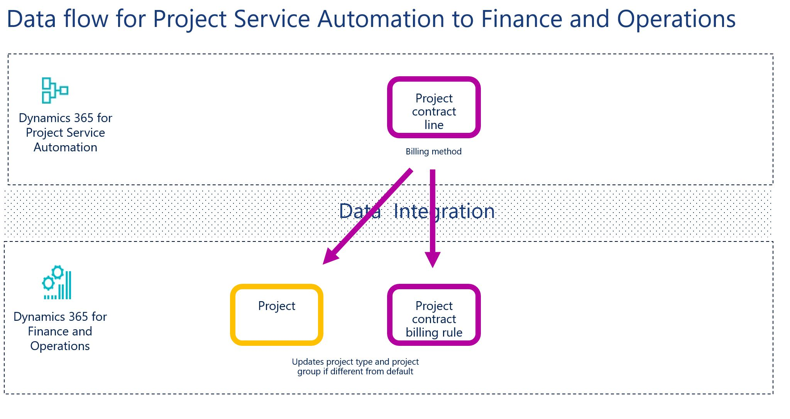

---
# required metadata

title: Synchronize project contract lines from Project Service Automation directly to project contract lines in Finance and Operations
description: This topic describes the templates and underlying tasks that are used to synchronize project contract lines directly from Microsoft Dynamics 365 for Project Service Automation to Microsoft Dynamics 365 for Finance and Operations, Enterprise edition.
author: KimANelson
manager: AnnBe
ms.date: 11/27/2017
ms.topic: article
ms.prod: 
ms.service: dynamics-ax-applications
ms.technology: 

# optional metadata

# ms.search.form: 
# ROBOTS: 
audience: Application User
# ms.devlang: 
ms.reviewer: twheeloc
ms.search.scope: Core, Operations
# ms.tgt_pltfrm: 
ms.custom: 87983
ms.assetid: b454ad57-2fd6-46c9-a77e-646de4153067
ms.search.region: Global
# ms.search.industry: 
ms.author: knelson
ms.search.validFrom: 2016-11-28
ms.dyn365.ops.version: AX 7.0.0

---
# Synchronize project contract lines from Project Service Automation directly to project contract lines in Finance and Operations

This topic describes the templates and underlying tasks that are used to synchronize project contract lines directly from Microsoft Dynamics 365 for Project Service Automation to Microsoft Dynamics 365 for Finance and Operations, Enterprise edition.

> [!NOTE]
> Before you can use the Project Service Automation to Finance and Operations integration solution, you should be familiar with the Dynamics 365 Data integration feature.

## Data flow for Project Service Automation to Finance and Operations

The Project Service Automation to Finance and Operations integration solution uses the Data integration feature to synchronize data across instances of Project Service Automation and Finance and Operations. The integration templates that are available with the Data integration feature enable the flow of data about project contracts, projects, project contract lines, and project contract line milestones from Project Service Automation to Finance and Operations.

The following illustration shows how the data is synchronized between Project Service Automation and Finance and Operations.

## Templates and tasks

To access the available templates, in the Microsoft PowerApps Admin Center, select **Projects**, and then, in the upper-right corner, select **New project** to select public templates.

The following template and underlying task are used to synchronize project contracts from Project Service Automation to Finance and Operations:

- **Name of the template in Data integration:** Project contract lines (PSA to Fin and Ops)
- **Name of the task in the project:** ContractLine

Before synchronization of project contract lines can occur, you must synchronize projects. For more information, see Projects.
## Entity set

| Project Service Automation | Finance and Operations                       |
|----------------------------|----------------------------------------------|
| Order lines                | Integration entity for project contract line |

## Entity flow

Project contract lines are managed in Project Service Automation, and they are synchronized to Finance and Operations as project contract billing rules. During synchronization, the project type for the contract line project and project group is updated if the billing method differs from the default project type.

## Preconditions and mapping setup

Before synchronization of project contract lines can occur, you must synchronize projects. For more information, see <TO DO – add link to Projects topic>.

## Template mapping in Data integration

The following illustration shows an example of a template mapping in Data integration.

> [!NOTE]
> The mapping shows the field information that will be synchronized from Project Service Automation to Finance and Operations.

