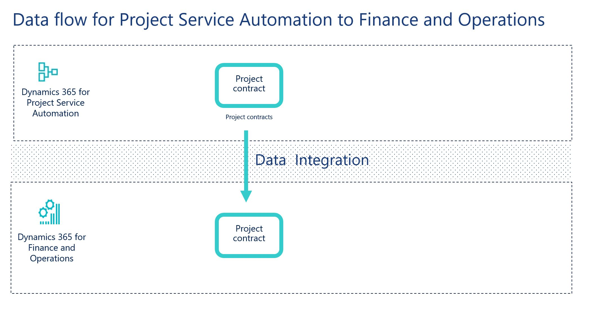

---
# required metadata

title: Synchronize project contracts directly from Project Service Automation to project contracts in Finance and Operations
description: This topic discusses the templates and underlying tasks that are used to synchronize project contracts directly from 
Microsoft Dynamics 365 for Project Service Automation to Microsoft Dynamics 365 for Finance and Operations, Enterprise edition.
author: KimANelson
manager: AnnBe
ms.date: 11/27/2017
ms.topic: article
ms.prod: 
ms.service: dynamics-ax-applications
ms.technology: 

# optional metadata

# ms.search.form: 
# ROBOTS: 
audience: Application User
# ms.devlang: 
ms.reviewer: twheeloc
ms.search.scope: Core, Operations
# ms.tgt_pltfrm: 
ms.custom: 87983
ms.assetid: b454ad57-2fd6-46c9-a77e-646de4153067
ms.search.region: Global
# ms.search.industry: 
ms.author: knelson
ms.search.validFrom: 2016-11-28
ms.dyn365.ops.version: AX 7.0.0

---

# Synchronize project contracts directly from Project Service Automation to project contracts in Finance and Operations

This topic discusses the templates and underlying tasks that are used to synchronize project contracts directly from Microsoft 
Dynamics 365 for Project Service Automation to Microsoft Dynamics 365 for Finance and Operations, Enterprise edition.

> [!NOTE] 
> Before you can use the Project Service Automation to Finance and Operations integration solution, you should be familiar with 
Dynamics 365 Data Integration.

## Data flow for Project Service Automation to Finance and Operations
The solution to integrate Project Service Automation to Finance and Operations uses the Data integration feature to synchronize 
data across instances of Project Service Automation and Finance and Operations. The integration templates that are available with the
Data integration feature enable the flow of data about project contracts, projects, project contract lines and project contract line 
milestones from Project Service Automation to Finance and Operations. 

The following illustration shows how the data is synchronized between Project Service Automation and Finance and Operations.

 

## Templates and tasks
To access the available templates, open the PowerApps Admin Center. 
Select **Projects**, and then, in the upper-right corner, select **New project** to select public templates.

The following template and underlying task are used to synchronize project contracts from Project Service Automation to Finance and 
Operations:

•	Name of the template in Data integration: Project contracts (PSA to Fin and Ops)

•	Name of the task in the project: Project contracts PSA to Fin and Ops

You must synchronize Accounts before project contracts synchronization can occur.

## Entity set

| Project service automation  | Finance and Operations      |
|-------------------------|--------------------------------|
| Orders                  | Integration entity for project contract   |

## Entity flow

Project contracts are managed in Project Service Automation and synchronized to Finance and Operations as project contracts. 
As part of the integration template, you can set the Integration source in Finance and Operations for the project contract.

## Project Service Automation to Operations solution

The **Project contract ID** field is available on the **Project contracts** page. It has been made a natural and unique key in order 
to support the integration.

When a new project contract is created, if an ID value doesn’t already exist, it’s automatically generated by using a number sequence. 
The value consists of ORD followed by an increasing number sequence and then a suffix of six characters. 
Here is an example: ORD-01022-Z4M9Q0.

When the integration solution for Project Service Automation <TO DO: link in the top level document link where we will be adding the 
instructions for applying the PSA solution> is applied, an upgrade script sets the ID field for existing project contracts in 
Project Service Automation.

## Preconditions and mapping setup

•	You must synchronize Accounts before project contracts synchronization can occur.

•	Add an integration key field mapping in your connection set for msdyn_organizationalunits to msdyn_name [Name]. 
You may need to add a project to the connection set first. For more information on integration keys, reference Dynamics 365 
Data Integration.

•	The **PaymentTerms** mapping must be updated to reflect valid **Terms of payment** in Finance and Operations. You can also choose to remove 
the mapping from the project task. The default value map has default values for demo data. In Project Service Automation, the values are:

| **Value**              | **Description**      |
|-------------------------|--------------------------------|
| 1                  | Net 30       |
| 2                  | 2% 10,Net 30       |
| 3                  | Net 45       |
| 4                  | Net 60       |

•	The **SourceDataID** can be updated to a different value or be removed from the mapping. The default template value is 
**Project Service Automation**.

## Power Query

You will need to use Power Query to filter data if you have:

•	sales orders in **Dynamics 365 for Sales**

•	multiple Organizational units in Project Service Automation that would map to multiple legal entities in Finance and Operations

If you need to use Power Query:

•	the Project contracts (PSA to Fin and Ops) template has a default filter to include only sales orders of type **Work item 
(msdyn_ordertype = 192350001)** to make sure that project contracts are not created for sales orders in Finance and Operations. 
If you create your own template, you will need to add this filter.

•	you will need to create a PowerQuery filter to include only the contract organizations you want synchronized into the legal entity 
of the integration connection set. For example, you may want the project contracts with the contract organizational unit of Contoso US 
to synchronize into the USSI legal entity and project contracts with contract organizational unit of Contoso Global to synchronize into 
the USMF legal entity. If you do not add this filter to your task mapping, all project contracts regardless of the contract 
organizational unit will be synchronized into the legal entity defined for the connection set.

## Template mapping in Data integration

> [!NOTE] 
> The **CustomerReference**, **AddressCity**, **AddressCountryRegionID**, **AddressDescription**, **AddressLine1**, **AddressLine2**, 
**AddressState**, and **AddressZipCode** fields aren’t included in the default mapping. You can add the mapping if you require this data
to be synchronized for project contracts.

The following illustration shows an example of a template mapping in Data integration.

> [!NOTE] 
> The mapping shows which field information will be synchronized from Project Service Automation to Finance and Operations.

 

