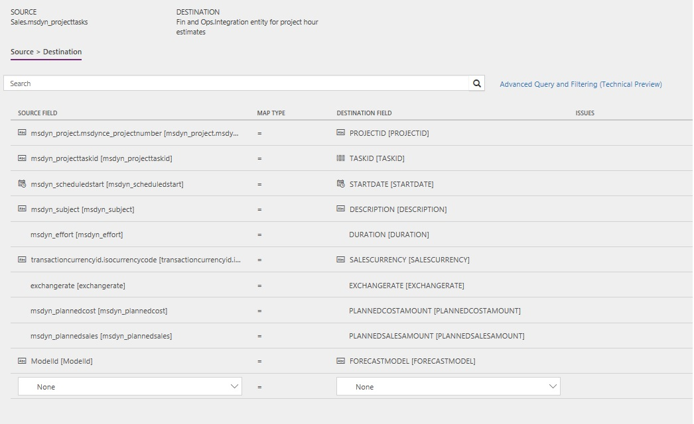
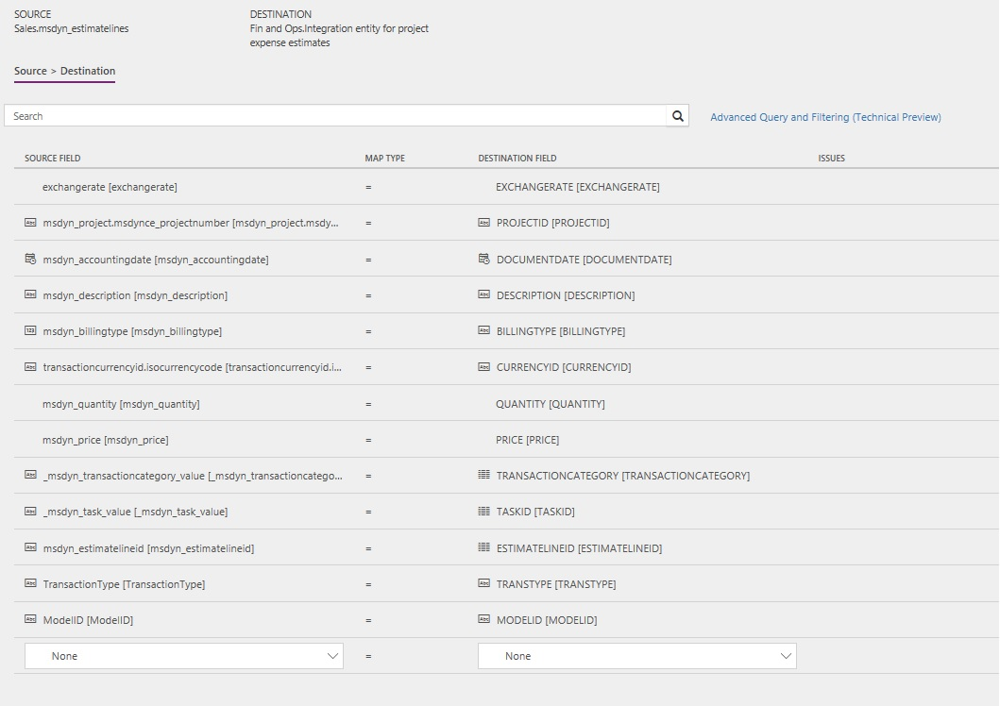

---
# required metadata

title: Synchronize project estimates from Project Service Automation directly to project forecasts in Finance and Operations
description: This topic describes the templates and underlying tasks that are used to synchronize project hour estimates and project expense estimates directly from Microsoft Dynamics 365 for Project Service Automation to Dynamics 365 for Finance and Operations.
author: KimANelson
manager: AnnBe
ms.date: 04/02/2018
ms.topic: article
ms.prod: 
ms.service: dynamics-ax-applications
ms.technology: 

# optional metadata

# ms.search.form: 
# ROBOTS: 
audience: Application User
# ms.devlang: 
ms.reviewer: twheeloc
ms.search.scope: Core, Operations
# ms.tgt_pltfrm: 
ms.custom: 87983
ms.assetid: b454ad57-2fd6-46c9-a77e-646de4153067
ms.search.region: Global
# ms.search.industry: 
ms.author: knelson
ms.search.validFrom: 2016-11-28
ms.dyn365.ops.version: AX 7.3.0

---
# Synchronize project estimates from Project Service Automation directly to project forecasts in Finance and Operations

This topic describes the templates and underlying tasks that are used to synchronize project hour estimates and project expense estimates directly from Microsoft Dynamics 365 for Project Service Automation to Dynamics 365 for Finance and Operations.

> [!NOTE]
> Project tasks integration, expense transaction categories, hour estimates, expense estimates, and functionality locking is available 
in Dynamics 365 for Finance and Operations version 8.0.

> Actuals integration is available in Dynamics 365 for Finance and Operations version 8.0.1.

> If you are using Dynamics 365 for Finance and Operations, Enterprise edition 7.3.0, you will be able to use the templates to integrate project tasks, expense transaction categories, hour estimates, expense estimates, actuals and configure functionality locking after installing KB 4132657 and KB 4132660. It is recommended that you install KB 4131710 if you need to reset the accounting distributions.

## Data flow for Project Service Automation to Finance and Operations

The Project Service Automation to Finance and Operations integration solution uses the Data integration feature to synchronize data across instances of Project Service Automation and Finance and Operations. The integration templates that are available with the Data integration feature enable the flow of data about project hour estimates and project expense estimates from Project Service Automation to Finance and Operations.

The following illustration shows how the data is synchronized between Project Service Automation and Finance and Operations.

## Templates and tasks

To access the available templates, in the Microsoft PowerApps Admin Center, select **Projects**, and then, in the upper-right corner, select **New project** to select public templates.

The following template and underlying tasks are used to synchronize project hour estimates from Project Service Automation to Finance and Operations:

-  **Name of the template in Data integration:** Project hour estimates (PSA to Fin and Ops)

-  **Name of the tasks in the project:** 
    - Transaction relationships 
    - Expense estimates

## Entity set

| Project Service Automation      | Finance and Operations                          |
|---------------------------------|-------------------------------------------------|
| Project tasks                   | Integration entity for project hour estimates   |

## Entity flow

Project hour estimates are managed in Project Service Automation, and they are synchronized to Finance and Operations as project hour forecasts.

## Preconditions

Before synchronization of project hour estimates can occur, you must synchronize projects, project tasks, and project expense transaction categories.

## Power Query

You must use Microsoft Power Query in the project hour estimates template to:
- Set the **Forecast model ID** that will be used when the integration creates new hour forecasts.
- Filter out any resource specific records within the task that will fail the integration into hour forecasts
- Filter out any empty transaction category rows. Failure to do this may result in incorrect hour forecasts.

### Forecast model ID
To update the default forecast model ID in the template, click the **Map** arrow to open the mapping. Select to open the Advanced Query and Filtering.
- If you are using the default Microsoft Project hour estimates (PSA to Fin and Ops) template, select the **Inserted Condition** in the **Applied Steps** section. In the **Function** entry, replace **O_forecast** with the name of the **Forecast model ID** that should be used with the integration. The default template has a forecast model ID from the demo data.
- If you are creating a new template, you must add this column. Select **Add Conditional Column** and give the column a name, such as ModelID. Enter the condition for the column where if Project task is not null, then<enter the forecast model ID>; else null.

### Filter out resource specific records
The Project hour estimates (PSA to Fin and Ops) template has a default filter that removes any resource specific records. If you create your own template, you must add this filter. In the Advanced Query and Filtering form, select to filter on the column **msdyn_islinetask** to only include **False** records.

### Filter out empty transaction category rows
You must add a filter to remove any rows with empty transaction categories. This is needed regardless if you are using the default template or creating your own template. This filter will remove any summary rows coming from Project Service Automation that could cause the hour forecasts in Finance and Operations to be incorrect. In the Advanced Query and Filtering form, select to filter out the null records in the column **msdyn_transactioncategory_value**.

## Template mapping in Data integration

The following illustration shows an example of the template task mapping in Data integration. The mapping shows the field information that will be synchronized from Project Service Automation to Finance and Operations.

The following template and underlying task is used to synchronize project expense estimates from Project Service Automation to Finance and Operations:

-  **Name of the template in Data integration:** Project expense estimates (PSA to Fin and Ops)
-  **Name of the tasks in the project:** 
     - Transaction relationships 
     - Expense estimates

## Entity set

| Project Service Automation      | Finance and Operations                                     |
|---------------------------------|------------------------------------------------------------|
| Transaction Connections         | Integration entity for project transaction relationships.   |
| Estimate Lines                  | Integration entity for project expense estimates.           |

## Entity flow

Project expense estimates are managed in Project Service Automation, and they are synchronized to Finance and Operations as project expense forecasts.

## Prerequisites

Before synchronization of project expense estimates can occur, you must synchronize Projects, Project tasks and Project expense transaction categories.

## Power Query

You must use Microsoft Power Query in the project expense estimates template to:
- Filter to include only expense estimate line records
- Set the **Forecast model ID** that will be used when the integration creates new hour forecasts.
- Transform the billing types.
- Transform the transaction types.

### Filter to include only expense estimate lines
The Project expense estimates (PSA to Fin and Ops) template has a default filter to only include expense lines in the integration. If you create your own template, you must add this filter. Select the Transaction relationships task and click the **Map** arrow. Select **Advanced Query and filtering**. Filter the **msdyn_transactiontype1** column to include only **msdyn_estimateline**.

### Forecast model ID
To update the default forecast model ID in the template, for the Expense estimates task, click the **Map** arrow to open the mapping. Select to open the Advanced Query and Filtering.
- If you are using the default Microsoft Project expense estimates (PSA to Fin and Ops) template, select the first **Inserted Condition** in the **Applied Steps** section. In the **Function** entry, replace **O_forecast** with the name of the **Forecast model ID** that should be used with the integration. The default template has a forecast model ID from the demo data.
- If you are creating a new template, you must add this column. Select **Add Conditional Column** and give the column a name, such as ModelID. Enter the condition for the column where if Estimate line ID is not null, then < enter the forecast model ID >; else null.

### Transform the billing types
The Project expense estimates (PSA to Fin and Ops) template has a conditional column added to transform the billing types received from Project Service Automation during the integration.
- If you create your own template, you must add this conditional column. In the Advanced Query and Filtering form, select **Add Conditional Column**. Give the column a name, such as "BillingType". The condition to enter is as follows:

    If **msdyn_billingtype** = 192350000, then **NonChargeable**
    else if **msdyn_billingtype** = 192350001, then **Chargeable**
    else if **msdyn_billingtype** = 192350002, then **Complimentary**
    else **NotAvailable**

### Transform the transaction types
The Project expense estimates (PSA to Fin and Ops) template has a conditional column added to transform the transaction types received from Project Service Automation during the integration.
- If you create your own template, you must add this conditional column. In the Advanced Query and Filtering form, select **Add Conditional Column**. Give the column a name, such as "TransactionType". The condition to enter is as follows:
    If **msdyn_transactiontypecode** = 192350000, then **Cost**
    else if **msdyn_transactiontypecode** = 192350005, then **Sales**
    else **null**

## Template mapping in Data integration

The following illustrations show examples of the template task mappings in Data integration. The mapping shows the field information that will be synchronized from Project Service Automation to Finance and Operations.

