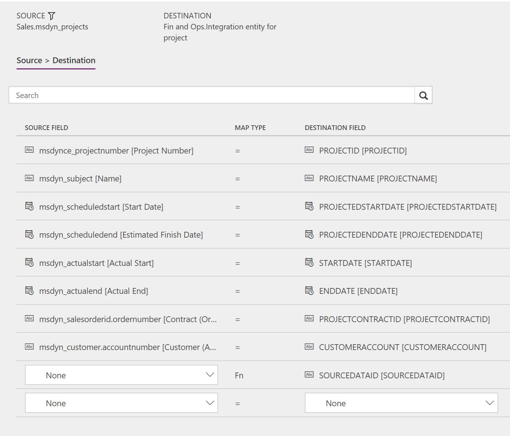

---
# required metadata

title: Synchronize projects from Project Service Automation directly to projects in Finance and Operations
description: This topic describes the template and underlying tasks that are used to synchronize projects directly from Microsoft Dynamics 365 for Project Service Automation to Microsoft Dynamics 365 for Finance and Operations, Enterprise edition.
author: KimANelson
manager: AnnBe
ms.date: 11/27/2017
ms.topic: article
ms.prod: 
ms.service: dynamics-ax-applications
ms.technology: 

# optional metadata

# ms.search.form: 
# ROBOTS: 
audience: Application User
# ms.devlang: 
ms.reviewer: twheeloc
ms.search.scope: Core, Operations
# ms.tgt_pltfrm: 
ms.custom: 87983
ms.assetid: b454ad57-2fd6-46c9-a77e-646de4153067
ms.search.region: Global
# ms.search.industry: 
ms.author: knelson
ms.search.validFrom: 2016-11-28
ms.dyn365.ops.version: AX 7.0.0

---
# Synchronize projects from Project Service Automation directly to projects in Finance and Operations

This topic describes the template and underlying tasks that are used to synchronize projects directly from Microsoft Dynamics 365 for Project Service Automation to Microsoft Dynamics 365 for Finance and Operations, Enterprise edition.

> [!NOTE]
> Before you can use the Project Service Automation to Finance and Operations integration solution, you should be familiar with the Dynamics 365 Data integration feature.

## Data flow for Project Service Automation to Finance and Operations

The Project Service Automation to Finance and Operations integration solution uses the Data integration feature to synchronize data across instances of Project Service Automation and Finance and Operations. The integration templates that are available with the Data integration feature enable the flow of data about project contracts, projects, project contract lines, and project contract line milestones from Project Service Automation to Finance and Operations.

The following illustration shows how the data is synchronized between Project Service Automation and Finance and Operations.

## Templates and tasks

To access the available templates, in the Microsoft PowerApps Admin Center, select **Projects**, and then, in the upper-right corner, select **New project** to select public templates.

The following template and underlying task are used to synchronize projects from Project Service Automation to Finance and Operations:

- **Name of the template in Data integration:** Projects (PSA to Fin and Ops)
- **Name of the task in the project:** Projects

Before project synchronization can occur, you must synchronize project contracts. For more information, see <TO DO – add link to the project contracts topic>.

## Entity set

| Project Service Automation | Finance and Operations         |
|----------------------------|--------------------------------|
| Projects                   | Integration entity for project |

## Entity flow

Time and material and Fixed price projects are managed in Project Service Automation, and they are synchronized to Finance and Operations as projects. As part of the template, you can set the integration source in Finance and Operations for the project.

## Project Service Automation to Finance and Operations integration solution

The **Project number** field is available on the **Projects** page. This field has been made a natural and unique key to support the integration.

When a new project is created, if a **Project number** value doesn't already exist, it's automatically generated by using a number sequence. The value consists of **PRJ** followed by an incrementing number sequence and then a suffix of six characters. Here is an example: **PRJ-01049-CCNID0**.

When the Project Service Automation to Finance and Operations integration solution is applied <TO DO: link the top level document link where we will be adding the instructions for applying the PSA solution>, an upgrade script sets the **Project number** field for existing projects in Project Service Automation.

## Preconditions and mapping setup

- Before project synchronization can occur, you must synchronize project contracts. For more information, see <TO DO – add link to project contracts topic>.
- In your connection set, add an integration key field mapping for **msdyn\_projects** to **msdynce\_projectnumber \[Project Number\]**. You might first have to add a project to the connection set. For more information about integration keys, see Dynamics 365 Data integration.
- **SourceDataID** can be updated to a different value or removed from the mapping. The default template value is **Project Service Automation**.

## Template mapping in Data integration

> [!NOTE]
> The **Description**, **ParentID**, **ProjectGroup**, **ProjectManagerPersonnelNumber**, and **ProjectType** fields aren't included in the default mapping. You can add the mappings if you require that this data be synchronized for your projects.

The following illustration shows an example of a template mapping in Data integration.

