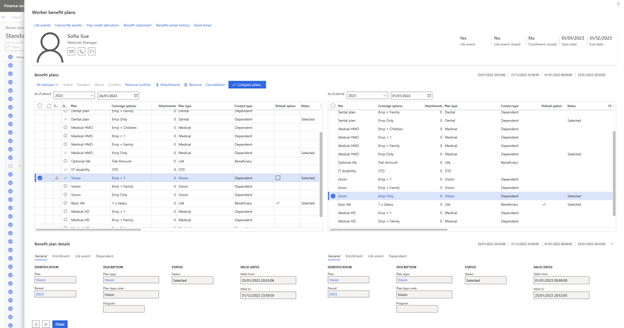

---
# required metadata

title: Benefit bulk update page 
description: This article describes features of the Benefit bulk update page.
author: twheeloc
ms.date: 03/03/2023
ms.topic: article
ms.prod: 
ms.technology: 

# optional metadata

ms.search.form: HcmJob, HcmPosition, OMOperatingUnit, HcmPersonnelManagementWorkspace
# ROBOTS: 
audience: Application User
# ms.devlang: 

# ms.tgt_pltfrm: 
ms.assetid: eb5dcacb-a5fe-451d-b30a-7ef14da65d81
ms.search.region: Global
# ms.search.industry: 
ms.author: twheeloc
ms.search.validFrom: 2016-02-28
ms.dyn365.ops.version: AX 7.0.0, Human Resources

---

# Benefit bulk update page

The **Benefit bulk update** page helps benefits administrators view, validate, and quickly take bulk action on employees' benefit plan selections.

After employees select their benefit plans by using Employee self service, the benefits administrator validates the selection and takes the required action. For example, they might confirm, cancel, or remove the selection, or send email to request evidence. In addition, they can access related information about enrollment, life events, dependents, beneficiaries, and the cost of employees' benefit selections. They can also make selections and corrections on behalf of employees. Finally, they can identify which plan records have changed since the previous period and select those plans for further validation.

The **Benefit bulk update** page provides quick filters and grouping that are based on period, plan, plan type, program, bundle, plan validity, and status. These quick filters and groupings help administrators select the desired records for bulk action, validate the selection, and then take bulk action on the selected records. 

The following table describes the options that are available on the **Filter by** drop-down menu. The administrator can use these options to filter the benefit plan records that are shown in the grid.

| Filter option | Description |
|---------------|-------------|
| Period | Filter the benefit plans by period. You can select a past period, the current period, or a future period. By default, the grid shows the plans for the current period. |
| Legal entity | Filter the benefit plans by legal entity. |
| Plan validity | Filter the benefit plans by validity. Plans can be active, expired, or future. You can select multiple values for this option. |
| Status | 
Filter the benefit plans by status. You can select multiple values for this option. The following values are available:
<ul><li>**Selected** – Show plans that have **Selected** status.</li><li>**Waived** – Show plans that have **Waived** status.</li><li>**Checked out** – Show plans that are checked out.</li><li>**Confirmed** – Show plans that are confirmed.</li><li>**Not selected/waived** – Show plans that don't have **Selected** or **Waived** status.</li></ul> |
| Apply | Apply the selected filter options. |
| Reset | Reset the filter options. |
| Advance filter | Access more filter options. |

The administrator can use the **Group by** drop-down menu to group the benefit plan records by worker, legal entity, plan, plan type, bundle, program, or period. 

After the desired quick filters and groupings are applied, the administrator can select one or more records, and take the required action. They can also send email notifications to the employees that benefit plan records were selected for.

To access related information about a selected plan, the administrator can select **Related information** on the right side of the page to expand the **Related information** pane. The pane shows the worker details, general information, and information about enrollment, life events, dependents, beneficiaries, and the cost of the employee's benefit selections.

To edit specific details of an employee's benefit plan, the administrator can select **Edit** to open the **Worker benefit plans** dialog box. The information in this dialog box can be edited as permitted by the configurations.

> [!NOTE]
> In the **Worker benefit plans** dialog box, the employee and employer amounts can't be edited if they're calculated by a rate. If you want administrators to be able to edit these fields, select the **Allow administrators to modify calculated rates** option on the **Benefits management** page.

## Benefits compare plans (Preview feature)

Benefits administrators often have to validate employees' benefits selections. For example, they validate changes in plan selections, coverage options, and employee or employer costs against the previous year's selection, or pre-life-event selections.

Administrators can use the **Compare plan** button in the **Worker benefit plans** dialog box and on the **Benefit bulk update** page to compare the benefit plan selections, coverage options, employee costs, dependents, and beneficiaries against the previous benefit period, or any point of time before the current date and period. On the **Benefit bulk update** page, administrators can select one or more records, and then select **Compare plan** to open the **Worker benefit plans** dialog box to do the comparison.

The **Worker benefit plans** dialog box has two grids that can be used to compare benefit plans for different periods (and dates). The data in the left grid can be edited, but the data in the right grid is read-only.

By default, the **As of period** field above the left grid is set to the current benefit period, and the **As of period** field above the right grid is set to the previous benefit period (and the last date of that period is selected). You can change the period and date for both grids. If you select a date that's outside the current period, the period value changes to match the date selection. The date that's selected for the left grid must always be later than the date that's selected for the right grid.

The benefit data in each grid is updated based on the period and date that you select. By selecting different date ranges in a benefit period, you can compare the benefit plan records (as shown in the preceding illustration). This capability can be useful for validating pre-life-event and post-life-event benefit plan selections.

If the plan type, plan option, coverage option, coverage amount, contribution amount, or dependent or beneficiary information for any record has changed since the previous period (or date range), a change symbol appears in the **Changed** column of the left grid. This symbol also appears if the employee doesn't select a plan that was selected in the previous period.

The change symbol alert is shown on the **Benefit bulk update** page, and in the **Worker benefit plans** dialog box that's opened by selecting **Edit** on the **Benefit bulk update** page. It's also shown in the **Worker benefit plans** dialog box when the **Compare plan** button is selected.

Administrators can select one or more records on the **Benefit bulk update** page and then select **Compare plan** to view the selected plans as a step-by-step list. The records for one employee at a time are shown and compared. After the administrator has validated the benefit plans and taken the required action on that employee's records, they can select the **Next** (right arrow) button to validate and take action on the records for the next employee in the selection. To close the plan comparison page, administrators can select **Done**. All changes are automatically saved.
