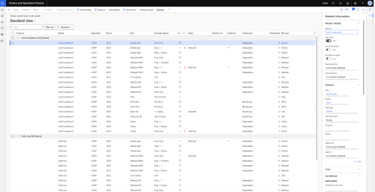

---
# required metadata

title: The Benefit bulk update page 
description: This article describes features of the Benefit bulk update page. 
author: twheeloc
ms.date: 01/30/2023
ms.topic: article
ms.prod: 
ms.technology: 

# optional metadata

ms.search.form: HcmJob, HcmPosition, OMOperatingUnit, HcmPersonnelManagementWorkspace
# ROBOTS: 
audience: Application User
# ms.devlang: 

# ms.tgt_pltfrm: 
ms.custom: 87933
ms.assetid: eb5dcacb-a5fe-451d-b30a-7ef14da65d81
ms.search.region: Global
# ms.search.industry: 
ms.author: twheeloc
ms.search.validFrom: 2016-02-28
ms.dyn365.ops.version: AX 7.0.0, Human Resources

---

# Benefit bulk updates

The Benefit bulk update page helps the benefit administrators to view, validate and take quick bulk actions on employees’ benefit plan selections.  

Once the employees select their benefit plans using Employee self service, the Benefits administrator validates the selections and takes the needed action such as 
confirmation, cancelation, send E-mail to request evidence or remove the selection. Administrators can also make selections and corrections on behalf of the employees. 

To help the administrators validate the bulk selections and take quick actions, various filters and grouping are available on the page. The quick filters and groupings
based on period, plans, plan types, program, bundles, plan validity and status help select the desired records and then take bulk actions on selected records. 

The administrators can access the related information regarding enrollment, life events, dependents, beneficiaries, and cost of the employees’ benefit selections.
Email notifications can be sent out to workers from the bulk update page.

Administrators can identify which plan records have changed as compared to the previous period and select those plans for further validation. The page invokes the
worker benefit plan page for editing a specific worker plan detail.

The ‘Filter by’ options:

|Filter option|  More information|
|--------------|------------------|
|Period|The benefit plans on the page can be filtered using the **Period filter**. You can select a past, current (by default) or future period to view the related benefit plans.|
|Legal entity|	The plans in the grid filtered by the Legal entity selected in this field.|
|Plan validity|	The plans in the grid are filtered by the active, expired, future status selected in the grid. You can multiselect the validity.|
|Status|	You can filter the benefit plan records based on the status. You can multiselect the status.
•	**Selected**: Displays the plans that have **selected** status.
•	**Waived**: Displays the plans that have **waived** status.
•	**Checked out**: Displays the plans that are checked out. 
•	**Confirmed**: Displays the plans that are confirmed. 
•	**Not selected/waived**: Displays the plans that are not ‘selected’ or waived.|
|Apply|	Click to apply the filter.|
|Reset|	Click to reset the filter options.|
|Advance filter|	Click to access more filter options.|

The **Group by** option can be used to group the benefit records based on Worker, Legal Entity, Plan, Plan type, Bundle, Program and Period. 
After applying the desired filters and groupings, you can multiselect the records and take the needed actions. You can send email notifications to the employees for 
whom the benefit plan records are selected.  

To access the **related information** regarding the selected plans, click the toggle on the right to open **Related information**. For the highlighted plan, you 
can view the worker details, General information, cost, enrollment, life event. dependent and beneficiary information. 

To edit the information, click **Edit**. When the **Edit** button is clicked, the **Worker benefit plan** opens as a slider. You can edit the information in this slider
(as permitted by your configurations). 

>[!NOTE]
>In the **Worker benefit plan**, the employee and employer amounts are not editable when these amounts are calculated by a rate. If you want the administrators to be able to edit these fields, select the option **Allow administrators to modify calculated rates** on the **Benefits management** page. 

### Benefits compare plans (Preview feature)
The Benefit administrators often need to validate the employees’ benefits selections. Administrators validate the changes in the plan selections, coverage options and 
employee or employer costs against previous year’s selection or pre-life evet selections. The **Compare plan** option provides an ability to compare the benefit plan 
selections, coverage options, employee costs, dependents, and beneficiaries against previous benefit period or against any point of time (less than current date and 
period). 

The **Compare plan** button is available on **Worker benefit plan** page and the **Benefit bulk update** page. In the **Bulk update** page, Administrators can 
select (or multiselect) the record(s) and click **Compare plan** and open the **Worker benefit plans** page. 

The left grid, the **As of period** is defaulted as the current period. However, you can change the period and date. If you select a date that falls in a different 
period than current, the period value changes to match with the date selection. The plans in the grid underneath are the ‘as on date (and period)’ either defaulted or 
chosen. Period is the benefit period pertaining to the date selected. You select a date within the current or past period. The date on the left grid must always be
greater than the date on the right grid. 

The **Compared against** grid or the right grid pertains to the previous period and the benefits data is not editable in this grid. In the **Period** drop down, last day of the previous period defaulted. However, you have the option to choose the date. The date selected in the right grid must be less than the date selected in the left grid. 

You can choose different date ranges within a benefit period to compare the benefit plan records (as pictured above). This can be useful while validating the pre and after Life-event benefit plan selections. 

The records that have changed as compared to the previous period (or date range) have the change icon in the **Changed** column. The change icon is triggered in the left grid if there is any change in the Plan type, Plan option, Coverage option, Coverage amount, Contribution amount, Dependent and/or Beneficiary information as compared against the previous period (the right grid). If the employee does NOT select a plan that was selected in the previous period, the change icon is triggered. 

The **Change** icon alert is displayed in the **Bulk update** page and the **Worker benefit plan** page opened through the **Edit** button on the **Bulk update** page.
It is also available on the **Worker benefit plan** page when the **Compare plan** toggle is selected. 

Benefit administrators can select records(s) from the **Bulk update** page and click **Compare plan**, the selected plans are displayed as a step-by-step list. At one 
time, one employee records are displayed and compared. Once the admin has validated the benefit plans and taken the needed action on one employee’s records, admin can 
select the next arrow button, validate, and take action on the next employee’s records in the selection. Administrators can select **Done** to exit the compare plan 
window. The changes are autosaved. 

