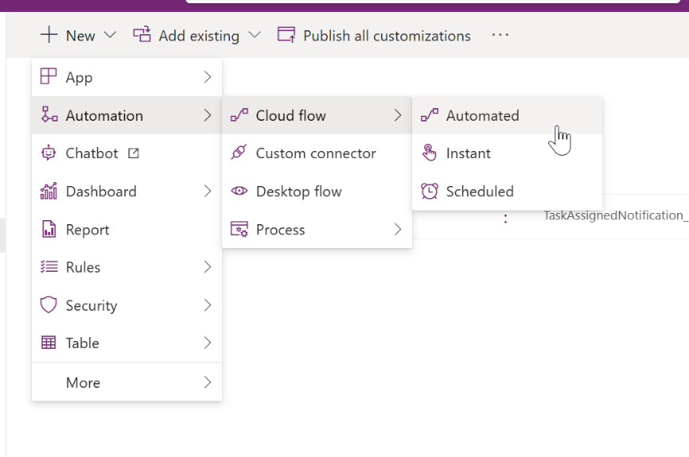
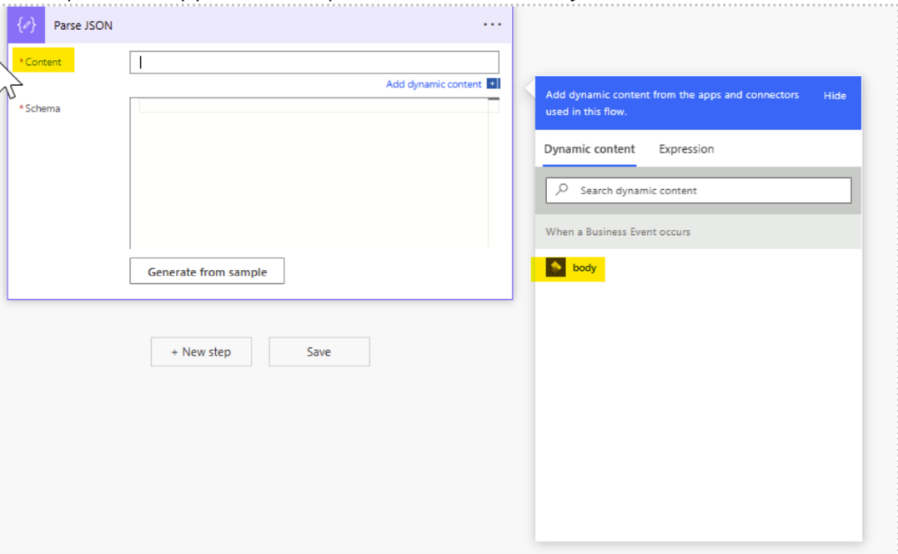
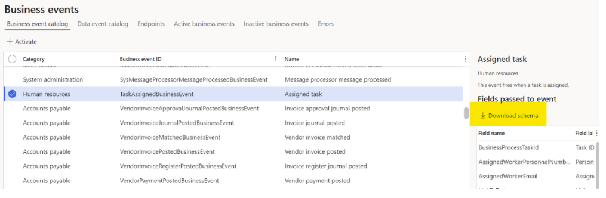
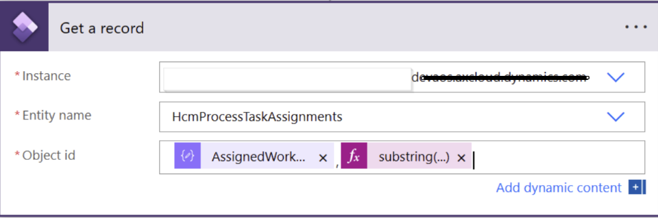
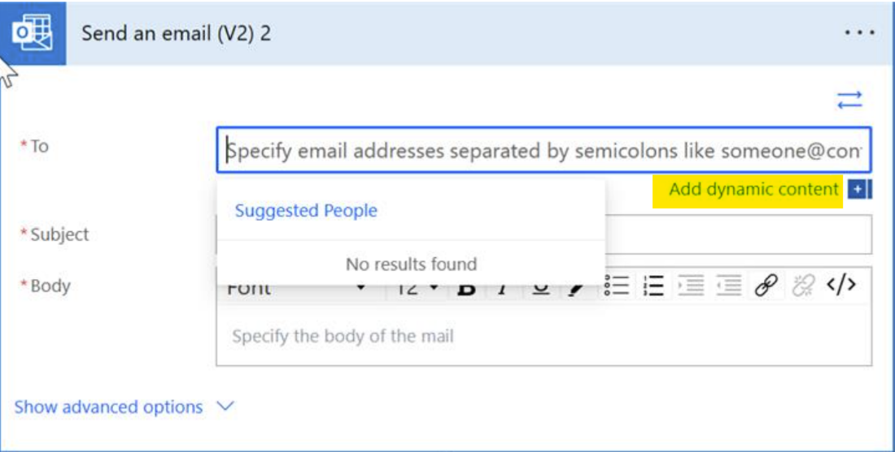
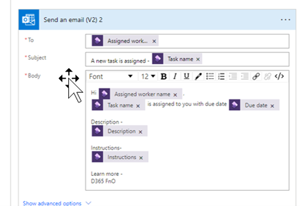

---
# required metadata

title: Business event example
description: This article provides an example of a business event.
author: twheeloc
ms.date: 03/03/2023
ms.topic: overview
ms.prod: 
ms.technology: 

# optional metadata

ms.search.form: HRMParameters, EssWorkspace
# ROBOTS: 
audience: Application User
# ms.devlang: 

# ms.tgt_pltfrm: 
ms.custom: ["51941", "intro-internal"]
ms.assetid: 2cfb061a-a616-4bf9-9d98-9cde00039eec
ms.search.region: Global
# ms.search.industry: 
ms.author: twheeloc
ms.search.validFrom: 2020-03-19
ms.dyn365.ops.version: Human Resources

---

# Business event example

This article provides an example of a business event.

[!INCLUDE [PEAP](../includes/peap-2.md)]

## Set up a flow for assigned task notification

1. Sign in to the [Microsoft Power Apps maker portal](https://make.powerapps.com/).
2. Select an existing environment where you have the permissions that are required to create a Power Automate resource. The default environment is open to all companies.
3. Create a new solution.
4. Inside the new solution, select **New \> Automation \> Cloud flow \> Automated** to create a new automated flow.

    

5. Search for and select the **Dynamics 365 Finance** connector.
6. Select the **When a Business event occurs** trigger.

7. Go to your environment instance:

    - Category = **Human Resources**
    - Business event = The name of the business event (for example, **Assigned task**)
    - Legal entity = The legal entity

8. Select **New step** to add a new action.
9. Search for the **Parse JSON data** operation. This step is required to parse the message that has the schema of the data contract.
10. Select the **Content** field of the **Parse JSON** action, and then select the **body** output from the earlier step that should appear as an option. Select body in the new window.

    

11. Go to your Finance instance, follow these steps:

    1. Go to **System Administration \> Business events \> Business events catalog**.
    2. Select a business event.
    3. Select **Download schema**.

        

    4. Open the text file that's downloaded, and copy the contents.

8. In Power Automate, select **Generate from sample** to generate the schema.
9. Paste the contents of the text file content that you copied earlier, and then select **Done**.
10. Add a new action, and use the **Get a record** connector to fetch more details from the relevant entity record.
11. Provide the following information:

    - **Instance** – Select the environment instance.
    - **Entity name** – Select the name of the entity that has the field that you want to add.
    - **Object id** – The object ID consists of the key values for the record, as strings that are separated by commas. For example, in the **Assigned task** business event, the personnel number of the worker (**AssignedWorkerPersonnelNumber**) and the ID of the assigned task (**BusinessProcessTaskId**) are required. Values are given in the form of strings, and the format of the task ID is a globally unique identifier (GUID). The substring expression is used to obtain the exact task ID, as shown in the following example: 

    substring(body('Read_business_event')?['BusinessProcessTaskId'], 1, sub(length(body('Read_business_event')?['BusinessProcessTaskId']),2)),

    Depending on the format of field, the value must be converted to **String** format. This conversion isn't required if the format of the field is already **String**. For example, because the format of **AssignedWorkerPersonnelNumber** is **String**, the field value is used.

    

12. Use the **Outlook** (or **Teams**) connector to send notifications.
13. Select **Add dynamic content** to add dynamic content to the notification.

    

14. Provide the following information:

    - **To** – Add an email ID. You can use a specific field that gives the value of the email ID. For example, in the **Assigned task** business event, use **Assigned worker email**.
    - **Subject** – You can provide any text together with specific information from the entity. For example, in the **Assigned task** business event, use **Task name**.
    - **Body** – You can enter the content that you want to send as a notification, together with dynamic content. The content can be formatted. For example, in the **Assigned task** business event, you want to send a notification to the worker that the task was assigned to, and you want to include all task details and the due date. Therefore, provide the assigned worker's name, description, instructions, and due date information in the **Body** field.

    

    Alternatively, if you want to receive responses from the notification that's sent, you can use the **Send email with options** connector. In this case, the flow will be paused until it receives a response. That response can be accessed via the **SelectedOption** field that's available in the dynamic content dialog box to add additional logic to your flow. The **Send email with options** connector lets you format emails by using HTML tags.

15. When the flow is ready, select **Save**.
16. Go to **System Administration \> Setup \> Business events**.
17. Select **Endpoints**, and verify that a new endpoint has been created that has a GUID.
18. On the **Active business events** tab of the same page, verify that the event is activated.

When an event occurs, it will trigger the flow. A notification should then be sent based on the preceding configuration. For example, in the **Assigned task** example that's mentioned earlier, if any new task is assigned to a worker, the flow will be triggered and will send the notifications to the assigned worker.
