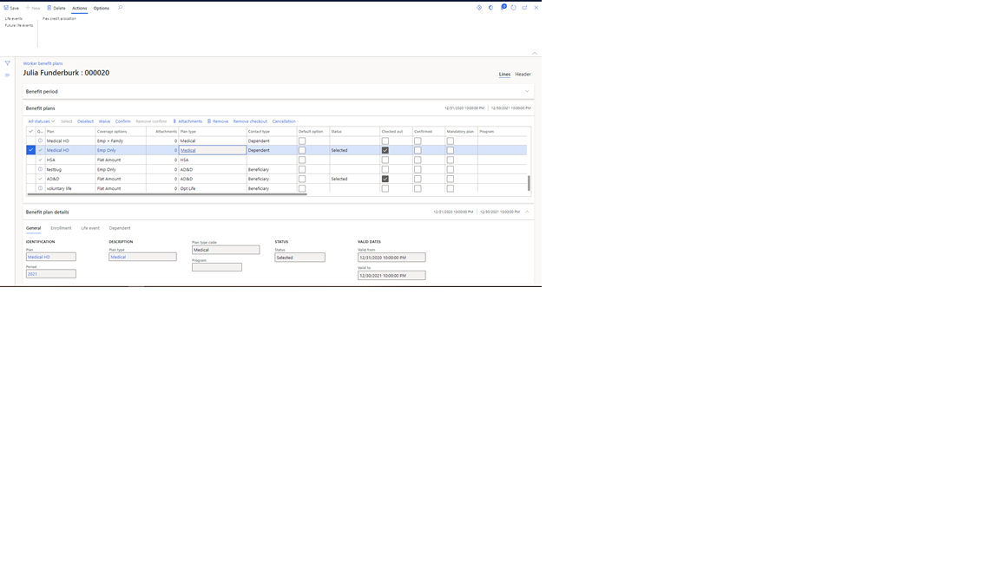

---
# required metadata
title: Employee benefit selection
description: This topic describes how employees can select or update their benefits.
author: twheeloc
ms.date: 12/06/2021
ms.topic: article
ms.prod: 
ms.technology: 

# optional metadata

# ms.search.form: EssWorkspace, 
# ROBOTS: 
audience: Application User
# ms.devlang: 
ms.search.scope: Human Resources
# ms.tgt_pltfrm: 
ms.custom: 7521
ms.assetid: 
ms.search.region: Global
# ms.search.industry: 
ms.author: twheeloc
ms.search.validFrom: 2020-12-28
ms.dyn365.ops.version: AX 7.0.0, Human Resources

---

# Employees select plans using Employee self service (optional)

[!include [Applies to Human Resources](../includes/applies-to-hr.md)]

When a new employee is hired, or a life event occurs, employees can select or update their benefits during open enrollment using **Employee self service**.

To access their benefits for enrollment, the employee will go to **Employee self service** and select **Benefits self-service** in the **Benefits** tile.

Within the **Benefits self-service** page, benefit plans are grouped by benefit plan type. To view the benefit plans within a plan type, select a tile in the 
**Employee benefits** page. The employee will see only the benefits that they are eligible for.

> [!Important:]

> For a plan type to display in **Employee self service**, it must be configured. For more information, see [Configure Employee self service](/hr-benefits-setup-employee-self-service.md).

Depending on the plan type, one or more benefits maybe selected for enrollment. For example, the medical plan type might be configured to limit the employee to one medical plan.
A life insurance plan type might allow the employee to select multiple life insurance plans.

Once an employee has determined a plan to enroll in, they may be required to select dependents. If the employee has selected a coverage option that is **Employee +1**, 
**Employee + children**, or **Family**, dependents must be selected. 

For more information about coverage options, see [Create coverage options](/hr-benefits-setup-coverage-options.md).

To select a benefit plan, click either the **ellipses** **(…)** or **Add to cart**. Once all of the benefit selections have been added to the cart, 
the employee selects **View cart**. After selecting **View cart**, the employee will be on the **Plans** page. They can view their selected and waived benefit plans. 
The employee must select **I agree** before selecting the **Checkout** button. The statement that is displayed to the right of the **I agree** toggle can be 
customized in **Human Resources Shared Parameters** in the **Benefits Management** tab.

When an employee confirms their benefit plan selections using **Employee self service**, their selections are recorded and displayed in the **Worker benefit plans** and 
**Worker benefit plans bulk update** pages.

When an employee selects their plans, the status of the benefit shows **Selected**. When the employee selects the **Check out** button in **Benefits self-service**, 
the **Checked Out** option will be selected.

> [!IMPORTANT]
> To complete enrollment, the benefits administrator must select **Confirm** for each selected employee benefit. Confirmation can be 
> completed in the **Worker benefits plan** or the **Worker benefit plans bulk update** pages.

It is not required for an employee to select **Benefits using self-service**. Benefits can be selected on behalf of the employee in the **Worker benefits plan** or 
the **Worker benefit plans bulk update** pages. The benefits must be confirmed by the benefit administrator for the employee to be enrolled in the benefit.

[!INCLUDE[footer-include](../includes/footer-banner.md)]

