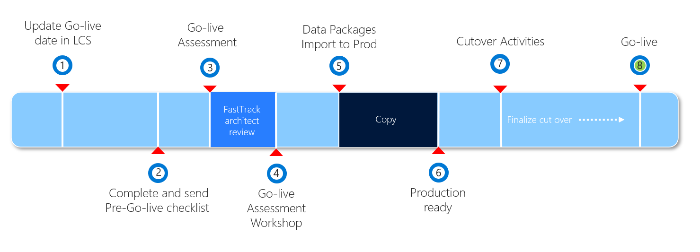

---

# required metadata

title: Prepare for Human Resources go-live
description: This page provides guidance on how to prepare for a go-live with Dynamics 365 Human Resources.
author: rachel-profitt
manager: tfehr
ms.date: 10/13/2020
ms.topic: article
ms.prod: 
ms.service: dynamics-human-resources
ms.technology: 

# optional metadata

ms.search.form: 
# ROBOTS: 
audience: Application User
# ms.devlang: 
ms.reviewer: anbichse
# ms.search.scope: Human Resources
# ms.tgt_pltfrm: 
ms.custom: 7521
ms.assetid: 
ms.search.region: Global
# ms.search.industry: 
ms.author: raprofit
ms.search.validFrom: 2020-10-13
ms.dyn365.ops.version: Human Resources

---

# Prepare for Human Resources go-live

[!include [banner](../includes/banner.md)]

This topic describes how to prepare to go live with a Dynamics 365 Human Resources project by using Microsoft Dynamics Lifecycle Services (LCS). 

This graphic shows the phases of the go-live process. 

The following table lists all the steps in the process, the expected duration, and who is responsible for the action.

| Phase | Action | Duration/When | Who | Notes |
| --- | --- | --- | --- |--- |
| 1 | Update go-live date in LCS | At the latest 2-3 months in advance | Partner/Customer | The milestone dates should be kept up to date on an ongoing basis. |
| 2 | Complete and send checklist | After user acceptance testing (UAT) is complete | Partner/Customer | Follow the instructions provided in [FastTrack go-live assessment](hr-admin-go-live-prepare.md#fasttrack-go-live-assessment). |
| 3 | Project assessment (FastTrack) | FastTrack Architect* | Architect delivers assessment after checklist is received and continues review until questions are clarified and mitigations are in place, if applicable. |
| 4 | Project workshop (FastTrack) | FastTrack Architect* | |
| 5 | Data package imports | Depends on the project | Partner/Customer | Follow the instructions in [Data management overview](https://docs.microsoft.com/dynamics365/fin-ops-core/dev-itpro/data-entities/data-entities-data-packages).|
| 6 | Production ready | After all previous steps have been completed | Partner/Customer | Partner/Customer can take control of the production environment.|
| 7 | Cutover activities | Depends on the project | Partner/Customer | |
| 8 | Go live | Depends on the project | Customer | |

> [!IMPORTANT]
> *Steps 3 and 4 are only completed for customers who qualify for FastTrack.

## Completing the LCS methodology

A major milestone in each implementation project is the cutover to the production environment. 

To help ensure the production environment is used for live operations, Microsoft provisions the production instance only when the implementation is approaching the **Operate** phase, after the required activities in the LCS methodology are completed. For more information about the environments in your subscription, see the [Dynamics 365 Licensing Guide](https://go.microsoft.com/fwlink/?LinkId=866544). 

Customers must complete the **Analysis**, **Design and Develop**, and **Test** phases in the LCS methodology before the **Configure** button for requesting the production environment becomes available. To complete a phase in LCS, you must first complete every required step in that phase. When all the steps in a phase are completed, you can complete the whole phase. You can always reopen a phase later if you must make changes. For more information, see [Lifecycle Services (LCS) for Finance and Operations apps customers](https://docs.microsoft.com/dynamics365/fin-ops-core/dev-itpro/lifecycle-services/lcs-works-lcs). 

The process of completing a step has two parts: 

- Do the actual work, such as a fit-gap analysis or user acceptance testing (UAT). 
- Mark the corresponding step in the LCS methodology as completed. 

It's a good practice to complete the steps in the methodology as you make progress with the implementation. Don't wait until the last minute. Don't just click through all the steps so you can get a production environment. It's in the customer's best interest to have a solid implementation. 

## UAT for your solution

During the UAT phase, you must test all the business processes you've implemented, and any customizations you've made, in a Sandbox environment in the implementation project. To help ensure a successful go-live, you should consider the following as you complete the UAT phase: 

- Test cases cover the entire scope of requirements. 
- Test by using migrated data. This data should include master data such as workers, jobs, and positions. Also include opening balances, like leave and absence accruals. Finally, include open transactions, such as current benefits enrollments. Complete testing with all types of data, even if the data set isn't finalized. 
- Test by using the correct security roles (default roles and custom roles) that are assigned to users. 
- Make sure that the solution complies with any company- and industry-specific regulatory requirements. 
- Document all features and obtain approval and sign-off from the customer. 

## FastTrack go-live assessment

Customers who are qualified for FastTrack and are engaged with a FastTrack Solution Architect will complete a go-live review with Microsoft FastTrack. For more information, see [Microsoft FastTrack](https://docs.microsoft.com/dynamics365/fin-ops-core/fin-ops/get-started/fasttrack-dynamics-365-overview). 

About eight weeks before go-live, the FastTrack team will ask you to fill in a [Go-live checklist](https://go.microsoft.com/fwlink/?linkid=2146013).

The project manager or a key project member must complete the go-live checklist during the pre-go-live phase of the project. Typically, the checklist is completed four to six weeks before the proposed go-live date, when UAT is completed or almost completed. 

When you've completed the go-live checklist, email it to your FastTrack Solution Architect. Always include a key stakeholder from the customer and the implementation partner on the email. 

After you submit the checklist, your FastTrack Solution Architect will review the project and provide an assessment that describes the potential risks, best practices, and recommendations for a successful go-live of the project. In some cases, the solution architect might highlight risk factors and ask for a mitigation plan. 

## See also

[Go-live FAQ](hr-admin-go-live-faq.md)