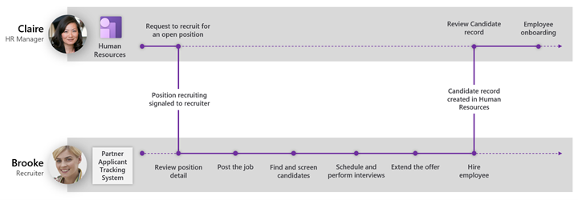
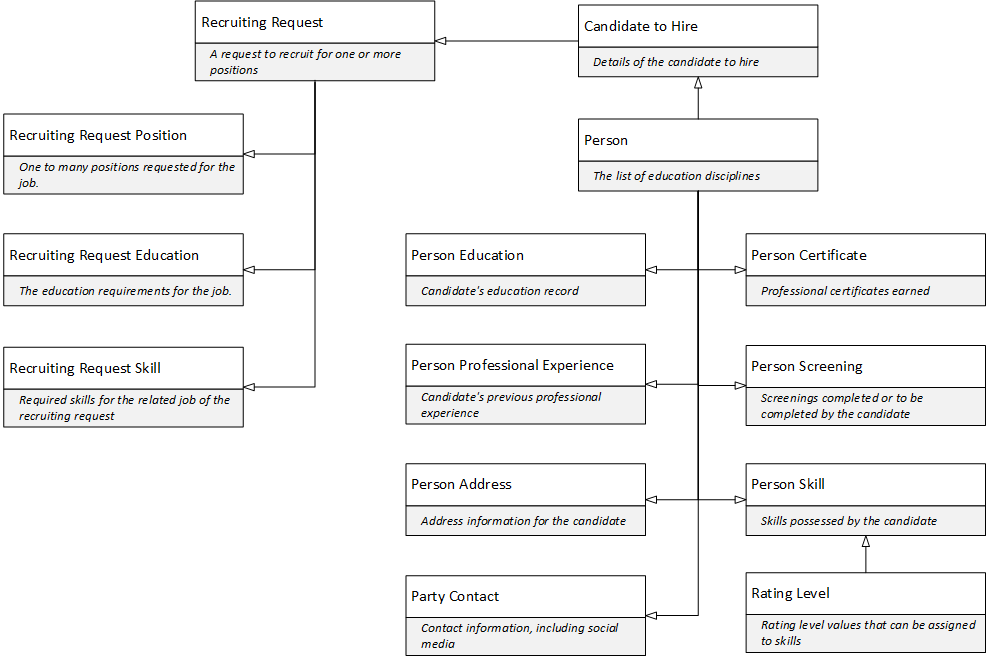

---
# required metadata

title: Applicant Tracking System integration API introduction
description: This article describes the Dynamics 365 Human Resources Applicant Tracking System (ATS) integration API.
author: andreabichsel
ms.date: 02/03/2021
ms.topic: article
ms.prod: 
ms.technology: 

# optional metadata

# ms.search.form: 
audience: Application User
# ms.devlang: 
# ms.tgt_pltfrm: 
ms.collection: get-started
ms.assetid: 
ms.search.region: Global
# ms.search.industry: 
ms.author: jaredha
ms.search.validFrom: 2021-02-03
ms.dyn365.ops.version: Human Resources
---

# Applicant Tracking System integration API introduction

[!INCLUDE [PEAP](../includes/peap-1.md)]

[!include [Applies to Human Resources](../includes/applies-to-hr.md)]

This article describes the Dynamics 365 Human Resources Applicant Tracking System (ATS) integration API. The intent of the API is to enable streamlined integrations between Dynamics 365 Human Resources and partnering ATSs.

The integrated experience begins in Human Resources when a hiring manager creates a recruiting request. When the request is activated, the ATS pulls the detail for the request to create a recruiting project. Then it follows the recruiting pipeline to select and hire a candidate for the position(s). Finally, the ATS completes the round-trip integration by sending the selected candidate’s record into Human Resources. The candidate record can then go through more onboarding validations and workflows to create the employee record.

To enable the integration, Human Resources has added the following components:

1.	Functionality to create a recruiting request.
2.	An expanded candidate profile and related workflows.
3.	An integration API opening up the new functionality to integrating applications.

For more information about setting up and using the recruiting request and candidate functionality, see [Recruit job candidates](hr-personnel-recruit.md).

## Microsoft Dataverse

This API is built on Microsoft Dataverse (formerly Common Data Service). All RESTful interaction with this API is done via the Microsoft Dataverse Web API, which uses OData. This API is a subset of the Dataverse Web API. The Dataverse Web API defines characteristics such as authentication, SLAs, batch, concurrency control, and error handling.

For more general information about the Microsoft Dataverse Web API, see:

- [What is Microsoft Dataverse?](/powerapps/maker/data-platform/data-platform-intro)
- [Use the Microsoft Dataverse Web API](/powerapps/developer/data-platform/webapi/overview)
- [Microsoft Dataverse developer guide](/powerapps/developer/data-platform)

The above documentation includes detail and developer guidance on using the Dataverse Web API, such as [managing authentication](/powerapps/developer/data-platform/webapi/authenticate-web-api), [performing operations](/powerapps/developer/data-platform/webapi/perform-operations-web-api), [using Postman with the API](/powerapps/developer/data-platform/webapi/use-postman-web-api), and [using change tracking or delta tokens](/powerapps/developer/data-platform/use-change-tracking-synchronize-data-external-systems) with the API.

### Option sets

The data model for the ATS integration API described in this document includes option sets that provide enumerated values associated with entity properties. For detail on working with option sets in the Dataverse Web API, see [Create and update option sets using the Web API](/powerapps/developer/data-platform/webapi/create-update-optionsets). Option sets are defined for each Dataverse environment.

### Virtual tables for Human Resources in Dataverse

The endpoints for the ATS integration API use the virtual table platform capabilities of Microsoft Dataverse. By default, the virtual tables and their associated API endpoints are not deployed for Human Resources environments, enabling organizations to determine which OData endpoints will be exposed for the environment. To use the API, the virtual tables for the Human Resources entities must be generated for the environment. 

For information on generating the virtual tables for the API, see [Configure Dataverse virtual tables](./hr-admin-integration-common-data-service-virtual-entities.md).

## Data model

The data model is centered around two main entities:

- **RecruitingRequest** represents a request to an ATS to recruit for one or more open positions.For an example query, see [Example query for Recruiting request](hr-admin-integration-ats-api-recruiting-request-example-query.md).
- **CandidateToHire** represents details of a candidate who has accepted an offer for a position. **Person** represents the individual who is the candidate. A person can have multiple roles in the company, such as candidate, worker, employee, or contractor. For an example query, see [Example query for Candidate to hire](hr-admin-integration-ats-api-candidate-to-hire-example-query.md).

The following diagram illustrates relationships within the API. Several types have foreign keys to other, pre-existing entities in Human Resources that aren't illustrated here. This document provides information on entities that are specific to recruiting integration scenarios. However, there are many other entities in the Dataverse Web API for Dynamics 365 Human Resources that may also be relevant to your integration. For example, you may also need detail for workers, jobs, positions, or other entities not defined here. Many of these entities are referenced in foreign key relationships or navigation properties.

## Recruiting request and related entities and option sets

Example query: 

- [Example query for Recruiting request](hr-admin-integration-ats-api-recruiting-request-example-query.md)

Entities:

- [Recruiting request](hr-admin-integration-ats-api-recruiting-request.md)
- [Recruiting request position](hr-admin-integration-ats-api-recruiting-request-position.md)
- [Recruiting request skill](hr-admin-integration-ats-api-recruiting-request-skill.md)
- [Recruiting request education](hr-admin-integration-ats-api-recruiting-request-education.md)
- [Recruiting request location](hr-admin-integration-ats-api-recruiting-request-location.md)

Option sets:

- [Job exempt status](hr-admin-integration-ats-api-job-exempt-status.md)
- [Recruiting request position status](hr-admin-integration-ats-api-recruiting-request-position-status.md)
- [Recruiting request status](hr-admin-integration-ats-api-recruiting-request-status.md)
- [Regulatory job category](hr-admin-integration-ats-api-regulatory-job-category.md)

## Candidate to hire and related entities and option sets

Example query:

- [Example query for Candidate to hire](hr-admin-integration-ats-api-candidate-to-hire-example-query.md)

Entities:

- [Candidate to hire](hr-admin-integration-ats-api-candidate-to-hire.md)
- [Person](hr-admin-integration-ats-api-person.md)
- [Person education](hr-admin-integration-ats-api-person-education.md)
- [Person professional experience](hr-admin-integration-ats-api-person-professional-experience.md)
- [Person address](hr-admin-integration-ats-api-person-address.md)
- [Party contact](hr-admin-integration-ats-api-party-contact.md)
- [Person skill](hr-admin-integration-ats-api-person-skill.md)
- [Rating level](hr-admin-integration-ats-api-rating-level.md)
- [Person certificate](hr-admin-integration-ats-api-person-certificate.md)
- [Certificate type](hr-admin-integration-ats-api-certificate-type.md)
- [Person screening](hr-admin-integration-ats-api-person-screening.md)
- [Screening types](hr-admin-integration-ats-api-screening-types.md)
- [Person identification number](hr-admin-integration-ats-api-person-identification-number.md)

Option sets:

- [Applicant integration result](hr-admin-integration-ats-api-applicant-integration-result.md)
- [Blank Yes No](hr-admin-integration-ats-api-blank-yes-no.md)
- [Completion status](hr-admin-integration-ats-api-completion-status.md)
- [Contact type](hr-admin-integration-ats-api-contact-type.md)
- [Education credit basis](hr-admin-integration-ats-api-education-credit-basis.md)
- [Gender](hr-admin-integration-ats-api-gender.md)
- [Marital status](hr-admin-integration-ats-api-marital-status.md)
- [Months of year](hr-admin-integration-ats-api-months-of-year.md)
- [No Yes](hr-admin-integration-ats-api-no-yes.md)
- [Period unit](hr-admin-integration-ats-api-period-unit.md)
- [Screening frequency](hr-admin-integration-ats-api-screening-frequency.md)
- [Screening frequency generate from](hr-admin-integration-ats-api-screening-frequency-generate-from.md)
- [Skill level type](hr-admin-integration-ats-api-skill-level-type.md)

## See also

[Recruit job candidates](hr-personnel-recruit.md) 
[What is Microsoft Dataverse?](/powerapps/maker/data-platform/data-platform-intro) 
[Use the Microsoft Dataverse Web API](/powerapps/developer/data-platform/webapi/overview) 
[Create and update option sets using the Web API](/powerapps/developer/data-platform/webapi/create-update-optionsets) 

[!INCLUDE[footer-include](../includes/footer-banner.md)]
