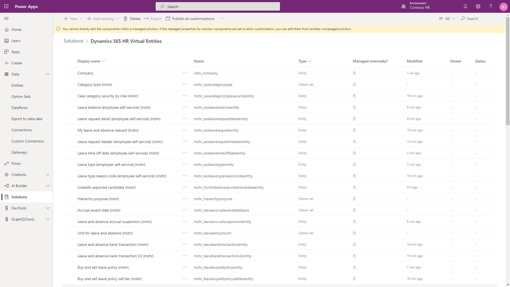
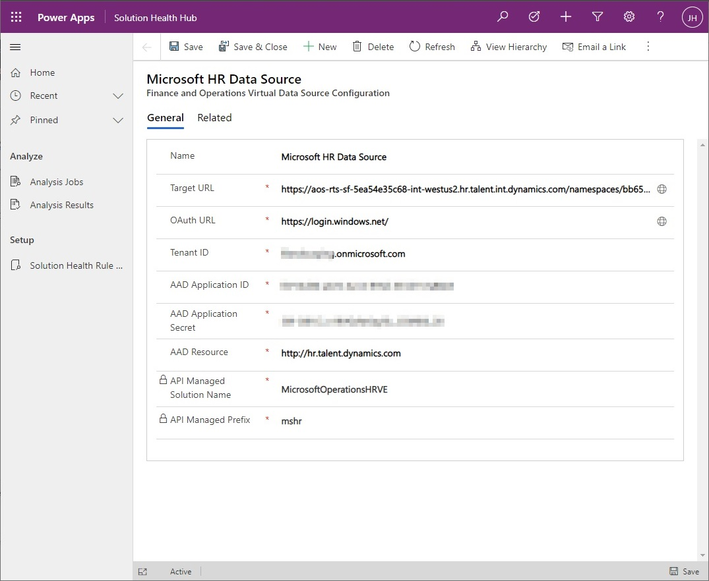
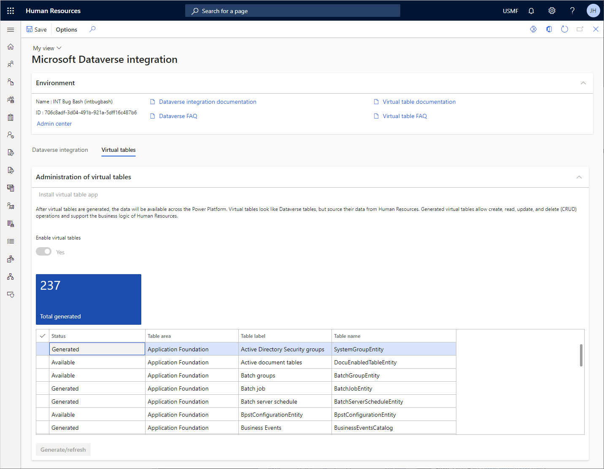

---
# required metadata

title: Configure Dataverse virtual tables
description: This article shows how to configure, generate, update existing virtual tables, and analyze generated and available tables for Dynamics 365 Human Resources. 
author: twheeloc
ms.date: 02/21/2023
ms.topic: article
ms.prod: 
ms.technology: 

# optional metadata

ms.search.form: CDSIntegrationAdministration
# ROBOTS: 
audience: Application User
# ms.devlang: 

# ms.tgt_pltfrm: 
ms.custom: 7521
ms.assetid: 
ms.search.region: Global
# ms.search.industry: 
ms.author: twheeloc
ms.search.validFrom: 2020-10-05
ms.dyn365.ops.version: Human Resources
---

# Configure Dataverse virtual tables

[!INCLUDE [PEAP](../includes/peap-2.md)]

[!include [Applies to Human Resources](../includes/applies-to-hr.md)]

Dynamics 365 Human Resources is a virtual data source in Microsoft Dataverse. It provides full create, read, update, and delete (CRUD) operations from Dataverse and Microsoft Power Platform. The data for virtual tables isn't stored in Dataverse, but in the application database.

To enable CRUD operations on Human Resources entities from Dataverse, you must make the entities available as virtual tables in Dataverse. This lets you perform CRUD operations from Dataverse and Microsoft Power Platform on data that's in Human Resources. The operations also support the full business logic validations of Human Resources to ensure data integrity when writing data to the entities.

> [!NOTE]
> Human Resources entities correspond to Dataverse tables. For more information about Dataverse (formerly Common Data Service) and terminology updates, see [What is Microsoft Dataverse?](/powerapps/maker/data-platform/data-platform-intro)

## Available virtual tables for Human Resources

All Open Data Protocol (OData) entities in Human Resources are available as virtual tables in Dataverse. They're also available in Power Platform. You can now build apps and experiences with data directly from Human Resources with full CRUD capability, without copying or synchronizing data to Dataverse. You can use Power Apps portals to build external-facing websites that enable collaboration scenarios for business processes in Human Resources.

You can view the list of virtual tables enabled in the environment, and begin working with the tables in [Power Apps](https://make.powerapps.com), in the **Dynamics 365 HR Virtual Tables** solution.

## Virtual tables versus native tables

Virtual tables for Human Resources aren't the same as the native Dataverse tables created for Human Resources. 

The native tables for Human Resources are generated separately and maintained in the HCM Common solution in Dataverse. With native tables, the data is stored in Dataverse and requires synchronization with the Human Resources application database.

> [!NOTE]
> For a list of the native Dataverse tables for Human Resources, see [Dataverse tables](./hr-developer-entities.md).

## Setup

Follow these setup steps to enable virtual tables in your environment.

### Enable virtual tables in Human Resources

First, you must enable virtual tables in the **Feature management** workspace.

1. In Human Resources, select **System administration**.

2. Select the **Feature management** tile.

3. Select **Virtual table support for HR in Dataverse**, and then select **Enable**.

For more information about enabling and disabling features, see [Manage features](hr-admin-manage-features.md).

### Register the app in Microsoft Azure

You must register your Human Resources instance in the Azure portal so the Microsoft identity platform can provide authentication and authorization services for the app and users. For more information about registering apps in Azure, see [Quickstart: Register an application with the Microsoft identity platform](/azure/active-directory/develop/quickstart-register-app).

1. Open the [Microsoft Azure portal](https://portal.azure.com).

2. In the Azure services list, select **App registrations**.

3. Select **New registration**.

4. In the **Name** field, enter a descriptive name for the app. For example, **Dynamics 365 Human Resources Virtual Tables**.

5. In the **Redirect URI** field, enter the namespace URL of your instance of Human Resources.

6. Select **Register**.

7. When registration completes, the Azure portal displays the app registration's **Overview** pane, which includes its **Application (client) ID**. Take note of the **Application (client) ID** at this time. You'll enter this information when you [Configure the virtual table data source](hr-admin-integration-common-data-service-virtual-entities.md#configure-the-virtual-table-data-source).

8. In the left navigation pane, select **Certificates and secrets**.

9. In the **Client secrets** section of the page, select **New client secret**.

10. Provide a description, select a duration, and select **Add**.

11. Record the secret's value from the **Value** property of the table. You'll enter this information when you [Configure the virtual table data source](hr-admin-integration-common-data-service-virtual-entities.md#configure-the-virtual-table-data-source).

    > [!IMPORTANT]
    > Be sure to take note of the secret's value at this time. The secret is never displayed again after you leave this page.

### Install the Dynamics 365 HR Virtual Table app

Install the Dynamics 365 HR Virtual Table app in your Power Apps environment to deploy the virtual table solution package to Dataverse.

1. In Human Resources, open the **Microsoft Dataverse integration** page.

2. Select the **Virtual tables** tab.

3. Select **Install virtual table app**.

### Configure the virtual table data source

The next step is to configure the virtual table data source in the Power Apps environment.

1. Open the [Power Platform admin center](https://admin.powerplatform.microsoft.com).

2. In the **Environments** list, select the Power Apps environment associated with your Human Resources instance.

3. Select the **Environment URL** in the **Details** section of the page.

4. In the **Solution Health Hub**, select **Advanced Settings** from the **Settings** menu.

5. In **Settings**, select the **Advanced Find** icon in the top right of the application page.

6.On the **Advanced Find** page, in the **Look for** dropdown list, select **Finance and operations Virtual Data Source Configurations**.

   > [!NOTE]
   > The installation of the virtual table app from the previous setup step can take a few minutes. If **Finance and operations Virtual Data Source Configurations** isn't available in the list, wait for a minute and refresh the list.

6. Select **Results**.

7. Select the **Microsoft HR Data Source** record.

8. Enter the required information for the data source configuration:

   - **Target URL**: The URL of your Human Resources namespace. The format of the target URL is:
     
     https://\<hostname\>.hr.talent.dynamics.com/namespaces/\<namespaceID\>/

     For example:
     
     `https://aos.rts-sf-5ea54e35c68-westus2.hr.talent.dynamics.com/namespaces/49d24c565-8f4d-4891-b174-bf83d948ed0c/`

     >[!NOTE]
     >Be sure to include the "**/**" character at the end of the URL to avoid receiving an error.

     >[!NOTE]
     >The Target URL determines the Human Resources environment that virtual tables will point to for data. If you create a sandbox environment by creating a copy of your production environment, update this value to the namespace URL of your new sandbox environment. This ensures the virtual tables are connected to the sandbox environment data rather than continuing to point to the production environment.

   - **Tenant ID**: The Azure Active Directory (Azure AD) tenant ID.

   - **AAD Application ID**: The application (client) ID created for the application registered in the Microsoft Azure portal. You received this information earlier during the step [Register the app in Microsoft Azure](hr-admin-integration-common-data-service-virtual-entities.md#register-the-app-in-microsoft-azure).

   - **AAD Application Secret**: The client secret created for the application registered in the Microsoft Azure portal. You received this information earlier during the step [Register the app in Microsoft Azure](hr-admin-integration-common-data-service-virtual-entities.md#register-the-app-in-microsoft-azure).

   

9. Select **Save & Close**.

### Grant app permissions in Human Resources

Grant permissions for the two Azure AD applications in Human Resources:

- The app created for your tenant in the Microsoft Azure portal
- The Dynamics 365 HR Virtual Table app installed in the Power Apps environment 

1. In Human Resources, open the **Azure Active Directory applications** page.

2. Select **New** to create a new application record:

    - In the **Client ID** field, enter the client ID of the app you registered in the Microsoft Azure portal.
    - In the **Name** field, enter the name of the app you registered in the Microsoft Azure portal.
    - In the **User ID** field, select the user ID of a user with admin permissions in Human Resources and the Power Apps environment.

3. Select **New** to create a second application record:

    - **Client Id**: f9be0c49-aa22-4ec6-911a-c5da515226ff
    - **Name**: Dynamics 365 HR Virtual Table
    - In the **User ID** field, select the user ID of a user with admin permissions in Human Resources and the Power Apps environment.

## Generate virtual tables

When setup completes, you can select the virtual tables you want to generate and enable in your Dataverse instance.

1. In Human Resources, open the **Microsoft Dataverse integration** page.

2. Select the **Virtual tables** tab.

> [!NOTE]
> The **Enable virtual tables** toggle will be set to **Yes** automatically when all required setup has been completed. If the toggle is set to **No**, review the steps in previous sections of this document to ensure all prerequisite setup is completed.

3. Select the table or tables you want to generate in Dataverse.

4. Select **Generate/refresh**.

## Check table generation status

Virtual tables are generated in Dataverse through an asynchronous background process. Updates on the process display in the action center. Details on the process, including error logs, appear in the **Process automations** page.

1. In Human Resources, open the **Process automations** page.

2. Select the **Background processes** tab.

3. Select **Virtual table poll async operation background process**.

4. Select **View most recent results**.

The slideout pane displays the most recent execution results for the process. You can view the log for the process, including any errors returned from Dataverse.

## See also

[What is Dataverse?](/powerapps/maker/common-data-service/data-platform-intro) 
[Tables in Dataverse](/powerapps/maker/common-data-service/entity-overview) 
[Table relationships overview](/powerapps/maker/common-data-service/relationships-overview) 
[Create and edit virtual tables that contain data from an external data source](/powerapps/maker/common-data-service/create-edit-virtual-entities) 
[What is Power Apps portals?](/powerapps/maker/portals/overview) 
[Overview of creating apps in Power Apps](/powerapps/maker/)

[!INCLUDE[footer-include](../includes/footer-banner.md)]

