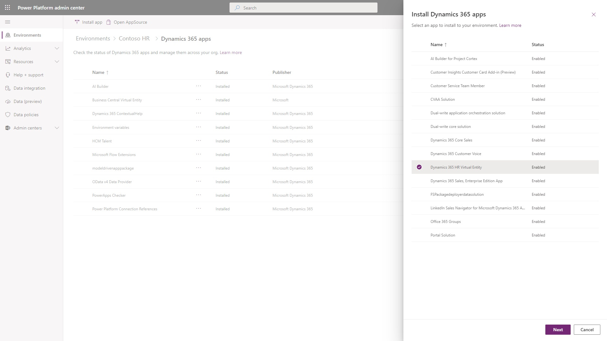
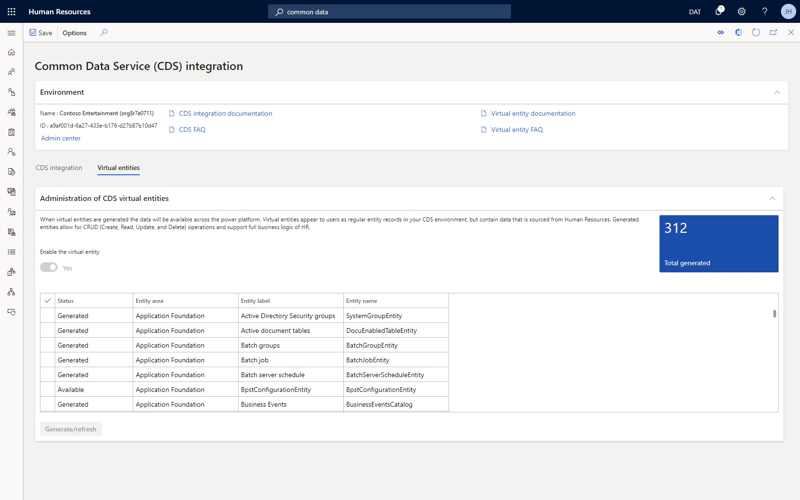

---
# required metadata

title: Configure Common Data Service virtual entities
description: This topic shows how to configure virtual entities for Dynamics 365 Human Resources. Generate and update existing virtual entities, and analyze generated and available entities. 
author: andreabichsel
manager: tfehr
ms.date: 10/05/2020
ms.topic: article
ms.prod: 
ms.service: dynamics-human-resources
ms.technology: 

# optional metadata

ms.search.form: CDSIntegrationAdministration
# ROBOTS: 
audience: Application User
# ms.devlang: 
ms.reviewer: anbichse
ms.search.scope: Human Resources
# ms.tgt_pltfrm: 
ms.custom: 7521
ms.assetid: 
ms.search.region: Global
# ms.search.industry: 
ms.author: anbichse
ms.search.validFrom: 2020-10-05
ms.dyn365.ops.version: Human Resources
---

# Configure Common Data Service virtual entities

[!include [banner](includes/preview-feature.md)]

Dynamics 365 Human Resources is a virtual data source in Common Data Service. It provides full create, read, update, and delete (CRUD) operations from Common Data Service and Microsoft Power Platform. The data for virtual entities isn't stored in Common Data Service, but in the application database. 

To enable CRUD operations on Human Resources entities from Common Data Service, you must make the entities available as virtual entities in Common Data Service. This lets you perform CRUD operations from Common Data Service and Microsoft Power Platform on data that's in Human Resources. The operations also support the full business logic validations of Human Resources to ensure data integrity when writing data to the entities.

## Available virtual entities for Human Resources

All Open Data Protocol (OData) entities in Human Resources are available as virtual entities in Common Data Service. They're also available in Power Platform. You can now build apps and experiences with data directly from Human Resources with full CRUD capability, without copying or synchronizing data to Common Data Service. You can use Power Apps portals to build external-facing websites that enable collaboration scenarios for business processes in Human Resources.

You can view the list of virtual entities enabled in the environment, and begin working with the entities in [Power Apps](https://make.powerapps.com), in the **Dynamics 365 HR Virtual Entities** solution.

## Virtual entities versus natural entities

Virtual entities for Human Resources aren't the same as the natural Common Data Service entities created for Human Resources. The natural entities for Human Resources are generated separately and maintained in the HCM Common solution in Common Data Service. With natural entities, the data is stored in Common Data Service and requires synchronization with the Human Resources application database.

> [!NOTE]
> For a list of the natural Common Data Service entities for Human Resources, see [Common Data Service entities](https://docs.microsoft.com/dynamics365/human-resources/hr-developer-entities).

## Setup

Follow these setup steps to enable virtual entities in your environment. 

### Register the app in Microsoft Azure

First, you need to register the app in the Azure portal so the Microsoft identity platform can provide authentication and authorization services for the app and users. For more information about registering apps in Azure, see [Quickstart: Register an application with the Microsoft identity platform](https://docs.microsoft.com/azure/active-directory/develop/quickstart-register-app).

1. Open the [Microsoft Azure portal](https://portal.azure.com).

2. In the Azure services list, select **App registrations**.

3. Select **New registration**.

4. In the **Name** field, enter a descriptive name for the app. For example, **Dynamics 365 Human Resources Virtual Entities**.

5. In the **Redirect URI** field, enter the namespace URL of your instance of Human Resources.

6. Select **Register**.

7. When registration completes, the Azure portal displays the app registration's **Overview** pane, which includes its **Application (client) ID**. Take note of the **Application (client) ID** at this time. You'll enter this information when you [Configure the virtual entity data source](hr-admin-integration-common-data-service-virtual-entities.md#configure-the-virtual-entity-data-source).

8. In the left navigation pane, select **Certificates and secrets**.

9. In the **Client secrets** section of the page, select **New client secret**.

10. Provide a description, select a duration, and select **Add**.

11. Record the secret's value. You'll enter this information when you [Configure the virtual entity data source](hr-admin-integration-common-data-service-virtual-entities.md#configure-the-virtual-entity-data-source).

    > [!IMPORTANT]
    > Be sure to take note of the secret's value at this time. The secret is never displayed again after you leave this page.

### Install the Dynamics 365 HR Virtual Entity app

Install the Dynamics 365 HR Virtual Entity app in your Power Apps environment to deploy the virtual entity solution package to Common Data Service.

1. Open the [Power Platform admin center](https://admin.powerplatform.microsoft.com).

2. In the **Environments** list, select the Power Apps environment associated with your Human Resources instance.

3. In the **Resources** section of the page, select **Dynamics 365 apps**.

4. Select the **Install app** action.

5. Select **Dynamics 365 HR Virtual Entity**, and select **Next**.

6. Review and mark to agree to the terms of service.

7. Select **Install**.

The install takes a few minutes. When it completes, continue to the next steps.

### Configure the virtual entity data source 

The next step is to configure the virtual entity data source in the Power Apps environment. 

1. Open the [Power Platform admin center](https://admin.powerplatform.microsoft.com).

2. In the **Environments** list, select the Power Apps environment associated with your Human Resources instance.

3. Select the **Environment URL** in the **Details** section of the page.

4. In the **Solution Health Hub**, select the **Advanced Find** icon in the top right of the application page.

5. On the **Advanced Find** page, in the **Look for** dropdown list, select **Finance and Operations Virtual Data Source Configurations**.

6. Select **Results**.

7. Select the **Microsoft HR Data Source** record.

8. Enter the required information for the data source configuration.

   - **Target URL**: The URL of your Human Resources namespace.
   - **Tenant ID**: The Azure Active Directory (Azure AD) tenant ID.
   - **AAD Application ID**: The application (client) ID created for the application registered in the Microsoft Azure portal. You received this information earlier during the step [Register the app in Microsoft Azure](hr-admin-integration-common-data-service-virtual-entities.md#register-the-app-in-microsoft-azure).
   - **AAD Application Secret**: The client secret created for the application registered in the Microsoft Azure portal. You received this information earlier during the step [Register the app in Microsoft Azure](hr-admin-integration-common-data-service-virtual-entities.md#register-the-app-in-microsoft-azure).

9. Select **Save & Close**.

   

### Grant app permissions in Human Resources

Grant permissions for the two Azure AD applications in Human Resources:

- The app created for your tenant in the Microsoft Azure portal
- The Dynamics 365 HR Virtual Entity app installed in the Power Apps environment 

1. In Human Resources, open the **Azure Active Directory applications** page.

2. Select **New** to create a new application record:

    - In the **Client ID** field, enter the client ID of the app you registered in the Microsoft Azure portal.
    - In the **Name** field, enter the name of the app you registered in the Microsoft Azure portal.
    - In the **User ID** field, select the user ID of a user with admin permissions in Human Resources and the Power Apps environment.

3. Select **New** to create a second application record:

    - **Client Id**: f9be0c49-aa22-4ec6-911a-c5da515226ff
    - **Name**: Dynamics 365 HR Virtual Entity
    - In the **User ID** field, select the user ID of a user with admin permissions in Human Resources and the Power Apps environment.

## Generate virtual entities

When setup completes, you can select the virtual entities you want to generate and enable in your Common Data Service instance.

1. In Human Resources, open the **Common Data Service (CDS) integration** page.

2. Select the **Virtual entities** tab.

> [!NOTE]
> The **Enable the virtual entity** toggle will be set to **Yes** automatically when all required setup has been completed. If the toggle is set to **No**, review the steps in previous sections of this document to ensure all prerequisite setup is completed.

3. Select the entity or entities you want to generate in Common Data Service.

4. Select **Generate/refresh**.

## Check entity generation status

Virtual entities are generated in Common Data Service through an asynchronous background process. Updates on the process display in the action center. Details on the process, including error logs, appear in the **Process automations** page.

1. In Human Resources, open the **Process automations** page.

2. Select the **Background processes** tab.

3. Select **Virtual entity poll async operation background process**.

4. Select **View most recent results**.

The slideout pane displays the most recent execution results for the process. You can view the log for the process, including any errors returned from Common Data Service.

## See also

[What is Common Data Service?](https://docs.microsoft.com/powerapps/maker/common-data-service/data-platform-intro) 
[Entity overview](https://docs.microsoft.com/powerapps/maker/common-data-service/entity-overview) 
[Entity relationships overview](https://docs.microsoft.com/powerapps/maker/common-data-service/relationships-overview) 
[Create and edit virtual entities that contain data from an external data source](https://docs.microsoft.com/powerapps/maker/common-data-service/create-edit-virtual-entities) 
[What is Power Apps portals?](https://docs.microsoft.com/powerapps/maker/portals/overview) 
[Overview of creating apps in Power Apps](https://docs.microsoft.com/powerapps/maker/)
