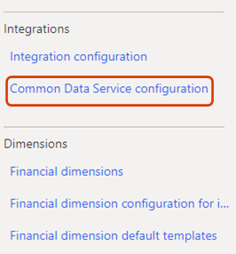
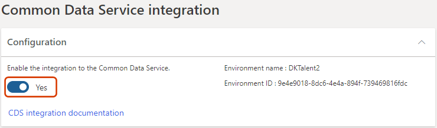
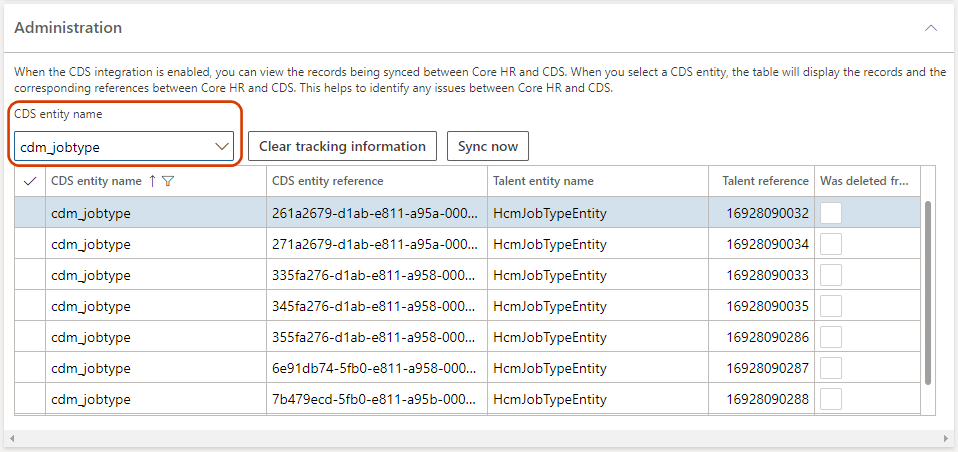
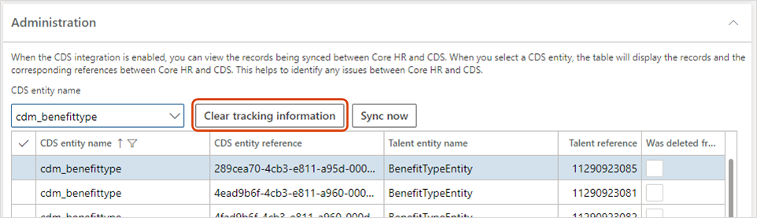
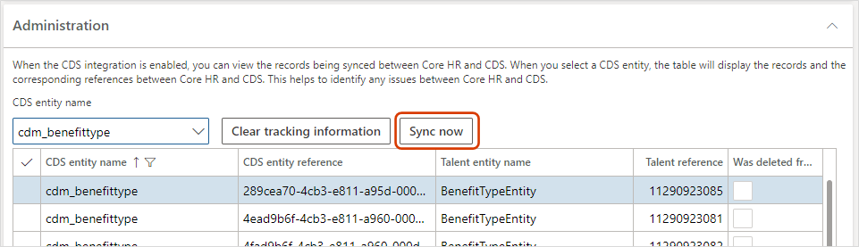

---
# required metadata

title: Configure Dataverse integration
description: You can turn integration between Dataverse and Dynamics 365 Human Resources on or off. You can also view synchronization details, clear tracking data, and resync an entity to help troubleshoot data issues between the two environments.
author: andreabichsel
manager: AnnBe
ms.date: 07/27/2020
ms.topic: article
ms.prod: 
ms.service: dynamics-human-resources
ms.technology: 

# optional metadata

ms.search.form: CDSIntegrationAdministration
# ROBOTS: 
audience: Application User
# ms.devlang: 
ms.reviewer: anbichse
# ms.tgt_pltfrm: 
ms.custom: 7521
ms.assetid: 
ms.search.region: Global
# ms.search.industry: 
ms.author: anbichse
ms.search.validFrom: 2020-02-03
ms.dyn365.ops.version: Human Resources

---

# Configure Dataverse integration

[!include [rename-banner](~/includes/cc-data-platform-banner.md)]

You can turn integration between Dataverse and Dynamics 365 Human Resources on or off. You can also view the synchronization details, clear tracking data, and resync an entity to help troubleshoot data issues between the two environments.

When you turn off integration, users can make changes in Human Resources or Dataverse, but those changes aren't synced between the two environments.

By default, integration between Human Resources and Dataverse is turned off.

You might want to turn off integration in these situations:

- You're filling in data through the Data Management Framework and must import the data multiple times to get it into a correct state.

- There are issues with data in either Human Resources or Dataverse. If you turn off integration, you can delete a record in one environment without deleting it in the other. When you turn integration back on, the record in the environment where it wasn't deleted sync to the environment where it was deleted. Synchronization begins the next time the **Common Data Service integration missed request sync** batch job runs.

> [!WARNING]
> When you turn off data integration, make sure that you don't edit the same record in both environments. When you turn integration back on, the record that you last edited will be synced. Therefore, if you didn't make the same changes to the record in both environments, data loss can occur.

## Access the Dataverse integration page

1. In the Human Resources instance where you want to view or configure settings for the integration with Dataverse, select the **System administration** tile.

    

2. Select the **Links** tab.

    

3. Under **Integrations**, select **Dataverse configuration**.

    

## Turn data integration between Human Resources and Dataverse on or off

- To turn on integration, set the **Enable the integration to the Dataverse** option to **Yes**.

    > [!NOTE]
    > When you turn on integration, data will be synced the next time that the **Dataverse integration missed request sync** batch job runs. All data should be available after the batch job is completed.

- To turn off integration, set the option to **No**.

> [!WARNING]
> We strongly recommend turning off Dataverse integration while performing data migration tasks. Large data uploads can significantly impact performance. For example, uploading 2000 workers can take several hours when integration is enabled, and less than one hour when it's disabled. The numbers provided in this example are for demonstration purposes only. The exact amount of time it takes to import records can vary greatly based on many factors.

## View data integration details

On the **Administration** FastTab of the **Dataverse integration** page, you can see how records are linked together between Human Resources and Dataverse.

- To view the records for an entity, select the entity in the **Dataverse entity name** field. The grid shows all the records that are linked to the selected entity.

> [!NOTE]
> Not all Dataverse entities are currently listed. Only entities that support the use of custom fields appear in the grid. New entities become available through continuous releases of Human Resources.

The grid includes the following fields:

- **CDS entity name** – The name of the entity in Dataverse.
- **CDS entity reference** – The identifier that Dataverse uses to identify a record. This value is equivalent to a Human Resources **RecId** value. You can find the identifier when you open the Dataverse entity in Microsoft Excel.
- **Human Resources entity name** – The entity that last synced data to Dataverse. The entity can have either the Dataverse prefix or another prefix.
- **Human Resources reference** – The **RecId** value that is associated with the record in Human Resources.
- **Was deleted from CDS** – A value that indicates whether the record was deleted from Dataverse.

## Remove the association of a record in Human Resources from Dataverse

If you experience issues during data synchronization between Human Resources and Dataverse, you might be able to resolve them by clearing the tracking and letting the tracking table be resynced. If you remove the association, and then change or delete a record in Dataverse, the changes won't be synced to Human Resources. If you make changes in Human Resources, a new tracking record is created, and the record is updated in Dataverse.

- To remove the association of a record between Human Resources and Dataverse, select the entity in the **CDS entity name** field, and then select **Clear tracking information**.

To run a full synchronization on the entity after you clear the tracking, see the next procedure.

## Sync an entity between Human Resources and Dataverse

Use this procedure when:

- Changes from Dataverse take too long to appear in Human Resources.

- You must refresh the tracking table after clearing the tracking.

To run a full synchronization on an entity between Human Resources and Dataverse:

1. Select the entity in the **CDS entity name** field.

2. Select **Sync now**.

