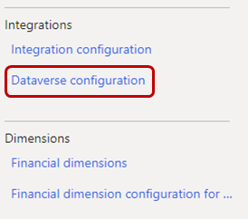

---
# required metadata

title: Configure Dataverse integration
description: This article describes the integration between Microsoft Dataverse and Dynamics 365 Human Resources. 
author: twheeloc
ms.date: 04/19/2024
ms.topic: article
# optional metadata

ms.search.form: CDSIntegrationAdministration
# ROBOTS: 
audience: Application User
# ms.devlang: 

# ms.tgt_pltfrm: 
ms.assetid: 
ms.search.region: Global
# ms.search.industry: 
ms.author: twheeloc
ms.search.validFrom: 2020-02-03
ms.dyn365.ops.version: Human Resources

---

# Configure Dataverse integration

[!include [Applies to Human Resources](../includes/applies-to-hr.md)]

You can turn integration between Microsoft Dataverse and Dynamics 365 Human Resources on or off. You can also view the synchronization details, clear tracking data, and resync a table to help troubleshoot data issues between the two environments.

> [!NOTE]
> For more information about Dataverse (formerly Common Data Service) and terminology updates, see [What is Microsoft Dataverse?](/powerapps/maker/data-platform/data-platform-intro)

When you turn off integration, users can make changes in Human Resources or Dataverse, but those changes aren't synced between the two environments.

By default, integration between Human Resources and Dataverse is turned off.

You might want to turn off integration in these situations:

- You're filling in data through the Data Management Framework and must import the data multiple times to get it into a correct state.

- There are issues with data in either Human Resources or Dataverse. If you turn off integration, you can delete a record in one environment without deleting it in the other. When you turn integration back on, the record in the environment where it wasn't deleted sync to the environment where it was deleted. Synchronization begins the next time the **Dataverse integration missed request sync** batch job runs.

> [!WARNING]
> When you turn off data integration, make sure that you don't edit the same record in both environments. When you turn integration back on, the record that you last edited will be synced. Therefore, if you didn't make the same changes to the record in both environments, data loss can occur.

## Access the Dataverse integration page

1. In the Human Resources instance where you want to view or configure settings for the integration with Dataverse, select the **System administration** tile.

    

2. Select the **Links** tab.

    

3. Under **Integrations**, select **Dataverse configuration**.

    

## Turn data integration between Human Resources and Dataverse on or off

- To turn on integration, set the **Enable Dataverse integration** option to **Yes** on the **Microsoft Dataverse integration** page.

    > [!NOTE]
    > When you turn on integration, data will be synced the next time that the **Dataverse integration missed request sync** batch job runs. All data should be available after the batch job is completed.

- To turn off integration, set the option to **No**.

> [!WARNING]
> We strongly recommend turning off Dataverse integration while performing data migration tasks. Large data uploads can significantly impact performance. For example, uploading 2000 workers can take several hours when integration is enabled, and less than one hour when it's disabled. The numbers provided in this example are for demonstration purposes only. The exact amount of time it takes to import records can vary greatly based on many factors.

## View data integration details

On the **Administration** FastTab of the **Microsoft Dataverse integration** page, you can see how rows are linked together between Human Resources and Dataverse.

- To view the rows for a table, select the table in the **Dataverse table** field. The grid shows all the rows that are linked to the selected table.

> [!NOTE]
> Not all Dataverse tables are currently listed. Only tables that support the use of custom fields appear in the grid. New tables become available through continuous releases of Human Resources.

The grid includes the following fields:

- **Dataverse table** – The name of the table in Dataverse.
- **Dataverse table reference** – The identifier that Dataverse uses to identify a record. This value is equivalent to a Human Resources **RecId** value. You can find the identifier when you open the Dataverse table in Microsoft Excel.
- **Human Resources entity name** – The Human Resources entity that last synced data to Dataverse. The entity can have either the Dataverse prefix or another prefix.
- **Human Resources reference** – The **RecId** value that is associated with the record in Human Resources.
- **Deleted from Dataverse** – A value that indicates whether the row was deleted from Dataverse.

> [!NOTE]
> Records in Human Resources correspond to rows in Dataverse.

## Remove the association of a Human Resources record from a Dataverse row

If you experience issues during data synchronization between Human Resources and Dataverse, you might be able to resolve them by clearing the tracking and letting the tracking table be resynced. If you remove the association, and then change or delete a row in Dataverse, the changes won't be synced to Human Resources. If you make changes in Human Resources, a new tracking record is created, and the row is updated in Dataverse.

- To remove the association of a Human Resources record and a Dataverse row, select the table in the **Dataverse table** field, and then select **Clear tracking information**.

To run a full synchronization on the table after you clear the tracking, see the next procedure.

## Sync a table between Human Resources and Dataverse

Use this procedure when:

- Changes from Dataverse take too long to appear in Human Resources.

- You must refresh the tracking table after clearing the tracking.

To run a full synchronization on a table between Human Resources and Dataverse:

1. Select the table in the **Dataverse table** field.

2. Select **Sync now**.

## See also

[Dataverse tables](hr-developer-entities.md) 
[Configure Dataverse virtual tables](hr-admin-integration-common-data-service-virtual-entities.md) 
[Human Resources virtual tables FAQ](dev-itpro/hr-admin-virtual-entity-faq.md) 
[What is Microsoft Dataverse?](/powerapps/maker/data-platform/data-platform-intro) 
[Terminology updates](/powerapps/maker/data-platform/data-platform-intro#terminology-updates)

[!INCLUDE[footer-include](../includes/footer-banner.md)]
