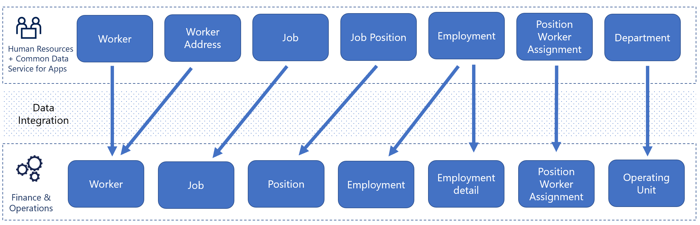

---
# required metadata

title: Configure integration with Finance
description: This topic describes the integration between Dynamics 365 Human Resources and Dynamics 365 Finance.
author: twheeloc  
ms.date: 08/19/2021
ms.topic: article
ms.prod: 
ms.technology: 

# optional metadata

ms.search.form: SystemAdministrationWorkspaceForm
# ROBOTS: 
audience: Application User
# ms.devlang: 
ms.search.scope: Human Resources
# ms.tgt_pltfrm: 
ms.custom: 7521
ms.assetid: 
ms.search.region: Global
# ms.search.industry: 
ms.author: twheeloc
ms.search.validFrom: 2020-02-03
ms.dyn365.ops.version: Human Resources

---

# Configure integration with Finance

[!INCLUDE [PEAP](../includes/peap-2.md)]

[!include [Applies to Human Resources](../includes/applies-to-hr.md)]

To integrate Dynamics 365 Human Resources with Dynamics 365 Finance, you can use the Human Resources to Finance template in [Data Integrator](/powerapps/administrator/data-integrator). The Human Resources to Finance template enables data flow for jobs, positions, and workers. The template allows data to flow from Human Resources into Finance, but doesn't allow data to flow from Finance into Human Resources.

The Human Resources to Finance solution provides the following types of data synchronization:

- Maintain jobs in Human Resources and sync them from Human Resources to Finance
- Maintain positions and position assignments in Human Resources and sync them from Human Resources to Finance
- Maintain employments in Human Resources and sync them from Human Resources to Finance
- Maintain workers and worker addresses in Human Resources and sync them from Human Resources to Finance

## System requirements for Human Resources

The integration solution requires the following versions of Human Resources and Finance: 

- Dynamics 365 Human Resources on Dataverse
- Dynamics 365 Finance version 7.2 and later

## Template and tasks

To access the Human Resources to Finance template.

1. Open [Power Apps Admin Center](https://admin.powerapps.com/). 

2. Select **Projects**, and then select **New project** in the upper-right corner. Create a new project for each legal entity that you want to integrate into in Finance.

3. Select the **Human Resources (Human Resources Dataverse to Finance)** to synchronize records from Human Resources to Finance.

The template uses the following underlying tasks to synchronize records from Human Resources to Finance:

- **Job Functions to Compensation Job Function**
- **Departments to Operating Unit**
- **Job Types to Compensation Job Type**
- **Jobs to Jobs**
- **Jobs to Job Detail**
- **Position Types to Position Type**
- **Job Positions to Base Position**
- **Job Positions to Position Details**
- **Job Positions to Position Durations**
- **Job Positions to Position Hierarchies**
- **Workers to Worker**
- **Employments to Employment**
- **Employments to Employment Detail**
- **Position Worker Assignment to Position Worker Assignments**
- **Worker Addresses to Worker Postal Address V2**

## Template mappings

In the following template mapping tables, the name of the task contains the entities used in each application. The source (Human Resources) is on the left and the destination (Finance) is on the right.

### Job Functions to Compensation Job Function

| Dataverse table (source) | Finance entity (destination) |
|-------------------------------------|---------------------------------------------|
| cdm_name (cdm_Job   Function Name)  | JOBFUNCTIONID   (JOBFUNCTIONID)            |
| cdm_description   (cdm_description) | DESCRIPTION   (DESCRIPTION)                 |

### Departments to Operating Unit

| Dataverse table (source)           | Finance entity (destination) |
|-----------------------------------------------|---------------------------------------------|
| cdm_name (cdm_name)                           | NAME (NAME)                                 |
| cdm_departmentnumber   (cdm_departmentnumber) | OPERATINGUNITNUMBER   (OPERATINGUNITNUMBER) |
|                                               | OPERATINGUNITTYPE   (OPERATINGUNITTYPE)     |
| cdm_description   (cdm_description)           | NAMEALIAS   (NAMEALIAS)                     |

### Job Types to Compensation Job Type

| Dataverse table (source)   | Finance entity (destination) |
|---------------------------------------|---------------------------------------------|
| cdm_name (cdm_name)                   | JOBTYPEID   (JOBTYPEID)                     |
| cdm_description   (cdm_description)   | DESCRIPTION   (DESCRIPTION)                 |
| cdm_exemptstatus   (cdm_exemptstatus) | EXEMPTSTATUS   (EXEMPTSTATUS)               |

### Jobs to Jobs

| Dataverse table (source)                           | Finance entity (destination)           |
|---------------------------------------------------------------|-------------------------------------------------------|
| cdm_name (cdm_name)                                           | JOBID (JOBID)                                         |
| cdm_maximumnumberofpositions   (cdm_maximumnumberofpositions) | MAXIMUMNUMBEROFPOSITIONS   (MAXIMUMNUMBEROFPOSITIONS) |
| cdm_allowedunlimitedpositions   (cdm_allowunlimitedpositions) | ALLOWUNLIMITEDPOSITIONS   (ALLOWUNLIMITEDPOSITIONS)   |
| cdm_description   (cdm_description)                           | DESCRIPTION   (DESCRIPTION)                           |
| cdm_jobdescription   (cdm_jobdescription)                     | JOBDESCRIPTION   (JOBDESCRIPTIONS)                    |

### Jobs to Job Detail

| Dataverse table (source)                             | Finance entity (destination) |
|-----------------------------------------------------------------|---------------------------------------------|
| cdm_name (cdm_name)                                             | JOBID (JOBID)                               |
| cdm_jobtypeid.cdm_name   (Job Type (Job Type Name))             | JOBTYPEID   (JOBTYPEID)                     |
| cdm_jobfunctionid.cdm_name   (Job Function (Job Function Name)) | FUNCTIONID   (FUCNTIONID)                   |
| cdm_validfrom   (Valid From)                                    | VALIDFROM   (VALIDFROM)                     |
| cdm_validto (Valid To)                                        | VALIDTO (VALIDTO)                           |
| cdm_defaultfulltimeequivalent   (Default Full-time Equivalent)   | FULLTIMEEQUIVALENT   (FULLTIMEEQUIVALENT)   |

### Position Types to Position Type

| Dataverse table (source)       | Finance entity (destination) |
|-------------------------------------------|---------------------------------------------|
| cdm_name (cdm_name)                       | POSITIONTYPEID   (POSITIONTYPEID)           |
| cdm_description   (cdm_description)       | DESCRIPTION   (DESCRIPTION)                 |
| cdm_classification   (cdm_classification) | CLASSIFICATION   (CLASSIFICATION)           |

### Job Positions to Base Position

| Dataverse table (source)           | Finance entity (destination) |
|-----------------------------------------------|---------------------------------------------|
| cdm_jobpositionnumber   (Job Position Number) | POSITIONID (POSITIONID)                      |

### Job Positions to Position Details

| Dataverse table (source)              | Finance entity (destination)       |
|--------------------------------------------------------------------------|---------------------------------------------------|
| cdm_jobpositionnumber  (Job Position Number)                            | POSITIONID (POSITIONID)                             |
| cdm_jobid.cdm_name   (Job (Name))                                        | JOBID (JOBID)                                    |
| cdm_description   (cdm_description)                                        | DESCRIPTION   (DESCRIPTION)                       |
| cdm_departmentid.cdm_departmentnumber   (Department (Department Number)) | DEPARTMENTNUMBER   (DEPARTMENTNUMBER)             |
| cdm_positiontypeid.cdm_name   (Position Type (Name))                     | POSITIONTYPEID   (POSITIONTYPEID)                 |
| cdm_avaialableforassignment   (Available for Assignment)                 | AVAILABLEFORASSIGNMENT   (AVAILABLEFORASSIGNMENT) |
| cdm_validfrom   (Valid From)                                            | VALIDFROM   (VALIDFROM)                           |
| cdm_validto (Valid To)                                                 | VALIDTO (VALIDTO)                               |
| cdm_fulltimeequivalent   (Full-time Equivalent)                           | FULLTIMEEQUIVALENT   (FULLTIMEEQUIVALENT)         |

### Job Positions to Position Durations

| Dataverse table (source)             | Finance entity (destination) |
|-------------------------------------------------|---------------------------------------------|
| cdm_jobpositionnumber   (Job Position Number)   | POSITIONID (POSITIONID)                      |
| Calculated   Activation (Calculated Activation) | VALIDFROM (VALIDFROM)                        |
| Calculated   Retirement (Calculated Retirement) | VALIDTO (VALIDTO)                         |

### Job Positions to Position Hierarchies

| Dataverse table (source)        | Finance entity (destination) |
|-----------------------------------------------------------------------------------------------|---------------------------------------------|
| cdm_jobpositionnumber   (Job Position Number)                                                 | POSITIONID(POSITIONID)                      |
| cdm_parentjobpositionid.cdmjobpositionnumber   (cdm_parentjobpositionid.cdmjobpositionnumber) | PARENTPOSITIONID (PARENTPOSITIONID)         |
| cdm_validfrom   (Valid From)                                                                  | VALIDFROM   (VALIDFROM)                     |
| cdm_validto (Valid   To)                                                                      | VALIDTO (VALIDTO)                           |
| HIERARCHYTYPENAME   (HIERARCHYTYPENAME)                                                       | HIERARCHYTYPENAME   (HIERARCHYTYPENAME)     |

### Workers to Worker
| Dataverse table (source)           | Finance entity (destination)       |
|-----------------------------------------------|---------------------------------------------------|
| cdm_birthdate   (cdm_birthdate)               | BIRTHDATE   (BIRTHDATE)                           |
| cdm_gender   (cdm_gender)                     | GENDER (GENDER)                                   |
| cdm_primaryaddress   (cdm_primaryaddress)     | PRIMARYCONTACTEMAIL   (PRIMARYCONTACTEMAIL )      |
| cdm_primarytelephone   (cdm_primarytelephone) | PRIMARYCONTACTPHONE   (PRIMARYCONTACTPHONE)       |
| cdm_facebookidentity   (cdm_facebookidentity) | PRIMARYCONTACTFACEBOOK   (PRIMARYCONTACTFACEBOOK) |
| cdm_twitteridentity   (cdm_twitteridentity)   | PRIMARYCONTACTTWITTER   (PRIMARYCONTACTTWITTER)   |
| cdm_linkedinIdentity   (cdm_linkedinIdentity) | PRIMARYCONTACTLINKEDIN   (PRIMARYCONTACTLINKEDIN) |
| cdm_websiteurl   (cdm_websiteurl)             | PRIMARYCONTACTURL   (PRIMARYCONTACTURL)           |
| cdm_firstname   (cdm_firstname)               | FIRSTNAME   (FIRSTNAME)                           |
| cdm_middlename   (cdm_middlename)             | MIDDLENAME   (MIDDLENAME)                         |
| cdm_lastname   (cdm_lastname)                 | LASTNAME (LASTNAME)                               |
| cdm_workernumber   (cdm_workernumber)         | PERSONNELNUMBER   (PERSONNELNUMBER)               |
| cdm_type (cdm_type)                           | WORKERTYPE   (WORKERTYPE)                         |
| cdm_state   (cdm_state)                       | WORKSTATUS   (WORKERSTATUS)                       |

### Employments to Employment

| Dataverse table (source)                             | Finance entity (destination) |
|-----------------------------------------------------------------|---------------------------------------------|
| cdm_employmentstartdate   (cdm_employmentstartdate)             | EMPLOYMENTSTARTDATE   (EMPLOYMENTSTARTDATE) |
| cdm_employmentenddate   (cdm_employmentenddate)                 | EMPLOYMENTENDDATE   (EMPLOYMENTENDDATE)     |
| cdm_workertype   (cdm_workertype)                               | WORKERTYPE   (WORKERTYPE)                   |
| cdm_workerid.cdm_workernumber   (cdm_workerid.cdm_workernumber) | PERSONNELNUMBER   (PERSONNELNUMBER)         |
| cdm_companyid.cdm_companycode   (cdm_companyid.cdm_companycode) | LEGALENTITYID   (LEGALENTITYID)             |

### Employments to Employment Detail

| Dataverse table (source)                             | Finance entity (destination)   |
|-----------------------------------------------------------------|-----------------------------------------------|
| cdm_employmentstartdate   (cdm_employmentstartdate)             | EMPLOYMENTSTARTDATE   (EMPLOYMENTSTARTDATE)   |
| cdm_employmentenddate   (cdm_employmentenddate)                 | EMPLOYMENTENDDATE   (EMPLOYMENTENDDATE)       |
| cdm_validfrom   (Valid From)                                    | VALIDFROM   (VALIDFROM)                       |
| cdm_validto (Valid   To)                                        | VALIDTO (VALIDTO)                             |
| cdm_workerstartdate   (cdm_workerstartdate)                     | WORKERSTARTDATE   (WORKERSTARTDATE)           |
| cdm_lastdateworked   (cdm_lastdateworked)                       | LASTDATEWORKED   (LASTDATEWORKED)             |
| cdm_transitiondate   (cdm_transitiondate)                       | TRANSITIONDATE   (TRANSITIONDATE)             |
| cdm_employerunitofnotice   (cdm_employerunitofnotice)           | EMPLOYERUNITOFNOTICE   (EMPLOYERUNITOFNOTICE) |
| cdm_workerunitofnotice   (cdm_workerunitofnotice)               | WORKERUNITOFNOTICE   (WORKERUNITOFNOTICE)     |
| cdm_workerid.cdm_workernumber   (cdm_workerid.cdm_workernumber) | PERSONNELNUMBER   (PERSONNELNUMBER)           |
| cdm_companyid.cdm_companycode   (cdm_companyid.cdm_companycode) | LEGALENTITYID   (LEGALENTITYID)               |
| cdm_employernoticeamount   (cdm_employernoticeamount)           | EMPLOYERNOTICEAMOUNT   (EMPLOYERNOTICEAMOUNT) |
| cdm_workernoticeamount   (cdm_workernoticeamount )              | WORKERNOTICEAMOUNT   (WORKERNOTICEAMOUNT)     |

### Position Worker Assignment to Position Worker Assignments

| Dataverse table (source)                             | Finance entity (destination)   |
|-----------------------------------------------------------------|-----------------------------------------------|
| cdm_workerid.cdm_workernumber   (cdm_workerid.cdm_workernumber) | PERSONNELNUMBER   (PERSONNELNUMBER)           |
| cdm_jobpositionnumber   (Job Position Number)                   | POSITIONID(POSITIONID)                        |
| cdm_validfrom   (Valid From)                                    | VALIDFROM   (VALIDFROM)                       |
| cdm_validto (Valid To)                                        | VALIDTO (VALIDTO)                             |

### Worker Addresses to Worker Postal Address V2

| Dataverse table (source)                             | Finance entity (destination)   |
|-----------------------------------------------------------------|-----------------------------------------------|
| cdm_workerid.cdm_workernumber   (cdm_workerid.cdm_workernumber) | PERSONNELNUMBER   (PERSONNELNUMBER)           |
| cdm_addresstype   (cdm_addresstype)                             | ADDRESSLOCATIONROLES   (ADDRESSLOCATIONROLES) |
| cdm_line1   (cdm_line1)                                         | ADDRESSSTREET   (ADDRESSSTREET)               |
| cdm_city (cdm_city)                                             | ADDRESSCITY   (ADDRESSCITY)                   |
| cdm_stateorprovince   (cdm_stateorprovince)                     | ADDRESSSTATE   (ADDRESSSTATE)                 |
| cdm_postalcode   (cdm_postalcode)                               | ADDRESSZIPCODE(ADDRESSZIPCODE)                |
| cdm_countryregion   (cdm_countryregion)                         | ADDRESSCOUNTRYREGION(ADDRESSCOUNTRYREGION)    |
| cdm_addressnumber   (cdm_addressnumber)                         | ADDRESSLOCATIONID(ADDRESSLOCATIONID)          |
| cdm_ispreferred   (cdm_ispreferred)                             | ISPRIMARY   (ISPRIMARY)                       |
| cdm_county   (cdm_county)                                       | ADDRESSCOUNTYID(ADDRESSCOUNTYID)              |
| cdm_addresstype   (cdm_addresstype)                             | ADDRESSDESCRIPTION(ADDRESSDESCRIPTION)        |

## Integration considerations

The integration from Human Resources to Finance attempts to match records based on the ID. If the records match, the Data Integrator overwrites the data in Finance with the values in Human Resources. However, an issue may occur if logically these are different records and the same ID was generated in either Human Resources or Finance based on the respective number sequence.

This issue can occur with **Worker**, which uses **Personnel number** to make the match, and **Positions**. Jobs don't use number sequences. As a result, if the same job ID exists in both Human Resources and Finance, the Human Resources information overwrites the Dynamics 365 Finance information. 

To prevent issues with duplicate IDs, you can either add a prefix on the [number sequence](/dynamics365/unified-operations/fin-and-ops/organization-administration/number-sequence-overview?toc=%2fdynamics365%2funified-operations%2ftalent%2ftoc.json), or set a beginning number on the number sequence that is beyond the range of the other system. 

The location ID used for worker address isn't part of a number sequence. When integrating a worker address from Human Resources to Finance, if the worker address already exists in Finance, a duplicate address record may be created. 

The following illustration shows an example of a template mapping in Data Integrator. 

[!INCLUDE[footer-include](../includes/footer-banner.md)]
