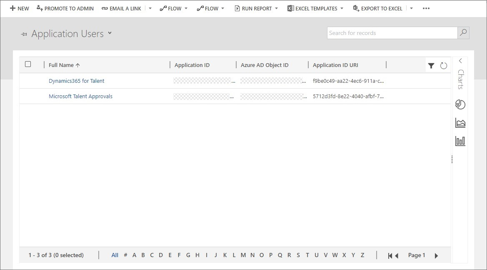

---
# required metadata

title: Integrate with LinkedIn Talent Hub
description: This topic explains how to set up integration between Microsoft Dynamics 365 Human Resources and LinkedIn Talent Hub.
author: jaredha
ms.date: 10/20/2020
ms.topic: article
ms.prod: 
ms.technology: 

# optional metadata

ms.search.form: 
# ROBOTS: 
audience: Application User
# ms.devlang: 
ms.search.scope: Human Resources
# ms.tgt_pltfrm: 
ms.custom: 7521
ms.assetid: 
ms.search.region: Global
# ms.search.industry: 
ms.author: anbichse
ms.search.validFrom: 2020-10-20
ms.dyn365.ops.version: Human Resources

---

# Integrate with LinkedIn Talent Hub

[!include [Applies to Human Resources](../includes/applies-to-hr.md)]

> [!IMPORTANT]
> The integration between Dynamics 365 Human Resources and LinkedIn Talent Hub described in this topic will be retired on December 31, 2021. The integration service will no longer be available after this date. Organizations not already using the integration service will not be able to implement the service prior to retirement.

[LinkedIn Talent Hub](https://business.linkedin.com/talent-solutions/talent-hub) is an applicant tracking system (ATS) platform. It lets you source, manage, and hire employees all in one place. By integrating Microsoft Dynamics 365 Human Resources with LinkedIn Talent Hub, you can easily create employee records in Human Resources for applicants who have been hired for a position.

## Setup

A system administrator must complete setup tasks to enable integration with LinkedIn Talent Hub. First, in the Power Apps environment, you must set up a user and security role to grant LinkedIn Talent Hub the appropriate permissions to write data into Human Resources.

### Link your environment to LinkedIn Talent Hub

1. Open [LinkedIn Talent Hub](https://business.linkedin.com/talent-solutions/talent-hub).

2. On the user drop-down menu, select **Product Settings**.

3. In the left navigation pane, in the **Advanced** section, select **Integrations**.

4. Select **Authorize** for the Microsoft Dynamics 365 Human Resources integration.

5. On the **Dynamics 365 Human Resources** page, select the environment to link LinkedIn Talent Hub to, and then select **Link**.

    

    > [!NOTE]
    > You can link only to environments where your user account has administrator access to both the Human Resources environment and the associated Power Apps environment. If no environments are listed on the Human Resources link page, make sure that you have licensed Human Resources environments on the tenant, and that the user that you signed in to the link page as has administrator permissions to both the Human Resources environment and the Power Apps environment.

### Create a Power Apps security role

1. Open the [Power Platform admin center](https://admin.powerplatform.microsoft.com).

2. In the **Environments** list, select the environment that is associated with the Human Resources environment that you want to link your instance of LinkedIn Talent Hub to.

3. Select **Settings**.

4. Expand the **Users + Permissions** node, and select **Security Roles**.

5. On the **Security Roles** page, on the toolbar, select **New role**.

6. On the **Details** tab, enter a name for the role, such as **LinkedIn Talent Hub HRIS Integration**.

7. On the **Customization** tab, select organization-level **Read** permission for the following entities:

    - Entity
    - Field
    - Relationship

8. Save and close the security role.

### Create a Power Apps application user

An application user must be created for the LinkedIn Talent Hub adapter to grant permissions to the adapter to write candidate records into the Power Apps environment.

1. Open the [Power Platform admin center](https://admin.powerplatform.microsoft.com).

2. In the **Environments** list, select the environment that is associated with the Human Resources environment that you want to link your instance of LinkedIn Talent Hub to.

3. Select **Settings**.

4. Expand the **Users + Permissions** node, and select **Users**.

5. Select **Manage users in Dynamics 365**.

6. Use the drop-down menu above the list to change the view from the default **Enabled Users** view to **Application Users**.

    

7. On the toolbar, select **New**.

8. On the **New user** page, follow these steps:

    1. Change the value of the **User type** field to **Application User**.
    2. Set the **User Name** field to **Dynamics365 HR LinkedIn HRIS Integration**.
    3. Set the **Application ID** field to **3a225c96-d62a-44ce-b3ec-bd4e8e9befef**.
    4. Enter any value in the **First Name**, **Last Name**, and **Primary Email** fields.
    5. On the toolbar, select **Save \& Close**.

### Assign a security role to the new user

After you save and close the new application user in the previous section, you're returned to the **Users list** page.

1. On the **Users list** page, change the view to **Application Users**.

2. Select the application user that you created in the previous section.

3. On the toolbar, select **Manage Roles**.

4. Select the security role that you created earlier for the integration.

5. Select **OK**.

### Add an Azure Active Directory app in Human Resources

1. In Dynamics 365 Human Resources, open the **Azure Active Directory applications** page.
2. Add a new record to the list, and set the following fields:

    - **Client ID**: Enter **3a225c96-d62a-44ce-b3ec-bd4e8e9befef**.
    - **Name**: Enter the name of the Power Apps security role that you created earlier, such as **LinkedIn Talent Hub HRIS Integration**.
    - **User ID**: Select a user who has permissions to write data in Personnel Management.

### Create the table in Dataverse

> [!IMPORTANT]
> The integration with LinkedIn Talent Hub depends on virtual tables in Dataverse for Human Resources. As a prerequisite for this step in the setup, you must configure virtual tables. For information about how to configure virtual tables, see [Configure Dataverse virtual tables](./hr-admin-integration-common-data-service-virtual-entities.md).

1. In Human Resources, open the **Dataverse integration** page.

2. Select the **Virtual tables** tab.

3. Filter the entity list by entity label to find **LinkedIn exported candidate**.

4. Select the entity, and then select **Generate/refresh**.

## Exporting candidate records

After the setup is completed, recruiters and human resources (HR) professionals can use the **Export to HRIS** function in LinkedIn Talent Hub to export hired candidate records from LinkedIn Talent Hub to Human Resources.

### Export records from LinkedIn Talent Hub

After a candidate has moved through the recruiting process and has been hired, you can export the candidate record from LinkedIn Talent Hub to Human Resources.

1. In LinkedIn Talent Hub, open the project that you hired the new employee for.

2. Select a candidate record.

3. Select **Change stage**, and then select **Hired**.

4. On the ellipsis menu (**...**) for the candidate, select **Export to HRIS**.

5. In the **Export to HRIS** pane, enter the information that must be exported:

    - In the **HRIS provider** field, select **Microsoft Dynamics 365 Human Resources**.
    - In the **Start date** field, select a value for the new employee.
    - In the **Job title** field, enter a job title for the new employee's job.
    - In the **Location** field, enter the location where the employee will be based.
    - Enter or verify the employee's email address.

## Complete onboarding in Human Resources

Candidate records that are exported from LinkedIn Talent Hub to Human Resources appear in the **Candidates to hire** section of the **Personnel management** page.

1. In Human Resources, open the **Personnel management** page.

2. In the **Candidates to hire** section, select **Hire** for the selected candidate.

3. In the **Hire new worker** dialog box, review the record, and add any required information. You can also select the position number that the candidate has been hired for.

After the required information has been entered, you can continue with your standard processes for creating employee records and onboarding employees.

The following details are imported and included on the new employee record:

- First name
- Last name
- Employment start date
- Email address
- Phone number

## See also

[Configure Dataverse virtual tables](./hr-admin-integration-common-data-service-virtual-entities.md) 
[What is Microsoft Dataverse?](/powerapps/maker/common-data-service/data-platform-intro)

[!INCLUDE[footer-include](../includes/footer-banner.md)]
