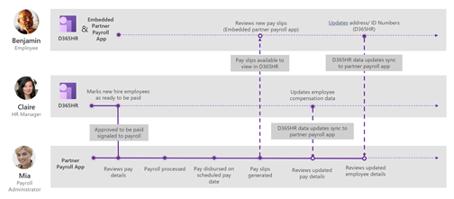
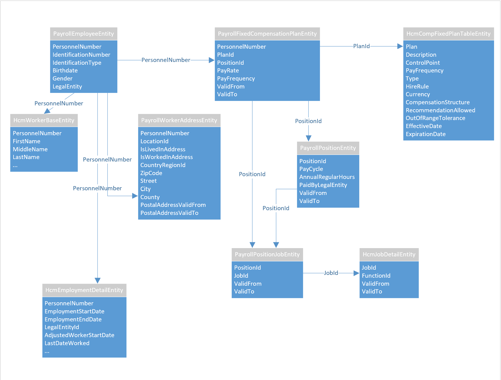

---
# required metadata

title: Payroll integration API introduction
description: This article describes the Dynamics 365 Human Resources Payroll integration API.
author: twheeloc
ms.date: 02/03/2021
ms.topic: article
ms.prod: 
ms.technology: 

# optional metadata

# ms.search.form: 
audience: Application User
# ms.devlang: 
# ms.tgt_pltfrm: 
ms.collection: get-started
ms.assetid: 
ms.search.region: Global
# ms.search.industry: 
ms.author: jcart
ms.search.validFrom: 2021-02-03
ms.dyn365.ops.version: Human Resources
---

# Payroll integration API introduction

[!INCLUDE [PEAP](../includes/peap-1.md)]

[!include [Applies to Human Resources](../includes/applies-to-hr.md)]

This document describes the Dynamics 365 Human Resources Payroll integration API. The API enables streamlined end-to-end integrations between Human Resources and partnering payroll systems. The integrated experience begins in Human Resources with the employee profile, salary and deduction, and contribution information. When you hire an employee and enter the required profile and pay information into Human Resources, the payroll system pulls this information to use when processing payroll. Any updates made to the employee or pay information are also pulled for use in later pay runs.

To enable the integration, Human Resources includes the following components:

- [Functionality to mark an employee as ready to pay.](hr-compensation-payroll.md)
- An integration API opening up the new functionality to integrating applications.

## Microsoft Dataverse

This API is built on Microsoft Dataverse (formerly Common Data Service). All RESTful interaction with this API is done via the Microsoft Dataverse Web API, which uses OData. This API is a subset of the Dataverse Web API. The Dataverse Web API defines characteristics such as authentication, SLAs, batch, concurrency control, and error handling.

For more general information about the Microsoft Dataverse Web API, see:

- [What is Microsoft Dataverse?](/powerapps/maker/data-platform/data-platform-intro)
- [Use the Microsoft Dataverse Web API](/powerapps/developer/data-platform/webapi/overview)
- [Microsoft Dataverse developer guide](/powerapps/developer/data-platform)

This documentation includes details and developer guidance for using the Dataverse Web API, including the following topics:

- [Authenticate to Microsoft Dataverse with the Web API](/powerapps/developer/data-platform/webapi/authenticate-web-api)
- [Perform operations using the Web API](/powerapps/developer/data-platform/webapi/perform-operations-web-api)
- [Use Postman with the Web API](/powerapps/developer/data-platform/webapi/use-postman-web-api)
- [Use change tracking to synchronize data with external systems](/powerapps/developer/data-platform/use-change-tracking-synchronize-data-external-systems)

### Virtual tables for Human Resources in Dataverse

The endpoints for the Payroll integration API use the virtual table platform capabilities of Microsoft Dataverse. By default, the virtual tables and their associated API endpoints aren't deployed for Human Resources environments, enabling organizations to determine which OData endpoints will be exposed for the environment. To use the API, the virtual tables for the Human Resources entities must be generated for the environment.

For information on generating the virtual tables for the API, see [Configure Dataverse virtual tables](./hr-admin-integration-common-data-service-virtual-entities.md).

## Data model

The following diagram illustrates relationships within the API. Several types have foreign keys to other, pre-existing entities in Human Resources that aren't illustrated here. This document provides information on entities that are specific to payroll integration scenarios. However, there are many other entities in the Dataverse Web API for Human Resources that may also be relevant to your integration. Some of these entities are referenced in foreign key relationships or navigation properties.

## Payroll employee and related entities

Entities:

- [Payroll employee](hr-admin-integration-payroll-api-payroll-employee.md)
- [Payroll worker address](hr-admin-integration-payroll-api-payroll-worker-address.md)
- [Payroll fixed compensation plan](hr-admin-integration-payroll-api-payroll-fixed-compensation-plan.md)
- [Payroll variable compensation plan](hr-admin-integration-payroll-api-payroll-variable-compensation-plan.md)
- [Payroll position job](hr-admin-integration-payroll-api-payroll-position-job.md)
- [Payroll position](hr-admin-integration-payroll-api-payroll-position.md)

## See also

[Generate and review payroll entities](hr-admin-integration-payroll-api-generate-review-entities.md) 
[Configure Human Resources parameters](hr-setup-parameters.md) 
[Configure Human Resources shared parameters](hr-setup-shared-parameters.md) 
[What is Microsoft Dataverse?](/powerapps/maker/data-platform/data-platform-intro) 
[Use the Microsoft Dataverse Web API](/powerapps/developer/data-platform/webapi/overview) 

[!INCLUDE[footer-include](../includes/footer-banner.md)]
