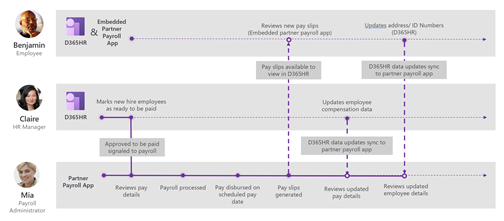

---
# required metadata

title: Payroll integration API introduction
description: This article describes the Dynamics 365 Human Resources Payroll integration API.
author: avanish2821
ms.date: 09/28/2026
ms.topic: concept-article
# optional metadata

# ms.search.form: 
audience: Application User
# ms.devlang: 
# ms.tgt_pltfrm: 
ms.collection: get-started
ms.assetid: 
ms.search.region: Global
# ms.search.industry: 
ms.author: twheeloc
ms.search.validFrom: 2021-02-03
ms.dyn365.ops.version: Human Resources
ai-usage: ai-assisted
---

# Payroll integration API introduction

[!INCLUDE [banner](../includes/banner.md)]

>[!NOTE]
>For the payroll integration to work for customers using the mshr entities for Ceredian Dayforce, navigate to [API-based payroll integration with Ceridian Dayforce](./hr-admin-payroll-api-integration-dayforce.md).

[!include [Applies to Human Resources](../includes/applies-to-hr.md)]

This article describes the Dynamics 365 Human Resources Payroll integration API. The API enables streamlined end-to-end integrations between Human Resources and partnering payroll systems. The integrated experience begins in Human Resources with the employee profile, salary and deduction, and contribution information. When you hire an employee and enter the required profile and pay information into Human Resources, the payroll system pulls this information to use when processing payroll. Any updates made to the employee or pay information are also pulled for use in later pay runs.

### Technical architecture and flow

The following diagram illustrates the technical integration flow from Finance and Operations through Microsoft Dataverse to the external payroll provider:

:::image type="content" source="media/hr-admin-integration-payroll-api-introduction/payroll-integration-api-setup-flow.png" alt-text="Diagram showing the payroll integration flow from Finance and Operations data entities through Dataverse setup to OData APIs for payroll providers."

## Data model

The following diagram illustrates relationships within the API. Several types have foreign keys to other, pre-existing entities in Human Resources that aren't illustrated here. This document provides information on entities that are specific to payroll integration scenarios. However, there are many other entities in the Dataverse Web API for Human Resources that might also be relevant to your integration. Some of these entities are referenced in foreign key relationships or navigation properties.

[:::image type="content" source="media/hr-admin-payroll-api-data-model.png" alt-text="Diagram of payroll API entities linked by PersonnelNumber, PositionId, PlanId, and JobId, including employee, position, and compensation plan.":::](media/hr-admin-payroll-api-data-model.png#lightbox)

## Microsoft Dataverse

This API is built on Microsoft Dataverse using virtual tables. You perform all RESTful interaction with this API through the Microsoft Dataverse Web API (OData), which handles authentication, SLAs, batch processing, concurrency control, and change tracking.

For more information about the Dataverse Web API, see:

- [What is Microsoft Dataverse?](/powerapps/maker/data-platform/data-platform-intro)
- [Use the Microsoft Dataverse Web API](/powerapps/developer/data-platform/webapi/overview)
- [Authenticate to Microsoft Dataverse with the Web API](/powerapps/developer/data-platform/webapi/authenticate-web-api)
- [Use change tracking to synchronize data with external systems](/powerapps/developer/data-platform/use-change-tracking-synchronize-data-external-systems)

## Enable the integration

To enable and use the Payroll integration API, complete the following four steps in order:

[Step 1: Configure the batch job](#step-1-configure-the-batch-job) 
[Step 2: Enable virtual entities](#step-2-enable-virtual-entities) 
[Step 3: Register the Azure AD app](#step-3-register-the-azure-ad-app) 
[Step 4: Add the app to Dataverse](#step-4-add-the-app-to-dataverse) 

### Step 1: Configure the batch job

Before the virtual entities can synchronize data, schedule the payroll data sync batch job in Dynamics 365 Human Resources. This job prepares and stages payroll data for integration.

For detailed instructions on configuring batch recurrence and selecting entities, see [Schedule Payroll Data sync job](hr-admin-integration-payroll-api-data-sync-job.md).

### Step 2: Enable virtual entities

The endpoints for the Payroll integration API use the virtual table capabilities of Microsoft Dataverse. By default, the system doesn't deploy the virtual tables and their associated API endpoints for Human Resources environments.

1. Ensure the system is configured with the required virtual table solutions and data sources. For more information, see [Configure Dataverse virtual tables](hr-admin-integration-common-data-service-virtual-entities.md) or [Admin reference for virtual entities](../fin-ops-core/dev-itpro/power-platform/admin-reference.md).
2. Sign in to the [Power Apps maker portal](https://make.powerapps.com/).
3. In the upper-right corner, select the appropriate environment.
4. In the left navigation pane, select **Tables**, and then select **All**.
5. Filter the **Table** column for **Available Finance and Operations Entity**.
6. Select the table and select **Edit** on the toolbar.
7. Search for the payroll integration entities (prefixed with `PayIntV`). Set both **Visible** and **Change tracking** to **Yes**. If an error occurs, select the row and select **Edit row using form** on the toolbar to update the settings.
8. Repeat these steps for all required payroll integration entities.

### Step 3: Register the Azure AD app

Register an application in Azure Active Directory (Microsoft Entra ID) so that the Microsoft identity platform can provide authentication and authorization services for API calls.

1. Open the [Azure portal](https://portal.azure.com/).
2. In the Azure services list, select **App registrations**.
3. Select **New registration**.
4. In the **Name** field, enter a descriptive name for the app (for example, **Dynamics 365 Human Resources Virtual Tables**).
5. Select **Register**.
6. Note the **Application (client) ID** displayed in the app registration's **Overview** pane.
7. In the left navigation pane, select **Certificates and secrets**.
8. In the **Client secrets** section, select **New client secret**.
9. Enter a description, choose an expiration duration, and select **Add**.
10. Record the secret's **Value**.
    > [!IMPORTANT]
    > Record the secret's value immediately. It won't be displayed again after you navigate away from this page.

For more information, see [Quickstart: Register an application with the Microsoft identity platform](/entra/identity-platform/quickstart-register-app).

### Step 4: Add the app to Dataverse

Add the registered application as an application user in Dataverse and link it in Finance and Operations:

1. Sign in to the [Power Platform admin center](https://admin.powerplatform.microsoft.com/).
2. In the navigation pane, select **Manage** > **Environments**, and select your environment.
3. Select **Settings** > **Users + permissions** > **Application users**.
4. Select **New app user**, select **Add an app**, and select the **Application (client) ID** registered in Step 3.
5. Select the business unit, and assign the **Basic User** and **Finance and operations basic user** security roles to the app user.
6. In the Finance and Operations application, go to **System administration** > **Setup** > **Microsoft Entra ID applications**.
7. Select **New**, and enter the **Client ID** and **Name** of the application.
8. In the **User ID** field, select a user who has permission to read and write the payroll integration entities, and save the record.

When you complete the setup, the OData endpoints are ready for the payroll provider to read and write data. For details on the available entities and their schemas, see [Payroll employee and related entities](#payroll-employee-and-related-entities).

## Payroll employee and related entities

Entities:

- [Payroll employee](payroll-integration-payroll-employee.md)
- [Payroll worker address](payroll-integration-payroll-worker-address-current.md)
- [Payroll fixed compensation plan](payroll-integration-compensation-fixed-employee.md)
- [Payroll variable compensation enrollment](payroll-integration-variable-compensation-enrollment.md)
- [Payroll position job](payroll-integration-payroll-position-job.md)
- [Payroll position](payroll-integration-position.md)

## See also

[Configure Human Resources parameters](hr-setup-parameters.md) 
[Configure Human Resources shared parameters](hr-setup-shared-parameters.md) 
[What is Microsoft Dataverse?](/powerapps/maker/data-platform/data-platform-intro) 
[Use the Microsoft Dataverse Web API](/powerapps/developer/data-platform/webapi/overview) 

[!INCLUDE[footer-include](../includes/footer-banner.md)]
