---
# required metadata

title: Create a recurring data export app
description: This topic describes how to create a Microsoft Azure logic app that exports data from Microsoft Dynamics 365 Human Resources on a recurring schedule.
author: twheeloc    
ms.date: 08/19/2021
ms.topic: article
ms.prod: 
ms.technology: 

# optional metadata

ms.search.form: 
# ROBOTS: 
audience: Application User
# ms.devlang: 
ms.search.scope: Human Resources
# ms.tgt_pltfrm: 
ms.custom: 7521
ms.assetid: 
ms.search.region: Global
# ms.search.industry: 
ms.author: twheeloc
ms.search.validFrom: 2020-02-03
ms.dyn365.ops.version: Human Resources

---

# Create a recurring data export app


[!INCLUDE [PEAP](../includes/peap-1.md)]

[!include [Applies to Human Resources](../includes/applies-to-hr.md)]

This topic describes how to create a Microsoft Azure logic app that exports data from Microsoft Dynamics 365 Human Resources on a recurring schedule. The tutorial takes advantage of Human Resources' DMF package REST application programming interface (API) to export the data. After the data has been exported, the logic app saves the exported data package to a Microsoft OneDrive for Business folder.

## Business scenario

In one typical business scenario for Microsoft Dynamics 365 integrations, data must be exported to a downstream system on a recurring schedule. This tutorial shows how to export all worker records from Microsoft Dynamics 365 Human Resources and save the list of workers in a OneDrive for Business folder.

> [!TIP]
> The specific data that is exported in this tutorial and the destination of the exported data are only examples. You can easily change them to meet your business needs.

## Technologies used

This tutorial uses the following technologies:

- **[Dynamics 365 Human Resources](https://dynamics.microsoft.com/talent/overview/)** – The master data source for workers that will be exported.
- **[Azure Logic Apps](https://azure.microsoft.com/services/logic-apps/)** – The technology that provides orchestration and scheduling of the recurring export.

    - **[Connectors](/azure/connectors/apis-list)** – The technology that is used to connect the logic app to the required endpoints.

        - [HTTP with Azure AD](/connectors/webcontents/) connector
        - [OneDrive for Business](/azure/connectors/connectors-create-api-onedriveforbusiness) connector

- **[DMF package REST API](../fin-ops-core/dev-itpro/data-entities/data-management-api.md)** – The technology that is used to trigger the export and monitor its progress.
- **[OneDrive for Business](https://onedrive.live.com/about/business/)** – The destination for the exported workers.

## Prerequisites

Before you begin the exercise in this tutorial, you must have the following items:

- A Human Resources environment that has admin-level permissions in the environment
- An [Azure subscription](https://azure.microsoft.com/free/) to host the logic app

## The exercise

At the end of this exercise, you will have a logic app that is connected to your Human Resources environment and your OneDrive for Business account. The logic app will export a data package from Human Resources, wait for the export to be completed, download the exported data package, and save the data package in the OneDrive for Business folder that you specified.

The completed logic app will resemble the following illustration.

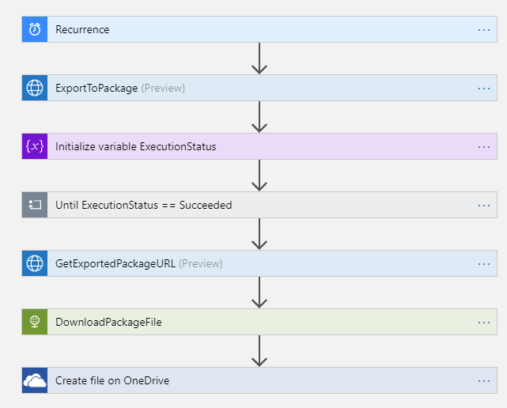

### Step 1: Create a data export project in Human Resources

In Human Resources, create a data export project that exports workers. Name the project **Export Workers**, and make sure that the **Generate data package** option is set to **Yes**. Add a single entity (**Worker**) to the project, and select the format to export in. (Microsoft Excel format is used in this tutorial.)

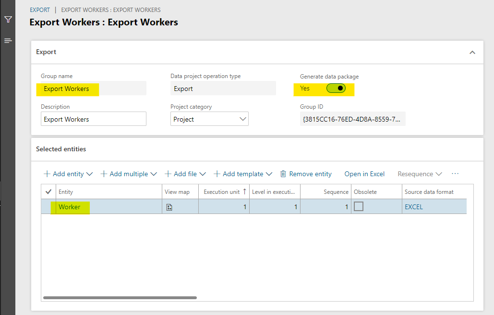

> [!IMPORTANT]
> Remember the name of the data export project. You will need it when you create the logic app in the next step.

### Step 2: Create the logic app

The bulk of the exercise involves creating the logic app.

1. In the Azure portal, create a logic app.

    

2. In the Logic Apps Designer, start with a blank logic app.
3. Add a [Recurrence Schedule trigger](/azure/connectors/connectors-native-recurrence) to run the logic app every 24 hours (or according to a schedule of your choice).

    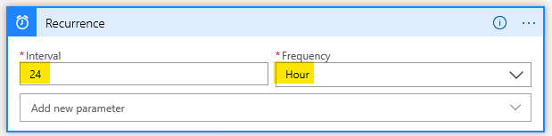

4. Call the [ExportToPackage](../fin-ops-core/dev-itpro/data-entities/data-management-api.md#exporttopackage) DMF REST API to schedule the export of your data package.

    1. Use the **Invoke an HTTP request** action from the HTTP with Azure AD connector.

        - **Base Resource URL:** The URL of your Human Resources environment (Don't include path/namespace information.)
        - **Azure AD Resource URI:** `http://hr.talent.dynamics.com`

        > [!NOTE]
        > The Human Resources service doesn't yet provide a connector that exposes all the APIs that make up the DMF package REST API, such as **ExportToPackage**. Instead, you must call the APIs by using raw HTTPS requests through the HTTP with Azure AD connector. This connector uses Azure Active Directory (Azure AD) for authentication and authorization to Human Resources.

        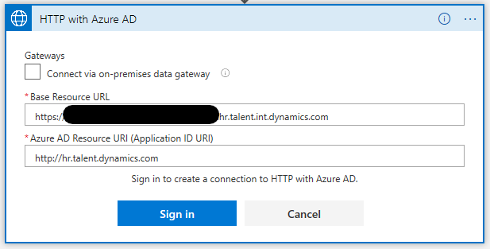

    2. Sign in to your Human Resources environment through the HTTP with Azure AD connector.
    3. Set up an HTTP **POST** request to call the **ExportToPackage** DMF REST API.

        - **Method:** POST
        - **Url of the request:** https://\<hostname\>/namespaces/\<namespace\_guid\>/data/DataManagementDefinitionGroups/Microsoft.Dynamics.DataEntities.ExportToPackage
        - **Body of the request:**

            ```JSON
            {
                "definitionGroupId":"Export Workers",
                "packageName":"talent_package.zip",
                "executionId":"",
                "reExecute":false,
                "legalEntityId":"USMF"
            }
            ```

        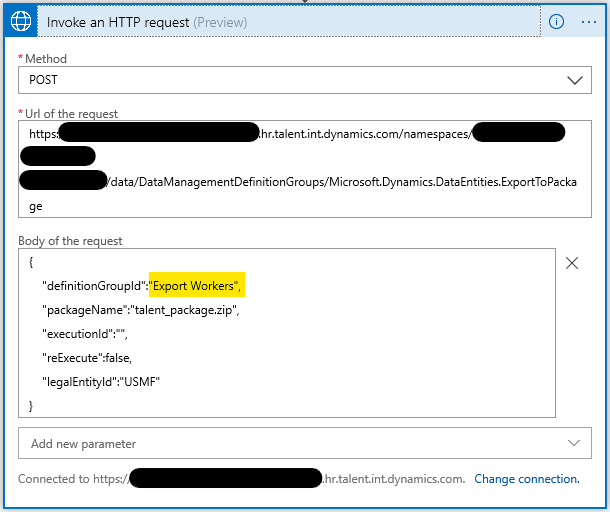

    > [!TIP]
    > You might want to rename each step so that it's more meaningful than the default name, **Invoke an HTTP request**. For example, you can rename this step **ExportToPackage**.

5. [Initialize a variable](/azure/logic-apps/logic-apps-create-variables-store-values#initialize-variable) to store the execution status of the **ExportToPackage** request.

    

6. Wait until the execution status of the data export is **Succeeded**.

    1. Add an [Until loop](/azure/logic-apps/logic-apps-control-flow-loops#until-loop) that repeats until the value of the **ExecutionStatus** variable is **Succeeded**.
    2. Add a **Delay** action that waits five seconds before it polls for the current execution status of the export.

        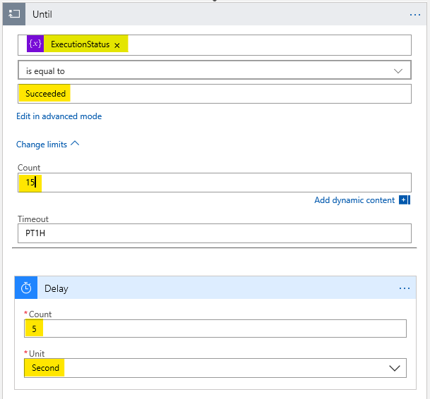

        > [!NOTE]
        > Set the limit count to **15** to wait a maximum of 75 seconds (15 iterations × 5 seconds) for the export to be completed. If your export takes more time, adjust the limit count as appropriate.        

    3. Add an **Invoke HTTP request** action to call the [GetExecutionSummaryStatus](../fin-ops-core/dev-itpro/data-entities/data-management-api.md#getexecutionsummarystatus) DMF REST API, and set the **ExecutionStatus** variable to the result of the **GetExecutionSummaryStatus** response.

        > This sample doesn't do error checking. The **GetExecutionSummaryStatus** API can return non-successful terminal states (that is, states other than **Succeeded**). For more information, see the [API documentation](../fin-ops-core/dev-itpro/data-entities/data-management-api.md#getexecutionsummarystatus).

        - **Method:** POST
        - **Url of the request:** https://\<hostname\>/namespaces/\<namespace\_guid\>/data/DataManagementDefinitionGroups/Microsoft.Dynamics.DataEntities.GetExecutionSummaryStatus
        - **Body of the request:** body('Invoke\_an\_HTTP\_request')?['value']

            > [!NOTE]
            > You might have to enter the **Body of the request** value either in code view or in the function editor in the designer.

        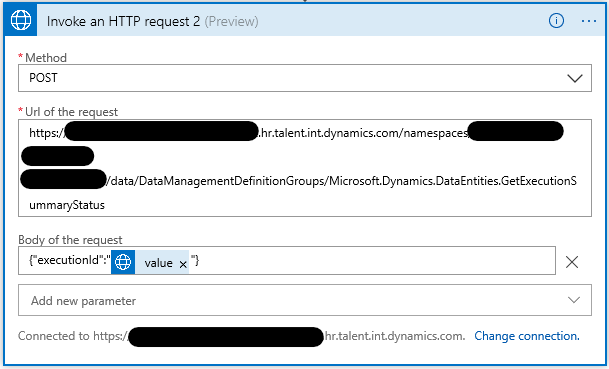

        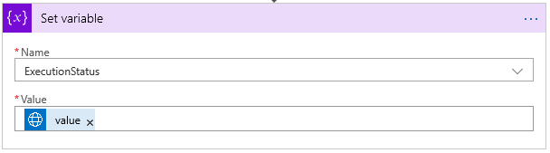

        > [!IMPORTANT]
        > The value for the **Set variable** action (**body('Invoke\_an\_HTTP\_request\_2')?['value']**) will differ from the value for the **Invoke an HTTP request 2** body value, even though the designer will show the values in the same way.

7. Get the download URL of the exported package.

    - Add an **Invoke HTTP request** action to call the [GetExportedPackageUrl](../fin-ops-core/dev-itpro/data-entities/data-management-api.md#getexportedpackageurl) DMF REST API.

        - **Method:** POST
        - **Url of the request:** https://\<hostname\>/namespaces/\<namespace\_guid\>/data/DataManagementDefinitionGroups/Microsoft.Dynamics.DataEntities.GetExportedPackageUrl
        - **Body of the request:** {"executionId": body('GetExportedPackageURL')?['value']}

        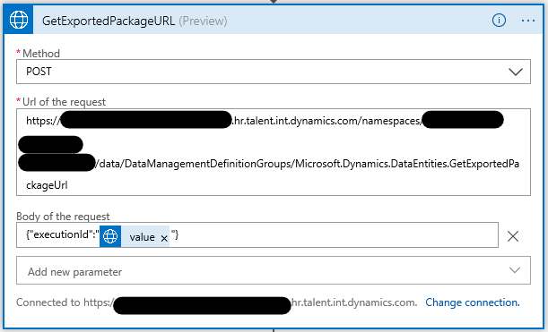

8. Download the exported package.

    - Add an HTTP **GET** request (a built-in [HTTP connector action](/azure/connectors/connectors-native-http)) to download the package from the URL that was returned in the previous step.

        - **Method:** GET
        - **URI:** body('Invoke\_an\_HTTP\_request\_3').value

            > [!NOTE]
            > You might have to enter the **URI** value either in code view or in the function editor in the designer.

        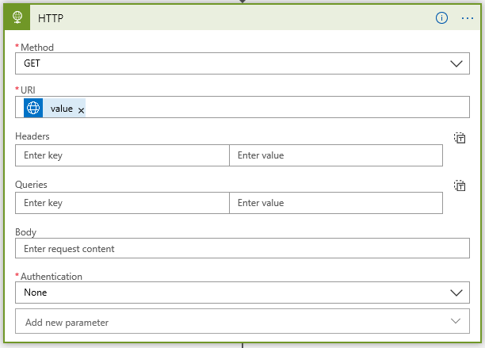

        > [!NOTE]
        > This request doesn't require any additional authentication, because the URL that the **GetExportedPackageUrl** API returns includes a shared access signatures token that grants access to download the file.

9. Save the downloaded package by using the [OneDrive for Business](/azure/connectors/connectors-create-api-onedriveforbusiness) connector.

    - Add a OneDrive for Business [Create File](/connectors/onedriveforbusinessconnector/#create-file) action.
    - Connect to your OneDrive for Business account, as required.

        - **Folder Path:** A folder of your choice
        - **File Name:** worker\_package.zip
        - **File Content:** The body from the previous step (dynamic content)

        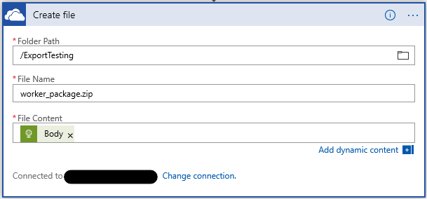

### Step 3: Test the logic app

To test your logic app, select the **Run** button in the designer. You will see that the steps of the logic app start to run. After 30 to 40 seconds, the logic app should finish running, and your OneDrive for Business folder should include a new package file that contains the exported workers.

If a failure is reported for any step, select the failed step in the designer, and examine the **Inputs** and **Outputs** fields for it. Debug and adjust the step as required to correct the errors.

The following illustration shows what the Logic Apps Designer looks like when all the steps of the logic app run successfully.

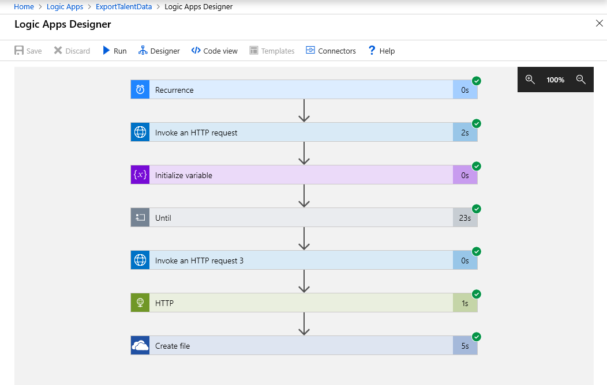

## Summary

In this tutorial, you learned how to use a logic app to export data from Human Resources and save the exported data to a OneDrive for Business folder. You can modify the steps of this tutorial as required to suit your business needs.


[!INCLUDE[footer-include](../includes/footer-banner.md)]
