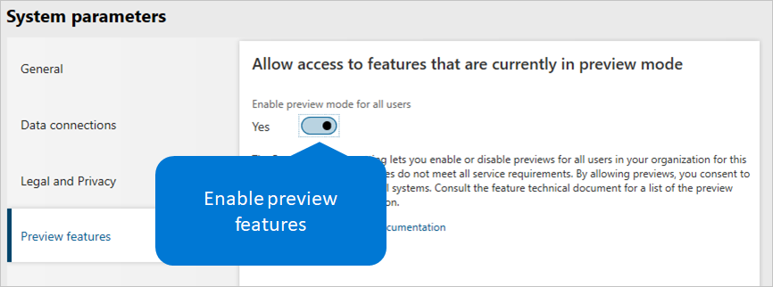

---
# required metadata

title: Manage features
description: 
author: andreabichsel
manager: AnnBe
ms.date: 02/01/2020
ms.topic: article
ms.prod: 
ms.service: dynamics-human-resources
ms.technology: 

# optional metadata

ms.search.form: 
# ROBOTS: 
audience: Application User
# ms.devlang: 
ms.reviewer: anbichse
ms.search.scope: Human Resources
# ms.tgt_pltfrm: 
ms.custom: 7521
ms.assetid: 
ms.search.region: Global
# ms.search.industry: 
ms.author: anbichse
ms.search.validFrom: 2020-02-01
ms.dyn365.ops.version: Human Resources April 2020 update

---

# Manage features

As part of our continuous rollout of new capabilities for Microsoft Dynamics 365 Human Resources, we want to let customers experience new features as soon as possible. We provide preview features, which are almost ready for general availability and have gone through extensive testing. We're just looking for a final round of customer feedback and validation before we release them for general availability.

For more information about new features in Human Resources, see [What's new in Human Resources](hr-adminwhats-new.md) and [Dynamics 365 and Power Platform Release Plan](https://docs.microsoft.com/dynamics365/release-plans/#pivot=products&panel=products1).

## Enable or disable preview features

To access preview features, you must first enable them in your environment. Enabling or disabling preview features is environment-specific.

> [!IMPORTANT]
> When you turn on the **Preview Features** setting, you enable preview features for all users in your organization who are in that environment. When you turn off the setting, you disable preview features and make them inaccessible to your users. Preview features have limited support in Talent. They might use fewer privacy and security measures, and they aren't included in the Talent service level agreement (SLA). You should not use preview features to process personal data (that is, any information that could identify you), or to process other data that is subject to legal or regulatory compliance requirements.

1. In Human Resources, select **System administration**, and then select the **Links** tab.
3. On the **System administration** page, under **Setup**, select **System parameters**.
4. On the **System parameters** page, select the **Preview features** tab.
5. Set the **Enable preview mode for all users** option to **Yes** to make preview features available.

    

> [!NOTE]
> To disable preview features, use the same steps, but set the **Enable preview mode for all users** option to **No**. When you disable preview features, they become inaccessible to your users, and errors might occur in processes that are associated with the features.

## Feedback

We want to hear from you about your experience with preview features. We encourage you to regularly post your feedback on the following sites as you use these or any other features:

- [Community](https://community.dynamics.com/enterprise/f/759?pi53869=0&category=Talent) – This site is a great resource where users can discuss use cases, ask questions, and get community help.
- Let us know about features that you want to see in the product, or let us know about any changes you think we should make to existing features. Suggest product ideas on [Human Resources ideas](https://powerusers.microsoft.com/t5/Ideas-for-Human-Resources/idb-p/HumanResources)
    
Please don't include personal data (any information that could identify you) in your feedback or product review submissions. Collected information might be analyzed further and isn't used to answer requests under applicable privacy laws. Personal data that is collected separately under these programs is subject to the [Microsoft Privacy Statement](https://privacy.microsoft.com/privacystatement).

## See also

- [What's new in Human Resources](hr-adminwhats-new.md)
- [Dynamics 365 and Power Platform Release Plan](https://docs.microsoft.com/dynamics365/release-plans/#pivot=products&panel=products1)