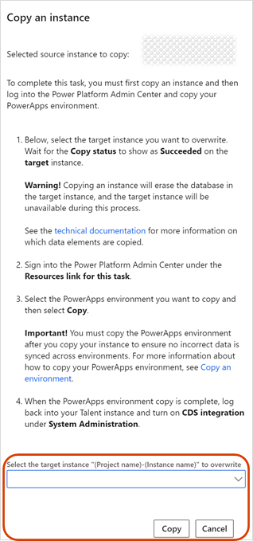
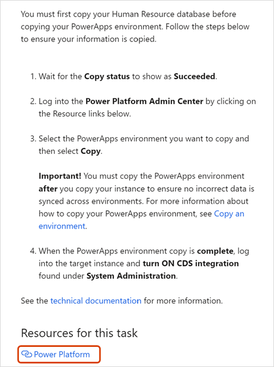

---
# required metadata

title: Copy an instance
description: You can use Microsoft Dynamics Lifecycle Services (LCS) to copy a Microsoft Dynamics 365 Human Resources database to a sandbox environment.
author: twheeloc
ms.date: 07/22/2020
ms.topic: article
# optional metadata

ms.search.form: SystemAdministrationWorkspaceForm
# ROBOTS: 
audience: Application User
# ms.devlang: 

# ms.tgt_pltfrm: 
ms.assetid: 
ms.search.region: Global
# ms.search.industry: 
ms.author: twheeloc
ms.search.validFrom: 2020-02-03
ms.dyn365.ops.version: Human Resources

---

# Copy an instance

> [!IMPORTANT]
> You can deploy new environments and use database movements to create copies. For more information about self-service deployments, see [Self-service deployment overview](../fin-ops-core/dev-itpro/deployment/infrastructure-stack.md). For more information about database movements on the finance and operations infrastructure, see [Database movement operations home page](../fin-ops-core/dev-itpro/database/dbmovement-operations.md).

You can use Microsoft Dynamics Lifecycle Services (LCS) to copy a Microsoft Dynamics 365 Human Resources database to a sandbox environment. If you have another sandbox environment, you can also copy the database from that environment to a targeted sandbox environment.

To copy an instance, keep the following tips in mind:

- The Human Resources instance you want to overwrite must be a sandbox environment.
- The environments you're copying from and to must be in the same region. You can't copy across regions.
- You must be an Administrator in the target environment so you can sign into it after copying the instance.
- When you copy the Human Resources database, you don't copy the elements (apps or data) that are contained in a Microsoft Power Apps environment. For information about how to copy elements in a Power Apps environment, see [Copy an environment](/power-platform/admin/copy-environment). The Power Apps environment you want to overwrite must be a sandbox environment. You must be a global tenant admin to change a Power Apps production environment to a sandbox environment. For more information about changing a Power Apps environment, see [Switch an instance](/dynamics365/admin/switch-instance).
- If you copy an instance into your sandbox environment and want to integrate your sandbox environment with Dataverse, you must reapply custom fields to Dataverse tables. See [Apply custom fields to Dataverse](hr-admin-setup-copy-instance.md?apply-custom-fields-to-common-data-service).

## Effects of copying a Human Resources database

> [!Note]
> Starting August 2022, Documents in Microsoft Azure Blob storage are included when copying a production environment to a sandbox environment. Any documents and templates that are attached will be copied over from the source environment to the target environment.

The following events occur when you copy a Human Resources database:

- The copy process erases the existing database in the target environment. After the copy process is completed, you can't recover the existing database.
- The target environment will be unavailable until the copy process is completed.
- All users except the except those with the "System Administrator" security role and other internal service user accounts will be unavailable. The Admin user can delete data before other users are allowed back into the system.
- Any user with the "System Administrator" security role must make required configuration changes, such as reconnecting integration endpoints to specific services or URLs.

## Copy the Human Resources database

To complete this task, you first copy an instance, and then sign in to the Microsoft Power Platform Admin Center to copy your Power Apps environment.

> [!WARNING]
> When you copy an instance, the database is erased in the target instance. The target instance is unavailable during this process.

1. Sign in to LCS, and select the LCS project that contains the instance that you want to copy.
2. In your LCS project, select the **Human Resources App Management** tile.
3. Select the instance to copy, and then select **Copy**.
4. In the **Copy an instance** task pane, select the instance to overwrite, and then select **Copy**. Wait for the **Copy status** field to be updated to **Completed**.

   ](./media/copy-instance-select-target-instance.png)

5. Select **Power Platform**, and sign in to the Microsoft Power Platform Admin Center.

   ](./media/copy-instance-select-power-platform.png)

6. Select the Power Apps environment to copy, and then select **Copy**.

For more information about copying Power Apps environments, see [Copy an environment](/power-platform/admin/copy-environment#copy-an-environment-1).

7. When the copy process is completed, sign in to the target instance, and enable Dataverse integration. For more information and instructions, see [Configure Dataverse integration](./hr-admin-integration-common-data-service.md).

## Data elements and statuses

The following data elements aren't copied when you copy a Human Resources instance:

- Email addresses in the **LogisticsElectronicAddress** table

- The batch job history in the **BatchJobHistory**, **BatchHistory**, and **BatchConstraintHistory** tables

- The Simple Mail Transfer Protocol (SMTP) password in the **SysEmailSMTPPassword** table

- The SMTP Relay server in the **SysEmailParameters** table

- Print Management settings in the **PrintMgmtSettings** and **PrintMgmtDocInstance** tables

- Environment-specific records in the **SysServerConfig**, **SysServerSessions**, **SysCorpNetPrinters**, **SysClientSessions**, **BatchServerConfig**, and **BatchServerGroup** tables

- Document attachments in the DocuValue table. These attachments include any Microsoft Office templates that were overwritten in the source environment

- The connection string in the **PersonnelIntegrationConfiguration** table

Some of these elements aren't copied because they're environment-specific. Examples include **BatchServerConfig** and **SysCorpNetPrinters** records. Other elements aren't copied because of the volume of support tickets. For example:

- Duplicate emails might be sent because SMTP is still enabled in the user acceptance testing (sandbox) environment.

- Invalid integration messages might be sent because batch jobs are still enabled.

- Users might be enabled before admins can perform post-refresh cleanup actions.

Also, the following statuses change when you copy an instance:

- All users except those with the "System Administrator" security role are set to **Disabled**.

- All batch jobs, except for some system jobs, are set to **Withhold**.

## Environment admin

All users in the target sandbox environment, including Administrators, are replaced by the users of the source environment. Before you copy an instance, be sure that you're an Administrator in the source environment. If you aren't, you can't sign in to the target sandbox environment after the copy has been completed.

All non-Administrator users in the target sandbox environment are disabled to prevent unwanted sign-ins in the sandbox environment. Administrators can reenable users if needed.

## Apply custom fields to Dataverse

If you copy an instance into your sandbox environment and want to integrate your sandbox environment with Dataverse, you must reapply custom fields to Dataverse tables.

For each custom field that's exposed on Dataverse tables, do the following steps:

1. Go to the custom field and select **Edit**.
2. Unselect the **Enabled** field for each cdm_* entity that the custom field is enabled on.
3. Select **Apply Changes**.
4. Select **Edit** again.
5. Select the **Enabled** field for each cdm_* entity that the custom field is enabled on.
6. Select **Apply Changes** again.
The process of unselecting, applying changes, reselecting, and reapplying changes prompts the schema to update in Dataverse to include the custom fields.

For more information about custom fields, see [Create and work with custom fields](../fin-ops-core/fin-ops/get-started/user-defined-fields.md).

## See also

[Provision Human Resources](hr-admin-setup-provision.md) 
[Remove an instance](hr-admin-setup-remove-instance.md) 
[Update process](hr-admin-setup-update-process.md)

[!INCLUDE[footer-include](../includes/footer-banner.md)]
