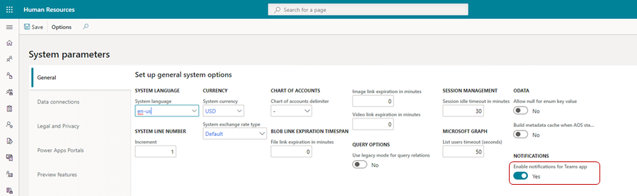
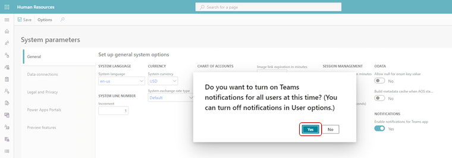
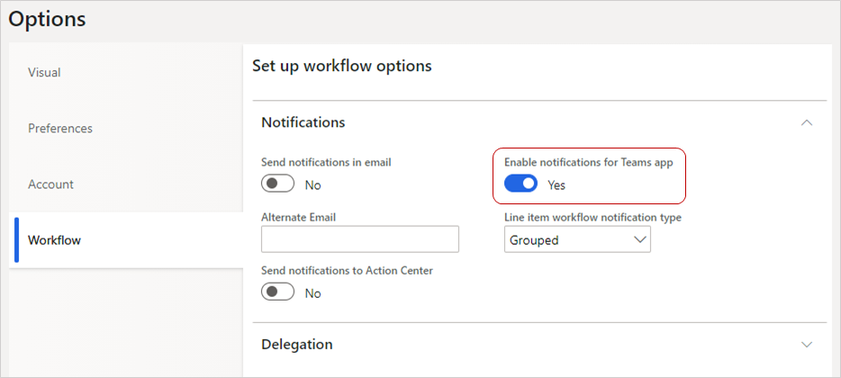

---
# required metadata

title: Human Resources app in Teams
description: This topic introduces the Microsoft Dynamics 365 Human Resources app in Microsoft Teams.
author: andreabichsel
manager: AnnBe
ms.date: 09/30/2020
ms.topic: article
ms.prod: 
ms.service: dynamics-human-resources
ms.technology: 

# optional metadata

ms.search.form: FeatureManagementWorkspace
# ROBOTS: 
audience: Application User
# ms.devlang: 
ms.reviewer: anbichse
# ms.search.scope: Human Resources
# ms.tgt_pltfrm: 
ms.custom: 7521
ms.assetid: 
ms.search.region: Global
# ms.search.industry: 
ms.author: anbichse
ms.search.validFrom: 2020-05-18
ms.dyn365.ops.version: Human Resources

---

# Human Resources app in Teams

[!include [banner](includes/preview-feature.md)]

The Microsoft Dynamics 365 Human Resources app in Microsoft Teams lets employees quickly request time off and view their time-off balance information in Microsoft Teams. Employees can interact with a bot to request information. The **Time off** tab provides more detailed information. In addition, they can send people information about upcoming time off in teams and chats outside the Human Resources app.

## Install and setup

You can find the Human Resources app in the Teams store. For information about installing the Teams app, see [Manage leave requests in Teams](hr-teams-leave-app.md).

For information about managing app permissions in Teams, see [Manage app permission policies in Microsoft Teams](https://docs.microsoft.com/MicrosoftTeams/teams-app-permission-policies).

## Enable notifications for the Human Resources app in Teams

If you want users to receive leave request notifications in the Teams app, you must enable notifications in Human Resources.

>[!NOTE]
>Only users who are signed into Teams and using the Human Resources Teams app will receive notifications.

1. In Human Resources, select **System administration**.

2. Select **Links**.

3. Under **Setup**, select **System parameters**.

4. On the **General** tab, set **Enable notifications for Teams app** to **Yes**.

   

5. To turn on Teams notifications for all users, select **Yes** at the prompt.

   

### Turn Teams notifications on or off for individual users

After you've enabled notifications for the Human Resources Teams app, you can turn notifications on or off for individual users.

1. In Human Resources, select **System administration**.

2. Select **Links**.

3. Under **Users**, select **User options**.

4. Select the **Workflow** tab.

5. Set **Enable notifications for Teams app** to **Yes** to enable notifications for the user or **No** to disable notifications for the user.

   

6. Select **Save**.

## Known issues

| Issue | Status |
| --- | --- |
| The balance is incorrect when submitting time off for a future date. | Forecasting isn't yet available. The balance displays for the current date. |
| Unable to cancel an **In review** request. | This functionality isn't currently supported and will be added in a future release. |
| Balance information is calculated as of today. | The system currently doesn't display balances as of the accrual period, even if it's configured in Leave and absence parameters. |

## Troubleshooting

If a user is having trouble signing into or using the Human Resources Teams app, try following these troubleshooting instructions. If you're still having problems after troubleshooting, contact Support. For more information, see [Get support](hr-admin-troubleshooting-support.md).

### Can't sign into the Human Resources app in Teams

If a user contacts you because they can't sign into the app, verify that the user has an associated employee record in Human Resources.

### Error when approving leave requests in the Human Resources app in Teams

If a user receives an error while trying to approve leave requests in the Teams app, perform the following troubleshooting steps:

1. Verify that their Teams account is the same one they use for accessing Human Resources.

2. Verify that they're a valid approver for the request by checking the workflow settings for leave approval. For more information about leave request workflows, see [Create a leave request workflow](hr-leave-and-absence-workflow.md).

## Privacy notice

### Microsoft Language Understanding Intelligent Service (LUIS)

With the Dynamics 365 Human Resources bot in Microsoft Teams, the user’s text inputs are analyzed for understanding the underlying query/intent. The user’s input such as “Search account Contoso” is routed to one of Microsoft’s Cognitive Service called Language Understanding Intelligent Service (LUIS). Read more about LUIS [here](https://www.luis.ai/). The LUIS service disambiguates or understands the intent of user input (in this case, the intent is to find information) and the target entity (in this case, the intended entity is an account named Contoso). This information is then passed on to Microsoft’s [Azure bot framework](https://azure.microsoft.com/services/bot-service/), which interacts with data from Dynamics 365 Human Resources and retrieves the desired information for the user query. 

By installing and allowing access to use of the bot, you agree to allow the LUIS service and Azure bot framework to process the intent behind the input,  which results in an enhanced conversational user experience. The LUIS service and Azure bot framework may have varying levels of compliance compared to Dynamics 365 Human Resources. While the LUIS service has access to only the user queries and is not designed to be connected to the user’s Dynamics 365 Human Resources data or account, a user of the Dynamics 365 Human Resources bot could voluntarily enter a query containing Customer Data, Personal Data, or other data and such query content could get sent to the LUIS service and the Azure bot framework. 

The content of user’s queries and messages is retained in LUIS system for a maximum of 30 days, is encrypted at rest, and is not used for training or service improvement. Read more about Cognitive Services [here](https://azure.microsoft.com/services/cognitive-services/language-understanding-intelligent-service/). 

To manage admin settings for apps in Microsoft Teams, go to the [Microsoft Teams admin center](https://admin.teams.microsoft.com/).

### Microsoft Teams, Azure Event Grid, and Azure Cosmos DB

When using the Dynamics 365 Human Resources app in Microsoft Teams, certain customer data may flow outside of the geographic region where your tenant’s Human Resources service is deployed.

Dynamics 365 Human Resources transmits the employee’s leave request and workflow task details to Microsoft Azure Event Grid and Microsoft Teams. This data may be stored in Microsoft Azure Event Grid for up to 24 hours and will be processed in the United States, is encrypted in transit and at rest, and is not used by Microsoft or its subprocessors for training or service improvements. To understand where your data is stored in Teams, please see: [Location of data in Microsoft Teams](https://docs.microsoft.com/microsoftteams/location-of-data-in-teams?view=o365-worldwide&preserve-view=true).

While conversing with the chat bot in the Human Resources app, the conversation content may be stored in Azure Cosmos DB and transmitted to Microsoft Teams. This data may be stored in Azure Cosmos DB for up to 24 hours and may be processed outside of the geographic region where your tenant's Human Resources service is deployed, is encrypted in transit and at rest, and is not used by Microsoft or its subprocessors for training or service improvements. To understand where your data is stored in Teams, please see: [Location of data in Microsoft Teams](https://docs.microsoft.com/microsoftteams/location-of-data-in-teams?view=o365-worldwide&preserve-view=true).
 
To restrict access to the Human Resources app in Microsoft Teams for your organization or users within your organization, see [Manage app permission policies in Microsoft Teams](https://docs.microsoft.com/MicrosoftTeams/teams-app-permission-policies).

## See also 

[Download and install Microsoft Teams](https://support.office.com/article/download-and-install-microsoft-teams-422bf3aa-9ae8-46f1-83a2-e65720e1a34d) 
[Microsoft Teams help center](https://support.office.com/teams) 
[Manage leave requests in Teams](hr-teams-leave-app.md)

