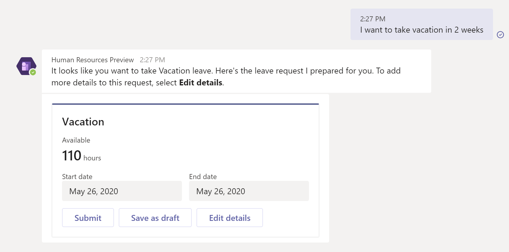
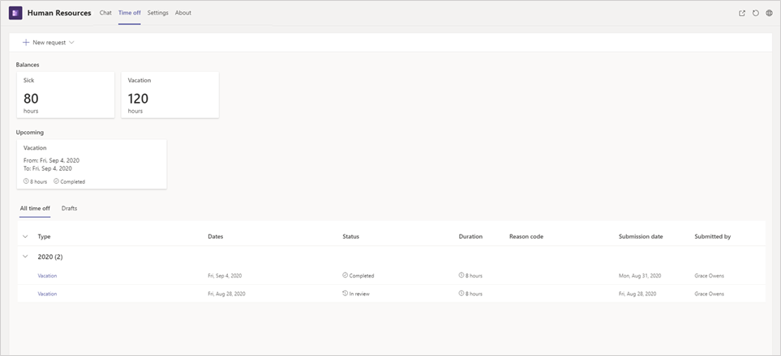

---
# required metadata

title: Human Resources app in Teams
description: This article introduces the Microsoft Dynamics 365 Human Resources app in Microsoft Teams.
author: andreabichsel
manager: AnnBe
ms.date: 05/04/2020
ms.topic: article
ms.prod: 
ms.service: dynamics-human-resources
ms.technology: 

# optional metadata

ms.search.form: 
# ROBOTS: 
audience: Application User
# ms.devlang: 
ms.reviewer: anbichse
ms.search.scope: Human Resources
# ms.tgt_pltfrm: 
ms.custom: 7521
ms.assetid: 
ms.search.region: Global
# ms.search.industry: 
ms.author: anbichse
ms.search.validFrom: 2020-05-04
ms.dyn365.ops.version: Human Resources

---

# Human Resources app in Teams

[!include [banner](includes/preview-feature.md)]

The Microsoft Dynamics 365 Human Resources app in Microsoft Teams lets employees quickly request time off and view their time-off balance information in Teams. Employees can interact with a bot to request information, and they can see more detailed information on the **Time off** tab.

## Install and setup

You can find the Human Resources app in the Teams store. For information about installing the Teams app, see [Manage leave requests in Teams](hr-teams-leave-app.md).

For information about managing app permissions in Teams, see [Manage app permission policies in Microsoft Teams](https://docs.microsoft.com/MicrosoftTeams/teams-app-permission-policies).

## Known issues

| Issue | Status |
| --- | --- |
| The balance is incorrect when submitting time off for a future date. | Forecasting isn't yet available. The balance displays for the current date. |
| When reducing the number of hours taken in an existing request, the **Remaining balance** goes down instead of up. | We'll address this known issue in the future. The display is incorrect, but the correct amounts are adjusted upon submission. |
| The date picker isn't accessible in dark mode. | We'll add dark mode support in the future. |
| Two **Upcoming time off** cards display for the same dates. | The cards represent individual submissions. We'll continue to take feedback and make adjustments if necessary. |
| Unable to cancel an **In review** request. | This functionality isn't currently supported and will be added in a future release. |

## Privacy notice

While using the model-driven apps in Dynamics 365 bot in Microsoft Teams, the user’s text inputs are analyzed for understanding the underlying query/intent. The user’s input such as “Search account Contoso” is routed to one of Microsoft’s Cognitive Service called Language Understanding Intelligent Service (LUIS). Read more about LUIS [here](https://www.luis.ai/). The LUIS service disambiguates or understands the intent of user input (in this case, the intent is to find information) and the target entity (in this case, the intended entity is an account named Contoso). This information is then passed on to Microsoft’s Azure bot framework which interacts with Dynamics 365 data and retrieves the desired information for the user query.

By installing and allowing access to use of the bot, you agree to allow the LUIS service and Azure bot framework to process the intent behind the input – which results in an enhanced conversational user experience. The LUIS service and [Azure bot framework](https://azure.microsoft.com/services/bot-service/) may have varying levels of compliance compared to Dynamics 365 Sales apps. While the LUIS service has access to only the user queries and is not designed to be connected to the user’s Dynamics data or account, a user of the Dynamics 365 Sales bot could voluntarily enter a query containing Customer Data, Personal Data or other data and such query content could get sent to the LUIS service and the Azure bot framework.

The content of user’s queries and messages is retained in LUIS system for a maximum of 30 days, encrypted at rest and is not used for training or service improvement. Read more about Cognitive Services [here](https://azure.microsoft.com/services/cognitive-services/language-understanding-intelligent-service/).

To manage admin settings for apps in Microsoft Teams, go to the Microsoft 365 admin center and open Settings > Services & add-ins, then choose Microsoft Teams. If you're signed in as an Office 365 admin, you can access these controls [here](https://admin.microsoft.com/adminportal/home#/Settings/ServicesAndAddIns), including the ability to uninstall.

For more information about privacy in Human Resources, see [Microsoft Privacy Statement](https://privacy.microsoft.com/privacystatement). For more information about privacy in Teams, see [For IT professionals: Privacy and security in Microsoft Teams](https://www.microsoft.com/microsoft-365/blog/2020/04/06/it-professionals-privacy-security-microsoft-teams/).

## See also

[Manage leave requests in Teams](hr-teams-leave-app.md)

