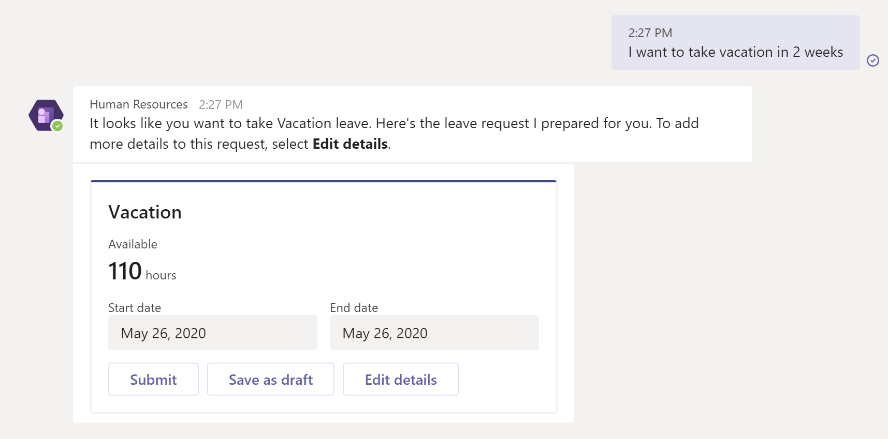

---
# required metadata

title: Human Resources app in Teams
description: This topic introduces the Microsoft Dynamics 365 Human Resources app in Microsoft Teams.
author: andreabichsel
manager: AnnBe
ms.date: 05/18/2020
ms.topic: article
ms.prod: 
ms.service: dynamics-human-resources
ms.technology: 

# optional metadata

ms.search.form: 
# ROBOTS: 
audience: Application User
# ms.devlang: 
ms.reviewer: anbichse
ms.search.scope: Human Resources
# ms.tgt_pltfrm: 
ms.custom: 7521
ms.assetid: 
ms.search.region: Global
# ms.search.industry: 
ms.author: anbichse
ms.search.validFrom: 2020-05-18
ms.dyn365.ops.version: Human Resources

---

# Human Resources app in Teams

[!include [banner](includes/preview-feature.md)]

The Microsoft Dynamics 365 Human Resources app in Microsoft Teams lets employees quickly request time off and view their time-off balance information in Microsoft Teams. Employees can interact with a bot to request information. The **Time off** tab provides more detailed information.

## Install and setup

You can find the Human Resources app in the Teams store. For information about installing the Teams app, see [Manage leave requests in Teams](hr-teams-leave-app.md).

For information about managing app permissions in Teams, see [Manage app permission policies in Microsoft Teams](https://docs.microsoft.com/MicrosoftTeams/teams-app-permission-policies).

## Known issues

| Issue | Status |
| --- | --- |
| The balance is incorrect when submitting time off for a future date. | Forecasting isn't yet available. The balance displays for the current date. |
| When reducing the number of hours taken in an existing request, the **Remaining balance** goes down instead of up. | We'll address this known issue in the future. The display is incorrect, but the correct amounts are adjusted upon submission. |
| Two **Upcoming time off** cards display for the same dates. | The cards represent individual submissions. We'll continue to take feedback and make adjustments. |
| Unable to cancel an **In review** request. | This functionality isn't currently supported and will be added in a future release. |
| Balance information is calculated as of today. | The system currently doesn't display balances as of the accrual period, even if it's configured in Leave and absence parameters. |

## Additional resources

[Manage leave requests in Teams](hr-teams-leave-app.md)

