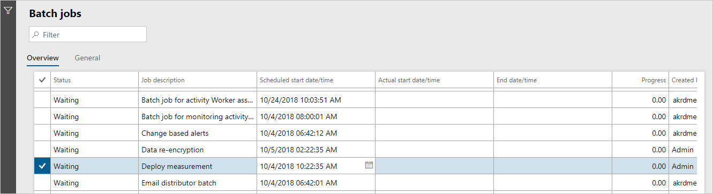

---
# required metadata

title: Troubleshoot analytic reports
description: This article explains how to troubleshoot and diagnose issues if a customer's data changes don't appear in any of the customer's workspaces.
author: twheeloc
ms.date: 01/31/2023
ms.topic: article
ms.prod: 
ms.technology: 

# optional metadata

# ms.search.form: HcmPersonnelManagementWorkspace, LeaveAbsenceWorkspace, HcmTalentBenefitWorkspace, HcmCompensationWorkspace, HcmEmployeeDevelopmentWorkspace, HcmLearningWorkspace
# ROBOTS: 
audience: Application User
# ms.devlang: 

# ms.tgt_pltfrm: 
ms.custom: 
ms.assetid: 
ms.search.region: Global
# ms.search.industry: 
ms.author: twheeloc
ms.search.validFrom: 2020-02-03
ms.dyn365.ops.version: Human Resources

---

# Troubleshoot analytic reports

[!INCLUDE [PEAP](../includes/peap-2.md)]

[!include [Applies to Human Resources](../includes/applies-to-hr.md)]

**Issue**

A customer's data changes don't appear on the **Analytics** tabs of any of the customer's workspaces.

**Cause**

By default, Microsoft Power BI reports are refreshed every four hours, according to the schedule of the Deploy measurement batch job.

**Resolution**

This issue might just be a matter of timing. Follow these steps to start the batch job and update the analytics workspaces.

1. Open the **Batch jobs** page at **System administration \> Links \> Batch jobs \> Batch jobs**. Alternatively, use Search, and enter **Batch Jobs**.
2. Find the **Deploy measurement** job in the list.
3. Select **Edit** at the top of the page, and set the scheduled start date/time to a value that will refresh the analytics closer to the current time.

>[!NOTE]
>The data that appears on the **Analytics** tab isn't real time and depends on the **Deploy measurement** batch job that runs according to the schedule. 

[!INCLUDE[footer-include](../includes/footer-banner.md)]
