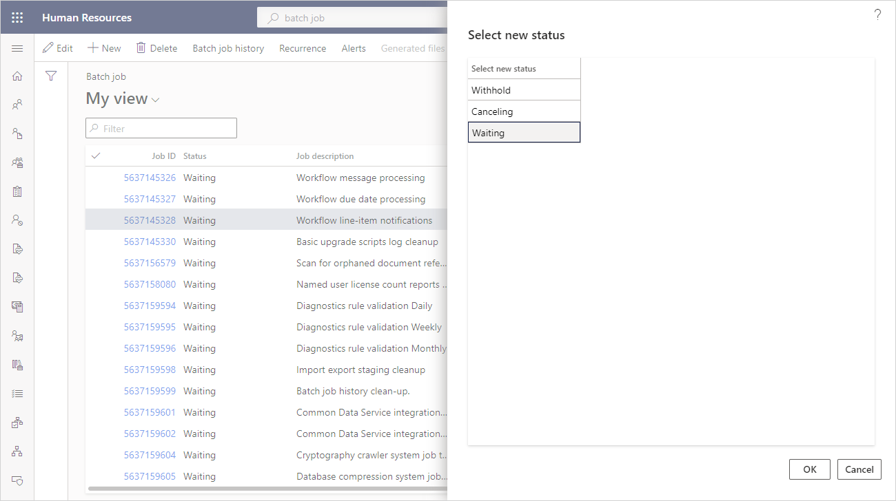

---
# required metadata

title: Reset stuck batch jobs
description: This topic explains how to resolve issues with batch jobs that are stuck.
author: twheeloc
ms.date: 03/19/2021
ms.topic: article
ms.prod: 
ms.technology: 

# optional metadata

# ms.search.form: BatchJob, BatchJobEnhanced
audience: Application User
# ms.devlang: 
ms.search.scope: Human Resources
# ms.tgt_pltfrm: 
ms.custom: 
ms.assetid: 
ms.search.region: Global
# ms.search.industry: 
ms.author: twheeloc
ms.search.validFrom: 2021-03-19
ms.dyn365.ops.version: Platform update 42
---

# Reset stuck batch jobs

[!INCLUDE [PEAP](../includes/peap-2.md)]

[!include [Applies to Human Resources](../includes/applies-to-hr.md)]

## Issue

Microsoft Dynamics 365 Human Resources can experience issues with batch jobs that are stuck in either an **Executing** or **Canceling** state and don't complete.

## Resolution

When a batch job is stuck in an **Executing** or **Canceling** state, you can reset the status by forcing the cancellation of the job. After you cancel it, you can reset the batch job by setting it to a **Waiting** status. It will then be picked up again for execution in the next scheduled batch run.

1. In the **System administration** workspace, select the **Links** page, and select **Batch jobs**.

2. On the **Batch job** list page, select the job that needs to be reset.

3. On the action ribbon, select **Force cancel**, and confirm the action.

   > [!NOTE]
   > The **Force cancel** action is only available when the selected batch job has a status of either **Executing** or **Canceling**, and no batch execution or cancellation processes are running for the job.

4. On the action ribbon, select **Change status**.

5. On the **Select new status** page, select **Waiting**, and then select **OK**.

   

## See also

[Optimize performance by scheduling batch jobs after hours](hr-admin-troubleshooting-batch-jobs.md) 
[Optimize performance with auto cleanup tasks](hr-admin-troubleshooting-batch-history.md)

[!INCLUDE[footer-include](../includes/footer-banner.md)]
