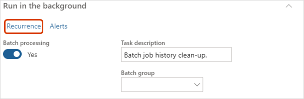
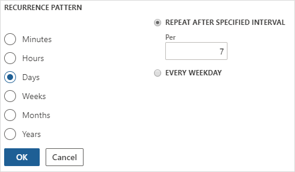

---
# required metadata

title: Optimize performance with auto cleanup tasks
description: This article explains how to improve performance in Microsoft Dynamics 365 Human Resources by cleaning up the batch job history.
author: twheeloc
ms.date: 08/21/2021
ms.topic: article
# optional metadata

# ms.search.form: BatchJob, BatchJobEnhanced
audience: Application User
# ms.devlang: 

# ms.tgt_pltfrm: 
ms.custom: 
ms.assetid: 
ms.search.region: Global
# ms.search.industry: 
ms.author: twheeloc
ms.search.validFrom: 2020-02-03
ms.dyn365.ops.version: Platform update 24
---

# Optimize performance with auto cleanup tasks

[!include [Applies to Human Resources](../includes/applies-to-hr.md)]

**Issue**

Microsoft Dynamics 365 Human Resources can experience performance issues if the batch job history grows too large.

**Cause**

Batch jobs that run frequently can lead to unsustainable growth of the batch job history. This can cause performance issues. 

**Resolution**

Schedule an automatic task to clean up your batch job history. We recommend setting up the task to run weekly, but you might need to run the cleanup more or less frequently, depending on your environment. The following procedure contains our recommended settings, but you can change these according to your needs.

1. In Human Resources, select **System administration**.

2. In the **Search** bar, enter **Batch job history clean-up**.

   

3. In **History limit (days)**, enter **30**.

   

4. Select **Run in the background** and then select **Recurrence**.

   

5. Under **Define recurrence**, set the **Start date** and **Start time** to occur during off-hours or the weekend, and then select **NO END DATE**. 

   

6. Under **RECURRENCE PATTERN**, select **Days** and set **REPEAT AFTER SPECIFIED INTERVAL** to **7**.

   

7. Select **OK**.

8. Change any other parameters under **Run in the background** as necessary, and then select **OK**.

[!INCLUDE[footer-include](../includes/footer-banner.md)]
