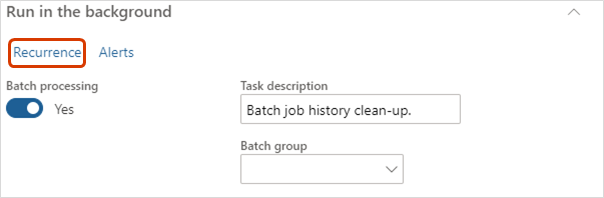

---
# required metadata

title: Optimize performance by scheduling batch jobs after hours
description: This topic explains how to resolve performance issues with Microsoft Dynamics 365 Human Resources by scheduling long-running batch jobs after hours.
author: twheeloc
ms.date: 06/23/2020
ms.topic: article
ms.prod: 
ms.technology: 

# optional metadata

# ms.search.form: BatchJob, BatchJobEnhanced
audience: Application User
# ms.devlang: 
ms.search.scope: Human Resources
# ms.tgt_pltfrm: 
ms.custom: 
ms.assetid: 
ms.search.region: Global
# ms.search.industry: 
ms.author: twheeloc
ms.search.validFrom: 2020-06-23
ms.dyn365.ops.version: Platform update 24
---

# Optimize performance by scheduling batch jobs after hours

[!INCLUDE [PEAP](../includes/peap-2.md)]

[!include [Applies to Human Resources](../includes/applies-to-hr.md)]

## Issue

Microsoft Dynamics 365 Human Resources can experience performance issues if long-running batch jobs run during typical business hours.

## Resolution

Schedule the following batch jobs during off hours. We also recommend reviewing the frequency of batch jobs that run frequently. If possible, reduce the recurrence of the batch job. In many cases, the default frequency is sufficient.

The following batch jobs should run at night or after hours. Be sure to check the time zone for these recurring batch jobs. Some batch jobs might use Pacific Standard Time (PST).

| Batch job | Default occurrence |
| --- | --- |
| Batch job history cleanup | 1 time per month |
| Export staging cleanup | 1 time per day |
| Common Data Service integration missed request sync | 1 time per day |
| Database compression system job that needs to run regularly during off hours | 1 time per day |
| Database index rebuild system job that needs to run regularly during off hours | 1 time per day |

1. In Human Resources, select **System administration**.

2. In the **Search** bar, search for one of the above batch jobs.

3. Select **Run in the background**, and then select **Recurrence**.

   

4. Under **Define recurrence**, set the **Start date** and **Start time** to occur during off hours or the weekend. Select **No end date**. 

   

5. Select **OK**.

6. If needed, change any other parameters under **Run in the background**, and then select **OK**.

## Additional resources

[Optimize performance with auto cleanup tasks](hr-admin-troubleshooting-batch-history.md)

[!INCLUDE[footer-include](../includes/footer-banner.md)]
