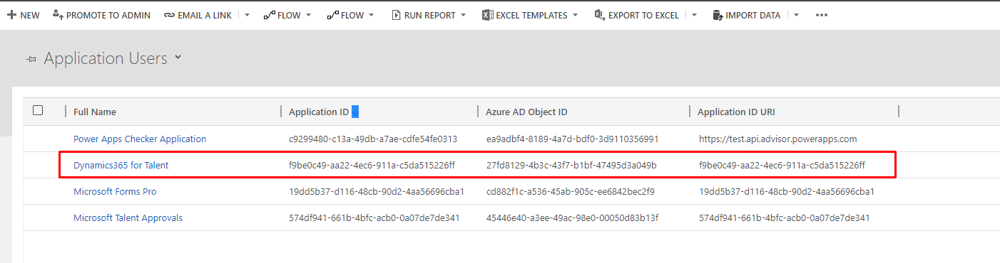
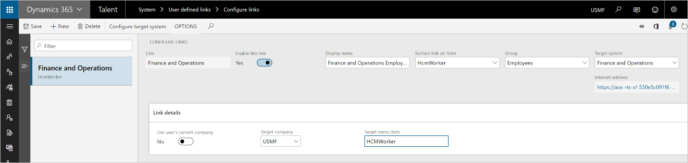
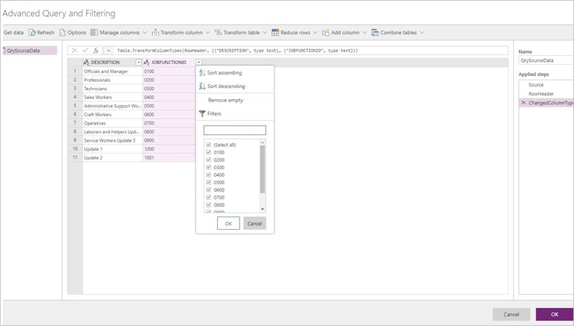
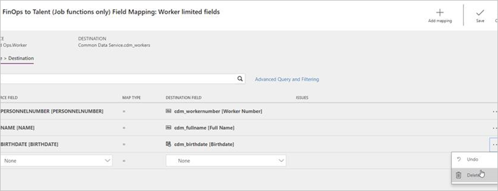
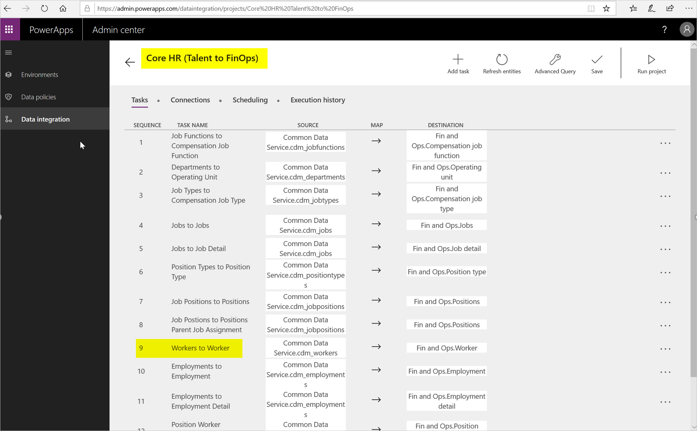
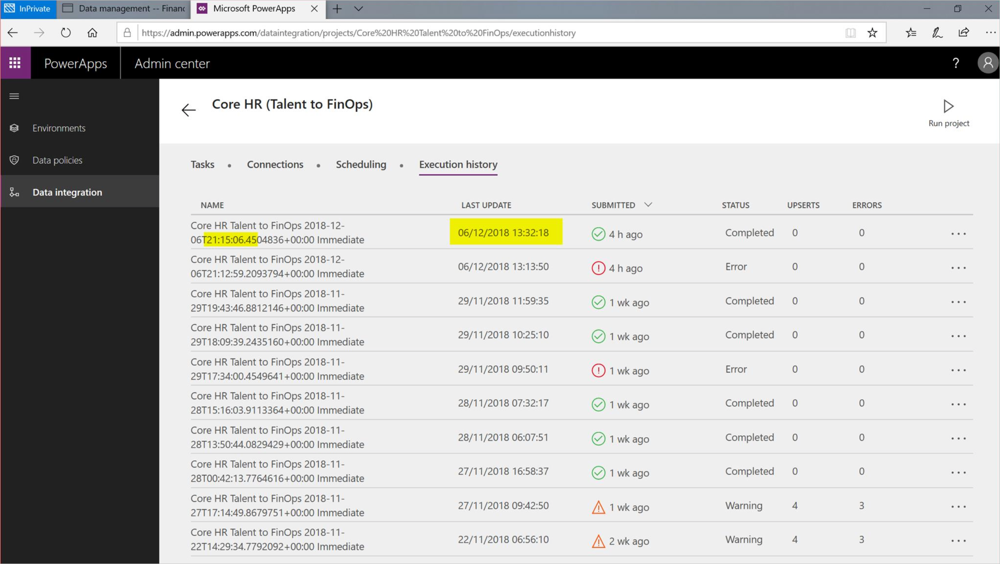
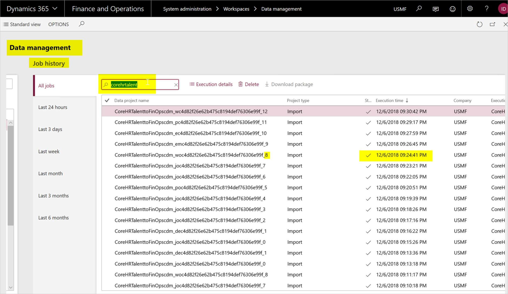
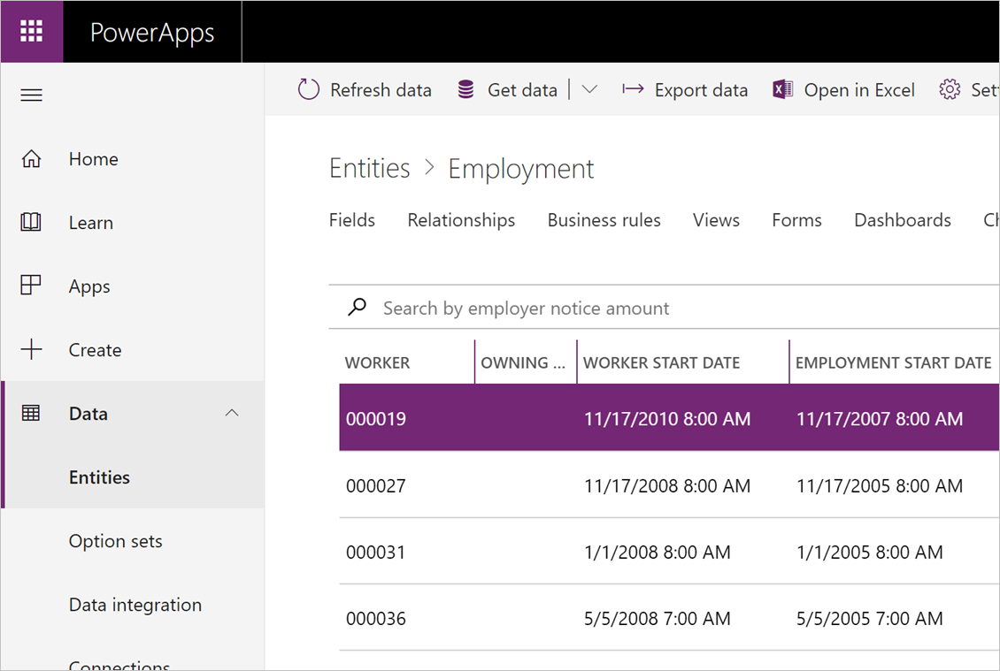
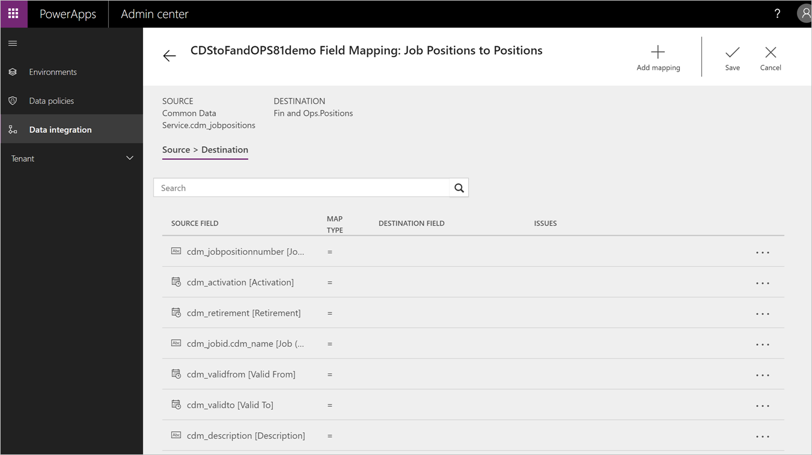

---
# required metadata

title: Integration with Finance FAQ
description: This article explains what data is synchronized in a Human Resources and Finance integration.
author: twheeloc
ms.date: 08/19/2021
ms.topic: article
ms.prod: 
ms.technology: 

# optional metadata

# ms.search.form: SystemAdministrationWorkspaceForm
# ROBOTS: 
audience: Application User
# ms.devlang: 

# ms.tgt_pltfrm: 
ms.custom: 
ms.assetid: 
ms.search.region: Global
# ms.search.industry: 
ms.author: twheeloc
ms.search.validFrom: 2020-02-03
ms.dyn365.ops.version: Human Resources

---

# Integration with Finance FAQ

[!INCLUDE [PEAP](../includes/peap-2.md)]

[!include [Applies to Human Resources](../includes/applies-to-hr.md)]

This article answers common questions associated about what data is synchronized when Dynamics 365 Human Resources is integrated with Dynamics 365 Finance.

## Can I edit the Dynamics 365 Talent application user in Power Apps?

No. If you edit the Human Resources application user, the integration between Human Resources and Dataverse might fail. The following table shows the default settings for the Talent application user.

| Full Name | Application ID | Azure AD Object ID | Application ID URI |
| --- | --- | --- | --- |
| Dynamics365 for Talent | f9be0c49-aa22-4ec6-911a-c5da515226ff | 27fd8129-4b3c-43f7-b1bf-47495d3a049b | f9be0c49-aa22-4ec6-911a-c5da515226ff |

## Is all data synchronized or just some data entities?

A subset of the data is synchronized. For a list of all the entities, see [Integration with Dynamics 365 Finance](hr-admin-integration-finance.md).

## Why don't I see any data synced to Dataverse?

By default, the Dataverse integration is turned off in new environments that don't include the provided demo data. By default, it's turned on in new environments that include demo data, and data synchronization begins when the environment is provisioned. After your environment is ready to sync data, you can turn on the integration. For more information, see [Configure Dataverse integration](hr-admin-integration-common-data-service.md).

## Can I create a new mapping without using the templates?

Templates are the starting point. You can create your own template, but a template is always needed when creating an integration project. For more information about data integrator (DI), templates, and projects, see [Integrate data into Microsoft Dataverse](/powerapps/administrator/data-integrator).

## Can I map financial dimensions to transfer between Human Resources and Finance?

Financial dimensions aren’t currently in Dataverse and as a result aren’t part of the default template. This entity is planned, but currently no release timeline is available.

For data that resides in Finance but does not exist in Human Resources, link the two systems together by using **Configure Links** in Human Resources.

## Sometimes when I import employees, they go into inactive workers in Finance. Why?

You may get this error if employees don’t have an active employment detail record in Human Resources. To resolve this, go to **Personnel Management \> Employees \> Employment History \> Date Manager**, and verify that there is an active employment detail record.

## If I select to map only a subset of fields, will changes made to non-mapped fields trigger a sync?

Data sync follows the execution schedule. The integration will pick up a record if any field in the record changes regardless if the field is part of integration mapping.

## How can I send only active worker changes and not the terminated records?

With the use of "Advanced query", you can filter and reshape source data before passing it into the destination.

## Can I specify which fields to send to Finance for a specific entity?

Fields can be added or removed from the integration task. Not all data fields that exist on the Dataverse table will be populated from Human Resources.
Additional data can be populated via Power Apps.

## I set up integration as a batch job, but Human Resources lost connection to the destination system. How can I send the same set of changes to the destination system?

No special setup is required for exception handling. The Data Integrator will automatically catch and report errors which occur at the source and destination and will allow manual retries. However, it doesn’t allow manual data correction. If data updates are needed, that should happen either at the source or the destination.

## Can I set up bi-directional integration?

No, integration is currently one-way (Human Resources to finance and operations). However, there is a default template available to send data from Human Resources to Finance.

## Can I allow record deletion as part of my integration?

No, Data Integrator will not capture deleted records for data transfer. Only data creation and updates (UPSERT) are currently included.

## Can I rerun the errored execution? If so, will it send a full file or only the changes?

The first run of Data Integrator is always a full run. Subsequent runs are based on change tracking. When an error run is executed, it extracts the records in scope of the run and sends out the most recent changes from Dataverse.

## When I save the project, I get the error: “Project has mapping errors." What do I do?

Check the setup of your integration keys, make any required changes to the setup, then refresh the entities in the project.

When the default template is used, the integration keys will be automatically imported. This issue may occur when new tasks are added to the existing template.

## If I have N number of legal entities where workers have employments, do I need to create a mapping for each of them?

Yes, for each legal entity in Finance, you'll need a separate integration project in the data integration.

## I need to transfer data that is not part of the default template provided by Microsoft. Can I do this?

Yes, fields can be added to or removed from the existing template. The template can be modified to include additional data from other Dataverse tables. The entity must be in Dataverse for it to be included in the template. 

## I just created new Finance and Human Resources environments, and I'm getting the error "The data value violates integrity constraints." Why?

Reasons for this error can include:

- The data transfer resulted in duplicate records extraction at the source (Dataverse).

- The data transfer has null values for fields that are required in finance and operations. Verify the data that is in Dataverse and meets the requirements of Finance and
Operations.

## If there are execution errors and the Employee ID didn't sync, how do I find the history job which has the failed employee record?

Data Integrator will create multiple projects in Finance. The relationship between the Data Integrator task and the Finance project is one to one.

Trace the time from the Data Integrator execution history and look for the index -1 project in Finance. If the task number is 9 in Data Integrator, the index in Finance is 8.

1. Capture the task index from Data Integrator (in this example it is "9").

    

2. Track the execution time of the project.

    

3. In Finance, identify index - 1. In this example, the project with suffix "8" and execution time of index "0" project matches with the execution time in Step 2.

    

## After integrating Human Resources and Finance, I don’t see my Human Resources data in Finance. What do I do?

The integration to Finance is a two-step process. First, verify that the Human Resources data is updated and available in Dataverse. This is a near real-time
sync and can be verified in Power Apps by looking at the data within the data tables.

If the data is not appearing as expected in Dataverse, verify that the entity is supported in the integration. To include additional data in Dataverse, a change will be required on the Microsoft side.

If the entity is supported and the data is available in Dataverse, verify the mapping is correct in Data Integrator. If the integrator mapping looks okay, then
verify the data management jobs have successfully run. Errors may occur during the execution of the batch jobs. For more information about Data Management, see [Data management](/dynamics365/unified-operations/dev-itpro/data-entities/data-entities-data-packages?toc=%2ffin-and-ops%2ftoc.json).

## The addresses for my employees are incorrect after I import them into Finance. What should I do?

The number sequence for **Location ID** uses the same pattern in both Human Resources and Finance. The number sequence needs to be unique on both sides so there are no address collisions when integrating data from Dataverse to finance and operations.

During implementation of Human Resources, verify that the number sequences are not the same in Human Resources and Finance. Validate that all number sequences are not identical where data may be maintained in both systems.

## When creating my connection set, I am unable to see the connection in the Connection drop-down list. What do I do?

Make sure when creating your connections, you choose Dynamics 365 Finance and Dataverse.

## When syncing employments, I get the errors “CompanyInfo_FK doesn’t exist" or “The value '12/31/2154 11:59:59 pm' in field 'Employment end date' is not found in the related table 'Employment'.” What should I do?

Ensure that you are mapping to the correct legal entities. Legal entity syncing is not part of the default template, so it is expected that each legal entity that is present in Human Resources and Dataverse is also present in Finance. Also, make sure that you are selecting the correct legal entities for the associated Connection Set.

## After setting up my project, the field mapping for Finance appears to be empty. What should I do?

Refresh the data entities in Finance by going to **Data management \> Framework Parameters \> Entity settings \> Refresh entity list.** This should take a couple of minutes to complete, then you should see those mappings. This issue occurs when new projects are created.

## Additional resources

- Data Integrator (DI): 

  - [Integrate data into Microsoft Dataverse](/powerapps/administrator/data-integrator)

  - [Data Integrator error management and troubleshooting](/powerapps/administrator/data-integrator-error-management)

- Data Management:

  - [Data management](/dynamics365/unified-operations/dev-itpro/data-entities/data-entities-data-packages?toc=%2ffin-and-ops%2ftoc.json)

[!INCLUDE[footer-include](../includes/footer-banner.md)]

