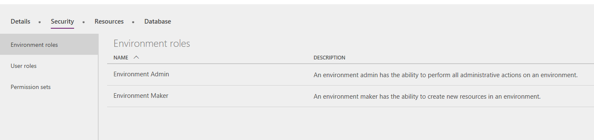
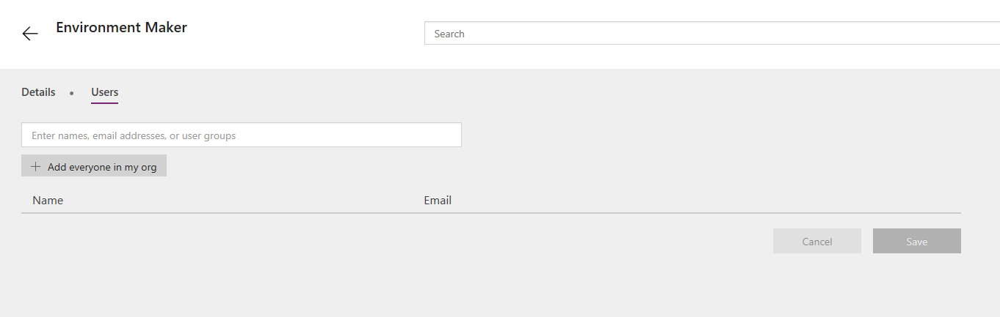

---
# required metadata

title: Human Resources doesn't appear in Microsoft Dynamics 365 apps
description: This article explains what to do if Microsoft Dynamics 365 Human Resources isn't listed among the Microsoft Dynamics 365 apps.
author: twheeloc
ms.date: 06/12/2026
ms.topic: article
# optional metadata

# ms.search.form: SystemAdministrationWorkspaceForm
# ROBOTS: 
audience: Application User
# ms.devlang: 

# ms.tgt_pltfrm: 
ms.assetid: 
ms.search.region: Global
# ms.search.industry: 
ms.author: twheeloc
ms.search.validFrom: 2020-02-03
ms.dyn365.ops.version: Human Resources
ms.custom:
  - sfi-image-nochange

---

# Human Resources app doesn't appear in Microsoft Dynamics 365 apps

[!include [Applies to Human Resources](../includes/applies-to-hr.md)]

**Issue**

The customer doesn't see Dynamics 365 Human Resources among the Microsoft Dynamics 365 apps.

**Resolution**

The user must be added to the Environment maker role for the environment in Microsoft Power Apps.

1. The admin user who has a Power Apps Plan 2 license must open the [Power Apps Admin portal](https://preview.admin.powerapps.com/).
1. Select **Environments**, and select the correct environment for Human Resources.
1. On the **Security** tab, on the **Environment roles** tab, select **Environment Maker**.

    

1. On the **Users** tab, add the user or your organization.

    

1. Select **Save**.
1. The user must now sign into Microsoft Dynamics 365.
1. Select **Sync** to update the user apps.

    

    After synchronization is completed, Human Resources appears on the home page.

[!INCLUDE[footer-include](../includes/footer-banner.md)]
